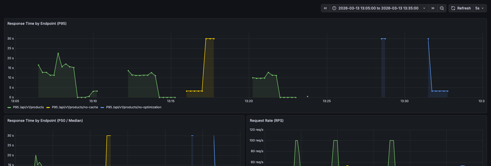
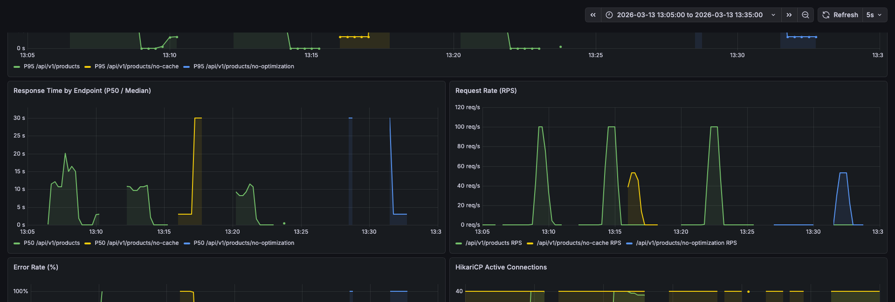

# "상품 조회가 느리다" — 인덱스, 비정규화, 멀티 레이어 캐시로 읽기 성능을 구조적으로 개선한 과정

---

## 문제 인식

이커머스 API의 상품 목록 조회가 느렸다. 원인은 세 가지였다.

1. **전량 로딩**: 10만 건의 상품을 메모리에 올려 Java `Comparator`로 정렬
2. **매 요청마다 COUNT 집계**: 좋아요 수를 `likes` 테이블에서 `GROUP BY`로 계산
3. **캐시 부재**: 동일한 쿼리가 매번 DB를 직격

단건 응답 시간이 2초(10만 건), 308초(1000만 건). K6로 200 RPS를 걸면 99.4% 요청이 실패했다. 서비스 불능 상태였다.

---

## 최적화 전략 — 세 겹의 방어선

### 1. 인덱스 + 비정규화: DB 레벨에서 해결

좋아요 수를 `likes` 테이블에서 매번 `COUNT(*)`로 파생시키던 구조를 `Product.likeCount` 컬럼으로 비정규화했다. 이전 주차에서 쓰기 경합 제거를 위해 `likeCount`를 제거했었다. 하지만 읽기 병목이 명확해진 시점에서, **트레이드오프의 축이 바뀌었다**고 판단했다.

| 시점 | 우선순위 | 결정 |
|------|---------|------|
| 이전 주차 | 쓰기 경합 해소 > 읽기 성능 | `likeCount` 제거, `COUNT(*)` 파생 |
| 이번 주차 | 읽기 성능 > 쓰기 경합 | `likeCount` 재도입, atomic SQL로 경합 최소화 |

비정규화와 함께 유스케이스 기반 복합 인덱스 4개를 설계했다.

```
idx_product_like_count        (like_count DESC, id DESC)         → 전체 + 좋아요순
idx_product_brand_like_count  (brand_id, like_count DESC, id DESC) → 브랜드 필터 + 좋아요순
idx_product_brand_price       (brand_id, price ASC, id ASC)      → 브랜드 필터 + 가격순
idx_likes_product_id          (product_id)                       → 좋아요 카운트 커버링 인덱스
```

EXPLAIN 결과, 1000만 건에서 스캔 행이 **9,955,217 → 20**으로 감소했다. 인덱스가 이미 정렬되어 있으므로 `LIMIT`만큼만 읽는다.

### 2. Redis 캐시: 네트워크 너머의 방어선

인덱스로 쿼리 자체는 빨라졌지만, 매 요청이 DB를 치는 구조는 RPS가 올라가면 HikariCP 풀(40개)이 포화된다. Cache-Aside 패턴의 Redis 캐시를 적용했다.

- **상품 상세**: `product:detail:{id}`, TTL 10분
- **상품 목록**: `product:list:v{version}:brand:...:sort:...:page:...`, TTL 5분
- **무효화**: 목록은 버전 기반 — `INCR product:list:version`으로 O(1) 무효화. `SCAN`/`KEYS` 패턴 삭제를 회피

Redis 장애 시에는 try-catch로 DB 직접 조회. 캐시는 **필수 의존이 아니라 최적화 계층**이다.

### 3. L1 Caffeine + L2 Redis: 멀티 레이어 캐시

모든 캐시 조회가 Redis 네트워크 왕복(1~3ms)을 거치고 있었다. 인기 상품처럼 반복 조회되는 데이터에 대해 JVM 로컬 캐시(Caffeine)를 L1으로 추가하면, 같은 스레드 풀에서 더 많은 요청을 처리할 수 있다.

**Look-Aside 흐름:**
```
GET:   L1(Caffeine) hit → 반환 (μs)
       L1 miss → L2(Redis) hit → L1 backfill → 반환 (ms)
       양쪽 miss → DB 조회 → L2 저장 → L1 저장

PUT:   L2 먼저 → L1  (L2가 truth source)
EVICT: L1 먼저 → L2  (stale 서빙 시간 최소화)
```

| 캐시 | maxSize | TTL | 메모리 | 근거 |
|------|---------|-----|--------|------|
| 상품 상세 (L1) | 500 | 30초 | ~150KB | hot data 0.5% 커버 |
| 상품 목록 (L1) | 200 | 15초 | ~1.2MB | 인기 조합 커버 |
| **총 메모리** | — | — | **~1.5MB** | 무시 가능 |

---

## DIP — 캐시도 인터페이스로 분리한 이유

Repository는 DIP를 잘 지키고 있었다. `ProductRepository`(domain interface) ← `ProductRepositoryImpl`(infrastructure). 그런데 캐시는 `ProductCacheService`라는 concrete class가 application 레이어에서 `RedisTemplate`을 직접 의존하고 있었다.

```
// Repository — DIP 준수 ✅
ProductFacade → ProductRepository (domain interface) ← ProductRepositoryImpl (infrastructure)

// 캐시 — DIP 위반 ❌
ProductFacade → ProductCacheService (concrete, RedisTemplate 직접 의존)
```

실무 문제는 테스트에서 먼저 드러났다. `FakeProductCacheService extends ProductCacheService`에서 `super(null, null, null)`을 호출해야 했다. 생성자 시그니처가 바뀌면 모든 Fake가 깨진다.

**해결**: `ProductCachePort` 인터페이스를 application에, 구현체 3개를 infrastructure에 분리했다.

```
ProductCachePort (application, interface)
  ├── CaffeineProductCacheAdapter (infrastructure, L1)
  ├── RedisProductCacheAdapter (infrastructure, L2)
  └── MultiLayerProductCacheAdapter (infrastructure, @Primary, L1+L2)
```

호출부(`ProductFacade`, `LikeController`)는 타입과 변수명만 교체. 메서드 시그니처가 동일하므로 호출 코드의 구조적 변경은 없다. 테스트 Fake는 인터페이스를 구현하므로 생성자 의존이 사라졌다.

---

## 검증 — Docker 환경에서 10M 데이터로 측정

### 테스트 환경 구성

프로덕션에 가까운 조건을 로컬에서 재현했다.

- **MySQL** (Docker): 상품 1000만 건, 브랜드 500개, 회원 5000명, 좋아요 95만 건 (멱법칙 분포)
- **Redis** (Docker): Master-Replica 토폴로지
- **K6**: 100 rps, 1분, constant-arrival-rate
- **Prometheus + Grafana**: 응답 시간, 에러율, HikariCP, JVM 실시간 모니터링

### 비교군 설계

단일 지표만으로는 "왜 이 구조를 선택했는가"를 설명할 수 없다. 각 최적화 계층의 기여분을 분리하기 위해 A/B 비교 엔드포인트를 추가했다.

| 엔드포인트 | 인덱스 | 비정규화 | 캐시 | 증명하는 것 |
|-----------|--------|---------|------|-----------|
| `/products/no-optimization` | X | X | X | **기준선** — 최적화 필요성 |
| `/products/no-cache` | O | O | X | DB 레벨 최적화의 한계 |
| `/products` (L2 Redis Only) | O | O | L2 | 분산 캐시 단독 효과 |
| `/products` (L1+L2) | O | O | L1+L2 | 로컬 캐시 추가 효과 |

### 결과

| 시나리오 | P50 | P95 | Error Rate | 처리량 | 상태 |
|---------|-----|-----|-----------|--------|------|
| No Optimization | 3.00s | 3.01s | **100%** | 51 rps | 완전 붕괴 |
| No Cache (인덱스+비정규화) | 3.00s | 3.02s | **99.65%** | 35 rps | 완전 붕괴 |
| L2 Redis Only | 6.47ms | 10.19ms | 0% | 100 rps | 안정 |
| **L1+L2 Multi-Layer** | **4.76ms** | **8.04ms** | **0%** | **100 rps** | **안정** |

**읽는 법:**
- No Optimization → No Cache: 인덱스+비정규화를 적용해도, 1000만 건에서 100 rps를 DB만으로 감당하면 HikariCP 풀이 포화된다. **인덱스는 단건 쿼리를 빠르게 하지만, 고부하에서 DB 커넥션 경합은 별개 문제다.**
- No Cache → L2 Redis: 캐시를 도입하면 DB 커넥션을 소비하지 않는다. P95가 3초 → 10ms로, 에러율이 99% → 0%로 전환된다. **캐시가 서비스 가용성을 결정한다.**
- L2 Redis → L1+L2: P95 10ms → 8ms. Redis 네트워크 왕복(~2ms)을 제거한 효과다. 절대값은 작지만, RPS가 수천으로 올라가면 Tomcat 스레드 점유 시간의 차이가 누적된다.

### Grafana 모니터링




K6 실행 구간에서 Grafana를 통해 다음을 확인했다:
- **P95 Response Time**: L1+L2는 바닥(~8ms), No Optimization은 3초+ 타임아웃
- **HikariCP Active Connections**: 캐시 적용 시 1~2개, 미적용 시 40개(Max Pool) 포화
- **Error Rate**: L1+L2 = 0%, No Optimization = 100%

---

## 시행착오

**Docker `/tmp` 디스크 포화**: 1000만 건에서 No Optimization(전체 풀스캔 + filesort)을 먼저 돌리면, MySQL이 동시 정렬 임시 파일을 생성하면서 Docker VM의 디스크를 채웠다. 이후 실행하는 캐시 적용 테스트도 캐시 미스 시 DB 쿼리가 실패하며 연쇄적으로 무너졌다. **해결**: MySQL `sort_buffer_size`를 8MB로 증가시키고, 테스트 간 MySQL 컨테이너를 재시작하여 임시 파일을 정리했다.

**`ddl-auto: create`로 데이터 유실**: local 프로필의 `ddl-auto: create` 설정 때문에, 앱을 재시작할 때마다 테이블이 재생성되어 시딩한 1000만 건이 날아갔다. **해결**: `--spring.jpa.hibernate.ddl-auto=none`을 JVM 인자로 전달하여 재시작 시 데이터를 보존했다.

---

## 정리

"상품 조회가 느리다"는 문제를, DB 레벨(인덱스 + 비정규화) → 분산 캐시(Redis) → 로컬 캐시(Caffeine) 세 겹의 방어선으로 해결했다. 각 계층의 기여분을 비교 엔드포인트와 K6 벤치마크로 분리 측정하여, 아키텍처 결정의 근거를 수치로 확보했다.

캐시 구현체는 DIP 원칙에 따라 `ProductCachePort` 인터페이스로 분리하고, L1/L2/MultiLayer를 각각 독립된 Adapter로 구현했다. 이 구조 덕분에 테스트 Fake가 concrete class 상속에서 해방되었고, 향후 캐시 구현체 교체나 레이어 추가가 인터페이스 뒤에서 이루어진다.

| 판단 | 선택 | 근거 |
|------|------|------|
| 좋아요 집계 | `likeCount` 비정규화 + atomic SQL | 읽기 성능 > 쓰기 경합 (축 전환) |
| 인덱스 | 유스케이스별 복합 인덱스 4개 | EXPLAIN rows 497,760배 감소 |
| 캐시 전략 | RedisTemplate 직접 사용 | 버전 기반 무효화, Master/Replica 분리 |
| 캐시 아키텍처 | DIP + L1 Caffeine + L2 Redis | 네트워크 비용 제거, 테스트 안정성 |
| 검증 방법 | Docker + 10M + K6 + Grafana | 비교 엔드포인트로 각 계층 기여분 분리 |
