# 02. 시퀀스 다이어그램

---

## 목차

### 유저
- [상품 목록 조회](#상품-목록-조회)
- [상품 상세 조회](#상품-상세-조회)
- [브랜드 상세 정보 조회](#브랜드-상세-정보-조회)
- [좋아요 등록](#좋아요-등록)
- [좋아요 취소](#좋아요-취소)
- [좋아요한 상품 목록 조회](#좋아요한-상품-목록-조회)
- [상품 주문](#상품-주문)
- [주문 목록 조회](#주문-목록-조회)
- [주문 상세 조회](#주문-상세-조회)

### 관리자
- [관리자 공통 인증](#관리자-공통-인증)
- [관리자 - 브랜드 등록](#관리자---브랜드-등록)
- [관리자 - 브랜드 수정](#관리자---브랜드-수정)
- [관리자 - 브랜드 삭제](#관리자---브랜드-삭제)
- [관리자 - 브랜드 목록 조회](#관리자---브랜드-목록-조회)
- [관리자 - 브랜드 상세 조회](#관리자---브랜드-상세-조회)
- [관리자 - 상품 등록](#관리자---상품-등록)
- [관리자 - 상품 수정](#관리자---상품-수정)
- [관리자 - 상품 삭제](#관리자---상품-삭제)
- [관리자 - 상품 목록 조회](#관리자---상품-목록-조회)
- [관리자 - 상품 상세 조회](#관리자---상품-상세-조회)
- [관리자 - 주문 목록 조회](#관리자---주문-목록-조회)
- [관리자 - 주문 상세 조회](#관리자---주문-상세-조회)

---

## 상품 목록 조회

로그인/비로그인 상태에 따라 좋아요 여부 플래그가 달라지는 분기 흐름을 표현한다.

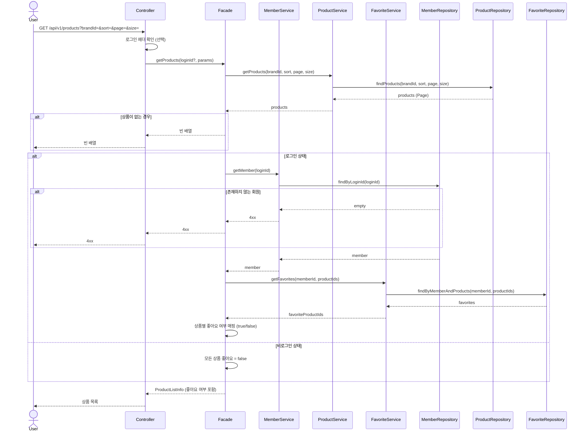
```mermaid
sequenceDiagram
    actor User
    participant Controller
    participant Facade
    participant MemberService
    participant ProductService
    participant FavoriteService
    participant MemberRepository
    participant ProductRepository
    participant FavoriteRepository

    User->>Controller: GET /api/v1/products?brandId=&sort=&page=&size=
    Controller->>Controller: 로그인 헤더 확인 (선택)

    Controller->>Facade: getProducts(loginId?, params)
    Facade->>ProductService: getProducts(brandId, sort, page, size)
    ProductService->>ProductRepository: findProducts(brandId, sort, page, size)
    ProductRepository-->>ProductService: products (Page)
    ProductService-->>Facade: products

    alt 상품이 없는 경우
        Facade-->>Controller: 빈 배열
        Controller-->>User: 빈 배열
    end

    alt 로그인 상태
        Facade->>MemberService: getMember(loginId)
        MemberService->>MemberRepository: findByLoginId(loginId)
        alt 존재하지 않는 회원
            MemberRepository-->>MemberService: empty
            MemberService-->>Facade: 4xx
            Facade-->>Controller: 4xx
            Controller-->>User: 4xx
        end
        MemberRepository-->>MemberService: member
        MemberService-->>Facade: member

        Facade->>FavoriteService: getFavorites(memberId, productIds)
        FavoriteService->>FavoriteRepository: findByMemberAndProducts(memberId, productIds)
        FavoriteRepository-->>FavoriteService: favorites
        FavoriteService-->>Facade: favoriteProductIds
        Facade->>Facade: 상품별 좋아요 여부 매핑 (true/false)
    else 비로그인 상태
        Facade->>Facade: 모든 상품 좋아요 = false
    end

    Facade-->>Controller: ProductListInfo (좋아요 여부 포함)
    Controller-->>User: 상품 목록
```

**핵심 포인트:**
- 로그인 여부와 관계없이 상품 목록은 동일하게 조회된다.
- 좋아요 여부 플래그는 Facade에서 조합하여 반환한다.
- brandId가 있으면 해당 브랜드 상품만 필터링, 없으면 전체 조회한다.

---

## 상품 상세 조회

상품 존재 확인, 브랜드 정보 포함, 로그인 여부에 따른 좋아요 플래그 처리 흐름을 표현한다.

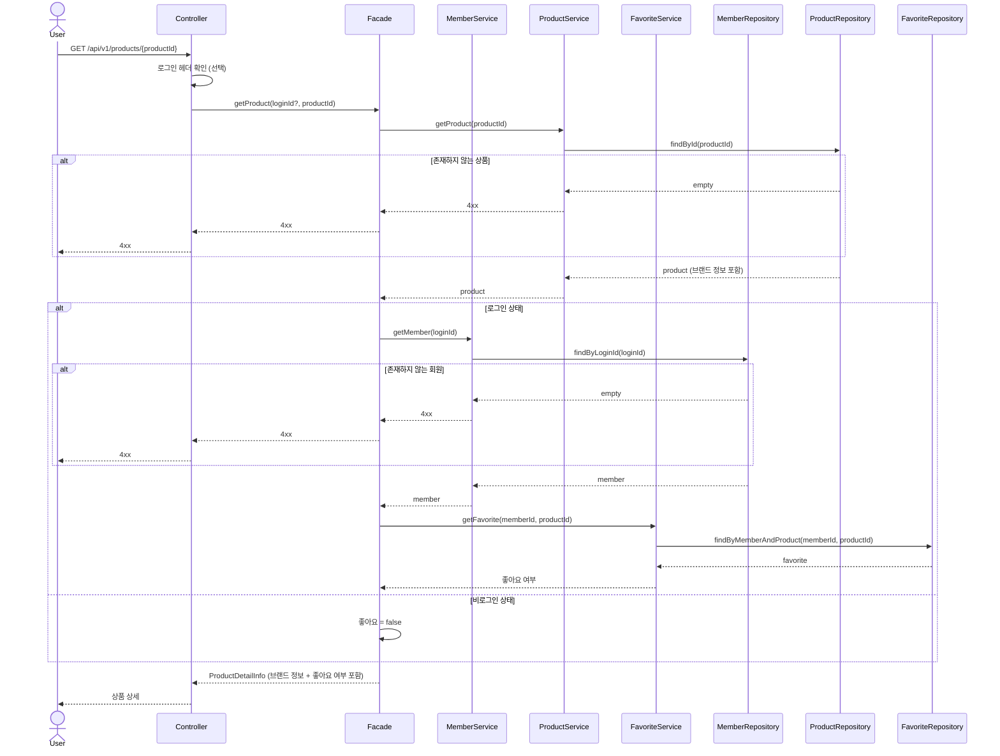
```mermaid
sequenceDiagram
    actor User
    participant Controller
    participant Facade
    participant MemberService
    participant ProductService
    participant FavoriteService
    participant MemberRepository
    participant ProductRepository
    participant FavoriteRepository

    User->>Controller: GET /api/v1/products/{productId}
    Controller->>Controller: 로그인 헤더 확인 (선택)

    Controller->>Facade: getProduct(loginId?, productId)

    Facade->>ProductService: getProduct(productId)
    ProductService->>ProductRepository: findById(productId)

    alt 존재하지 않는 상품
        ProductRepository-->>ProductService: empty
        ProductService-->>Facade: 4xx
        Facade-->>Controller: 4xx
        Controller-->>User: 4xx
    end

    ProductRepository-->>ProductService: product (브랜드 정보 포함)
    ProductService-->>Facade: product

    alt 로그인 상태
        Facade->>MemberService: getMember(loginId)
        MemberService->>MemberRepository: findByLoginId(loginId)
        alt 존재하지 않는 회원
            MemberRepository-->>MemberService: empty
            MemberService-->>Facade: 4xx
            Facade-->>Controller: 4xx
            Controller-->>User: 4xx
        end
        MemberRepository-->>MemberService: member
        MemberService-->>Facade: member

        Facade->>FavoriteService: getFavorite(memberId, productId)
        FavoriteService->>FavoriteRepository: findByMemberAndProduct(memberId, productId)
        FavoriteRepository-->>FavoriteService: favorite
        FavoriteService-->>Facade: 좋아요 여부
    else 비로그인 상태
        Facade->>Facade: 좋아요 = false
    end

    Facade-->>Controller: ProductDetailInfo (브랜드 정보 + 좋아요 여부 포함)
    Controller-->>User: 상품 상세
```

**핵심 포인트:**
- 상품 정보에 브랜드 정보가 포함되어 반환된다.
- 상품이 존재하지 않으면 4xx를 반환한다.
- 좋아요 여부는 상품 목록 조회와 동일한 패턴으로 처리한다.

---

## 브랜드 상세 정보 조회

브랜드 존재 여부를 확인하고 상세 정보를 반환하는 공개 엔드포인트 흐름을 표현한다.

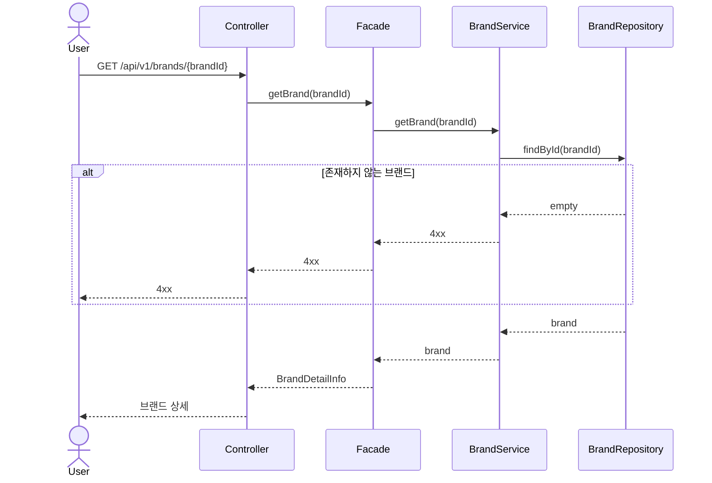
```mermaid
sequenceDiagram
    actor User
    participant Controller
    participant Facade
    participant BrandService
    participant BrandRepository

    User->>Controller: GET /api/v1/brands/{brandId}

    Controller->>Facade: getBrand(brandId)

    Facade->>BrandService: getBrand(brandId)
    BrandService->>BrandRepository: findById(brandId)

    alt 존재하지 않는 브랜드
        BrandRepository-->>BrandService: empty
        BrandService-->>Facade: 4xx
        Facade-->>Controller: 4xx
        Controller-->>User: 4xx
    end

    BrandRepository-->>BrandService: brand
    BrandService-->>Facade: brand
    Facade-->>Controller: BrandDetailInfo
    Controller-->>User: 브랜드 상세
```

**핵심 포인트:**
- 로그인 불필요 (공개 엔드포인트).
- 브랜드가 존재하지 않으면 4xx를 반환한다.

---

## 좋아요 등록

로그인 확인, 상품 존재 확인, 중복 좋아요 확인까지의 검증 흐름을 표현한다.

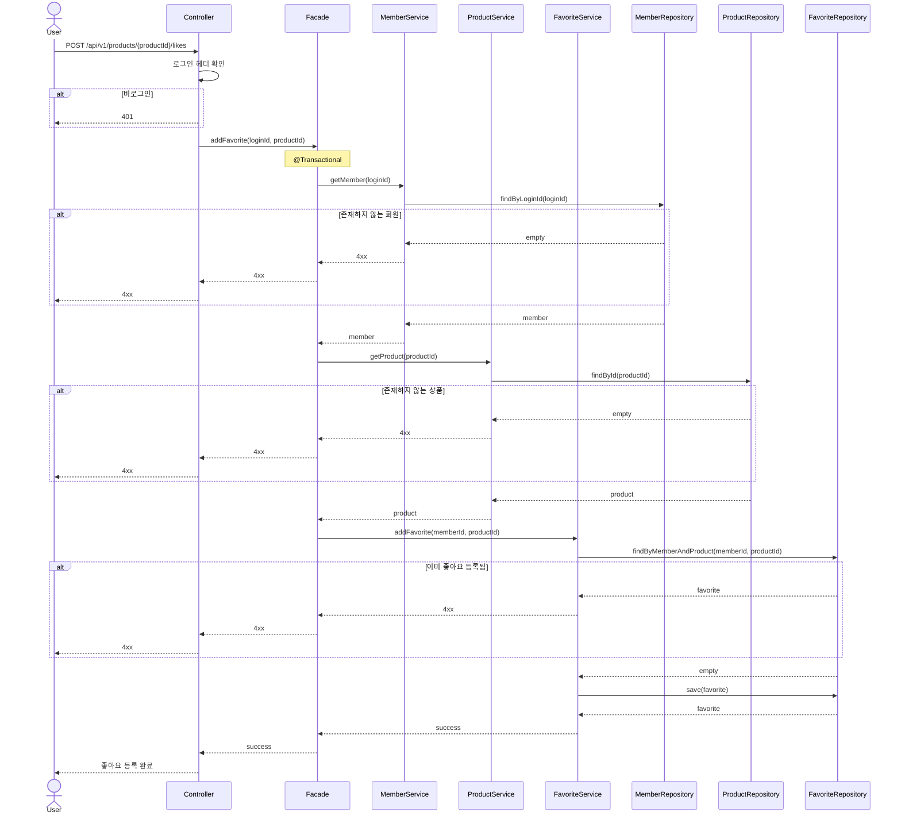
```mermaid
sequenceDiagram
    actor User
    participant Controller
    participant Facade
    participant MemberService
    participant ProductService
    participant FavoriteService
    participant MemberRepository
    participant ProductRepository
    participant FavoriteRepository

    User->>Controller: POST /api/v1/products/{productId}/likes
    Controller->>Controller: 로그인 헤더 확인

    alt 비로그인
        Controller-->>User: 401
    end

    Controller->>Facade: addFavorite(loginId, productId)
    Note over Facade: @Transactional

    Facade->>MemberService: getMember(loginId)
    MemberService->>MemberRepository: findByLoginId(loginId)
    alt 존재하지 않는 회원
        MemberRepository-->>MemberService: empty
        MemberService-->>Facade: 4xx
        Facade-->>Controller: 4xx
        Controller-->>User: 4xx
    end
    MemberRepository-->>MemberService: member
    MemberService-->>Facade: member

    Facade->>ProductService: getProduct(productId)
    ProductService->>ProductRepository: findById(productId)

    alt 존재하지 않는 상품
        ProductRepository-->>ProductService: empty
        ProductService-->>Facade: 4xx
        Facade-->>Controller: 4xx
        Controller-->>User: 4xx
    end

    ProductRepository-->>ProductService: product
    ProductService-->>Facade: product

    Facade->>FavoriteService: addFavorite(memberId, productId)
    FavoriteService->>FavoriteRepository: findByMemberAndProduct(memberId, productId)

    alt 이미 좋아요 등록됨
        FavoriteRepository-->>FavoriteService: favorite
        FavoriteService-->>Facade: 4xx
        Facade-->>Controller: 4xx
        Controller-->>User: 4xx
    end

    FavoriteRepository-->>FavoriteService: empty
    FavoriteService->>FavoriteRepository: save(favorite)
    FavoriteRepository-->>FavoriteService: favorite

    FavoriteService-->>Facade: success
    Facade-->>Controller: success
    Controller-->>User: 좋아요 등록 완료
```

**핵심 포인트:**
- 좋아요 등록 전 상품 존재 여부와 중복 등록 여부를 순차적으로 검증한다.
- 중복 좋아요 시도 시 4xx를 반환한다.
- Facade의 `@Transactional`로 회원 조회, 상품 조회, 좋아요 저장이 하나의 트랜잭션으로 처리된다.

---

## 좋아요 취소

로그인 확인, 상품 존재 확인, 좋아요 등록 여부 확인 후 취소하는 흐름을 표현한다.

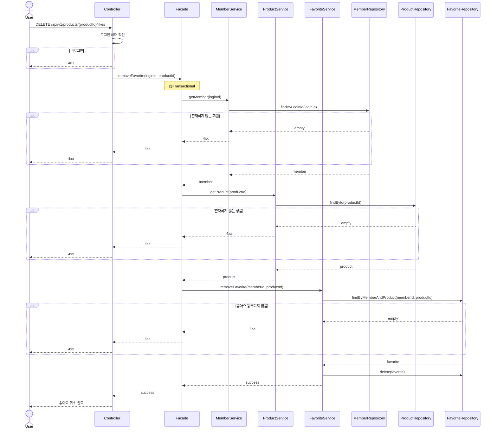
```mermaid
sequenceDiagram
    actor User
    participant Controller
    participant Facade
    participant MemberService
    participant ProductService
    participant FavoriteService
    participant MemberRepository
    participant ProductRepository
    participant FavoriteRepository

    User->>Controller: DELETE /api/v1/products/{productId}/likes
    Controller->>Controller: 로그인 헤더 확인

    alt 비로그인
        Controller-->>User: 401
    end

    Controller->>Facade: removeFavorite(loginId, productId)
    Note over Facade: @Transactional

    Facade->>MemberService: getMember(loginId)
    MemberService->>MemberRepository: findByLoginId(loginId)
    alt 존재하지 않는 회원
        MemberRepository-->>MemberService: empty
        MemberService-->>Facade: 4xx
        Facade-->>Controller: 4xx
        Controller-->>User: 4xx
    end
    MemberRepository-->>MemberService: member
    MemberService-->>Facade: member

    Facade->>ProductService: getProduct(productId)
    ProductService->>ProductRepository: findById(productId)

    alt 존재하지 않는 상품
        ProductRepository-->>ProductService: empty
        ProductService-->>Facade: 4xx
        Facade-->>Controller: 4xx
        Controller-->>User: 4xx
    end

    ProductRepository-->>ProductService: product
    ProductService-->>Facade: product

    Facade->>FavoriteService: removeFavorite(memberId, productId)
    FavoriteService->>FavoriteRepository: findByMemberAndProduct(memberId, productId)

    alt 좋아요 등록되지 않음
        FavoriteRepository-->>FavoriteService: empty
        FavoriteService-->>Facade: 4xx
        Facade-->>Controller: 4xx
        Controller-->>User: 4xx
    end

    FavoriteRepository-->>FavoriteService: favorite
    FavoriteService->>FavoriteRepository: delete(favorite)

    FavoriteService-->>Facade: success
    Facade-->>Controller: success
    Controller-->>User: 좋아요 취소 완료
```

**핵심 포인트:**
- 좋아요 취소 전 상품 존재 여부와 좋아요 등록 여부를 순차적으로 검증한다.
- 좋아요가 등록되지 않은 상품에 대한 취소 시도 시 4xx를 반환한다.
- Facade의 `@Transactional`로 회원 조회, 상품 조회, 좋아요 삭제가 하나의 트랜잭션으로 처리된다.

---

## 좋아요한 상품 목록 조회

로그인한 회원이 좋아요한 상품 중 전시중인 상품만 필터링하여 반환하는 흐름을 표현한다.

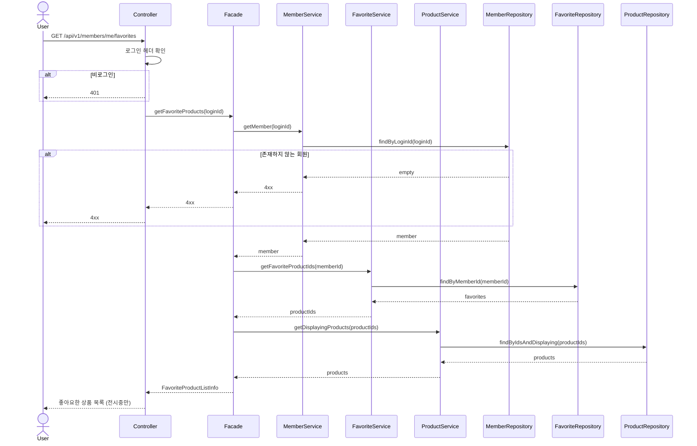
```mermaid
sequenceDiagram
    actor User
    participant Controller
    participant Facade
    participant MemberService
    participant FavoriteService
    participant ProductService
    participant MemberRepository
    participant FavoriteRepository
    participant ProductRepository

    User->>Controller: GET /api/v1/members/me/favorites
    Controller->>Controller: 로그인 헤더 확인

    alt 비로그인
        Controller-->>User: 401
    end

    Controller->>Facade: getFavoriteProducts(loginId)

    Facade->>MemberService: getMember(loginId)
    MemberService->>MemberRepository: findByLoginId(loginId)
    alt 존재하지 않는 회원
        MemberRepository-->>MemberService: empty
        MemberService-->>Facade: 4xx
        Facade-->>Controller: 4xx
        Controller-->>User: 4xx
    end
    MemberRepository-->>MemberService: member
    MemberService-->>Facade: member

    Facade->>FavoriteService: getFavoriteProductIds(memberId)
    FavoriteService->>FavoriteRepository: findByMemberId(memberId)
    FavoriteRepository-->>FavoriteService: favorites
    FavoriteService-->>Facade: productIds

    Facade->>ProductService: getDisplayingProducts(productIds)
    ProductService->>ProductRepository: findByIdsAndDisplaying(productIds)
    ProductRepository-->>ProductService: products
    ProductService-->>Facade: products

    Facade-->>Controller: FavoriteProductListInfo
    Controller-->>User: 좋아요한 상품 목록 (전시중만)
```

**핵심 포인트:**
- 로그인 필수 (비로그인 시 401 반환).
- FavoriteService에서 좋아요한 상품 ID 목록을 조회한 후, ProductService에서 전시중인 상품만 필터링한다.
- Facade에서 두 Service를 조합하여 유스케이스를 처리한다.
- 전시 중단된 상품은 목록에서 제외된다.

---

## 상품 주문

주문 생성 시 상품 존재 확인, 재고 검증 및 차감, 주문 시점 상품 정보 스냅샷 저장까지의 흐름을 표현한다.

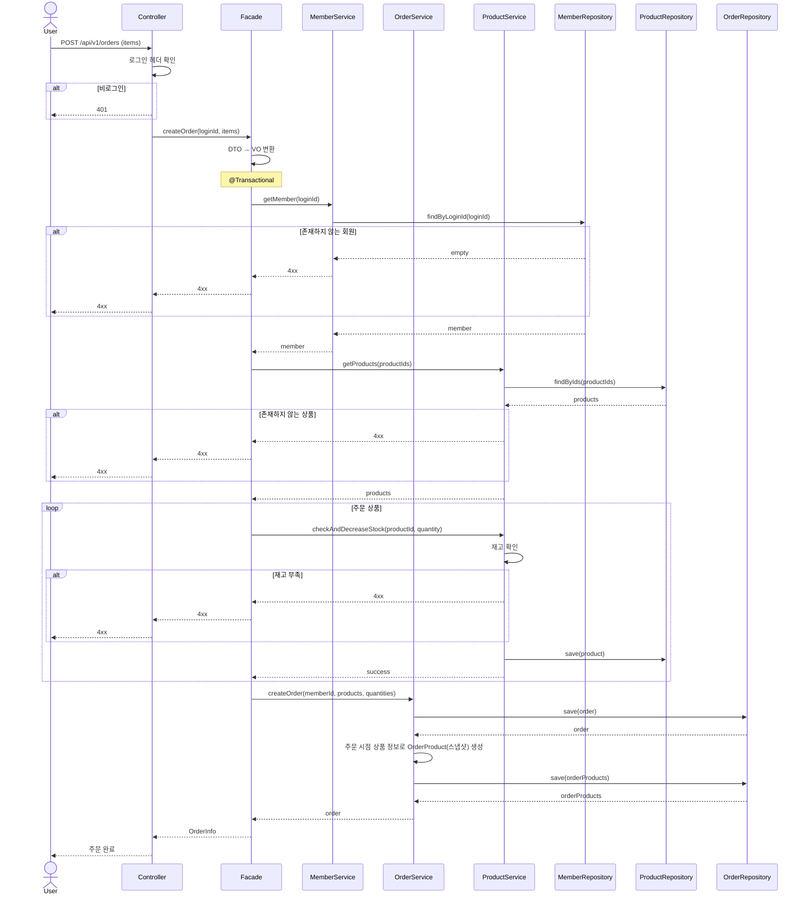
```mermaid
sequenceDiagram
    actor User
    participant Controller
    participant Facade
    participant MemberService
    participant OrderService
    participant ProductService
    participant MemberRepository
    participant ProductRepository
    participant OrderRepository

    User->>Controller: POST /api/v1/orders (items)
    Controller->>Controller: 로그인 헤더 확인

    alt 비로그인
        Controller-->>User: 401
    end

    Controller->>Facade: createOrder(loginId, items)
    Facade->>Facade: DTO → VO 변환
    Note over Facade: @Transactional

    Facade->>MemberService: getMember(loginId)
    MemberService->>MemberRepository: findByLoginId(loginId)
    alt 존재하지 않는 회원
        MemberRepository-->>MemberService: empty
        MemberService-->>Facade: 4xx
        Facade-->>Controller: 4xx
        Controller-->>User: 4xx
    end
    MemberRepository-->>MemberService: member
    MemberService-->>Facade: member

    Facade->>ProductService: getProducts(productIds)
    ProductService->>ProductRepository: findByIds(productIds)
    ProductRepository-->>ProductService: products

    alt 존재하지 않는 상품
        ProductService-->>Facade: 4xx
        Facade-->>Controller: 4xx
        Controller-->>User: 4xx
    end

    ProductService-->>Facade: products

    loop 주문 상품
        Facade->>ProductService: checkAndDecreaseStock(productId, quantity)
        ProductService->>ProductService: 재고 확인
        alt 재고 부족
            ProductService-->>Facade: 4xx
            Facade-->>Controller: 4xx
            Controller-->>User: 4xx
        end
        ProductService->>ProductRepository: save(product)
        ProductService-->>Facade: success
    end

    Facade->>OrderService: createOrder(memberId, products, quantities)
    OrderService->>OrderRepository: save(order)
    OrderRepository-->>OrderService: order
    OrderService->>OrderService: 주문 시점 상품 정보로 OrderProduct(스냅샷) 생성
    OrderService->>OrderRepository: save(orderProducts)
    OrderRepository-->>OrderService: orderProducts

    OrderService-->>Facade: order
    Facade-->>Controller: OrderInfo
    Controller-->>User: 주문 완료
```

**핵심 포인트:**
- Facade의 `@Transactional`로 회원 조회, 재고 차감, 주문 생성이 하나의 트랜잭션으로 묶인다.
- 주문 시점의 상품 정보(가격, 이름 등)를 OrderProduct로 스냅샷 저장하여 이후 상품 정보 변경에 영향받지 않는다.

---

## 주문 목록 조회

로그인한 유저의 주문 목록을 기간 필터링하여 조회하는 흐름을 표현한다.

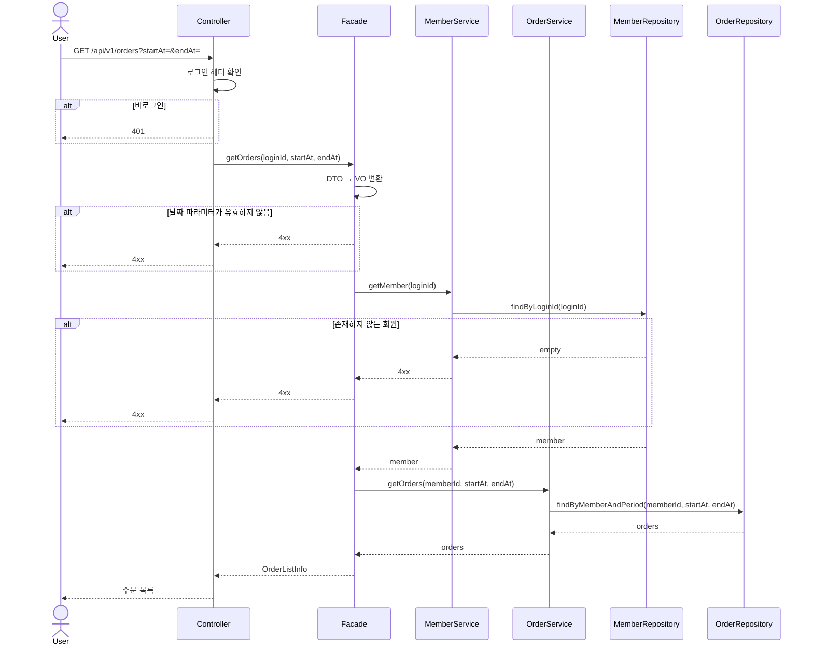
```mermaid
sequenceDiagram
    actor User
    participant Controller
    participant Facade
    participant MemberService
    participant OrderService
    participant MemberRepository
    participant OrderRepository

    User->>Controller: GET /api/v1/orders?startAt=&endAt=
    Controller->>Controller: 로그인 헤더 확인

    alt 비로그인
        Controller-->>User: 401
    end

    Controller->>Facade: getOrders(loginId, startAt, endAt)
    Facade->>Facade: DTO → VO 변환

    alt 날짜 파라미터가 유효하지 않음
        Facade-->>Controller: 4xx
        Controller-->>User: 4xx
    end

    Facade->>MemberService: getMember(loginId)
    MemberService->>MemberRepository: findByLoginId(loginId)
    alt 존재하지 않는 회원
        MemberRepository-->>MemberService: empty
        MemberService-->>Facade: 4xx
        Facade-->>Controller: 4xx
        Controller-->>User: 4xx
    end
    MemberRepository-->>MemberService: member
    MemberService-->>Facade: member

    Facade->>OrderService: getOrders(memberId, startAt, endAt)
    OrderService->>OrderRepository: findByMemberAndPeriod(memberId, startAt, endAt)
    OrderRepository-->>OrderService: orders

    OrderService-->>Facade: orders
    Facade-->>Controller: OrderListInfo
    Controller-->>User: 주문 목록
```

**핵심 포인트:**
- 본인의 주문만 조회된다.
- startAt, endAt 파라미터로 기간 필터링한다.
- VO 변환 시 날짜 파라미터의 유효성을 검증한다 (startAt > endAt 등).

---

## 주문 상세 조회

주문 존재 확인, 본인 주문 확인 후 주문 당시 저장된 정보를 반환하는 흐름을 표현한다.

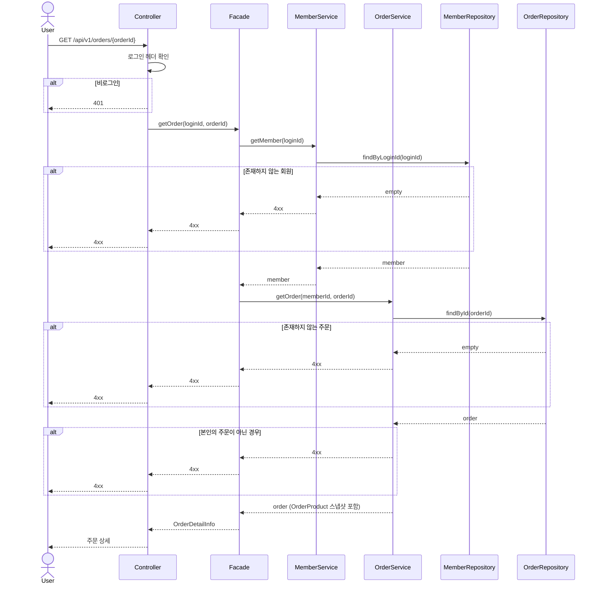
```mermaid
sequenceDiagram
    actor User
    participant Controller
    participant Facade
    participant MemberService
    participant OrderService
    participant MemberRepository
    participant OrderRepository

    User->>Controller: GET /api/v1/orders/{orderId}
    Controller->>Controller: 로그인 헤더 확인

    alt 비로그인
        Controller-->>User: 401
    end

    Controller->>Facade: getOrder(loginId, orderId)

    Facade->>MemberService: getMember(loginId)
    MemberService->>MemberRepository: findByLoginId(loginId)
    alt 존재하지 않는 회원
        MemberRepository-->>MemberService: empty
        MemberService-->>Facade: 4xx
        Facade-->>Controller: 4xx
        Controller-->>User: 4xx
    end
    MemberRepository-->>MemberService: member
    MemberService-->>Facade: member

    Facade->>OrderService: getOrder(memberId, orderId)
    OrderService->>OrderRepository: findById(orderId)

    alt 존재하지 않는 주문
        OrderRepository-->>OrderService: empty
        OrderService-->>Facade: 4xx
        Facade-->>Controller: 4xx
        Controller-->>User: 4xx
    end

    OrderRepository-->>OrderService: order

    alt 본인의 주문이 아닌 경우
        OrderService-->>Facade: 4xx
        Facade-->>Controller: 4xx
        Controller-->>User: 4xx
    end

    OrderService-->>Facade: order (OrderProduct 스냅샷 포함)
    Facade-->>Controller: OrderDetailInfo
    Controller-->>User: 주문 상세
```

**핵심 포인트:**
- 주문 존재 여부와 본인 주문 여부를 순차적으로 검증한다.
- 주문 당시 저장된 OrderProduct(스냅샷) 정보를 반환한다.

---

## 관리자 공통 인증

모든 관리자 API는 `X-Loopers-Ldap` 커스텀 헤더를 통해 관리자 인증을 수행한다. 헤더가 누락되거나 값이 일치하지 않는 경우 401을 반환한다. 이후 모든 관리자 다이어그램에서 아래 패턴이 공통으로 적용된다.

```
Controller->>Controller: X-Loopers-Ldap 헤더 확인
alt 인증 실패
    Controller-->>Admin: 401
end
```

---

## 관리자 - 브랜드 등록

관리자가 새로운 브랜드를 등록하는 흐름을 표현한다.

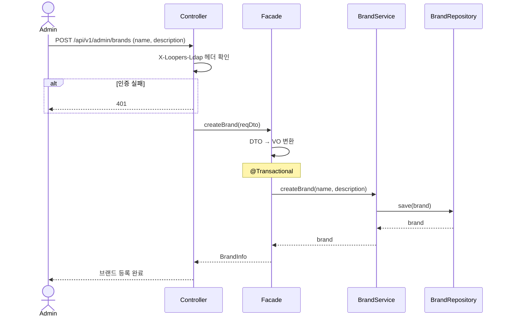
```mermaid
sequenceDiagram
    actor Admin
    participant Controller
    participant Facade
    participant BrandService
    participant BrandRepository

    Admin->>Controller: POST /api/v1/admin/brands (name, description)
    Controller->>Controller: X-Loopers-Ldap 헤더 확인

    alt 인증 실패
        Controller-->>Admin: 401
    end

    Controller->>Facade: createBrand(reqDto)
    Facade->>Facade: DTO → VO 변환
    Note over Facade: @Transactional
    Facade->>BrandService: createBrand(name, description)
    BrandService->>BrandRepository: save(brand)
    BrandRepository-->>BrandService: brand
    BrandService-->>Facade: brand
    Facade-->>Controller: BrandInfo
    Controller-->>Admin: 브랜드 등록 완료
```

**핵심 포인트:**
- 모든 관리자 API는 X-Loopers-Ldap 헤더 검증이 필수이다.
- Facade에서 DTO를 VO로 변환하여 Service에 전달한다.

---

## 관리자 - 브랜드 수정

관리자가 기존 브랜드 정보를 수정하는 흐름을 표현한다.

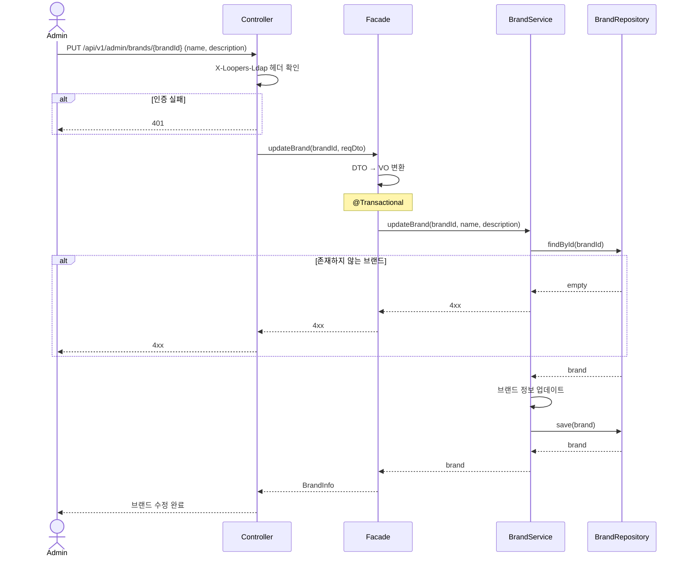
```mermaid
sequenceDiagram
    actor Admin
    participant Controller
    participant Facade
    participant BrandService
    participant BrandRepository

    Admin->>Controller: PUT /api/v1/admin/brands/{brandId} (name, description)
    Controller->>Controller: X-Loopers-Ldap 헤더 확인

    alt 인증 실패
        Controller-->>Admin: 401
    end

    Controller->>Facade: updateBrand(brandId, reqDto)
    Facade->>Facade: DTO → VO 변환
    Note over Facade: @Transactional
    Facade->>BrandService: updateBrand(brandId, name, description)
    BrandService->>BrandRepository: findById(brandId)

    alt 존재하지 않는 브랜드
        BrandRepository-->>BrandService: empty
        BrandService-->>Facade: 4xx
        Facade-->>Controller: 4xx
        Controller-->>Admin: 4xx
    end

    BrandRepository-->>BrandService: brand
    BrandService->>BrandService: 브랜드 정보 업데이트
    BrandService->>BrandRepository: save(brand)
    BrandRepository-->>BrandService: brand
    BrandService-->>Facade: brand
    Facade-->>Controller: BrandInfo
    Controller-->>Admin: 브랜드 수정 완료
```

**핵심 포인트:**
- 브랜드 존재 여부를 먼저 확인하고, 없으면 4xx를 반환한다.
- Service에서 도메인 객체의 정보를 업데이트한다.

---

## 관리자 - 브랜드 삭제

관리자가 브랜드를 삭제하는 흐름을 표현한다. 브랜드 삭제 시 해당 브랜드의 상품들도 함께 삭제된다.

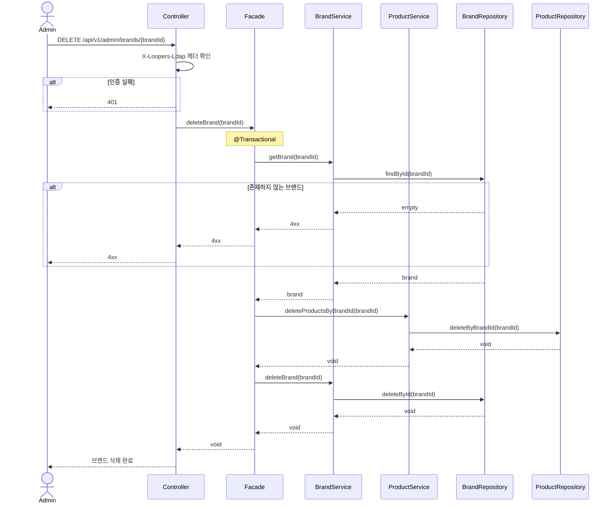
```mermaid
sequenceDiagram
    actor Admin
    participant Controller
    participant Facade
    participant BrandService
    participant ProductService
    participant BrandRepository
    participant ProductRepository

    Admin->>Controller: DELETE /api/v1/admin/brands/{brandId}
    Controller->>Controller: X-Loopers-Ldap 헤더 확인

    alt 인증 실패
        Controller-->>Admin: 401
    end

    Controller->>Facade: deleteBrand(brandId)
    Note over Facade: @Transactional
    Facade->>BrandService: getBrand(brandId)
    BrandService->>BrandRepository: findById(brandId)

    alt 존재하지 않는 브랜드
        BrandRepository-->>BrandService: empty
        BrandService-->>Facade: 4xx
        Facade-->>Controller: 4xx
        Controller-->>Admin: 4xx
    end

    BrandRepository-->>BrandService: brand
    BrandService-->>Facade: brand

    Facade->>ProductService: deleteProductsByBrandId(brandId)
    ProductService->>ProductRepository: deleteByBrandId(brandId)
    ProductRepository-->>ProductService: void
    ProductService-->>Facade: void

    Facade->>BrandService: deleteBrand(brandId)
    BrandService->>BrandRepository: deleteById(brandId)
    BrandRepository-->>BrandService: void
    BrandService-->>Facade: void
    Facade-->>Controller: void
    Controller-->>Admin: 브랜드 삭제 완료
```

**핵심 포인트:**
- 브랜드 삭제 전 존재 여부를 확인한다.
- 브랜드 삭제 시 해당 브랜드의 모든 상품을 먼저 삭제한다.
- Facade의 `@Transactional`로 상품 삭제와 브랜드 삭제가 하나의 트랜잭션으로 묶인다.
- Facade에서 ProductService와 BrandService를 조합하여 삭제 흐름을 관리한다.

---

## 관리자 - 브랜드 목록 조회

관리자가 브랜드 목록을 페이지네이션으로 조회하는 흐름을 표현한다.

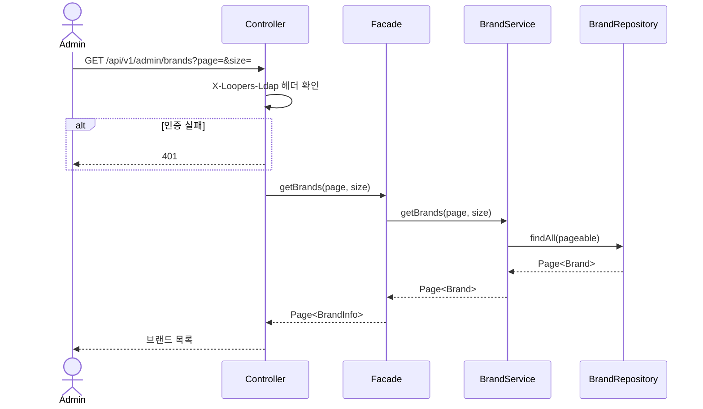
```mermaid
sequenceDiagram
    actor Admin
    participant Controller
    participant Facade
    participant BrandService
    participant BrandRepository

    Admin->>Controller: GET /api/v1/admin/brands?page=&size=
    Controller->>Controller: X-Loopers-Ldap 헤더 확인

    alt 인증 실패
        Controller-->>Admin: 401
    end

    Controller->>Facade: getBrands(page, size)
    Facade->>BrandService: getBrands(page, size)
    BrandService->>BrandRepository: findAll(pageable)
    BrandRepository-->>BrandService: Page<Brand>
    BrandService-->>Facade: Page<Brand>
    Facade-->>Controller: Page<BrandInfo>
    Controller-->>Admin: 브랜드 목록
```

**핵심 포인트:**
- 페이지네이션을 지원한다 (page, size 파라미터).

---

## 관리자 - 브랜드 상세 조회

관리자가 특정 브랜드의 상세 정보를 조회하는 흐름을 표현한다.

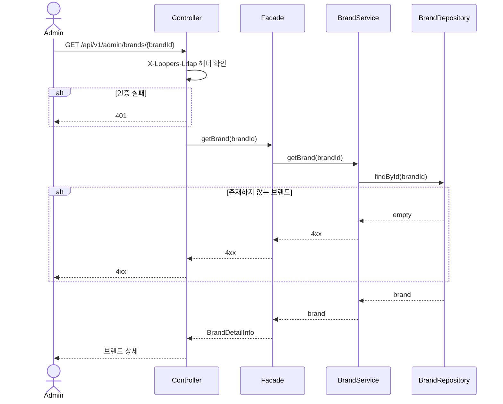
```mermaid
sequenceDiagram
    actor Admin
    participant Controller
    participant Facade
    participant BrandService
    participant BrandRepository

    Admin->>Controller: GET /api/v1/admin/brands/{brandId}
    Controller->>Controller: X-Loopers-Ldap 헤더 확인

    alt 인증 실패
        Controller-->>Admin: 401
    end

    Controller->>Facade: getBrand(brandId)
    Facade->>BrandService: getBrand(brandId)
    BrandService->>BrandRepository: findById(brandId)

    alt 존재하지 않는 브랜드
        BrandRepository-->>BrandService: empty
        BrandService-->>Facade: 4xx
        Facade-->>Controller: 4xx
        Controller-->>Admin: 4xx
    end

    BrandRepository-->>BrandService: brand
    BrandService-->>Facade: brand
    Facade-->>Controller: BrandDetailInfo
    Controller-->>Admin: 브랜드 상세
```

**핵심 포인트:**
- 브랜드가 존재하지 않으면 4xx를 반환한다.

---

## 관리자 - 상품 등록

관리자가 새로운 상품을 등록하는 흐름을 표현한다. 브랜드 존재 여부를 먼저 검증한다.

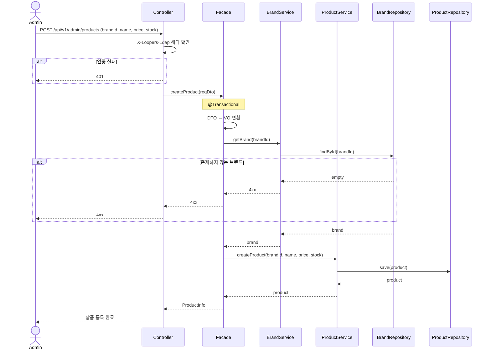
```mermaid
sequenceDiagram
    actor Admin
    participant Controller
    participant Facade
    participant BrandService
    participant ProductService
    participant BrandRepository
    participant ProductRepository

    Admin->>Controller: POST /api/v1/admin/products (brandId, name, price, stock)
    Controller->>Controller: X-Loopers-Ldap 헤더 확인

    alt 인증 실패
        Controller-->>Admin: 401
    end

    Controller->>Facade: createProduct(reqDto)
    Note over Facade: @Transactional
    Facade->>Facade: DTO → VO 변환

    Facade->>BrandService: getBrand(brandId)
    BrandService->>BrandRepository: findById(brandId)

    alt 존재하지 않는 브랜드
        BrandRepository-->>BrandService: empty
        BrandService-->>Facade: 4xx
        Facade-->>Controller: 4xx
        Controller-->>Admin: 4xx
    end

    BrandRepository-->>BrandService: brand
    BrandService-->>Facade: brand

    Facade->>ProductService: createProduct(brandId, name, price, stock)
    ProductService->>ProductRepository: save(product)
    ProductRepository-->>ProductService: product
    ProductService-->>Facade: product
    Facade-->>Controller: ProductInfo
    Controller-->>Admin: 상품 등록 완료
```

**핵심 포인트:**
- 상품 등록 전 BrandService를 통해 브랜드 존재 여부를 검증한다.
- 존재하지 않는 브랜드로 상품 등록 시 4xx를 반환한다.

---

## 관리자 - 상품 수정

관리자가 상품 정보를 수정하는 흐름을 표현한다. 브랜드 정보 변경은 허용되지 않는다.

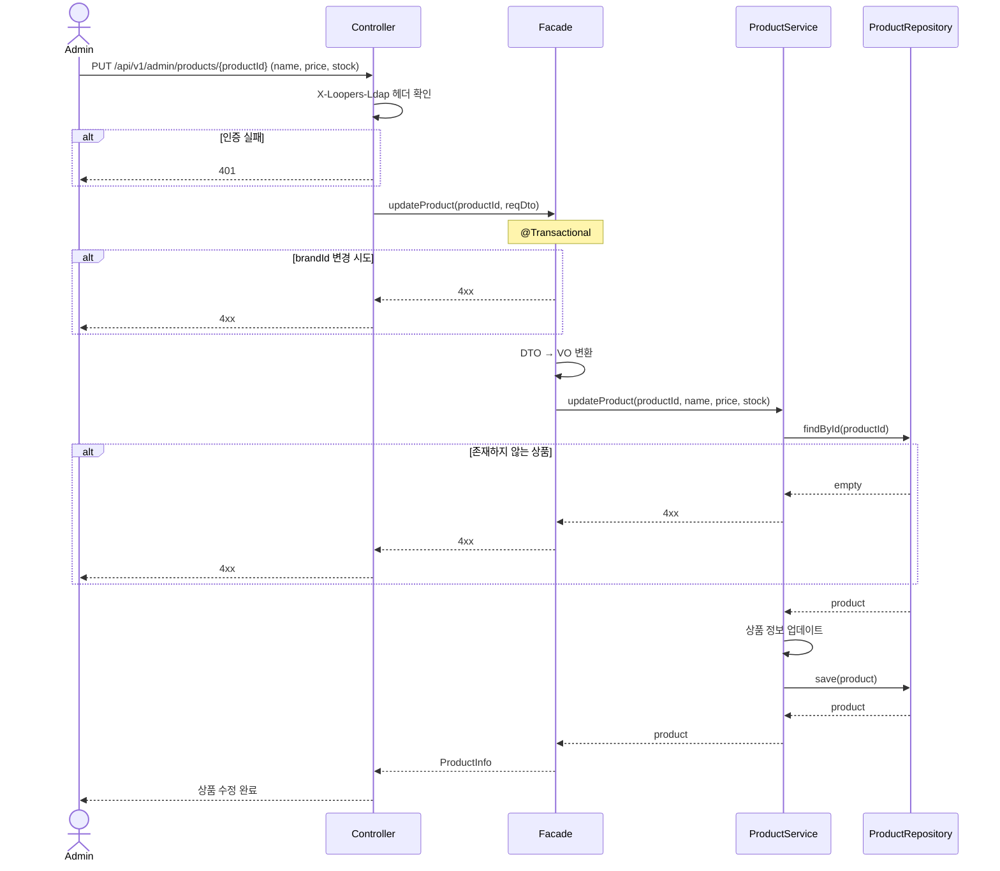
```mermaid
sequenceDiagram
    actor Admin
    participant Controller
    participant Facade
    participant ProductService
    participant ProductRepository

    Admin->>Controller: PUT /api/v1/admin/products/{productId} (name, price, stock)
    Controller->>Controller: X-Loopers-Ldap 헤더 확인

    alt 인증 실패
        Controller-->>Admin: 401
    end

    Controller->>Facade: updateProduct(productId, reqDto)
    Note over Facade: @Transactional

    alt brandId 변경 시도
        Facade-->>Controller: 4xx
        Controller-->>Admin: 4xx
    end

    Facade->>Facade: DTO → VO 변환
    Facade->>ProductService: updateProduct(productId, name, price, stock)
    ProductService->>ProductRepository: findById(productId)

    alt 존재하지 않는 상품
        ProductRepository-->>ProductService: empty
        ProductService-->>Facade: 4xx
        Facade-->>Controller: 4xx
        Controller-->>Admin: 4xx
    end

    ProductRepository-->>ProductService: product
    ProductService->>ProductService: 상품 정보 업데이트
    ProductService->>ProductRepository: save(product)
    ProductRepository-->>ProductService: product
    ProductService-->>Facade: product
    Facade-->>Controller: ProductInfo
    Controller-->>Admin: 상품 수정 완료
```

**핵심 포인트:**
- 요청 DTO에 brandId 필드가 포함되어 있으면 4xx를 반환한다 (브랜드 변경 불가).
- 상품 존재 여부를 확인한 후 수정한다.

---

## 관리자 - 상품 삭제

관리자가 상품을 삭제하는 흐름을 표현한다.

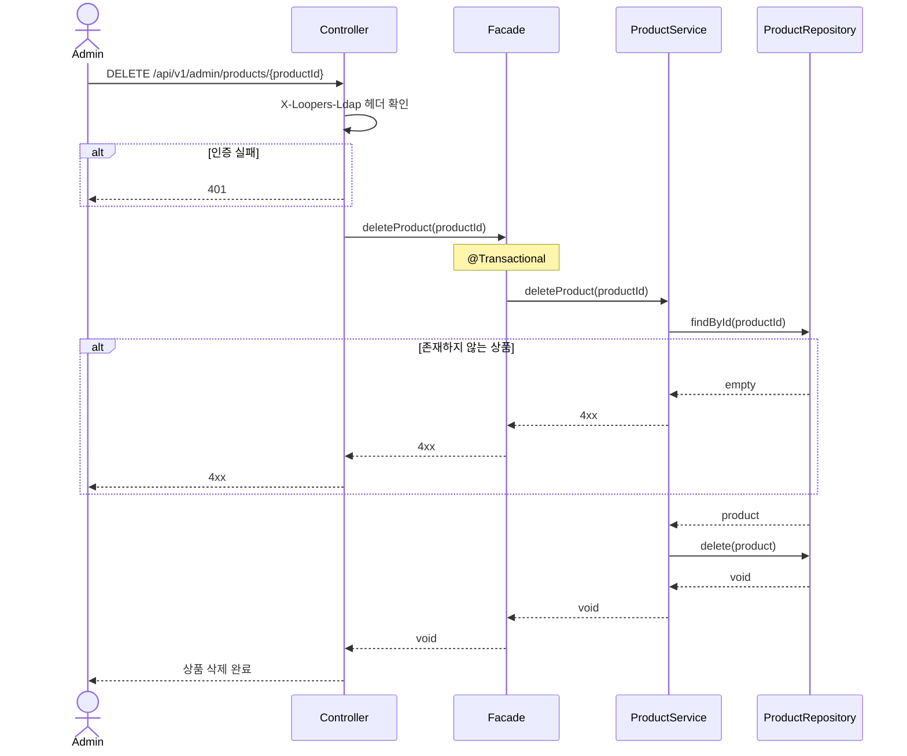
```mermaid
sequenceDiagram
    actor Admin
    participant Controller
    participant Facade
    participant ProductService
    participant ProductRepository

    Admin->>Controller: DELETE /api/v1/admin/products/{productId}
    Controller->>Controller: X-Loopers-Ldap 헤더 확인

    alt 인증 실패
        Controller-->>Admin: 401
    end

    Controller->>Facade: deleteProduct(productId)
    Note over Facade: @Transactional
    Facade->>ProductService: deleteProduct(productId)
    ProductService->>ProductRepository: findById(productId)

    alt 존재하지 않는 상품
        ProductRepository-->>ProductService: empty
        ProductService-->>Facade: 4xx
        Facade-->>Controller: 4xx
        Controller-->>Admin: 4xx
    end

    ProductRepository-->>ProductService: product
    ProductService->>ProductRepository: delete(product)
    ProductRepository-->>ProductService: void
    ProductService-->>Facade: void
    Facade-->>Controller: void
    Controller-->>Admin: 상품 삭제 완료
```

**핵심 포인트:**
- 상품 존재 여부를 확인한 후 삭제한다.

---

## 관리자 - 상품 목록 조회

관리자가 상품 목록을 조회하는 흐름을 표현한다. brandId 필터와 페이지네이션을 지원한다.

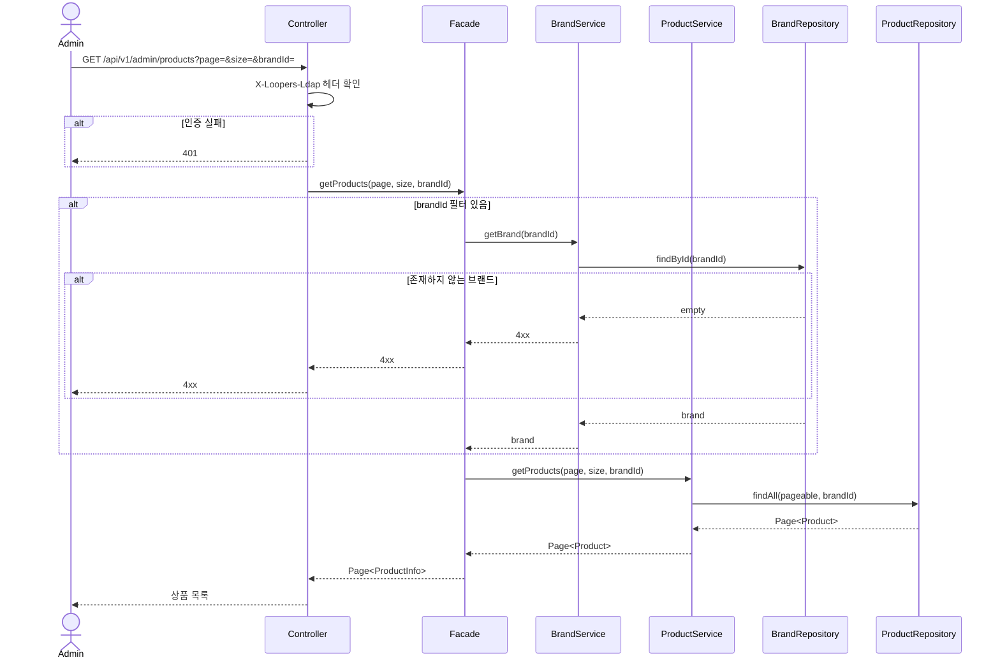
```mermaid
sequenceDiagram
    actor Admin
    participant Controller
    participant Facade
    participant BrandService
    participant ProductService
    participant BrandRepository
    participant ProductRepository

    Admin->>Controller: GET /api/v1/admin/products?page=&size=&brandId=
    Controller->>Controller: X-Loopers-Ldap 헤더 확인

    alt 인증 실패
        Controller-->>Admin: 401
    end

    Controller->>Facade: getProducts(page, size, brandId)

    alt brandId 필터 있음
        Facade->>BrandService: getBrand(brandId)
        BrandService->>BrandRepository: findById(brandId)

        alt 존재하지 않는 브랜드
            BrandRepository-->>BrandService: empty
            BrandService-->>Facade: 4xx
            Facade-->>Controller: 4xx
            Controller-->>Admin: 4xx
        end

        BrandRepository-->>BrandService: brand
        BrandService-->>Facade: brand
    end

    Facade->>ProductService: getProducts(page, size, brandId)
    ProductService->>ProductRepository: findAll(pageable, brandId)
    ProductRepository-->>ProductService: Page<Product>
    ProductService-->>Facade: Page<Product>
    Facade-->>Controller: Page<ProductInfo>
    Controller-->>Admin: 상품 목록
```

**핵심 포인트:**
- brandId는 선택적 파라미터이다. 제공 시 브랜드 존재 여부를 먼저 검증하고, 없으면 전체 상품을 조회한다.
- 존재하지 않는 브랜드 ID로 필터링 시 4xx를 반환한다.
- 페이지네이션을 지원한다 (page, size 파라미터).

---

## 관리자 - 상품 상세 조회

관리자가 특정 상품의 상세 정보를 조회하는 흐름을 표현한다.

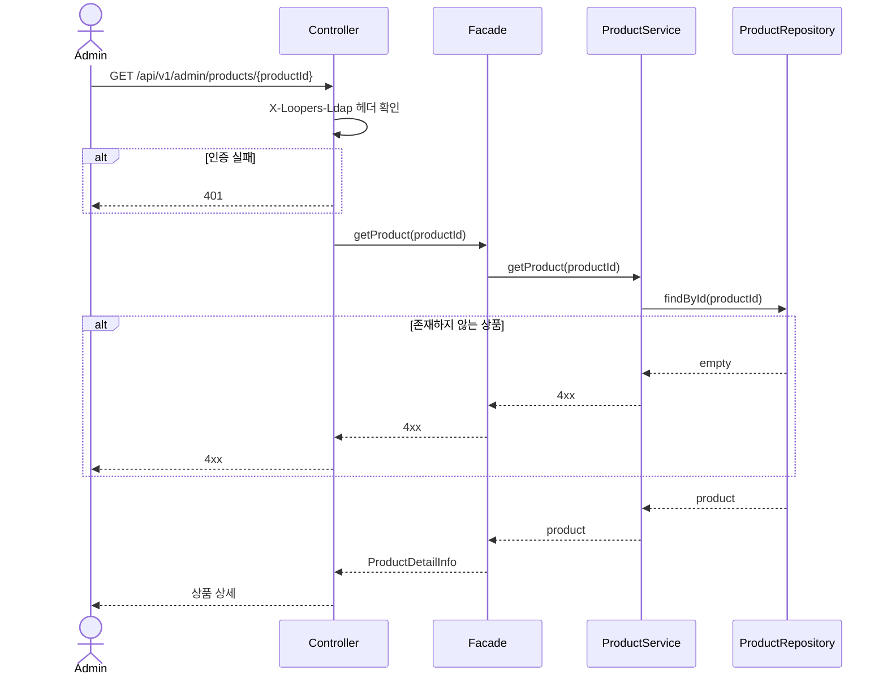
```mermaid
sequenceDiagram
    actor Admin
    participant Controller
    participant Facade
    participant ProductService
    participant ProductRepository

    Admin->>Controller: GET /api/v1/admin/products/{productId}
    Controller->>Controller: X-Loopers-Ldap 헤더 확인

    alt 인증 실패
        Controller-->>Admin: 401
    end

    Controller->>Facade: getProduct(productId)
    Facade->>ProductService: getProduct(productId)
    ProductService->>ProductRepository: findById(productId)

    alt 존재하지 않는 상품
        ProductRepository-->>ProductService: empty
        ProductService-->>Facade: 4xx
        Facade-->>Controller: 4xx
        Controller-->>Admin: 4xx
    end

    ProductRepository-->>ProductService: product
    ProductService-->>Facade: product
    Facade-->>Controller: ProductDetailInfo
    Controller-->>Admin: 상품 상세
```

**핵심 포인트:**
- 상품이 존재하지 않으면 4xx를 반환한다.

---

## 관리자 - 주문 목록 조회

관리자가 전체 사용자의 주문 목록을 조회하는 흐름을 표현한다.

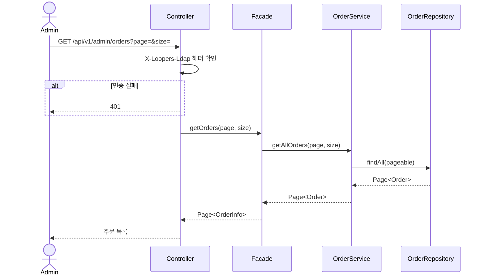
```mermaid
sequenceDiagram
    actor Admin
    participant Controller
    participant Facade
    participant OrderService
    participant OrderRepository

    Admin->>Controller: GET /api/v1/admin/orders?page=&size=
    Controller->>Controller: X-Loopers-Ldap 헤더 확인

    alt 인증 실패
        Controller-->>Admin: 401
    end

    Controller->>Facade: getOrders(page, size)
    Facade->>OrderService: getAllOrders(page, size)
    OrderService->>OrderRepository: findAll(pageable)
    OrderRepository-->>OrderService: Page<Order>
    OrderService-->>Facade: Page<Order>
    Facade-->>Controller: Page<OrderInfo>
    Controller-->>Admin: 주문 목록
```

**핵심 포인트:**
- 전체 사용자의 주문을 조회한다 (회원 필터 없음).
- 페이지네이션을 지원한다 (page, size 파라미터).

---

## 관리자 - 주문 상세 조회

관리자가 특정 주문의 상세 정보를 조회하는 흐름을 표현한다. 소유자 확인 없이 모든 주문을 조회할 수 있다.

```mermaid
sequenceDiagram
    actor Admin
    participant Controller
    participant Facade
    participant OrderService
    participant OrderRepository

    Admin->>Controller: GET /api/v1/admin/orders/{orderId}
    Controller->>Controller: X-Loopers-Ldap 헤더 확인

    alt 인증 실패
        Controller-->>Admin: 401
    end

    Controller->>Facade: getOrder(orderId)
    Facade->>OrderService: getOrder(orderId)
    OrderService->>OrderRepository: findById(orderId)

    alt 존재하지 않는 주문
        OrderRepository-->>OrderService: empty
        OrderService-->>Facade: 4xx
        Facade-->>Controller: 4xx
        Controller-->>Admin: 4xx
    end

    OrderRepository-->>OrderService: order (OrderProduct 스냅샷 포함)
    OrderService-->>Facade: order
    Facade-->>Controller: OrderDetailInfo
    Controller-->>Admin: 주문 상세
```

**핵심 포인트:**
- 주문 존재 여부만 확인한다 (소유자 검증 없음, 관리자는 모든 주문 조회 가능).
- 주문 당시 저장된 OrderProduct(스냅샷) 정보를 반환한다.
- 유저 주문 상세 조회와 달리 본인 주문 확인 로직이 없다.
