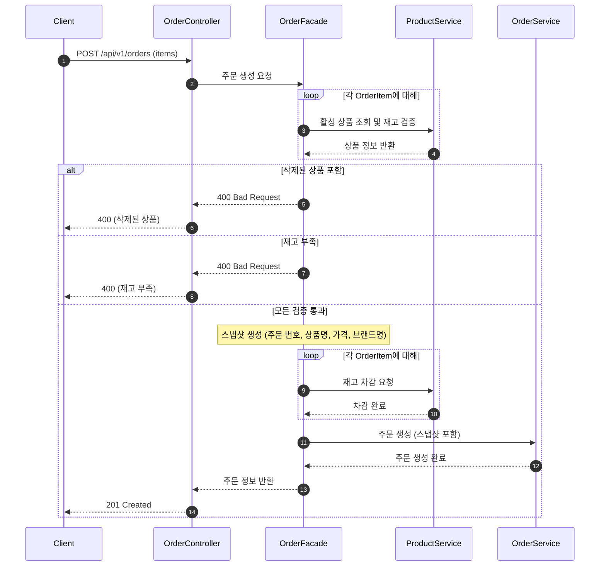
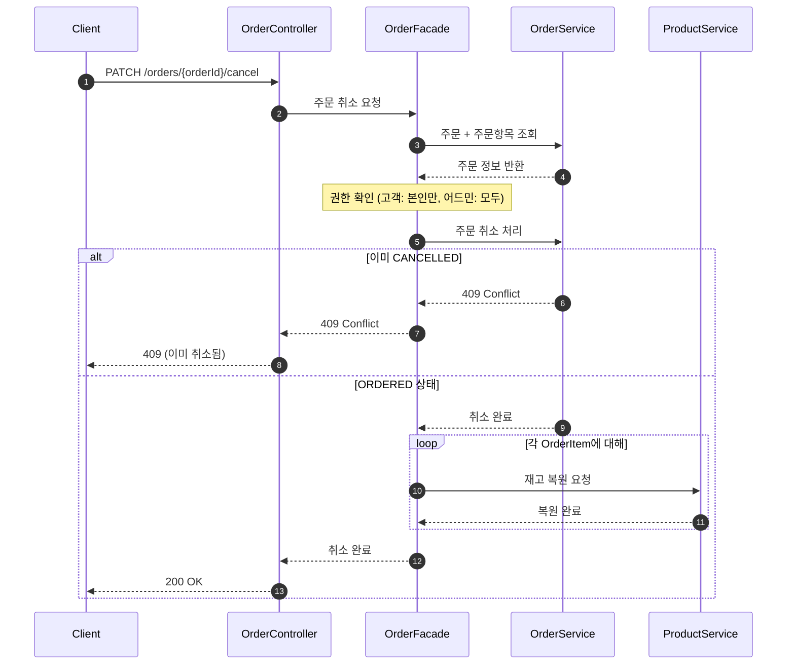
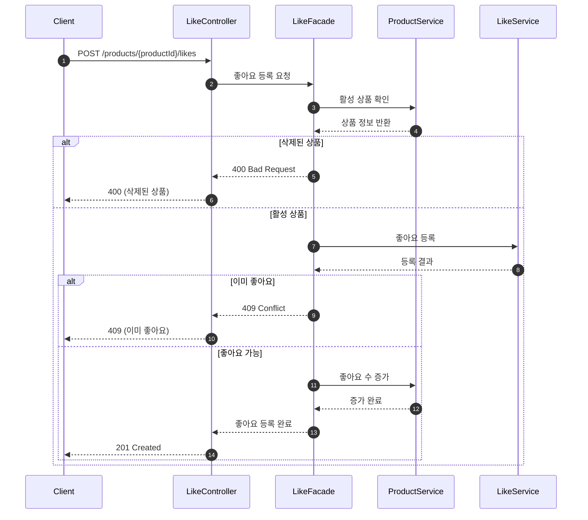
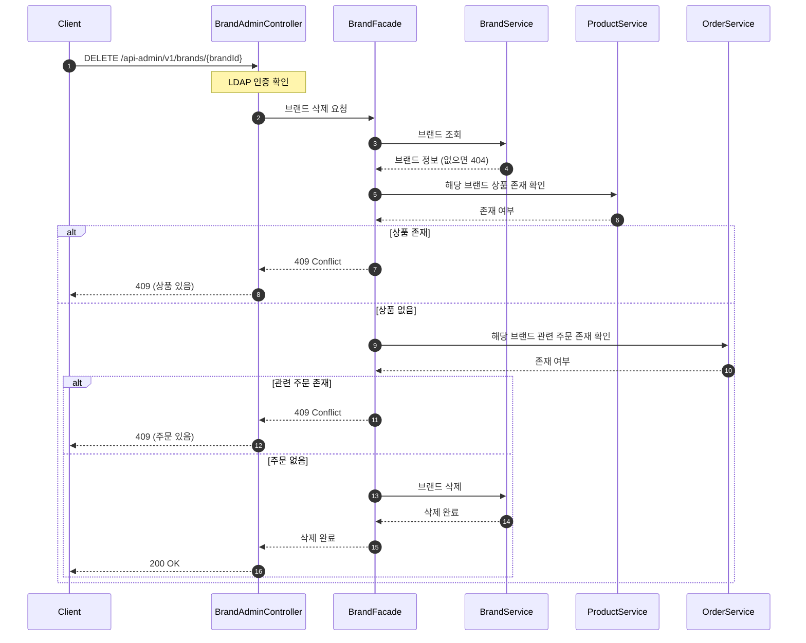
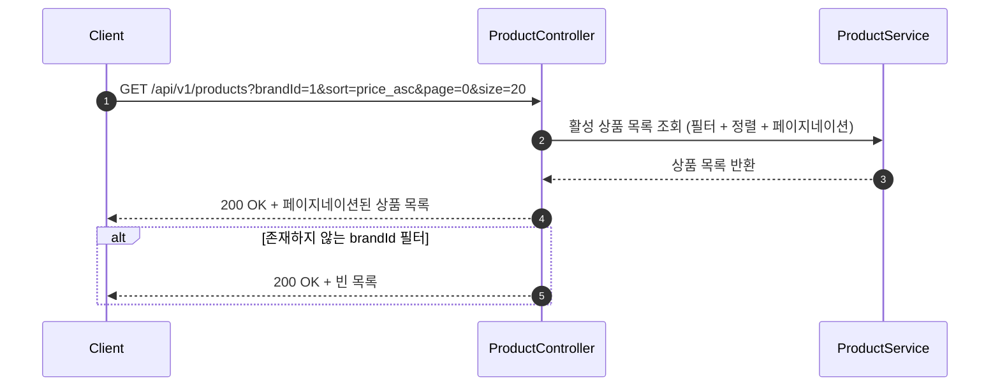

# 시퀀스 다이어그램

## 주문 요청 (POST /api/v1/orders)

주문 생성은 이 시스템에서 가장 복잡한 로직이다. 상품 활성 상태 확인 → 재고 확인 → 재고 차감 → 스냅샷 생성 → 주문 저장이 원자적으로 처리되는지, 실패 시 전체 롤백이 보장되는지 검증한다.

### 핵심 포인트
- **전체 실패 정책**: 여러 상품 중 하나라도 문제가 있으면 전체 주문이 실패한다 (부분 성공 없음).
- **스냅샷 시점**: Facade에서 검증 완료된 상품 정보로 스냅샷을 생성한 후, OrderService에 전달.

### 설계 리스크
- **크로스 도메인 원자성**: 재고 차감과 주문 저장이 별도 트랜잭션이므로, 주문 저장 실패 시 재고 복원 보상 로직 필요.
- **재고 동시성**: Facade의 읽기 검증과 재고 차감 사이에 갭이 존재. `WHERE stock >= quantity` 조건으로 해결 가능.

---

## 주문 취소 (PATCH /orders/{orderId}/cancel)

주문 취소는 고객/어드민 모두 가능하되 권한이 다르다. 상태 변경과 재고 복원이 처리되는지, 이미 취소된 주문에 대한 처리를 검증한다.

### 핵심 포인트
- **권한 분기**: Facade에서 권한을 확인한 후 (고객: 본인만, 어드민: 모두), 취소 로직을 진행.

### 설계 리스크
- **삭제된 상품의 재고 복원**: 주문 후 상품이 Soft Delete된 경우, 취소 시 재고를 복원해야 하는지 정책 결정 필요. 현재는 복원하는 것으로 가정.

---

## 좋아요 등록 (POST /api/v1/products/{productId}/likes)

좋아요 등록은 Like 저장과 Product의 likeCount 업데이트가 일관성 있게 처리되는지 검증한다. 중복 좋아요 방지와 삭제된 상품 차단 로직을 확인한다.

### 핵심 포인트
- **이중 보호**: 애플리케이션 레벨 중복 체크 + DB Unique 제약조건으로 중복 방지.

### 설계 리스크
- **크로스 도메인 원자성**: 좋아요 저장과 좋아요 수 증가가 별도 트랜잭션. 좋아요 수 증가 실패 시 좋아요 삭제 보상 로직 필요.
- **likeCount 경합**: 인기 상품에 좋아요가 몰릴 경우 likeCount UPDATE에서 락 경합 발생 가능. 기본 기능 개발 후 고도화 단계에서 해결.

---

## 브랜드 삭제 (DELETE /api-admin/v1/brands/{brandId})

브랜드 삭제는 참조 무결성 보장이 핵심이다. 상품이 있거나, 관련 상품에 주문이 있는 경우 삭제를 차단하는 로직이 올바른 순서로 동작하는지 검증한다.

### 핵심 포인트
- **참조 무결성 순서**: Facade에서 상품 존재 확인 → 주문 존재 확인 → BrandService에 삭제 위임.

### 설계 리스크
- **확인-삭제 사이 갭**: 상품 없음을 확인한 후 삭제 전에 새 상품이 등록될 수 있음. 트랜잭션 격리 수준으로 기본 방어 가능.

---

## 상품 목록 조회 (GET /api/v1/products)

동적 필터(브랜드), 정렬(최신순/가격순/좋아요순), 페이지네이션이 결합된 읽기 전용 쿼리다. Facade 없이 처리되는 조회 패턴과, Soft Delete된 상품이 고객/어드민 API에서 다르게 처리되는 로직을 검증한다.

### 핵심 포인트
- **Facade 불필요**: 읽기 전용 조회이므로 Controller → Service로 직접 흐른다.
- **동적 쿼리**: brandId는 선택적 필터, sort는 3가지 정렬 기준(latest, price_asc, likes_desc), page/size로 페이지네이션 처리.
- **Soft Delete 분기**: 고객 API는 삭제 상품 제외. 어드민 API(`/api-admin/v1/products`)는 deletedAt 포함하여 전체 노출.

### 설계 리스크
- **정렬 성능**: likes_desc 정렬 시 likeCount 컬럼에 인덱스가 없으면 대량 데이터에서 성능 저하 가능. 인덱스 추가로 해결.
