# 시퀀스 다이어그램 — 브랜드 & 상품

## API 공통 규칙

- 대고객 API: `/api/v1` prefix. 유저 식별 시 `X-Loopers-LoginId`, `X-Loopers-LoginPw` 헤더 사용.
- 어드민 API: `/api-admin/v1` prefix. 어드민 식별 시 `X-Loopers-Ldap: loopers.admin` 헤더 사용.
- 인증/인가는 구현하지 않으며, 헤더 기반 식별만 수행한다.

---

## 1. 일반 사용자 — 브랜드 상세 조회

Facade가 BrandService와 ProductService를 조합하여 브랜드 기본 정보 + 판매중 상품 수를 반환한다.

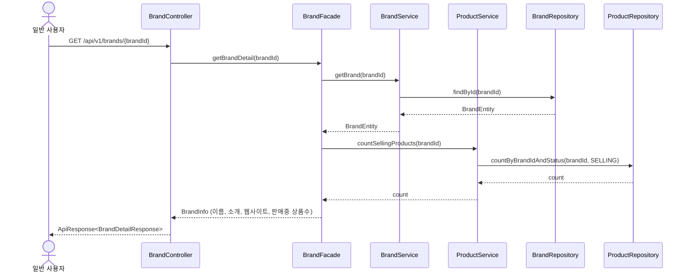

- 포인트: Facade가 BrandService와 ProductService를 각각 호출하여 조합한다. 브랜드 기본 정보와 판매중 상품 개수는 서로 다른 서비스의 책임이므로, Facade에서 조합하는 것이 적절하다.

## 2. 일반 사용자 — 상품 목록 조회 (정렬/페이징)

정렬 조건은 Controller에서 enum으로 변환, Repository에서 동적 정렬 처리.

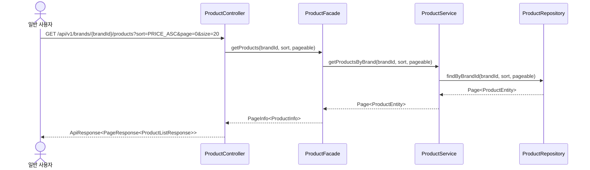

- 포인트: 정렬 조건은 Controller에서 enum으로 변환하여 전달하고, Repository에서 동적 정렬을 처리한다. Pageable은 Spring Data의 표준 페이징을 활용한다.

## 3. 일반 사용자 — 브랜드 검색

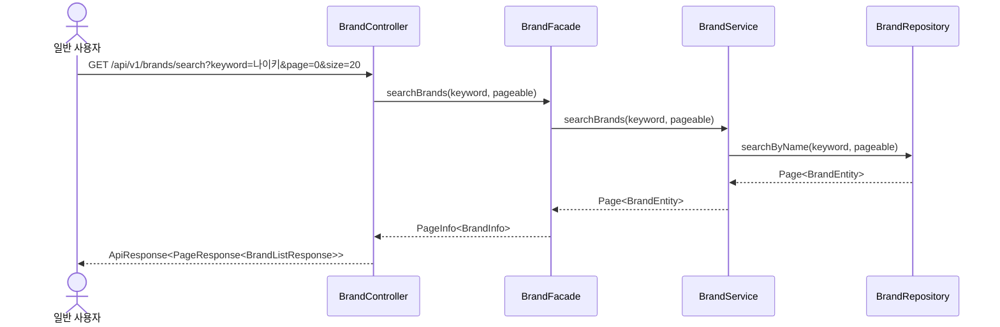

## 4. 일반 사용자 — 상품 검색

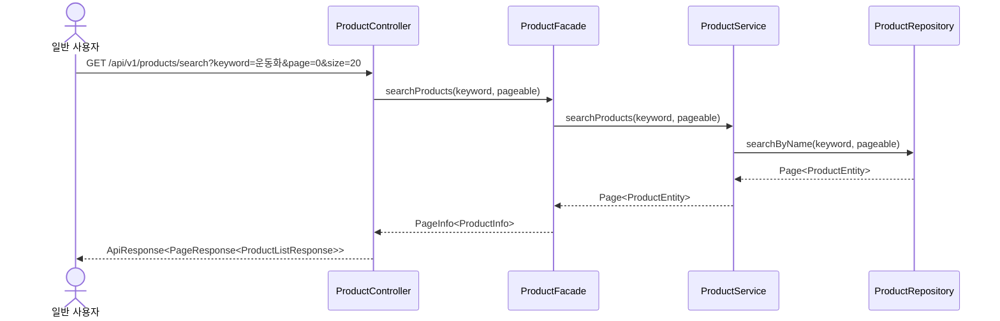

## 5. Admin — 브랜드 목록 조회

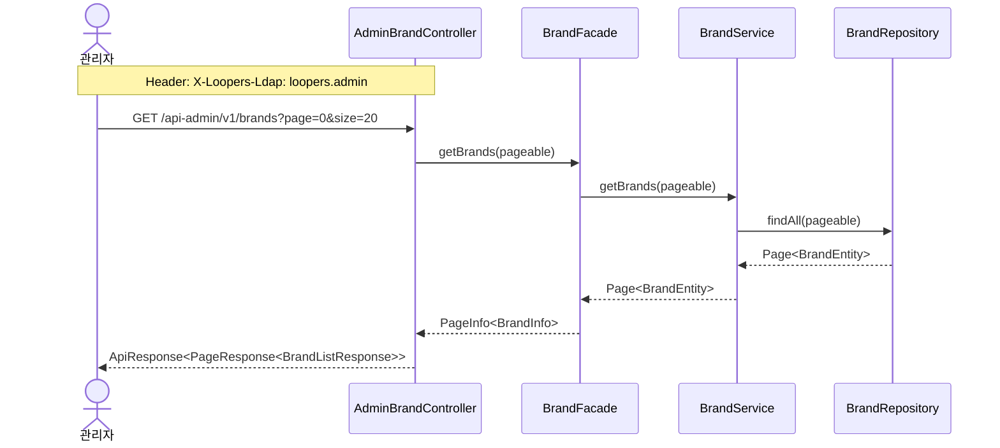

## 6. Admin — 브랜드 등록

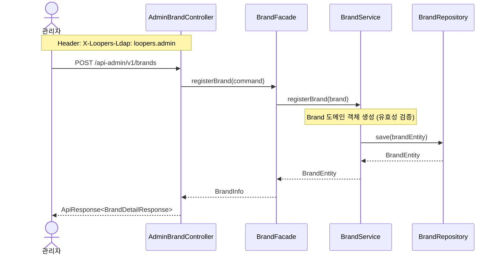

## 7. Admin — 브랜드 수정

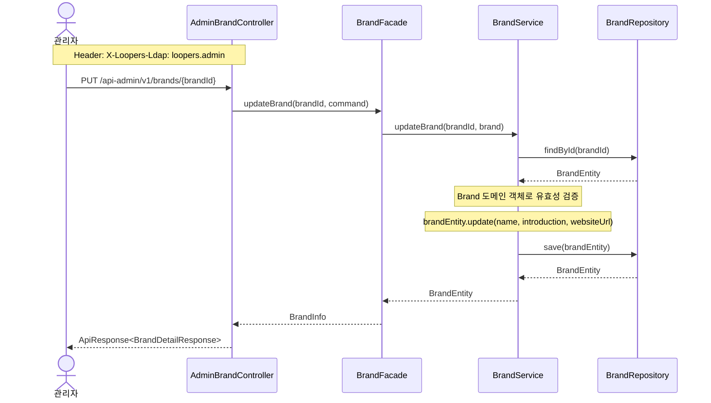

## 8. Admin — 브랜드 삭제 (상품 일괄 삭제)

하나의 트랜잭션 안에서 상품 벌크 soft delete -> 브랜드 soft delete 순서로 처리.

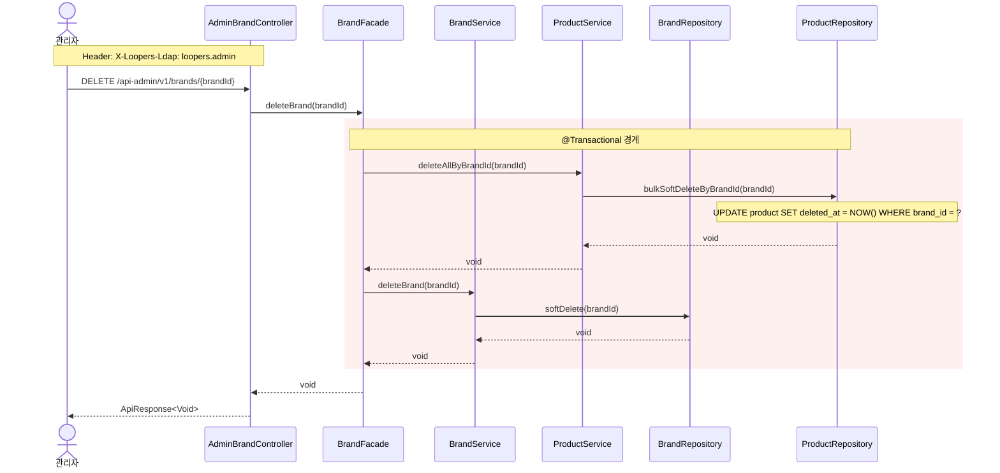

- 포인트: 브랜드 삭제와 상품 일괄 삭제는 하나의 트랜잭션 안에서 처리된다. 상품을 먼저 삭제한 후 브랜드를 삭제하는 순서. Facade 레벨에서 @Transactional을 걸어 두 서비스 호출을 묶는다.

## 9. Admin — 상품 등록

상품 등록 시 브랜드 존재 여부 확인 필수. Product 도메인 객체에서 유효성 검증 수행.

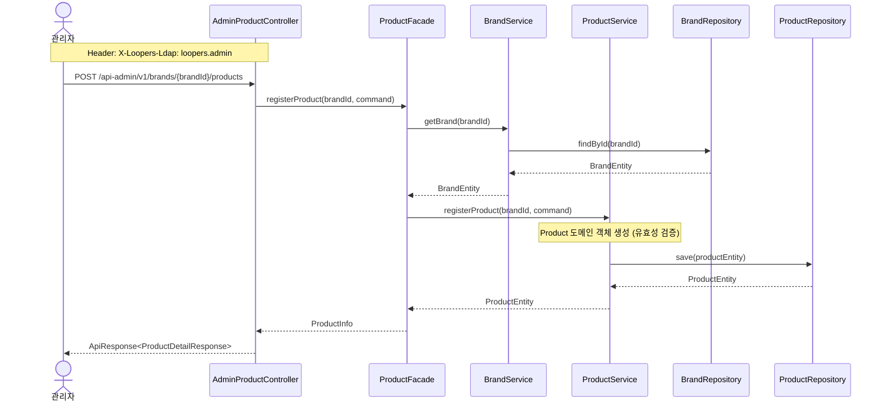

- 포인트: 상품 등록 시 브랜드 존재 여부를 먼저 확인한다. 존재하지 않으면 CoreException(NOT_FOUND)을 던진다. Product 도메인 객체에서 비즈니스 유효성 검증(가격 > 0 등)을 수행한다.

## 10. Admin — 상품 수정

상품 수정 시 소속 브랜드는 변경 불가.

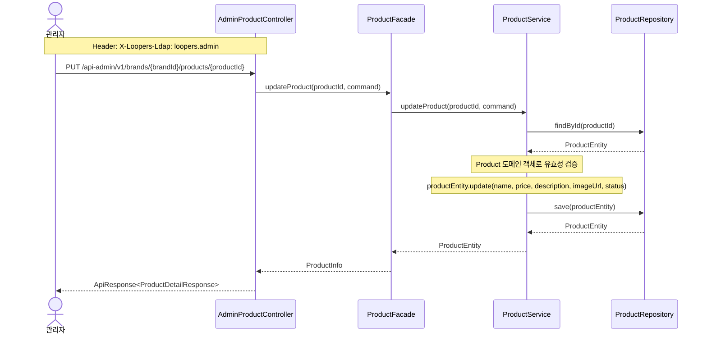

## 11. Admin — 상품 삭제

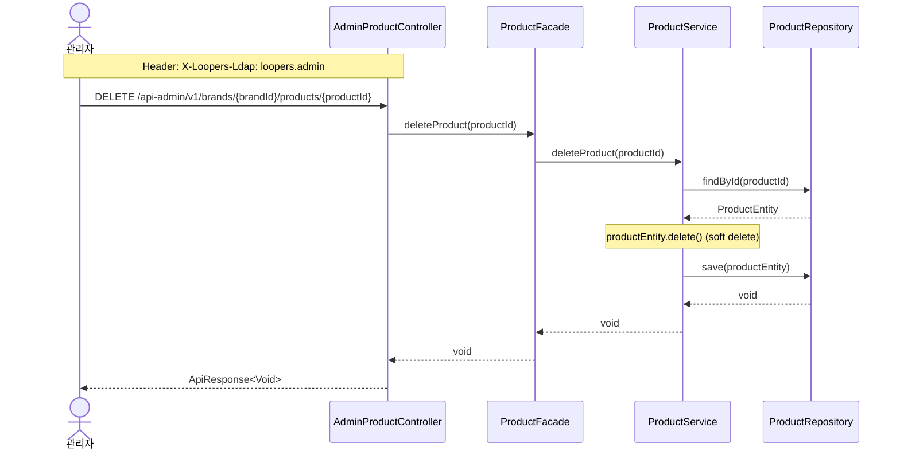

## 12. Admin — 브랜드 상품 목록 조회

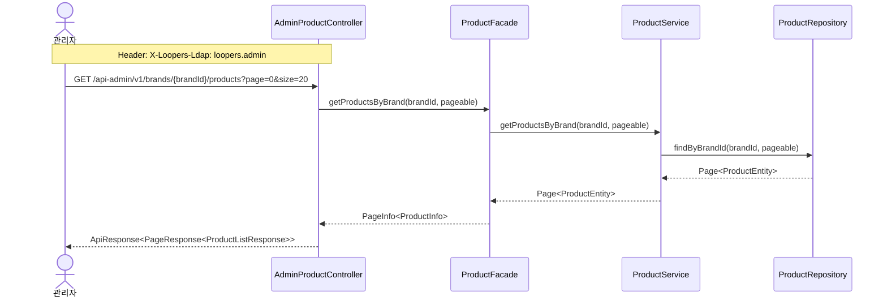

## 13. Admin — 브랜드 상품 상세 조회

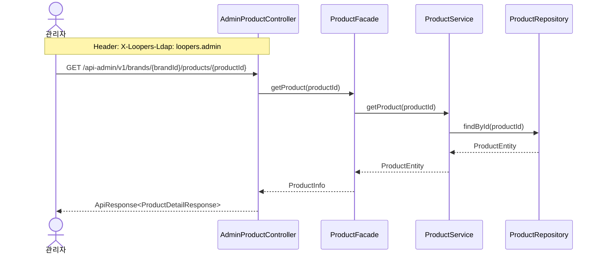

---

# 시퀀스 다이어그램 — 좋아요 & 주문

## 14. 좋아요 등록

멱등성 보장이 핵심. 서비스 레이어에서 기존 레코드 존재 여부를 먼저 확인하고, 이미 좋아요 상태면 에러 없이 기존 레코드를 반환한다. likeCount 증감은 같은 트랜잭션 내에서 비관적 락으로 처리한다.

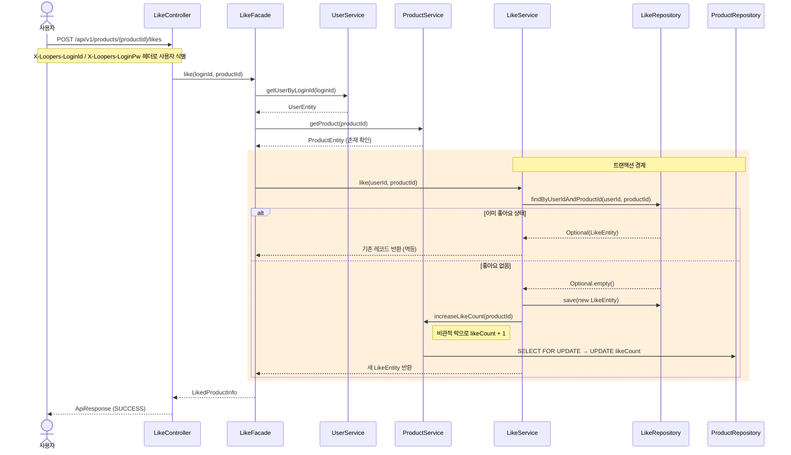

- 포인트: 서비스 레이어 사전 검증이 불필요한 likeCount 변경을 방지한다. DB 복합 유니크 키 `(user_id, product_id)`는 동시 요청 시 최종 방어선 역할.

---

## 15. 좋아요 취소

등록과 대칭적으로 멱등성을 보장한다. 좋아요 레코드가 없으면 에러 없이 무시한다.

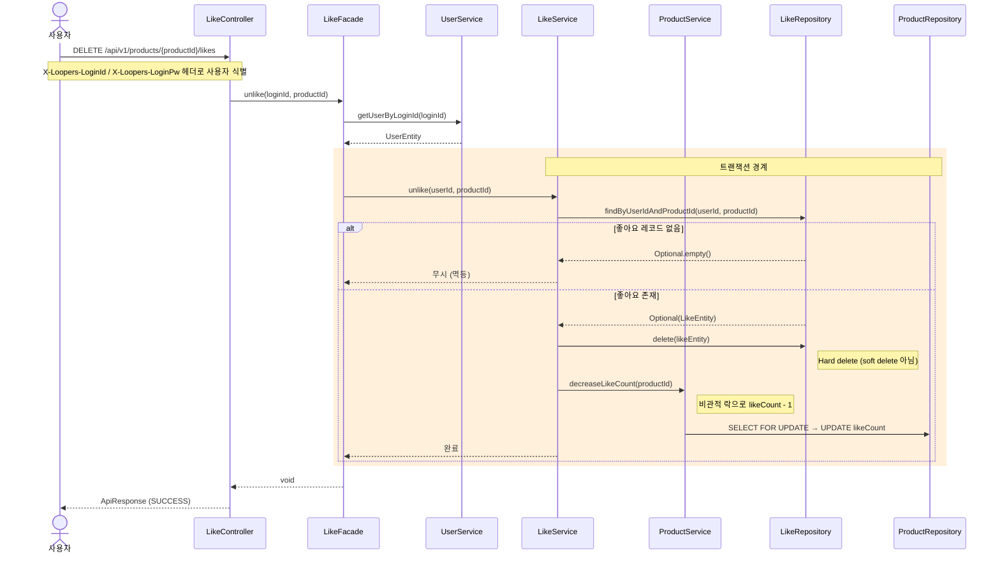

- 포인트: 좋아요는 hard delete를 사용한다. soft delete 시 유니크 키에 deletedAt을 포함해야 하며, 재좋아요 시 복잡도가 증가하기 때문.

---

## 16. 좋아요 목록 조회

사용자가 좋아요 한 상품 목록을 상품 상세 포함하여 조회한다.

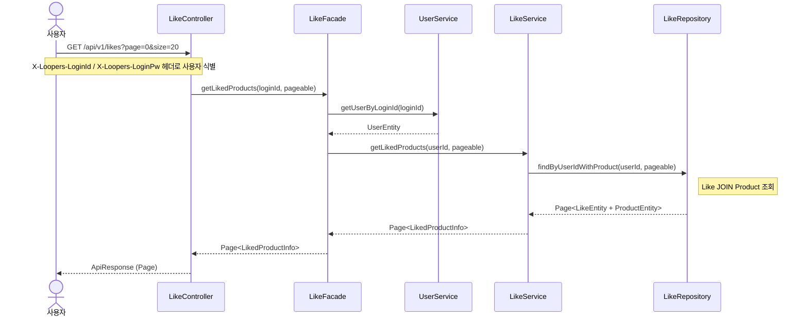

- 포인트: 헤더의 loginId로 사용자를 식별하므로 별도의 pathVariable 없이 본인의 좋아요 목록만 조회 가능하다.

---

## 17. 주문 생성

핵심 흐름: 상품 존재/판매 상태 확인 → 재고 비관적 락 차감 → 스냅샷과 함께 주문 생성. 하나라도 실패하면 전체 롤백.

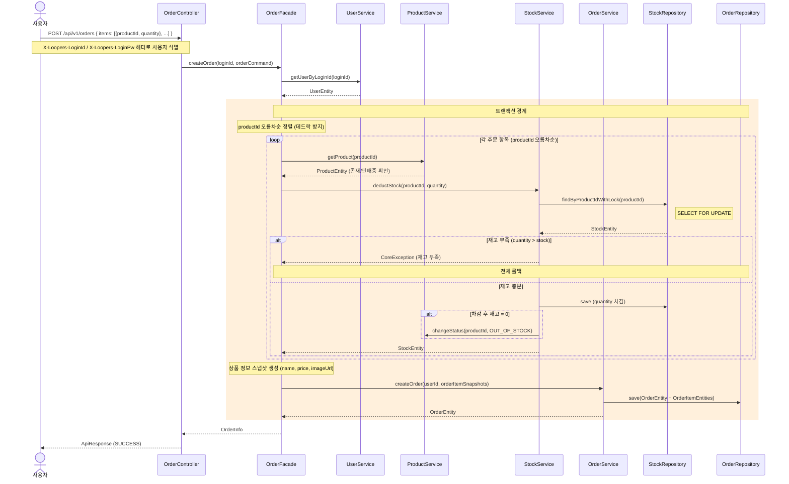

- 포인트: productId 오름차순 정렬 후 순차적으로 락을 획득하여 데드락을 방지한다. 스냅샷 생성은 재고 차감이 모두 성공한 후, 주문 저장 직전에 수행.

---

## 18. 주문 목록 조회 (사용자)

기간 필터(startAt, endAt)와 페이징을 지원한다.

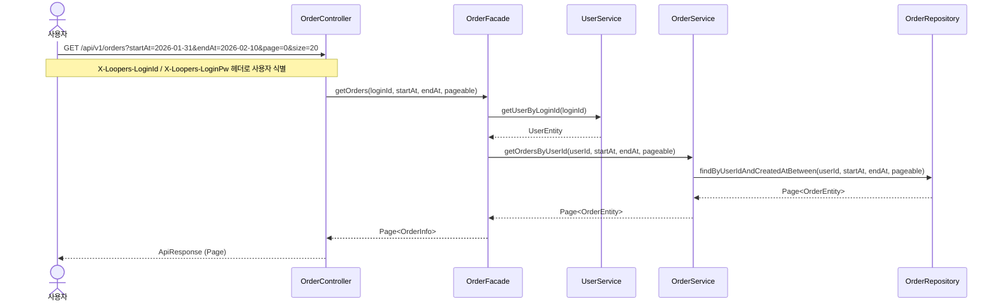

- 포인트: 기간 필터는 `createdAt` 기준. startAt, endAt은 선택적 파라미터로, 미제공 시 전체 조회.

---

## 19. 주문 상세 조회 (사용자)

주문 기본 정보 + 주문 항목(스냅샷 포함)을 조회한다.

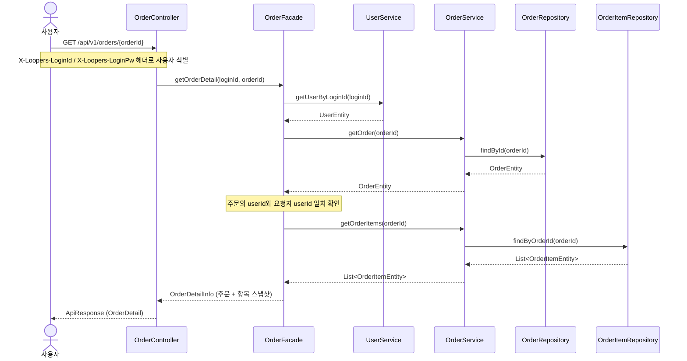

- 포인트: Facade에서 주문 소유자 확인. 타 유저의 주문 상세 조회를 차단.

---

## 20. 주문 목록 조회 (어드민)

전체 주문을 페이징으로 조회한다. 필터 없음.

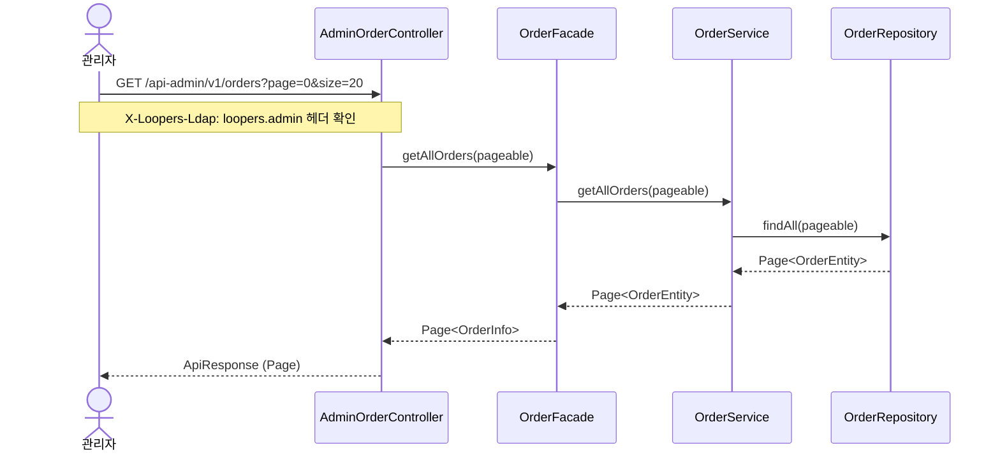

---

## 21. 주문 상세 조회 (어드민)

어드민은 소유자 확인 없이 모든 주문의 상세를 조회할 수 있다.

```mermaid
sequenceDiagram
    actor Admin as 관리자
    participant Controller as AdminOrderController
    participant Facade as OrderFacade
    participant OrderSvc as OrderService
    participant OrderRepo as OrderRepository
    participant OrderItemRepo as OrderItemRepository

    Admin->>Controller: GET /api-admin/v1/orders/{orderId}
    Note over Admin, Controller: X-Loopers-Ldap: loopers.admin 헤더 확인
    Controller->>Facade: getOrderDetailForAdmin(orderId)

    Facade->>OrderSvc: getOrder(orderId)
    OrderSvc->>OrderRepo: findById(orderId)
    OrderRepo-->>OrderSvc: OrderEntity
    OrderSvc-->>Facade: OrderEntity

    Facade->>OrderSvc: getOrderItems(orderId)
    OrderSvc->>OrderItemRepo: findByOrderId(orderId)
    OrderItemRepo-->>OrderSvc: List<OrderItemEntity>
    OrderSvc-->>Facade: List<OrderItemEntity>

    Facade-->>Controller: OrderDetailInfo (주문 + 항목 스냅샷)
    Controller-->>Admin: ApiResponse (OrderDetail)
```

- 포인트: 사용자 상세 조회(19번)와 동일한 흐름이지만 소유자 확인을 생략한다. Facade에 별도 메서드(`getOrderDetailForAdmin`)로 분리.
