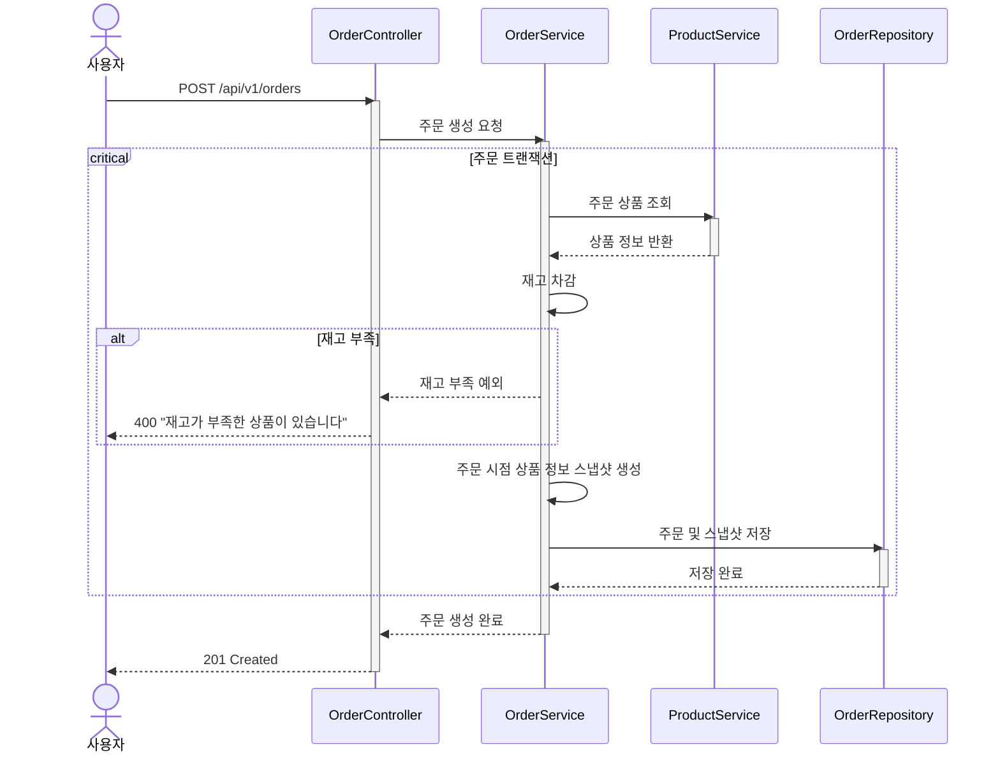
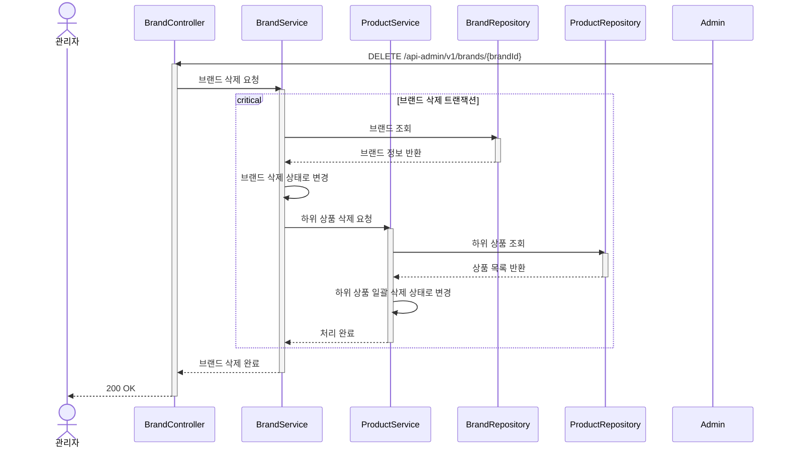
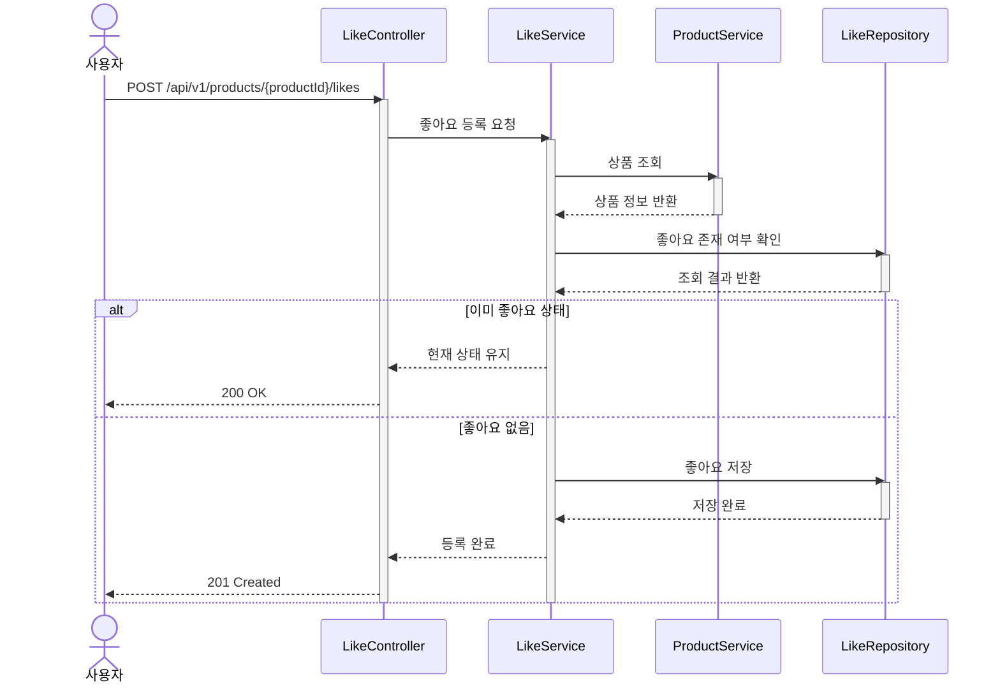

# Sequence Diagrams

## 1. OD-01. 주문 생성

```mermaid
sequenceDiagram
    actor 사용자
    participant OC as OrderController
    participant OS as OrderService
    participant PS as ProductService
    participant OR as OrderRepository

    사용자->>OC: POST /api/v1/orders
    activate OC
    OC->>OS: 주문 생성 요청
    activate OS

    critical 주문 트랜잭션
        OS->>PS: 주문 상품 조회
        activate PS
        PS-->>OS: 상품 정보 반환
        deactivate PS

        OS->>OS: 재고 차감

        alt 재고 부족
            OS-->>OC: 재고 부족 예외
            OC-->>사용자: 400 "재고가 부족한 상품이 있습니다"
        end

        OS->>OS: 주문 시점 상품 정보 스냅샷 생성

        OS->>OR: 주문 및 스냅샷 저장
        activate OR
        OR-->>OS: 저장 완료
        deactivate OR
    end

    OS-->>OC: 주문 생성 완료
    deactivate OS
    OC-->>사용자: 201 Created
    deactivate OC
```

## 2. BR-03. 브랜드 삭제

```mermaid
sequenceDiagram
    actor 관리자
    participant BC as BrandController
    participant BS as BrandService
    participant PS as ProductService
    participant BR as BrandRepository
    participant PR as ProductRepository

    Admin->>BC: DELETE /api-admin/v1/brands/{brandId}
    activate BC
    BC->>BS: 브랜드 삭제 요청
    activate BS

    critical 브랜드 삭제 트랜잭션
        BS->>BR: 브랜드 조회
        activate BR
        BR-->>BS: 브랜드 정보 반환
        deactivate BR

        BS->>BS: 브랜드 삭제 상태로 변경

        BS->>PS: 하위 상품 삭제 요청
        activate PS
        PS->>PR: 하위 상품 조회
        activate PR
        PR-->>PS: 상품 목록 반환
        deactivate PR
        PS->>PS: 하위 상품 일괄 삭제 상태로 변경
        PS-->>BS: 처리 완료
        deactivate PS
    end

    BS-->>BC: 브랜드 삭제 완료
    deactivate BS
    BC-->>관리자: 200 OK
    deactivate BC
```

## 3. LK-01. 좋아요 등록

```mermaid
sequenceDiagram
    actor 사용자
    participant LC as LikeController
    participant LS as LikeService
    participant PS as ProductService
    participant LR as LikeRepository

    %% 좋아요 등록
    사용자->>LC: POST /api/v1/products/{productId}/likes
    activate LC
    LC->>LS: 좋아요 등록 요청
    activate LS

    LS->>PS: 상품 조회
    activate PS
    PS-->>LS: 상품 정보 반환
    deactivate PS

    LS->>LR: 좋아요 존재 여부 확인
    activate LR
    LR-->>LS: 조회 결과 반환
    deactivate LR

    alt 이미 좋아요 상태
        LS-->>LC: 현재 상태 유지
        LC-->>사용자: 200 OK
    else 좋아요 없음
        LS->>LR: 좋아요 저장
        activate LR
        LR-->>LS: 저장 완료
        deactivate LR
        LS-->>LC: 등록 완료
        LC-->>사용자: 201 Created
    end
    deactivate LS
    deactivate LC
```