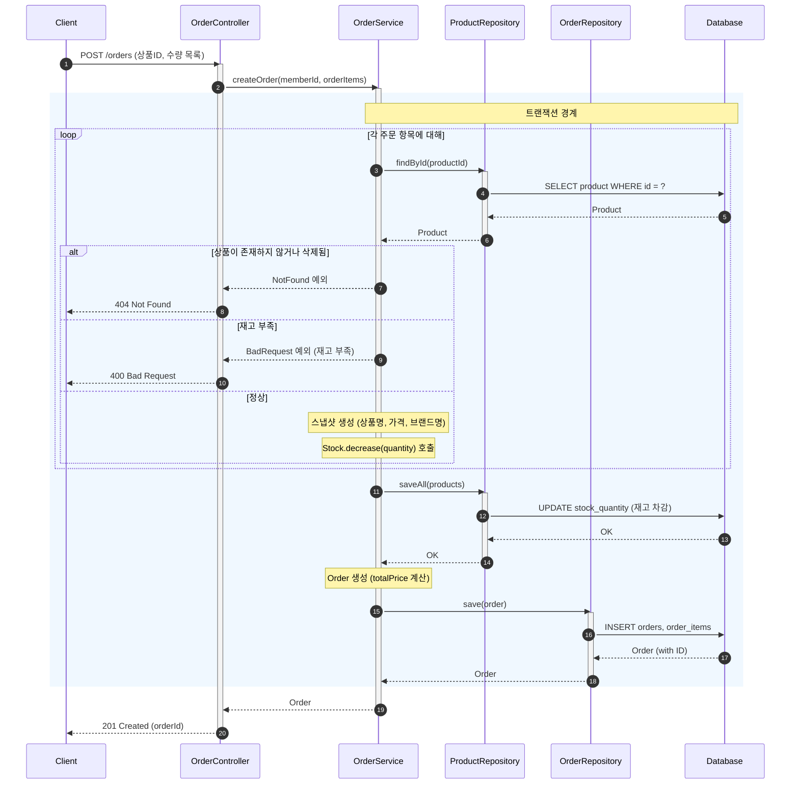
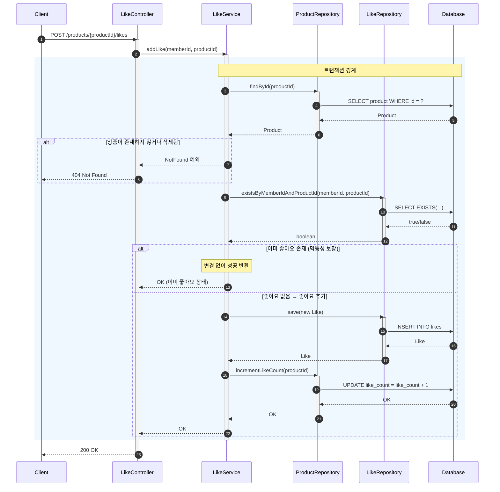
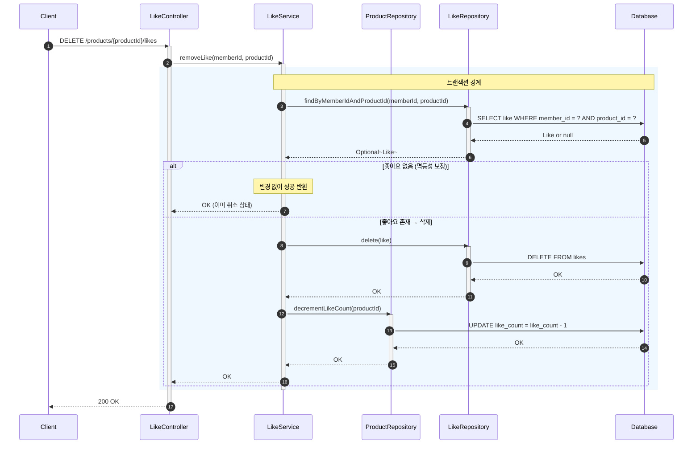
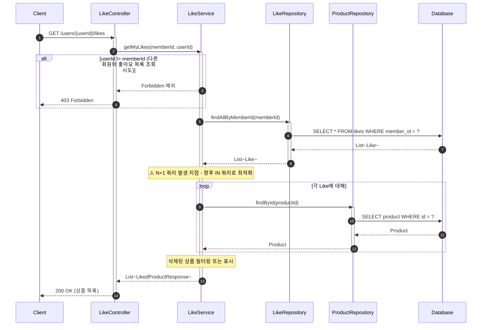
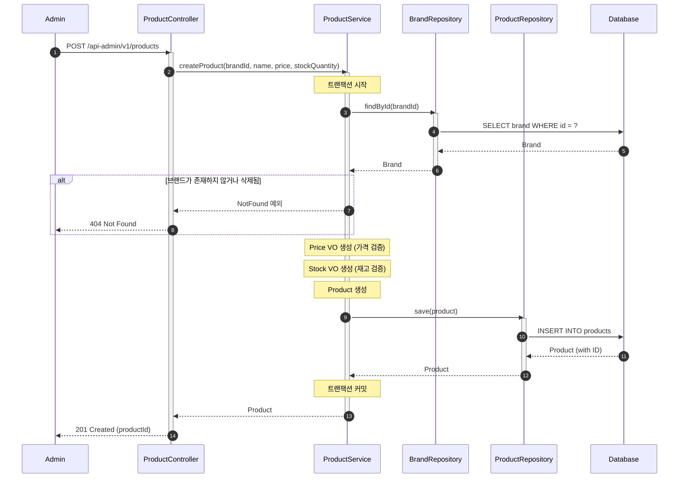
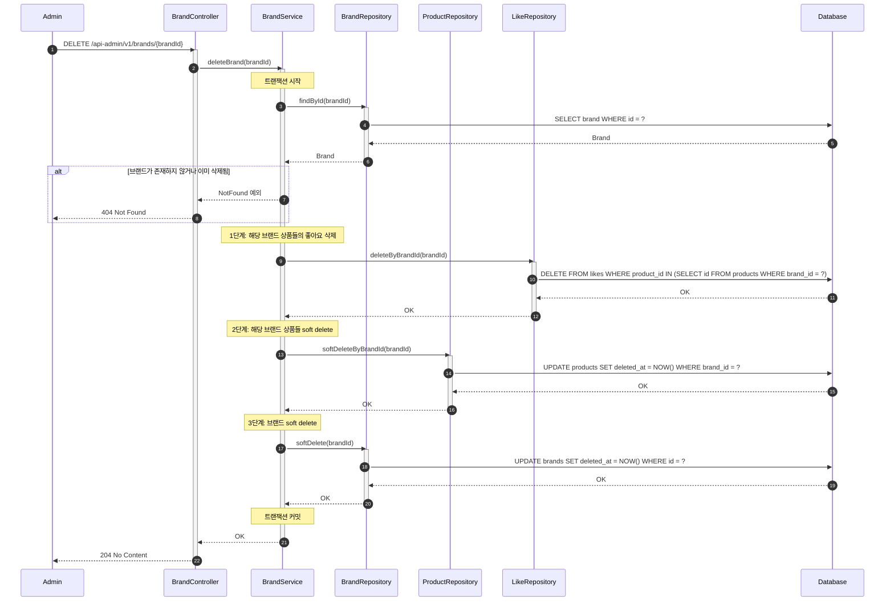
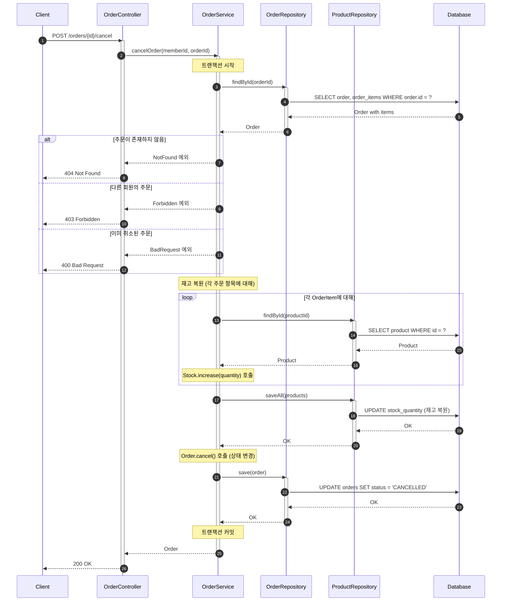

# 시퀀스 다이어그램

## 1. 개요

핵심 유스케이스의 객체 간 상호작용을 시퀀스 다이어그램으로 표현한다.

### 다이어그램 읽는 법

| 표기 | 의미 |
|------|------|
| 실선 화살표 (`->>`) | 동기 메시지 (호출) |
| 점선 화살표 (`-->>`) | 응답 (반환) |
| 세로 막대 (activate/deactivate) | 액티베이션 바 - 객체가 일하고 있는 시간 |
| `rect` 블록 | 트랜잭션 경계 등 논리적 그룹 |
| `alt` 블록 | 조건 분기 (if-else) |
| `loop` 블록 | 반복문 |
| `Note over` | 설명 노트 |

---

## 2. 주문 생성 (Order Creation)

### 왜 이 다이어그램이 필요한가?

주문 생성은 시스템에서 가장 복잡한 흐름이다. 다음을 검증하기 위해 필요:
- 재고 확인 → 차감 → 주문 저장이 **단일 트랜잭션**으로 처리되는지
- 스냅샷 생성 시점이 올바른지
- 예외 상황(재고 부족, 상품 없음)에서 롤백이 보장되는지

### 읽는 법

1. **rect 블록**이 트랜잭션 경계 - 이 안의 모든 작업이 성공하거나 모두 롤백
2. **loop 블록**에서 각 상품마다 재고 확인 및 스냅샷 생성
3. **alt 블록**의 예외 케이스는 트랜잭션 롤백 후 에러 응답

### 핵심 설계 포인트

| 포인트 | 설명 |
|--------|------|
| **단일 트랜잭션** | 재고 확인, 차감, 주문 저장이 원자적으로 처리 |
| **스냅샷 생성** | 주문 시점의 상품명, 가격, 브랜드명 저장 |
| **Stock VO** | 재고 차감 로직이 VO 내부에 캡슐화 |
| **예외 처리** | 상품 미존재, 재고 부족 시 즉시 롤백 |

---

## 3. 좋아요 등록 (Like - POST)

### 왜 이 다이어그램이 필요한가?

좋아요 등록은 다음을 검증하기 위해 필요:
- POST/DELETE 분리 방식의 RESTful 설계가 올바른지
- **멱등성**이 어떻게 보장되는지 (이미 좋아요 시 무시)
- `like_count` 동기화가 트랜잭션 내에서 처리되는지

### 읽는 법

1. **rect 블록** 안에서 Like 저장과 like_count 증가가 같은 트랜잭션
2. **alt "이미 좋아요 존재"** 분기에서 아무것도 하지 않고 성공 반환 → 멱등성 보장
3. 상품 조회 → 중복 확인 → 저장 순서로 진행

### 핵심 설계 포인트

| 포인트 | 설명 |
|--------|------|
| **RESTful** | POST로 리소스 생성 의도 명확 |
| **멱등성** | 이미 좋아요 존재 시 무시 (에러 아님) |
| **like_count 동기화** | Like 저장과 같은 트랜잭션에서 처리 |

---

## 4. 좋아요 취소 (Like - DELETE)

### 왜 이 다이어그램이 필요한가?

좋아요 취소 흐름에서 다음을 검증:
- DELETE 요청으로 리소스 삭제 의도가 명확한지
- **멱등성** - 이미 취소된 상태에서 다시 취소해도 에러 없이 성공

### 읽는 법

1. **alt "좋아요 없음"** 분기 - 이미 취소 상태면 아무것도 안 하고 성공
2. Like 삭제와 like_count 감소가 같은 트랜잭션 내 처리

### 핵심 설계 포인트

| 포인트 | 설명 |
|--------|------|
| **RESTful** | DELETE로 리소스 삭제 의도 명확 |
| **멱등성** | 좋아요 없을 때도 에러 아닌 성공 응답 |
| **비정규화** | 정렬 성능을 위해 like_count 별도 관리 |

---

## 5. 좋아요 목록 조회 (My Likes)

### 핵심 설계 포인트

| 포인트 | 설명 |
|--------|------|
| **권한 검증** | 본인의 좋아요 목록만 조회 가능 |
| **상품 정보 포함** | 좋아요한 상품의 상세 정보 반환 |
| **삭제 상품 처리** | 삭제된 상품은 필터링 또는 "삭제됨" 표시 |

---

## 6. 상품 등록 (Admin)

관리자가 새 상품을 등록하는 흐름이다.

### 핵심 설계 포인트

| 포인트 | 설명 |
|--------|------|
| **브랜드 검증** | 상품 등록 전 브랜드 존재 여부 확인 |
| **VO 검증** | Price, Stock 생성 시 유효성 검증 |
| **ID 참조** | Product는 brandId만 저장 (Brand 객체 참조 X) |

---

## 7. 브랜드 삭제 (연쇄 삭제)

브랜드 삭제 시 연관 데이터를 함께 처리하는 흐름이다.

### 핵심 설계 포인트

| 포인트 | 설명 |
|--------|------|
| **Soft Delete** | 브랜드, 상품은 deleted_at 설정 (주문 이력 보존) |
| **Hard Delete** | 좋아요는 의미 없어 완전 삭제 |
| **삭제 순서** | 좋아요 → 상품 → 브랜드 (의존 순서 역순) |
| **단일 트랜잭션** | 연쇄 삭제가 원자적으로 처리 |

---

## 8. 주문 취소 (Order Cancellation)

주문 취소 시 재고를 복원하는 흐름이다.

### 핵심 설계 포인트

| 포인트 | 설명 |
|--------|------|
| **재고 복원** | 주문 취소 시 차감했던 재고를 복원 |
| **상태 변경** | OrderStatus.CANCELLED로 변경 |
| **권한 검증** | 본인 주문만 취소 가능 |
| **멱등성 미적용** | 이미 취소된 주문 재취소는 에러 |

---

---

## 9. 잠재 리스크

| 리스크 | 현재 상태 | 대응 방안 |
|--------|----------|----------|
| **동시 주문 시 재고 이슈** | 락 없이 단순 조회 후 차감 | 비관적 락(`SELECT FOR UPDATE`) 또는 낙관적 락(버전 필드) 도입 |
| **트랜잭션 비대화** | 주문 생성 시 여러 상품 처리 | 상품 수 제한 또는 배치 처리 고려 |
| **like_count 정합성** | 트랜잭션 내 동기화 | 오차 허용, 야간 배치로 보정 가능 |
| **브랜드 삭제 시 대량 처리** | 동기 방식 연쇄 삭제 | 상품이 많으면 비동기 이벤트 처리 고려 |
| **N+1 쿼리** | 좋아요 목록에서 상품 개별 조회 | `IN` 쿼리로 일괄 조회 또는 Join Fetch |
| **주문 취소 시 삭제된 상품** | 재고 복원 대상 상품이 soft delete 상태일 수 있음 | 삭제된 상품은 재고 복원 생략, 또는 deletedAt 무시하고 복원 |
