# 시퀀스 다이어그램

> 작성일: 2026-02-11
> 기능 정의서(01-requirements.md) 기반
> 각 객체가 어떤 책임을 맡는가, 객체 간 메시지(책임 위임)는 어떻게 흐르는가를 중심으로 기술한다.
> 도메인 엔티티(Brand, Product, Order 등)도 책임 객체로서 다이어그램에 참여한다.

### 객체 의존 관계

```
OrderService → ProductService (주문 시 재고 확인/차감)
LikeService → ProductService (좋아요 시 상품/브랜드 유효성 확인)
BrandService ↔ ProductService (같은 BC 내 cross-aggregate 규칙)
  → BrandDeleteService로 해소 (Domain 레이어, Brand↔Product는 같은 Catalog BC)
```

---

## 1. 상품 둘러보기

### 1-1. 상품 목록 보기

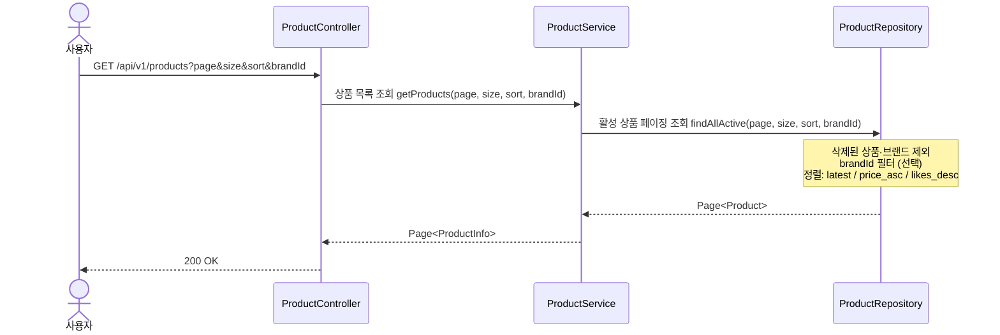

#### 읽는 포인트
- **ProductRepository**: 삭제 필터링(상품 + 브랜드), 정렬, 페이징을 한 번의 조회로 처리하는 책임.

---

### 1-2. 상품 상세 보기

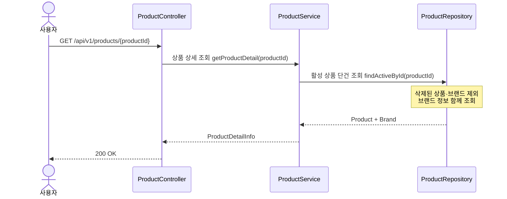

#### 읽는 포인트
- **ProductRepository**: 상품과 브랜드를 한 번에 조회하며, 어느 쪽이든 삭제되었으면 조회 불가.

---

### 1-3. 브랜드 상세 보기

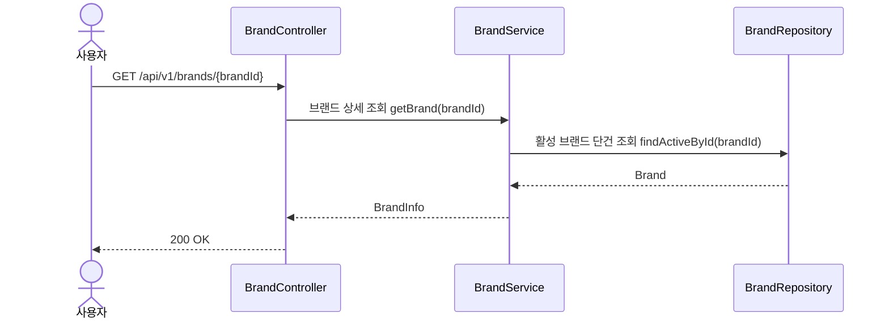

---

## 2. 좋아요

### 2-1. 좋아요 등록

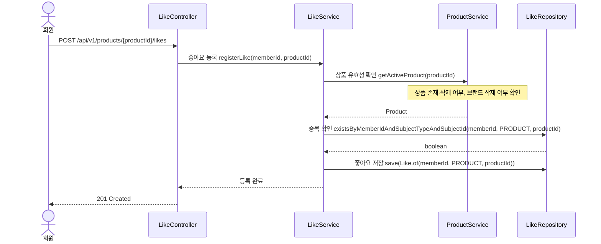

#### 읽는 포인트
- **LikeService**: 등록 흐름 조율. 상품 유효성은 ProductService에 위임하여, 상품/브랜드 상태를 직접 알 필요가 없다.
- **LikeRepository**: 중복 확인과 저장의 책임. hard-delete 방식이므로 취소 이력 없이 단순하게 존재 여부만 확인한다. Like는 `subjectType(PRODUCT) + subjectId`로 대상을 식별한다.
- 이미 좋아요가 있으면 LikeService가 예외를 발생시킨다.

---

### 2-2. 좋아요 취소

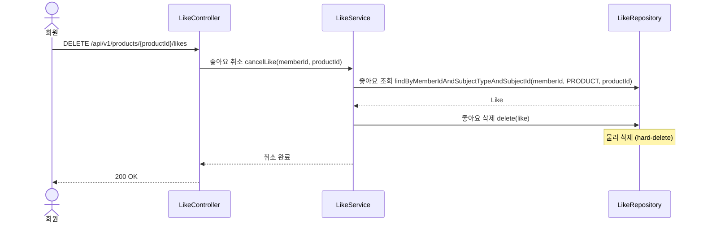

#### 읽는 포인트
- **LikeRepository**: 물리 삭제(hard-delete)의 책임. 레코드가 완전히 제거되므로 재등록 시 새 레코드가 생성된다.
- **LikeService**: 상품/브랜드 존재 여부를 확인하지 않는다. 요구사항에 따라 브랜드가 삭제되어도 취소는 가능하다.

---

### 2-3. 내 좋아요 목록 보기

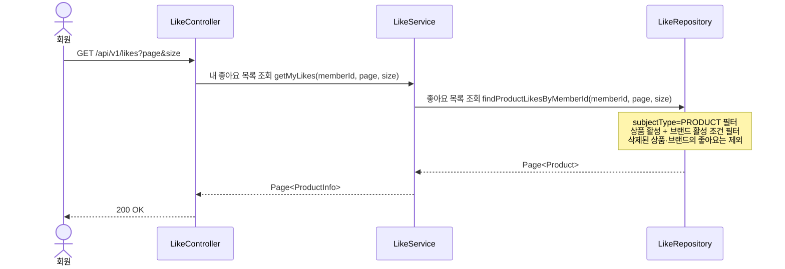

#### 읽는 포인트
- **LikeRepository**: 상품·브랜드 활성 필터링의 책임. 삭제된 상품/브랜드에 대한 좋아요는 목록에서 제외된다.

---

## 3. 주문

### 3-1. 주문하기

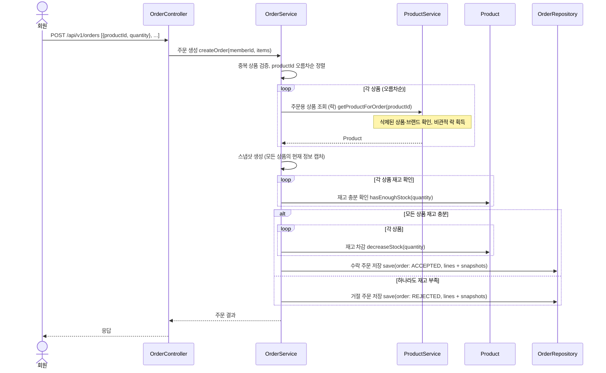

#### 읽는 포인트
- **OrderService**: 주문 흐름 전체를 조율하는 책임. 중복 검증, 정렬(데드락 방지), 스냅샷 생성, 수락/거절 판단까지 관장한다. ProductService와 단방향 의존.
- **Product 엔티티**: `hasEnoughStock(quantity)` — 재고 충분 여부를 Product이 스스로 판단한다. `decreaseStock(quantity)` — 재고 차감도 Product이 스스로 수행한다. 외부에서 stock 값을 직접 조작하지 않는다.
- **ProductService**: 비관적 락으로 상품을 조회하고 유효성(삭제 여부, 브랜드 상태)을 확인하는 책임.
- **OrderRepository**: 수락/거절 모두 스냅샷과 함께 저장하는 책임.
- **"확인 먼저, 차감 나중"**: 모든 상품을 먼저 확보한 후, 재고 충분 여부를 판단하고, 충분할 때만 차감한다.

---

### 3-2. 내 주문 내역 보기

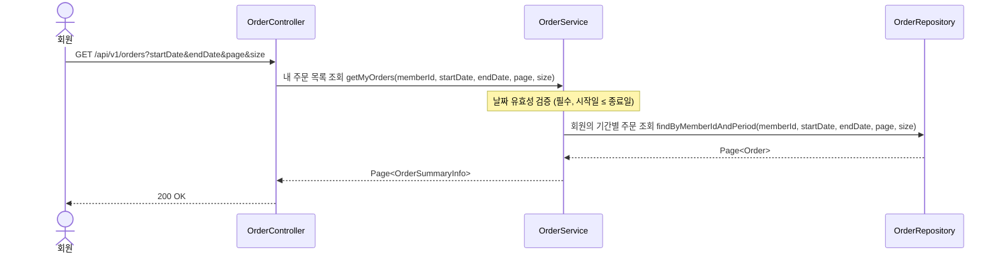

#### 읽는 포인트
- **OrderService**: 날짜 유효성 검증의 책임. 날짜는 필수이며, 시작일이 종료일보다 뒤면 예외.
- **OrderRepository**: 회원 ID + 기간 필터의 책임. 본인 주문만 조회된다.

---

### 3-3. 주문 상세 보기

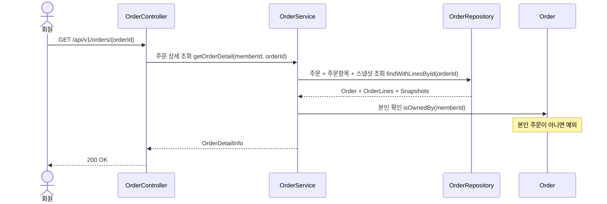

#### 읽는 포인트
- **Order 엔티티**: `isOwnedBy(memberId)` — 본인 확인은 Order 객체 스스로가 판단한다. Service가 memberId를 비교하는 것이 아니다.
- **OrderRepository**: 주문, 주문항목, 스냅샷을 함께 로딩하는 책임.

---

## 4. 관리자 — 브랜드 관리

### 4-1. 브랜드 목록 보기

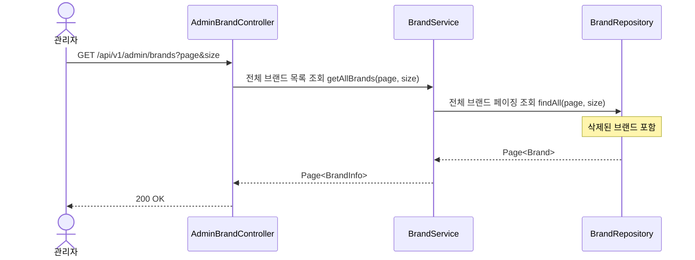

---

### 4-2. 브랜드 상세 보기

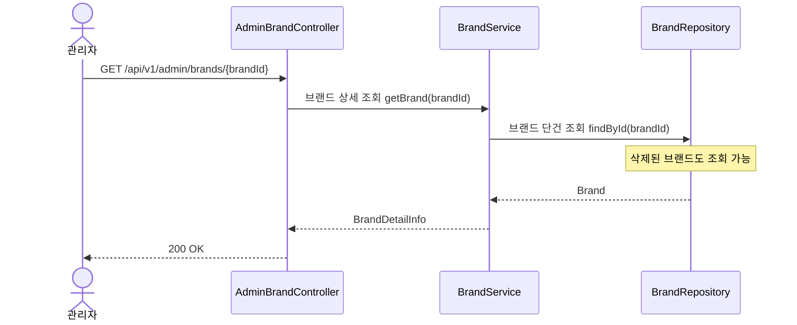

---

### 4-3. 브랜드 등록

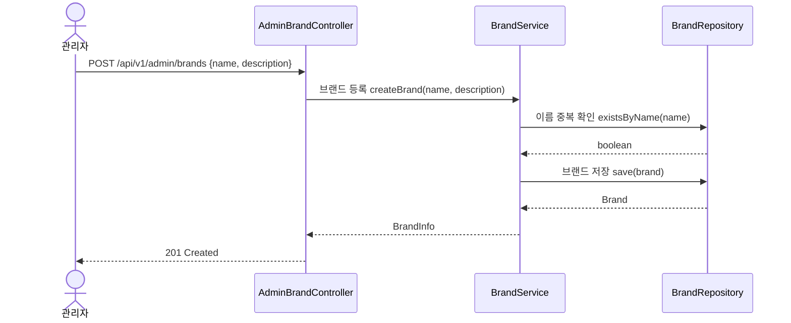

#### 읽는 포인트
- **BrandService**: 입력값 검증(이름 필수)과 이름 중복 검증의 책임. 설명은 선택.
- **BrandRepository**: 이름 중복 여부 확인과 저장의 책임.

---

### 4-4. 브랜드 수정

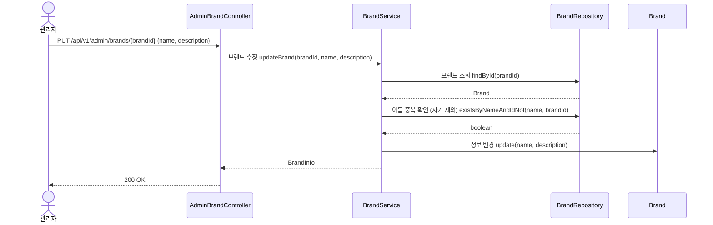

#### 읽는 포인트
- **Brand 엔티티**: `update(name, description)` — 정보 변경은 Brand 객체 스스로가 수행한다. 전체 덮어쓰기 방식.
- **BrandRepository**: 이름 중복 검증 시 자기 자신을 제외하는 책임.

---

### 4-5. 브랜드 삭제 (연쇄 soft-delete)

> Brand와 Product는 같은 Catalog BC. Brand 삭제 시 소속 Product 연쇄 삭제는 BrandDeleteService(Domain 레이어)에서 처리한다.

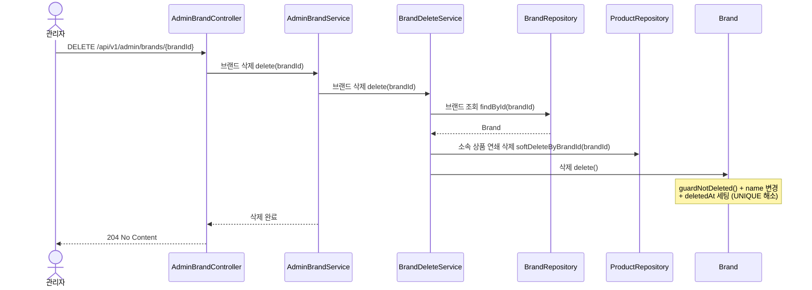

#### 읽는 포인트
- **BrandDeleteService**: 같은 BC(Catalog) 내 cross-aggregate 규칙 처리. 삭제 순서(상품 먼저 → 브랜드 나중)는 도메인 규칙.
- **AdminBrandService**: 트랜잭션 경계 소유. BrandDeleteService를 호출하는 Application 조정자.
- **Brand 엔티티**: `delete()` 내부에서 `guardNotDeleted()` + name 변경 + deletedAt 세팅을 스스로 수행한다.

---

## 5. 관리자 — 상품 관리

### 5-1. 상품 목록 보기

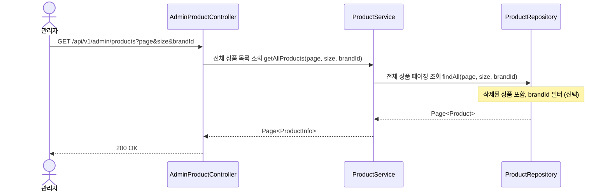

---

### 5-2. 상품 상세 보기

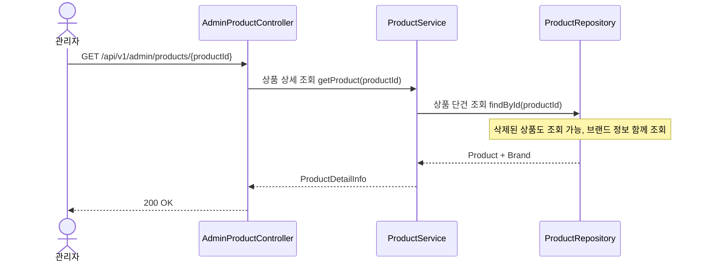

---

### 5-3. 상품 등록

> 상품 등록 시 Brand 활성 여부 확인은 AdminProductService(Application 레이어)에서 오케스트레이션한다.

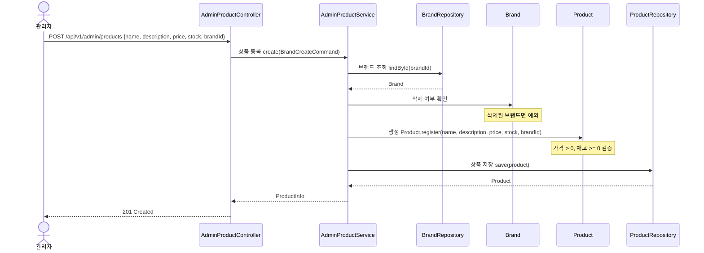

#### 읽는 포인트
- **AdminProductService**: 트랜잭션 경계 소유. Brand 조회 → 활성 확인 → Product 생성의 오케스트레이션.
- **Brand 엔티티**: 삭제 여부는 Brand 자신의 상태. Application Service가 조회 후 확인한다.
- **Product 엔티티**: 생성 시 입력값 검증(가격 > 0, 재고 >= 0)을 스스로 수행한다.

---

### 5-4. 상품 수정

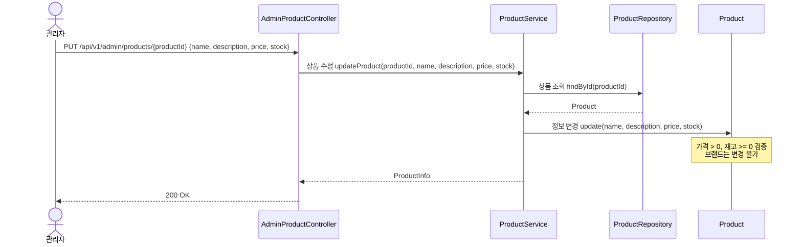

#### 읽는 포인트
- **Product 엔티티**: `update(name, description, price, stock)` — 정보 변경과 입력값 검증을 Product 스스로가 수행한다. 브랜드 변경은 아예 파라미터로 받지 않는다.

---

### 5-5. 상품 삭제

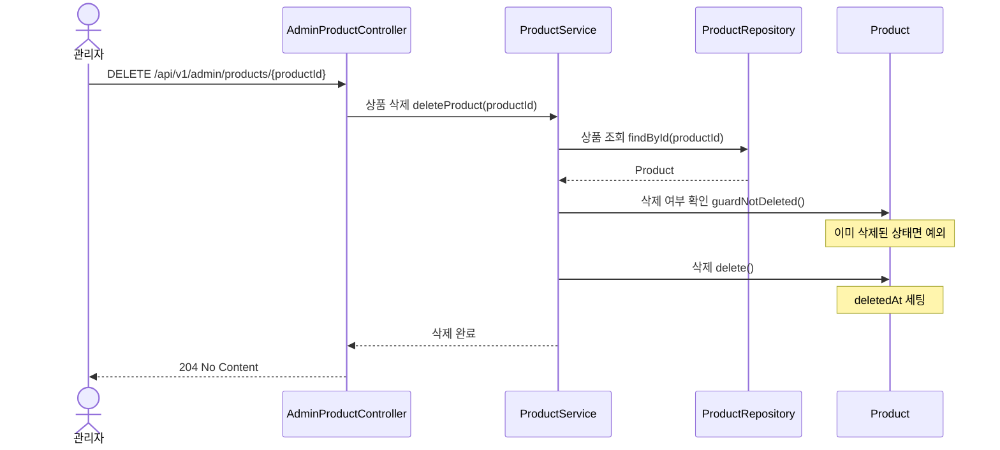

#### 읽는 포인트
- **Product 엔티티**: `guardNotDeleted()` — 삭제 가능 상태인지 스스로 검증한다. `delete()` — deletedAt 세팅도 스스로 수행한다.
- 단독 soft-delete. 좋아요는 건드리지 않으며, 목록 조회 시 자연스럽게 제외된다.

---

## 6. 관리자 — 주문 확인

### 6-1. 주문 목록 보기

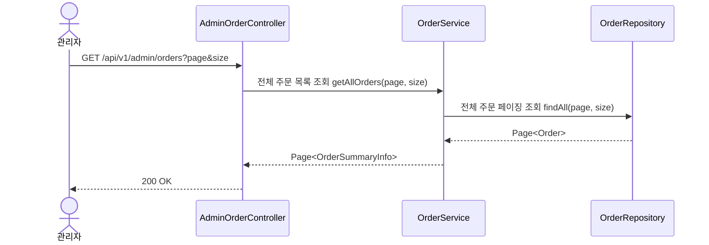

---

### 6-2. 주문 상세 보기

```mermaid
sequenceDiagram
    actor A as 관리자
    participant C as AdminOrderController
    participant OS as OrderService
    participant OR as OrderRepository

    A->>C: GET /api/v1/admin/orders/{orderId}
    C->>OS: 주문 상세 조회 getOrderDetail(orderId)
    OS->>OR: 주문 + 주문항목 + 스냅샷 조회 findWithLinesById(orderId)
    OR-->>OS: Order + OrderLines + Snapshots
    OS-->>C: OrderDetailInfo
    C-->>A: 200 OK
```

#### 읽는 포인트
- 회원 주문 상세(3-3)와 달리 `Order.isOwnedBy()` 호출이 없다. 관리자는 모든 주문을 조회할 수 있다.
