# 시퀀스 다이어그램

## 1. 개요

핵심 유스케이스의 객체 간 상호작용을 시퀀스 다이어그램으로 표현한다.

### 다이어그램 읽는 법

| 표기 | 의미 |
|------|------|
| 실선 화살표 (`->>`) | 동기 메시지 (호출) |
| 점선 화살표 (`-->>`) | 응답 (반환) |
| 세로 막대 (activate/deactivate) | 액티베이션 바 - 객체가 일하고 있는 시간 |
| `rect` 블록 | 트랜잭션 경계 등 논리적 그룹 |
| `alt` 블록 | 조건 분기 (if-else) |
| `loop` 블록 | 반복문 |
| `Note over` | 설명 노트 |

---

## 2. 주문 생성 (Order Creation)

### 왜 이 다이어그램이 필요한가?

주문 생성은 시스템에서 가장 복잡한 흐름이다. 다음을 검증하기 위해 필요:
- 재고 확인 → 비관적 락 차감이 **단일 트랜잭션**으로 처리되는지
- 쿠폰 적용이 **조건부 UPDATE**로 원자적으로 처리되는지
- 스냅샷 생성 시점이 올바른지
- 예외 상황(재고 부족, 쿠폰 사용 불가)에서 롤백이 보장되는지

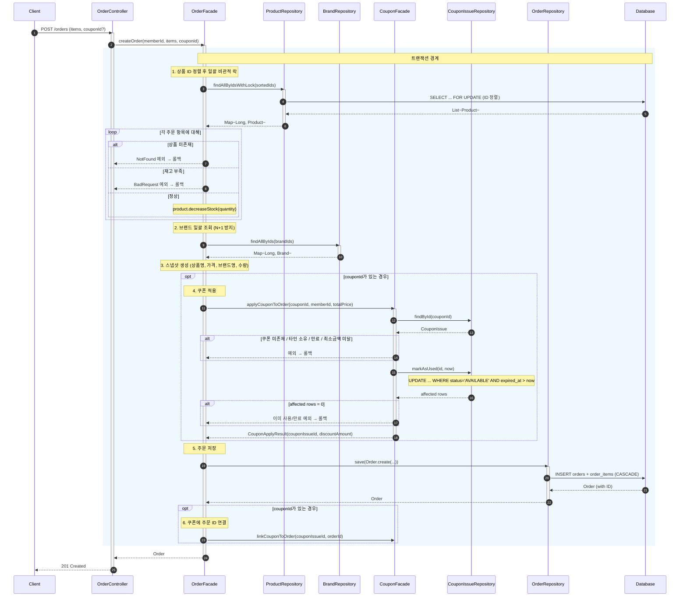

### 읽는 법

1. **rect 블록**이 트랜잭션 경계 — 이 안의 모든 작업이 성공하거나 모두 롤백
2. **비관적 락**: ID 정렬 후 `SELECT ... FOR UPDATE`로 데드락 방지
3. **opt 블록**: 쿠폰이 있을 때만 실행되는 선택적 흐름
4. **조건부 UPDATE**: markAsUsed가 `WHERE status='AVAILABLE'`로 이중 사용 원자적 방지

### 핵심 설계 포인트

| 포인트 | 설명 |
|--------|------|
| **단일 트랜잭션** | 재고 차감 + 쿠폰 사용 + 주문 저장이 원자적으로 처리 |
| **비관적 락** | Product를 ID 정렬 후 일괄 `SELECT ... FOR UPDATE` (데드락 방지) |
| **조건부 UPDATE** | 쿠폰은 `markAsUsed` 조건부 UPDATE로 이중 사용 방지 (락 불필요) |
| **스냅샷** | 주문 시점의 상품명, 가격, 브랜드명 + 할인 정보 저장 |
| **N+1 방지** | 상품은 `findAllByIdsWithLock`, 브랜드는 `findAllByIds`로 일괄 조회 |

---

## 3. 좋아요 등록 (Like - POST)

### 왜 이 다이어그램이 필요한가?

좋아요 등록은 다음을 검증하기 위해 필요:
- POST/DELETE 분리 방식의 RESTful 설계가 올바른지
- **멱등성**이 어떻게 보장되는지 (이미 좋아요 시 무시)
- 락 없이 UNIQUE 제약으로 동시성을 처리하는 구조

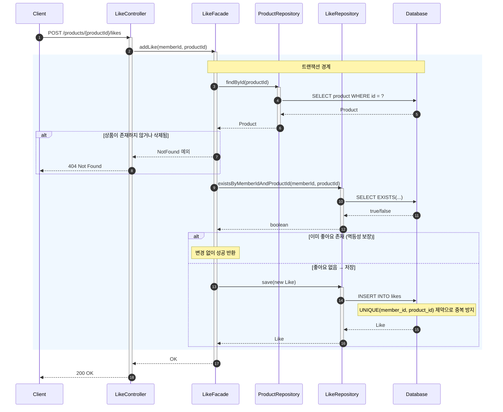

### 읽는 법

1. **rect 블록** 안에서 Like 저장이 처리됨 (Product 수정 없음)
2. **alt "이미 좋아요 존재"** 분기에서 아무것도 하지 않고 성공 반환 → 멱등성 보장
3. likes 테이블의 **UNIQUE 제약**이 DB 레벨에서 중복을 방지

### 핵심 설계 포인트

| 포인트 | 설명 |
|--------|------|
| **RESTful** | POST로 리소스 생성 의도 명확 |
| **멱등성** | 이미 좋아요 존재 시 무시 (에러 아님) |
| **락 불필요** | Product.likeCount 제거. UNIQUE 제약 + COUNT(*) 파생으로 Product 행 경합 원천 제거 |
| **좋아요 수** | 조회 시 `SELECT COUNT(*) FROM likes WHERE product_id = ?` 또는 배치 GROUP BY |

---

## 4. 좋아요 취소 (Like - DELETE)

### 왜 이 다이어그램이 필요한가?

좋아요 취소 흐름에서 다음을 검증:
- DELETE 요청으로 리소스 삭제 의도가 명확한지
- **멱등성** — 이미 취소된 상태에서 다시 취소해도 에러 없이 성공

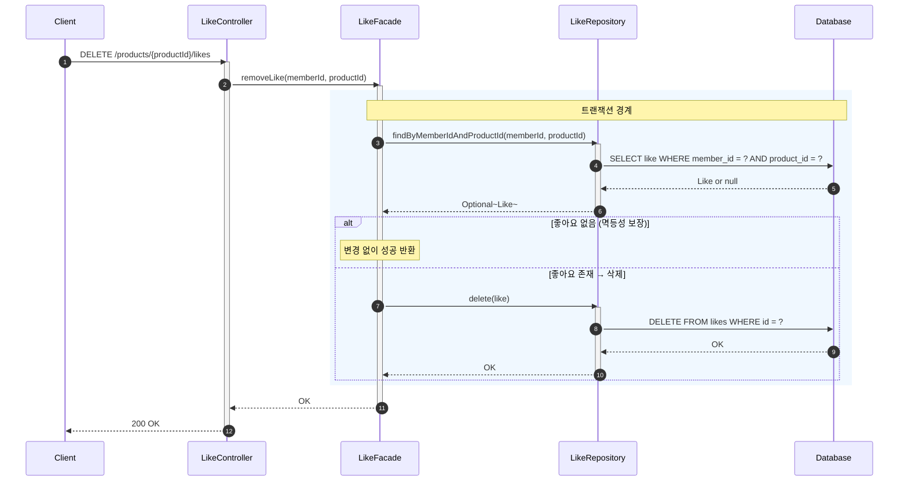

### 읽는 법

1. **alt "좋아요 없음"** 분기 — 이미 취소 상태면 아무것도 안 하고 성공
2. Like 삭제만 수행 (Product 수정 없음 — likeCount 컬럼이 없으므로)

### 핵심 설계 포인트

| 포인트 | 설명 |
|--------|------|
| **RESTful** | DELETE로 리소스 삭제 의도 명확 |
| **멱등성** | 좋아요 없을 때도 에러 아닌 성공 응답 |
| **락 불필요** | Like 행만 삭제. Product 행 수정 없어 경합 발생하지 않음 |

---

## 5. 좋아요 목록 조회 (My Likes)

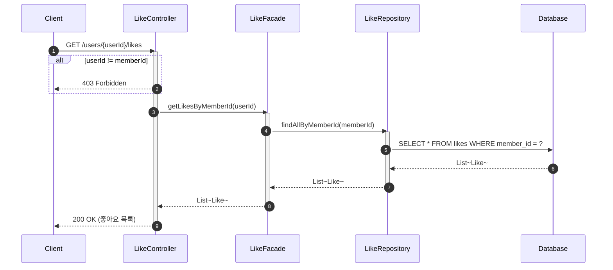

### 핵심 설계 포인트

| 포인트 | 설명 |
|--------|------|
| **권한 검증** | Controller에서 userId == memberId 확인 (본인만 조회) |
| **단순 조회** | Like 엔티티 목록 반환 (productId 포함) |

---

## 6. 상품 등록 (Admin)

관리자가 새 상품을 등록하는 흐름이다.

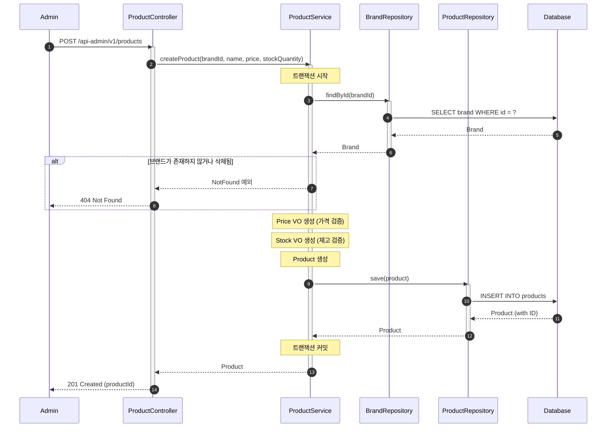

### 핵심 설계 포인트

| 포인트 | 설명 |
|--------|------|
| **브랜드 검증** | 상품 등록 전 브랜드 존재 여부 확인 |
| **VO 검증** | Price, Stock 생성 시 유효성 검증 |
| **ID 참조** | Product는 brandId만 저장 (Brand 객체 참조 X) |

---

## 7. 브랜드 삭제 (연쇄 삭제)

브랜드 삭제 시 연관 데이터를 함께 처리하는 흐름이다.

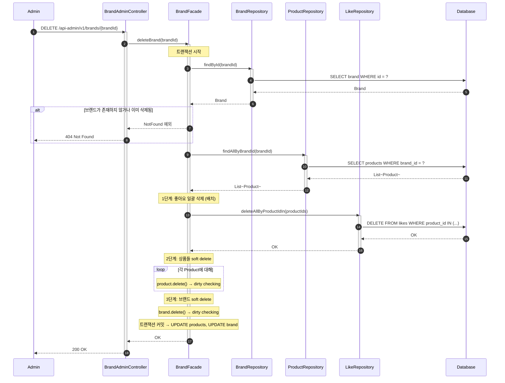

### 핵심 설계 포인트

| 포인트 | 설명 |
|--------|------|
| **Soft Delete** | 브랜드, 상품은 deleted_at 설정 (주문 이력 보존) |
| **Hard Delete** | 좋아요는 의미 없어 완전 삭제 |
| **삭제 순서** | 좋아요 → 상품 → 브랜드 (의존 순서 역순) |
| **단일 트랜잭션** | 연쇄 삭제가 원자적으로 처리 |

---

## 8. 쿠폰 발급 (Coupon Issue)

### 왜 이 다이어그램이 필요한가?

쿠폰 발급 흐름에서 다음을 검증:
- 쿠폰 템플릿의 만료 여부 확인
- CouponIssue 생성 및 저장

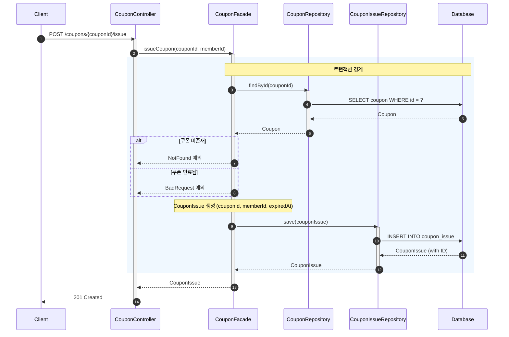

### 핵심 설계 포인트

| 포인트 | 설명 |
|--------|------|
| **만료 검증** | 발급 시점에 쿠폰 템플릿 만료 여부 확인 |
| **상태 초기화** | CouponIssue는 AVAILABLE 상태로 생성 |
| **만료일 복사** | 쿠폰 템플릿의 expiredAt을 CouponIssue에 복사 |

---

## 9. 주문 취소 (Order Cancellation)

### 왜 이 다이어그램이 필요한가?

주문 취소 시 재고 복원과 쿠폰 복원이 원자적으로 처리되는지 검증:

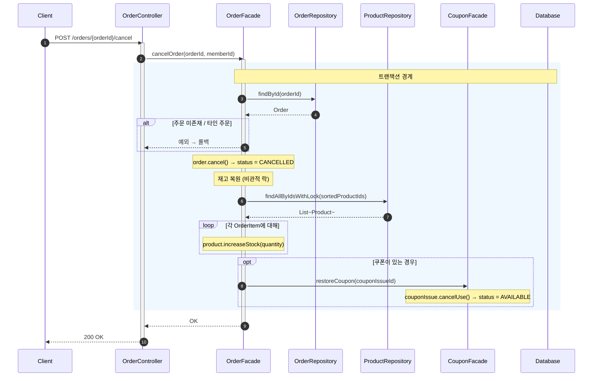

### 핵심 설계 포인트

| 포인트 | 설명 |
|--------|------|
| **원자적 복원** | 재고 복원 + 쿠폰 복원이 단일 트랜잭션 |
| **비관적 락** | 재고 복원도 비관적 락으로 동시 주문과의 경합 방지 |
| **쿠폰 복원** | USED → AVAILABLE, usedOrderId = null |

---

## 10. 결제 요청 (Payment Request) — TX 분리 + 7계층 Fallback

### 왜 이 다이어그램이 필요한가?

결제 요청은 PG 외부 시스템 연동이 포함된 가장 복잡한 비동기 흐름이다. 다음을 검증하기 위해 필요:
- **TX 분리**: PG 호출이 트랜잭션 밖에서 실행되는지 (DB 커넥션 비점유)
- **가주문 → 진주문 전환**: Redis 가주문 생성 → 결제 완료 시 DB 진주문 전환
- **멱등성**: 수동 Retry 루프에서 PG 상태 확인 후 재시도 판단
- **Outbox**: Payment + Outbox가 같은 TX에서 원자적으로 저장되는지

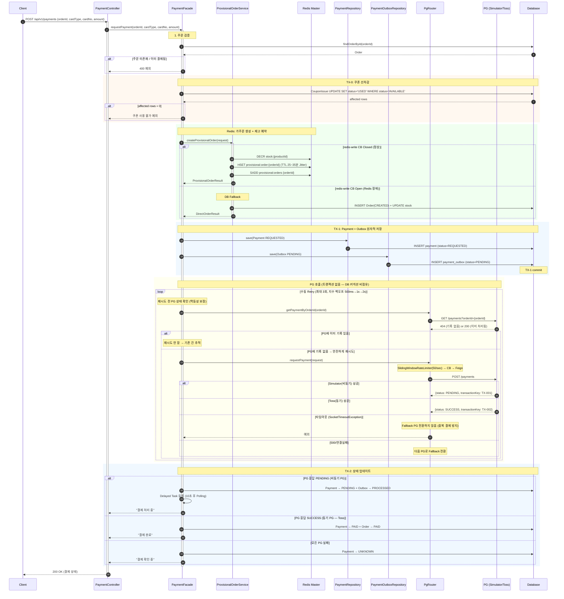

### 읽는 법

1. **4개의 rect 블록**이 각각 별도 트랜잭션(TX-0, Redis, TX-1, TX-2) — PG 호출은 TX 밖
2. **수동 Retry 루프**: 재시도 전 PG 상태 확인 → 중복 결제 방지 (멱등성)
3. **PgRouter 분기**: 타임아웃 시 Fallback 전환 불가, 500/연결실패만 Fallback
4. **Redis Fallback**: CB Open 시 DB 직접 주문으로 자동 전환

### 핵심 설계 포인트

| 포인트 | 설명 |
|--------|------|
| **TX 분리** | PG 호출 중 DB 커넥션 비점유 (초당 100건 기준 450 → 5 커넥션·초) |
| **Outbox 패턴** | Payment + Outbox 같은 TX에서 저장 → 서버 크래시에도 PG 호출 누락 없음 |
| **수동 Retry** | PG 상태 확인 후 재시도 → PG가 멱등하지 않아도 중복 결제 방지 |
| **Multi-PG** | 타임아웃 외 실패 시 자동 Fallback (Simulator → Toss) |
| **가주문** | Redis TTL Jitter(±5분)로 동시 만료 분산, CB Open 시 DB Fallback |

---

## 11. 콜백 수신 + 진주문 전환 (Callback → Real Order)

### 왜 이 다이어그램이 필요한가?

PG 콜백 수신 후 가주문→진주문 전환 과정에서 다음을 검증:
- **Callback Inbox (DLQ)**: 원본 먼저 저장 → PG에게 즉시 200 → 내부 처리
- **조건부 UPDATE**: 콜백/배치/폴링 동시 실행에서 멱등성 보장
- **SOT 전환**: Redis(가주문) → DB(진주문) 원자적 전환

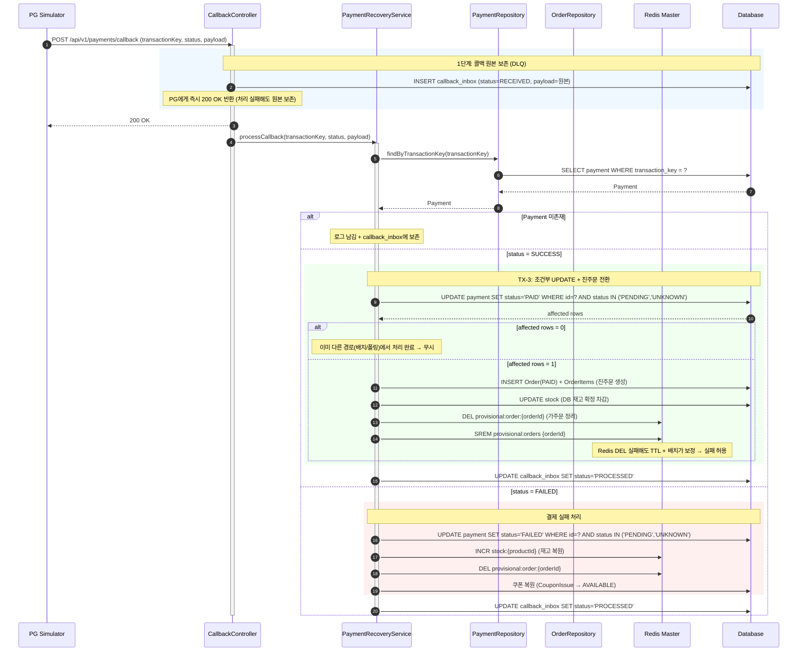

### 핵심 설계 포인트

| 포인트 | 설명 |
|--------|------|
| **Callback Inbox** | 원본 먼저 저장 → PG에게 200 즉시 반환 → 콜백 유실 원천 차단 |
| **조건부 UPDATE** | `WHERE status IN ('PENDING','UNKNOWN')` → 콜백/배치/폴링 동시 실행 시 1건만 성공 |
| **SOT 전환** | DB INSERT(진주문) + DB 재고 차감 = 같은 TX / Redis DEL = TX 밖 (실패 허용) |
| **DLQ 재처리** | RECEIVED + 30초 경과 건 → DLQ 스케줄러가 재처리 |

---

## 12. 복구 흐름 — Polling Hybrid + 배치 복구 + 대사

### 왜 이 다이어그램이 필요한가?

콜백 미수신, 서버 크래시, DB 장애 등에서 자동 복구가 동작하는지 검증:

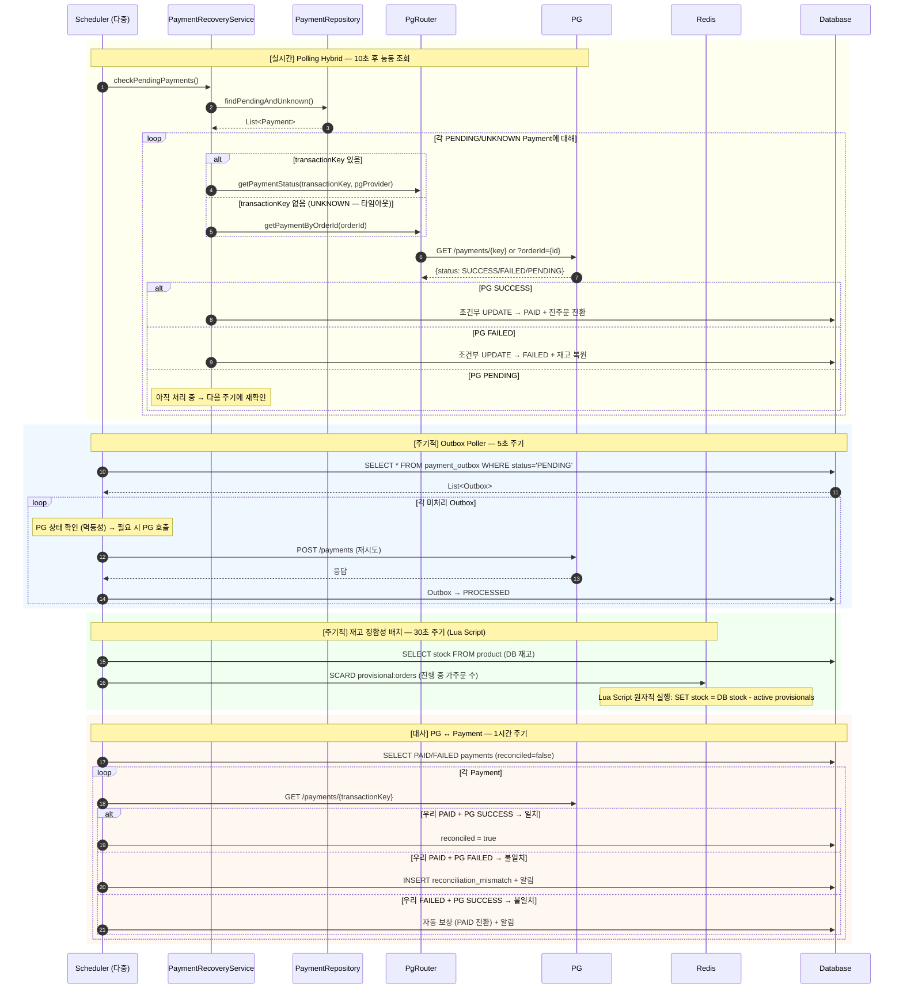

### 핵심 설계 포인트

| 포인트 | 설명 |
|--------|------|
| **3단계 복구** | 실시간(Polling 10초) → 주기적(배치 1분) → 대사(1시간) |
| **UNKNOWN 복구** | transactionKey 없는 UNKNOWN → orderId 기반 PG 조회로 복구 |
| **Lua Script** | Redis 재고 보정을 GET + SCARD + SET 원자적으로 실행 → Lost Update 방지 |
| **대사 역할** | 복구가 잘 동작하는지 검증하는 최종 안전망. 불일치 0건 = 복구 정상 |

---

## 13. 잠재 리스크

| 리스크 | 현재 상태 | 대응 방안 |
|--------|----------|----------|
| **트랜잭션 비대화** | 주문 생성 시 여러 상품 + 쿠폰 처리 | 상품 수 제한 또는 배치 처리 고려 |
| **좋아요 COUNT 비용** | 배치 GROUP BY로 최적화 완료 | 극단적 트래픽 시 캐시 도입 |
| **브랜드 삭제 시 대량 처리** | 배치 DELETE로 최적화 완료 | 상품이 매우 많으면 비동기 이벤트 처리 고려 |
| **쿠폰 조건부 UPDATE 경합** | affected rows 검증 | 동시 사용 시 1건만 성공, 나머지는 명확한 에러 |
| **PG 타임아웃 시 유령 결제** | UNKNOWN 상태 + 3단계 복구 경로 | 콜백 + Polling + 배치 이중 안전망 |
| **Redis-DB 재고 이중 존재** | Lua Script 원자적 보정 (30초) | DB가 SOT, Redis를 DB 기준으로 보정 |
| **콜백/배치/폴링 동시 실행** | 조건부 UPDATE (WHERE status IN) | affected rows = 0이면 무시 (멱등) |
| **Redis 가주문 TTL 만료 시 재고 미복원** | Proactive Expiry Scanner (30초) | TTL < 30초 감지 → 선제 정리 + INCR |
