# 📊 02. 시퀀스 다이어그램 (Sequence Diagrams)

### 다이어그램 목록

#### Admin (관리자)

| # | 시나리오 | 핵심 포인트 |
|---|---------|------------|
| 1 | 브랜드 등록 | 중복 검사, 유효성 검증 |
| 2 | 브랜드 삭제 | Cascade Soft Delete (하위 상품 숨김) |
| 3 | 상품 등록 | 옵션 포함, 원자적 저장 |

#### Member (회원) - 조회

| # | 시나리오 | 핵심 포인트 |
|---|---------|------------|
| 4 | 상품 목록 조회 | 필터링, 정렬, 삭제된 상품 제외 |
| 5 | 상품 상세 조회 | 옵션 목록, 좋아요 수, 품절 여부 표시 |
| 6 | 좋아요 목록 조회 | 삭제된 상품 제외 |
| 7 | 주문 내역 조회 | 스냅샷 데이터, 페이지네이션 |

#### Member (회원) - 좋아요/장바구니

| # | 시나리오 | 핵심 포인트 |
|---|---------|------------|
| 8 | 좋아요 토글 | 멱등성, 물리 삭제, 원자적 카운트 |
| 9 | 장바구니 담기 | Merge 로직 (수량 합산) |
| 10 | 장바구니 조회 | 실시간 가격, 품절 상태 |

#### Member (회원) - 주문

| # | 시나리오 | 핵심 포인트 |
|---|---------|------------|
| 11 | 주문 생성 (장바구니) | 동시성 제어, 재고 차감, 쿠폰, 스냅샷 |
| 12 | 주문 생성 (바로구매) | 단일 옵션 직접 주문 |
| 13 | 주문 취소 | Fail-Fast, 재고 복구, 쿠폰 복원 |

#### Member (회원) - 쿠폰

| # | 시나리오 | 핵심 포인트 |
|---|---------|------------|
| 14 | 쿠폰 발급 | 비관적 락, 수량 제한, 스냅샷 |

### 레이어 책임

```
┌─────────────────────────────────────────────────────────────┐
│  Controller                                                 │
│  - 요청/응답 변환                                              │
│  - 인증 정보 추출                                              │
└─────────────────────────────────────────────────────────────┘
                              │
                              ▼
┌─────────────────────────────────────────────────────────────┐
│  Facade                                                     │
│  - 여러 AppService 조합 (Orchestration)                        │
│  - Repository 직접 호출 금지                                    │
└─────────────────────────────────────────────────────────────┘
                              │
                              ▼
┌─────────────────────────────────────────────────────────────┐
│  AppService                                                  │
│  - 트랜잭션 경계 설정                                            │
│  - Repository 호출 및 도메인 메서드 실행                            │
│  - 순수 비즈니스 로직                                            │
└─────────────────────────────────────────────────────────────┘
                              │
                              ▼
┌─────────────────────────────────────────────────────────────┐
│  Domain (Entity + VO)                                       │
│  - 데이터 + 불변식 보장                                         │
│  - VO 내부에 검증/로직 캡슐화                                    │
└─────────────────────────────────────────────────────────────┘
```

### 다이어그램 표기법

| 표기 | 의미 |
|------|------|
| `[조회]` | 데이터베이스에서 데이터 읽기 |
| `[저장]` | 데이터베이스에 데이터 쓰기 |
| `[삭제]` | 데이터베이스에서 데이터 제거 |
| `[락 획득]` | 동시성 제어를 위한 배타적 잠금 |

---

## 1. 브랜드 등록 - 관리자 (시나리오 A)

### 1.1 다이어그램

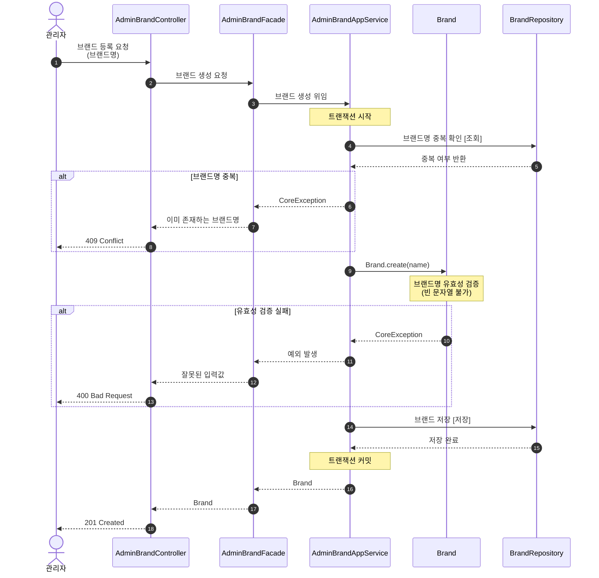
```mermaid
sequenceDiagram
    autonumber
    actor 관리자
    participant Controller as AdminBrandController
    participant Facade as AdminBrandFacade
    participant AppService as AdminBrandAppService
    participant Domain as Brand
    participant Repository as BrandRepository

    관리자->>Controller: 브랜드 등록 요청<br/>(브랜드명)
    Controller->>Facade: 브랜드 생성 요청
    Facade->>AppService: 브랜드 생성 위임

    Note over AppService: 트랜잭션 시작

    %% 1. 브랜드명 중복 검사
    AppService->>Repository: 브랜드명 중복 확인 [조회]
    Repository-->>AppService: 중복 여부 반환
    alt 브랜드명 중복
        AppService-->>Facade: CoreException
        Facade-->>Controller: 이미 존재하는 브랜드명
        Controller-->>관리자: 409 Conflict
    end

    %% 2. 도메인 객체 생성 및 유효성 검증
    AppService->>Domain: Brand.create(name)
    Note over Domain: 브랜드명 유효성 검증<br/>(빈 문자열 불가)
    alt 유효성 검증 실패
        Domain-->>AppService: CoreException
        AppService-->>Facade: 예외 발생
        Facade-->>Controller: 잘못된 입력값
        Controller-->>관리자: 400 Bad Request
    end

    %% 3. 저장
    AppService->>Repository: 브랜드 저장 [저장]
    Repository-->>AppService: 저장 완료

    Note over AppService: 트랜잭션 커밋

    AppService-->>Facade: Brand
    Facade-->>Controller: Brand
    Controller-->>관리자: 201 Created
```

### 1.2 핵심 설계 포인트

| 단계 | 책임 객체 | 설명 |
|------|----------|------|
| 중복 검사 | AppService | 동일한 브랜드명 등록 방지 |
| 유효성 검증 | Domain | 브랜드명 빈 문자열 검증 |
| 트랜잭션 경계 | AppService | 원자적 저장 보장 |

---

## 2. 브랜드 삭제 - 관리자 (시나리오 C)

### 2.1 다이어그램

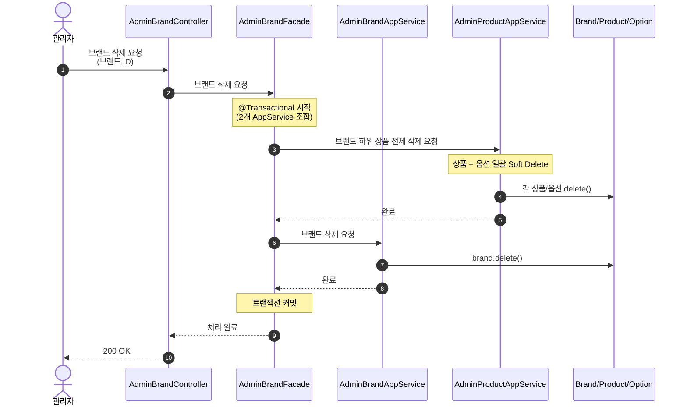
```mermaid
sequenceDiagram
    autonumber
    actor 관리자
    participant Controller as AdminBrandController
    participant Facade as AdminBrandFacade
    participant BrandAS as AdminBrandAppService
    participant ProductAS as AdminProductAppService
    participant Domain as Brand/Product/Option

    관리자->>Controller: 브랜드 삭제 요청<br/>(브랜드 ID)
    Controller->>Facade: 브랜드 삭제 요청

    Note over Facade: @Transactional 시작<br/>(2개 AppService 조합)

    %% 1. 하위 상품 Cascade Soft Delete
    Facade->>ProductAS: 브랜드 하위 상품 전체 삭제 요청
    Note over ProductAS: 상품 + 옵션 일괄 Soft Delete
    ProductAS->>Domain: 각 상품/옵션 delete()
    ProductAS-->>Facade: 완료

    %% 2. 브랜드 Soft Delete
    Facade->>BrandAS: 브랜드 삭제 요청
    BrandAS->>Domain: brand.delete()
    BrandAS-->>Facade: 완료

    Note over Facade: 트랜잭션 커밋

    Facade-->>Controller: 처리 완료
    Controller-->>관리자: 200 OK
```

### 2.2 핵심 설계 포인트

| 단계 | 책임 객체 | 설명 |
|------|----------|------|
| Cascade 삭제 | Facade | 2개 AppService를 조합하여 브랜드+상품 원자적 삭제 |
| Soft Delete | Domain | 물리 삭제 대신 삭제 상태 플래그 변경 |
| 트랜잭션 경계 | Facade (@Transactional) | 여러 AppService 조합 시 Facade가 트랜잭션 보유 |

### 2.3 Cascade 삭제 전략

| 방식 | 장점 | 단점 |
|------|------|------|
| 즉시 Cascade (채택) | 데이터 정합성 보장 | 삭제 시 처리 비용 |
| 지연 Cascade | 삭제 성능 우수 | 정합성 관리 복잡 |

---

## 3. 상품 등록 - 관리자 (시나리오 B)

### 3.1 다이어그램

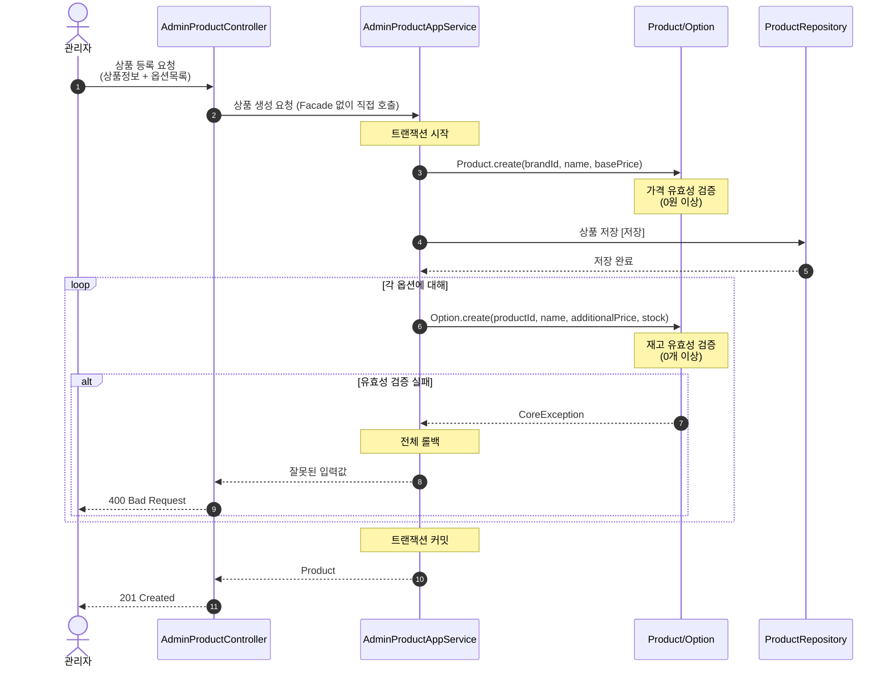
```mermaid
sequenceDiagram
    autonumber
    actor 관리자
    participant Controller as AdminProductController
    participant AppService as AdminProductAppService
    participant Domain as Product/Option
    participant Repository as ProductRepository

    관리자->>Controller: 상품 등록 요청<br/>(상품정보 + 옵션목록)
    Controller->>AppService: 상품 생성 요청 (Facade 없이 직접 호출)

    Note over AppService: 트랜잭션 시작

    %% 1. 도메인 객체 생성 및 유효성 검증
    AppService->>Domain: Product.create(brandId, name, basePrice)
    Note over Domain: 가격 유효성 검증<br/>(0원 이상)

    AppService->>Repository: 상품 저장 [저장]
    Repository-->>AppService: 저장 완료

    loop 각 옵션에 대해
        AppService->>Domain: Option.create(productId, name, additionalPrice, stock)
        Note over Domain: 재고 유효성 검증<br/>(0개 이상)
        alt 유효성 검증 실패
            Domain-->>AppService: CoreException
            Note over AppService: 전체 롤백
            AppService-->>Controller: 잘못된 입력값
            Controller-->>관리자: 400 Bad Request
        end
    end

    Note over AppService: 트랜잭션 커밋

    AppService-->>Controller: Product
    Controller-->>관리자: 201 Created
```

### 3.2 핵심 설계 포인트

| 단계 | 책임 객체 | 설명 |
|------|----------|------|
| 트랜잭션 경계 | AppService | 상품과 옵션을 원자적으로 저장 |
| 유효성 검증 | Domain (VO) | 가격/재고가 음수인 경우 생성 시점에 예외 |
| Facade 생략 | Controller → AppService | 단일 AppService 호출이므로 Facade 불필요 |

---

## 4. 상품 목록 조회 - 회원 (시나리오 D)

### 4.1 다이어그램

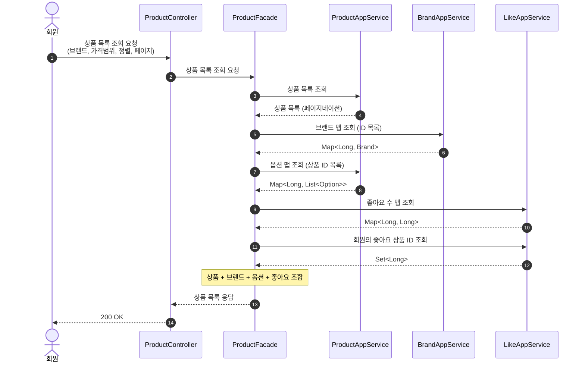
```mermaid
sequenceDiagram
    autonumber
    actor 회원
    participant Controller as ProductController
    participant Facade as ProductFacade
    participant ProductAS as ProductAppService
    participant BrandAS as BrandAppService
    participant LikeAS as LikeAppService

    회원->>Controller: 상품 목록 조회 요청<br/>(브랜드, 가격범위, 정렬, 페이지)
    Controller->>Facade: 상품 목록 조회 요청

    %% 1. 상품 목록 조회
    Facade->>ProductAS: 상품 목록 조회
    ProductAS-->>Facade: 상품 목록 (페이지네이션)

    %% 2. 브랜드 정보 배치 조회
    Facade->>BrandAS: 브랜드 맵 조회 (ID 목록)
    BrandAS-->>Facade: Map<Long, Brand>

    %% 3. 옵션 정보 배치 조회
    Facade->>ProductAS: 옵션 맵 조회 (상품 ID 목록)
    ProductAS-->>Facade: Map<Long, List<Option>>

    %% 4. 좋아요 정보 배치 조회
    Facade->>LikeAS: 좋아요 수 맵 조회
    LikeAS-->>Facade: Map<Long, Long>

    Facade->>LikeAS: 회원의 좋아요 상품 ID 조회
    LikeAS-->>Facade: Set<Long>

    %% 5. 응답 조립
    Note over Facade: 상품 + 브랜드 + 옵션 + 좋아요 조합

    Facade-->>Controller: 상품 목록 응답
    Controller-->>회원: 200 OK
```

### 4.2 핵심 설계 포인트

| 단계 | 책임 객체 | 설명 |
|------|----------|------|
| 필터링/정렬 | ProductAppService | 브랜드, 가격 범위 조건 적용 |
| Soft Delete 제외 | ProductAppService | 삭제된 상품은 목록에서 제외 |
| 배치 조회 | Facade | 각 AppService에서 Map/Set으로 배치 조회하여 N+1 방지 |
| 오케스트레이션 | Facade | 3개 AppService 결과를 조합 |

---

## 5. 상품 상세 조회 - 회원 (시나리오 D)

### 5.1 다이어그램

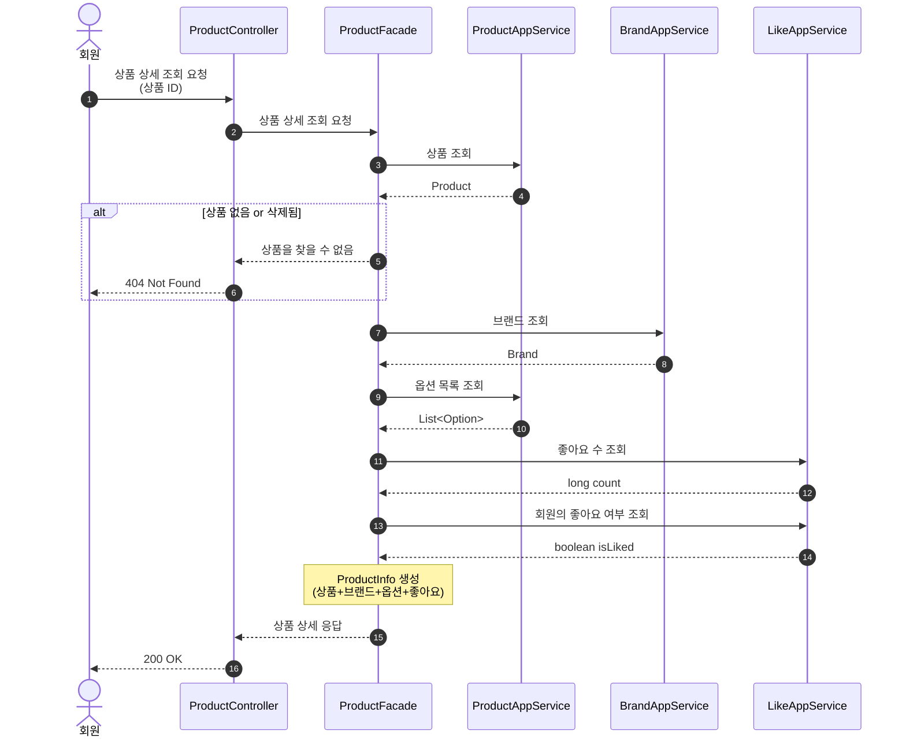
```mermaid
sequenceDiagram
    autonumber
    actor 회원
    participant Controller as ProductController
    participant Facade as ProductFacade
    participant ProductAS as ProductAppService
    participant BrandAS as BrandAppService
    participant LikeAS as LikeAppService

    회원->>Controller: 상품 상세 조회 요청<br/>(상품 ID)
    Controller->>Facade: 상품 상세 조회 요청

    %% 1. 상품 조회
    Facade->>ProductAS: 상품 조회
    ProductAS-->>Facade: Product
    alt 상품 없음 or 삭제됨
        Facade-->>Controller: 상품을 찾을 수 없음
        Controller-->>회원: 404 Not Found
    end

    %% 2. 브랜드 조회
    Facade->>BrandAS: 브랜드 조회
    BrandAS-->>Facade: Brand

    %% 3. 옵션 목록 조회
    Facade->>ProductAS: 옵션 목록 조회
    ProductAS-->>Facade: List<Option>

    %% 4. 좋아요 정보 조회
    Facade->>LikeAS: 좋아요 수 조회
    LikeAS-->>Facade: long count

    Facade->>LikeAS: 회원의 좋아요 여부 조회
    LikeAS-->>Facade: boolean isLiked

    %% 5. 응답 조립
    Note over Facade: ProductInfo 생성<br/>(상품+브랜드+옵션+좋아요)

    Facade-->>Controller: 상품 상세 응답
    Controller-->>회원: 200 OK
```

### 5.2 핵심 설계 포인트

| 단계 | 책임 객체 | 설명 |
|------|----------|------|
| 상품 조회 | ProductAppService | 삭제된 상품은 조회 불가 |
| 옵션 목록 | ProductAppService | 해당 상품의 모든 옵션 반환 |
| 좋아요 정보 | LikeAppService | 좋아요 수 + 회원의 좋아요 여부 |
| 오케스트레이션 | Facade | 3개 AppService 결과를 ProductInfo로 조합 |

---

## 6. 좋아요 목록 조회 - 회원 (시나리오 E)

### 6.1 다이어그램

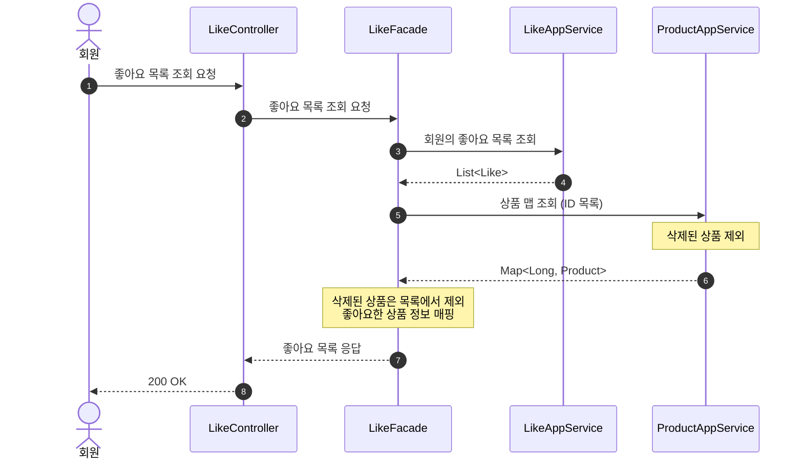
```mermaid
sequenceDiagram
    autonumber
    actor 회원
    participant Controller as LikeController
    participant Facade as LikeFacade
    participant LikeAS as LikeAppService
    participant ProductAS as ProductAppService

    회원->>Controller: 좋아요 목록 조회 요청
    Controller->>Facade: 좋아요 목록 조회 요청

    %% 1. 좋아요 목록 조회
    Facade->>LikeAS: 회원의 좋아요 목록 조회
    LikeAS-->>Facade: List<Like>

    %% 2. 상품 정보 배치 조회
    Facade->>ProductAS: 상품 맵 조회 (ID 목록)
    Note over ProductAS: 삭제된 상품 제외
    ProductAS-->>Facade: Map<Long, Product>

    %% 3. 응답 조립
    Note over Facade: 삭제된 상품은 목록에서 제외<br/>좋아요한 상품 정보 매핑

    Facade-->>Controller: 좋아요 목록 응답
    Controller-->>회원: 200 OK
```

### 6.2 핵심 설계 포인트

| 단계 | 책임 객체 | 설명 |
|------|----------|------|
| 좋아요 조회 | LikeAppService | 회원의 좋아요 목록 조회 |
| 삭제된 상품 제외 | ProductAppService | 좋아요한 상품이 삭제된 경우 목록에서 제외 |
| 오케스트레이션 | Facade | 2개 AppService 결과를 조합 |

---

## 7. 주문 내역 조회 - 회원 (시나리오 J)

### 7.1 다이어그램

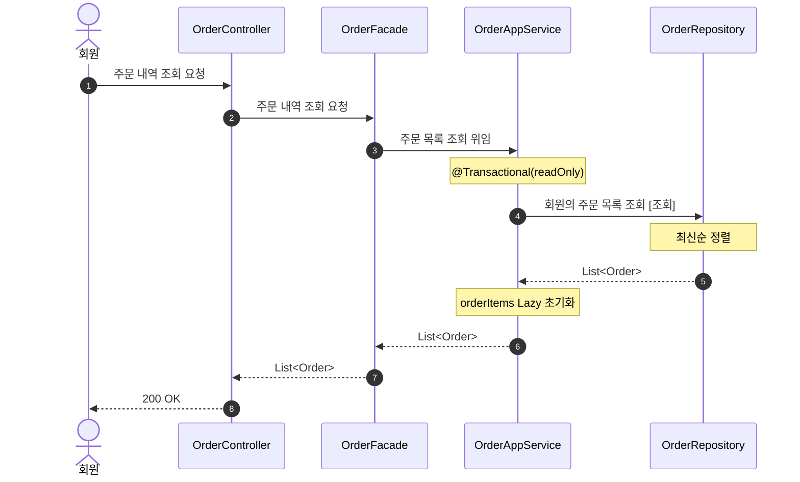
```mermaid
sequenceDiagram
    autonumber
    actor 회원
    participant Controller as OrderController
    participant Facade as OrderFacade
    participant AppService as OrderAppService
    participant Repository as OrderRepository

    회원->>Controller: 주문 내역 조회 요청
    Controller->>Facade: 주문 내역 조회 요청
    Facade->>AppService: 주문 목록 조회 위임

    Note over AppService: @Transactional(readOnly)

    AppService->>Repository: 회원의 주문 목록 조회 [조회]
    Note over Repository: 최신순 정렬
    Repository-->>AppService: List<Order>

    Note over AppService: orderItems Lazy 초기화

    AppService-->>Facade: List<Order>
    Facade-->>Controller: List<Order>
    Controller-->>회원: 200 OK
```

### 7.2 핵심 설계 포인트

| 단계 | 책임 객체 | 설명 |
|------|----------|------|
| 스냅샷 반환 | OrderItem | 주문 시점의 상품명, 가격 반환 (현재 가격 아님) |
| Lazy 초기화 | AppService | orderItems를 트랜잭션 내에서 강제 초기화 |
| 정렬 | Repository | 최신 주문 순으로 정렬 |

### 7.3 스냅샷 데이터의 의미

| 필드 | 설명 |
|------|------|
| 상품명 | 주문 시점의 상품명 (이후 변경되어도 유지) |
| 옵션명 | 주문 시점의 옵션명 (이후 변경되어도 유지) |
| 가격 | 주문 시점의 가격 (이후 변경되어도 유지) |
| 수량 | 주문한 수량 |

---

## 8. 좋아요 토글 - 회원 (시나리오 E)

### 8.1 다이어그램

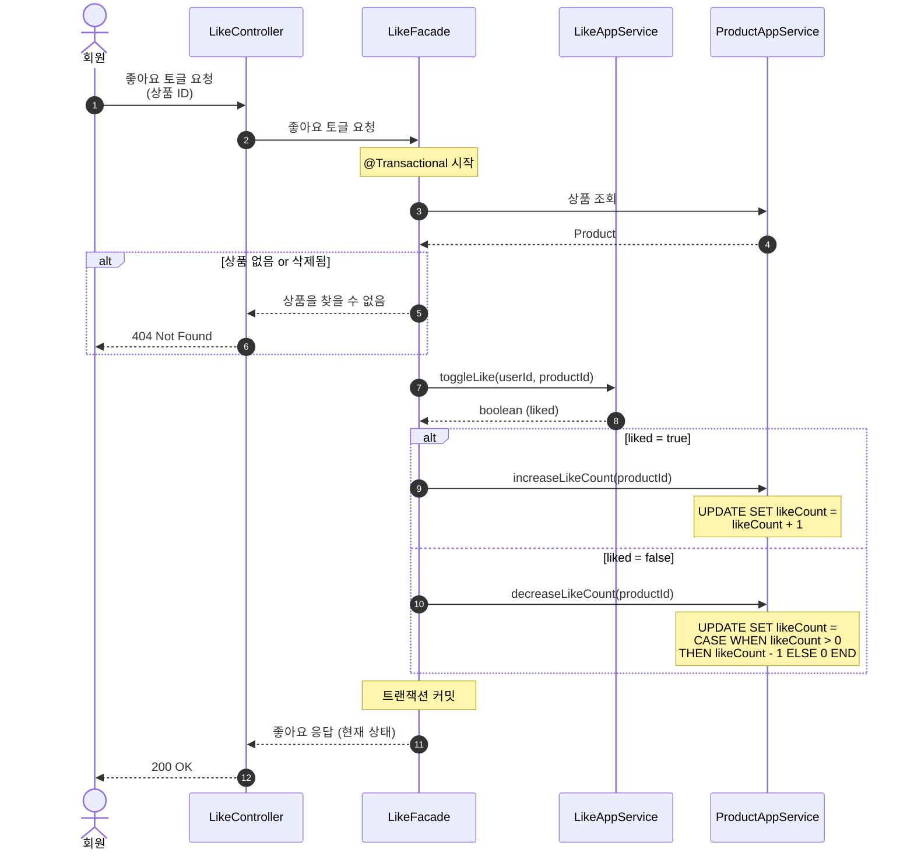
```mermaid
sequenceDiagram
    autonumber
    actor 회원
    participant Controller as LikeController
    participant Facade as LikeFacade
    participant LikeAS as LikeAppService
    participant ProductAS as ProductAppService

    회원->>Controller: 좋아요 토글 요청<br/>(상품 ID)
    Controller->>Facade: 좋아요 토글 요청

    Note over Facade: @Transactional 시작

    %% 1. 상품 존재 확인
    Facade->>ProductAS: 상품 조회
    ProductAS-->>Facade: Product
    alt 상품 없음 or 삭제됨
        Facade-->>Controller: 상품을 찾을 수 없음
        Controller-->>회원: 404 Not Found
    end

    %% 2. 좋아요 토글 (Like CRUD)
    Facade->>LikeAS: toggleLike(userId, productId)
    LikeAS-->>Facade: boolean (liked)

    %% 3. 좋아요 카운트 갱신 (원자적 UPDATE)
    alt liked = true
        Facade->>ProductAS: increaseLikeCount(productId)
        Note over ProductAS: UPDATE SET likeCount =<br/>likeCount + 1
    else liked = false
        Facade->>ProductAS: decreaseLikeCount(productId)
        Note over ProductAS: UPDATE SET likeCount =<br/>CASE WHEN likeCount > 0<br/>THEN likeCount - 1 ELSE 0 END
    end

    Note over Facade: 트랜잭션 커밋

    Facade-->>Controller: 좋아요 응답 (현재 상태)
    Controller-->>회원: 200 OK
```

### 8.2 멱등성 보장 전략

| 전략 | 구현 방법 |
|------|----------|
| 데이터베이스 레벨 | 회원-상품 조합에 유일 제약조건 |
| 애플리케이션 레벨 | 기존 데이터 조회 후 있으면 삭제, 없으면 생성 |
| 동시 요청 | 트랜잭션 + `@Modifying` 원자적 쿼리(ProductAppService 경유)로 카운트 정합성 보장 |

### 8.3 물리 삭제 선택 근거

| 논리 삭제 | 물리 삭제 (채택) |
|-------------|-------------------|
| 토글 시 3가지 분기 필요 (없음/활성/취소) | 토글 시 2가지 분기만 필요 (없음/있음) |
| 이력 보존 가능 | 이력 보존 불필요 (좋아요는 휘발성) |
| 쿼리 시 삭제 여부 조건 필요 | 단순 쿼리 |
| 재등록 시 복원 처리 | 재등록 시 새 레코드 생성 |

### 8.4 상태 전이 (물리 삭제 방식)

```
[없음] ─── 등록 ───> [있음]
[있음] ─── 삭제 ───> [없음]
```

---

## 9. 장바구니 담기 - 회원 (시나리오 F)

### 9.1 다이어그램

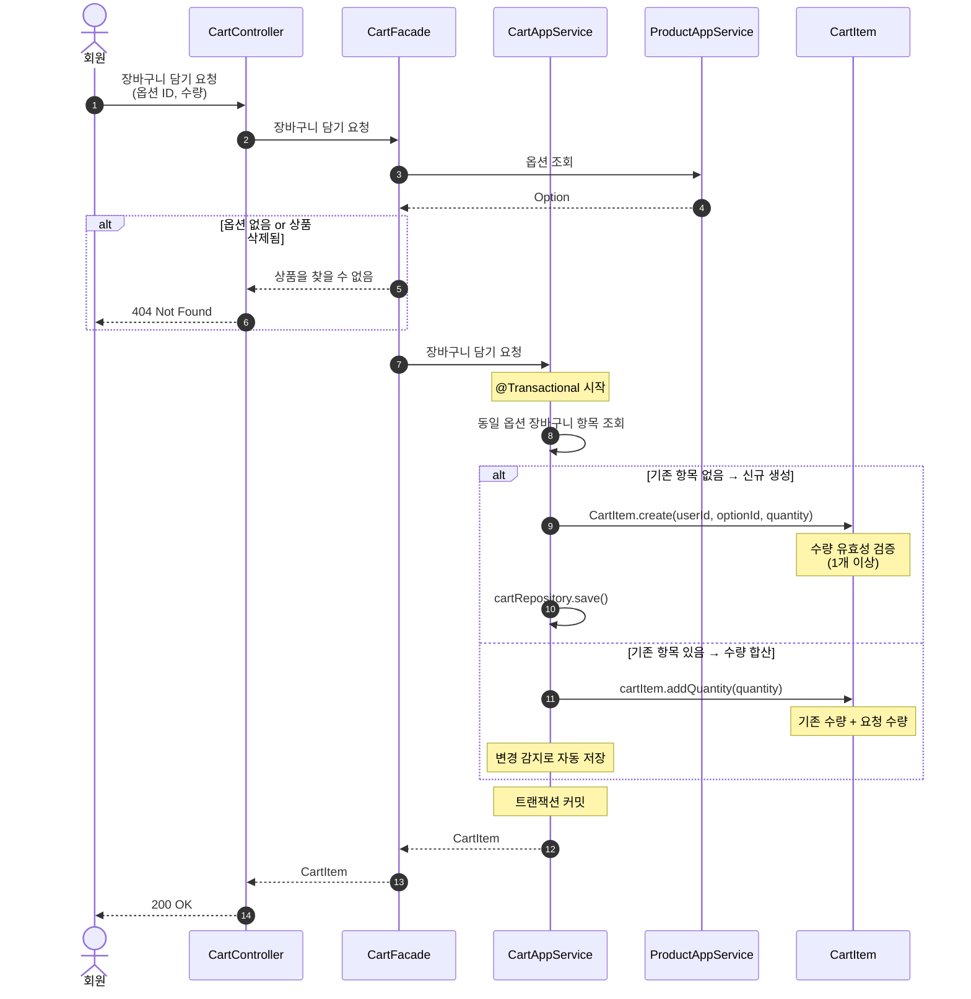
```mermaid
sequenceDiagram
    autonumber
    actor 회원
    participant Controller as CartController
    participant Facade as CartFacade
    participant CartAS as CartAppService
    participant ProductAS as ProductAppService
    participant Domain as CartItem

    회원->>Controller: 장바구니 담기 요청<br/>(옵션 ID, 수량)
    Controller->>Facade: 장바구니 담기 요청

    %% 1. 옵션 존재 확인
    Facade->>ProductAS: 옵션 조회
    ProductAS-->>Facade: Option
    alt 옵션 없음 or 상품 삭제됨
        Facade-->>Controller: 상품을 찾을 수 없음
        Controller-->>회원: 404 Not Found
    end

    %% 2. 장바구니 담기 (Merge 로직 포함)
    Facade->>CartAS: 장바구니 담기 요청

    Note over CartAS: @Transactional 시작

    CartAS->>CartAS: 동일 옵션 장바구니 항목 조회

    alt 기존 항목 없음 → 신규 생성
        CartAS->>Domain: CartItem.create(userId, optionId, quantity)
        Note over Domain: 수량 유효성 검증<br/>(1개 이상)
        CartAS->>CartAS: cartRepository.save()
    else 기존 항목 있음 → 수량 합산
        CartAS->>Domain: cartItem.addQuantity(quantity)
        Note over Domain: 기존 수량 + 요청 수량
        Note over CartAS: 변경 감지로 자동 저장
    end

    Note over CartAS: 트랜잭션 커밋

    CartAS-->>Facade: CartItem
    Facade-->>Controller: CartItem
    Controller-->>회원: 200 OK
```

### 9.2 핵심 설계 포인트

| 단계 | 책임 객체 | 설명 |
|------|----------|------|
| Merge 로직 | CartAppService | 동일 옵션이면 수량 합산, 아니면 신규 생성 |
| 수량 검증 | Domain (CartItem) | 0 이하 수량 불가 |
| 옵션 검증 | Facade → ProductAppService | 삭제된 상품/옵션은 장바구니에 담기 불가 |
| 트랜잭션 경계 | CartAppService | 조회+저장 원자적 처리 |

### 9.3 Merge 로직

```
[장바구니에 동일 옵션 없음] → 신규 항목 생성
[장바구니에 동일 옵션 있음] → 기존 수량 + 요청 수량
```

---

## 10. 장바구니 조회 - 회원 (시나리오 F)

### 10.1 다이어그램

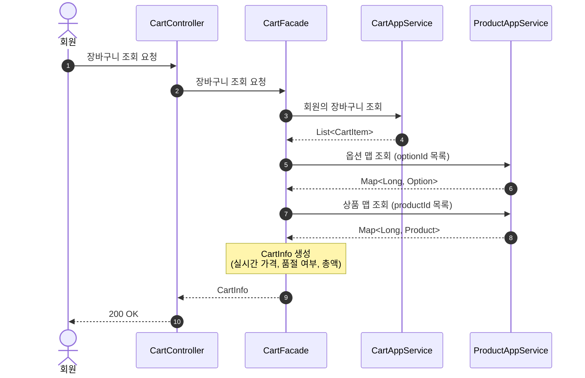
```mermaid
sequenceDiagram
    autonumber
    actor 회원
    participant Controller as CartController
    participant Facade as CartFacade
    participant CartAS as CartAppService
    participant ProductAS as ProductAppService

    회원->>Controller: 장바구니 조회 요청
    Controller->>Facade: 장바구니 조회 요청

    %% 1. 장바구니 항목 조회
    Facade->>CartAS: 회원의 장바구니 조회
    CartAS-->>Facade: List<CartItem>

    %% 2. 옵션 정보 배치 조회 (실시간 가격)
    Facade->>ProductAS: 옵션 맵 조회 (optionId 목록)
    ProductAS-->>Facade: Map<Long, Option>

    %% 3. 상품 정보 배치 조회
    Facade->>ProductAS: 상품 맵 조회 (productId 목록)
    ProductAS-->>Facade: Map<Long, Product>

    %% 4. 응답 조립
    Note over Facade: CartInfo 생성<br/>(실시간 가격, 품절 여부, 총액)

    Facade-->>Controller: CartInfo
    Controller-->>회원: 200 OK
```

### 10.2 핵심 설계 포인트

| 단계 | 책임 객체 | 설명 |
|------|----------|------|
| 실시간 가격 | ProductAppService | 장바구니 조회 시 현재 옵션 가격 반영 |
| 배치 조회 | Facade | Map으로 배치 조회하여 N+1 방지 |
| 오케스트레이션 | Facade | CartAppService + ProductAppService 조합 |

### 10.3 장바구니 vs 주문의 가격

| 시점 | 가격 |
|------|------|
| 장바구니 조회 | 실시간 현재 가격 |
| 주문 완료 | 스냅샷 (주문 시점 가격 고정) |

---

## 11. 주문 생성 - 장바구니 주문 (시나리오 G, H, I)

### 11.1 다이어그램

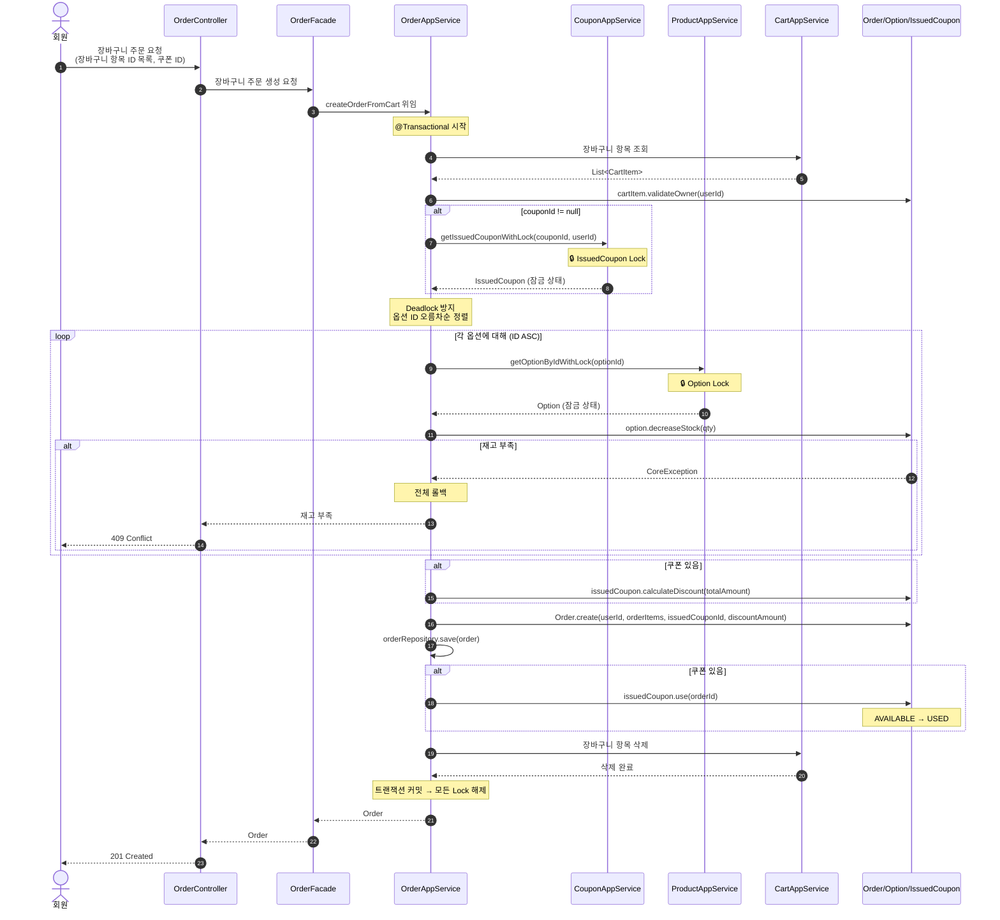
```mermaid
sequenceDiagram
    autonumber
    actor 회원
    participant Controller as OrderController
    participant Facade as OrderFacade
    participant OrderAS as OrderAppService
    participant CouponAS as CouponAppService
    participant ProductAS as ProductAppService
    participant CartAS as CartAppService
    participant Domain as Order/Option/IssuedCoupon

    회원->>Controller: 장바구니 주문 요청<br/>(장바구니 항목 ID 목록, 쿠폰 ID)
    Controller->>Facade: 장바구니 주문 생성 요청
    Facade->>OrderAS: createOrderFromCart 위임

    Note over OrderAS: @Transactional 시작

    %% 1. 장바구니 조회 및 소유권 검증
    OrderAS->>CartAS: 장바구니 항목 조회
    CartAS-->>OrderAS: List<CartItem>
    OrderAS->>Domain: cartItem.validateOwner(userId)

    %% 2. 쿠폰 락 획득 (Lock Ordering: 1순위)
    alt couponId != null
        OrderAS->>CouponAS: getIssuedCouponWithLock(couponId, userId)
        Note over CouponAS: 🔒 IssuedCoupon Lock
        CouponAS-->>OrderAS: IssuedCoupon (잠금 상태)
    end

    %% 3. 옵션 락 획득 + 재고 차감 (Lock Ordering: 2순위)
    Note over OrderAS: Deadlock 방지<br/>옵션 ID 오름차순 정렬
    loop 각 옵션에 대해 (ID ASC)
        OrderAS->>ProductAS: getOptionByIdWithLock(optionId)
        Note over ProductAS: 🔒 Option Lock
        ProductAS-->>OrderAS: Option (잠금 상태)
        OrderAS->>Domain: option.decreaseStock(qty)
        alt 재고 부족
            Domain-->>OrderAS: CoreException
            Note over OrderAS: 전체 롤백
            OrderAS-->>Controller: 재고 부족
            Controller-->>회원: 409 Conflict
        end
    end

    %% 4. 할인 계산 + 주문 생성
    alt 쿠폰 있음
        OrderAS->>Domain: issuedCoupon.calculateDiscount(totalAmount)
    end
    OrderAS->>Domain: Order.create(userId, orderItems, issuedCouponId, discountAmount)
    OrderAS->>OrderAS: orderRepository.save(order)

    %% 5. 쿠폰 사용 처리
    alt 쿠폰 있음
        OrderAS->>Domain: issuedCoupon.use(orderId)
        Note over Domain: AVAILABLE → USED
    end

    %% 6. 장바구니 정리
    OrderAS->>CartAS: 장바구니 항목 삭제
    CartAS-->>OrderAS: 삭제 완료

    Note over OrderAS: 트랜잭션 커밋 → 모든 Lock 해제

    OrderAS-->>Facade: Order
    Facade-->>Controller: Order
    Controller-->>회원: 201 Created
```

### 11.2 핵심 설계 포인트

| 단계 | 책임 객체 | 설명 |
|------|----------|------|
| 트랜잭션 경계 | OrderAppService | 원자성 보장 (All or Nothing) |
| 소유권 검증 | Domain (CartItem) | `cartItem.validateOwner()` |
| Lock Ordering | OrderAppService | IssuedCoupon → Option(ID ASC) 순서로 Deadlock 방지 |
| 재고 차감 | Domain (Option) | 부족 시 CoreException |
| 스냅샷 생성 | OrderAppService | OrderItem에 현재 가격/이름 복사 |
| 쿠폰 할인 | Domain (IssuedCoupon) | 스냅샷 기반 할인 계산 |

---

## 12. 주문 생성 - 바로 구매 (시나리오 K)

### 12.1 다이어그램

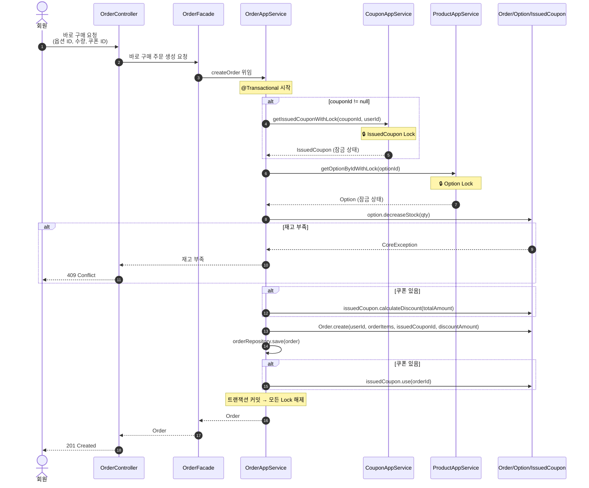
```mermaid
sequenceDiagram
    autonumber
    actor 회원
    participant Controller as OrderController
    participant Facade as OrderFacade
    participant OrderAS as OrderAppService
    participant CouponAS as CouponAppService
    participant ProductAS as ProductAppService
    participant Domain as Order/Option/IssuedCoupon

    회원->>Controller: 바로 구매 요청<br/>(옵션 ID, 수량, 쿠폰 ID)
    Controller->>Facade: 바로 구매 주문 생성 요청
    Facade->>OrderAS: createOrder 위임

    Note over OrderAS: @Transactional 시작

    %% 1. 쿠폰 락 획득 (Lock Ordering: 1순위)
    alt couponId != null
        OrderAS->>CouponAS: getIssuedCouponWithLock(couponId, userId)
        Note over CouponAS: 🔒 IssuedCoupon Lock
        CouponAS-->>OrderAS: IssuedCoupon (잠금 상태)
    end

    %% 2. 옵션 락 획득 + 재고 차감 (Lock Ordering: 2순위)
    OrderAS->>ProductAS: getOptionByIdWithLock(optionId)
    Note over ProductAS: 🔒 Option Lock
    ProductAS-->>OrderAS: Option (잠금 상태)
    OrderAS->>Domain: option.decreaseStock(qty)
    alt 재고 부족
        Domain-->>OrderAS: CoreException
        OrderAS-->>Controller: 재고 부족
        Controller-->>회원: 409 Conflict
    end

    %% 3. 할인 계산 + 주문 생성
    alt 쿠폰 있음
        OrderAS->>Domain: issuedCoupon.calculateDiscount(totalAmount)
    end
    OrderAS->>Domain: Order.create(userId, orderItems, issuedCouponId, discountAmount)
    OrderAS->>OrderAS: orderRepository.save(order)

    %% 4. 쿠폰 사용 처리
    alt 쿠폰 있음
        OrderAS->>Domain: issuedCoupon.use(orderId)
    end

    Note over OrderAS: 트랜잭션 커밋 → 모든 Lock 해제

    OrderAS-->>Facade: Order
    Facade-->>Controller: Order
    Controller-->>회원: 201 Created
```

### 12.2 장바구니 주문과의 차이점

| 항목 | 장바구니 주문 | 바로 구매 |
|------|-------------|----------|
| 입력 | 장바구니 항목 ID 목록 | 옵션 ID, 수량 |
| 장바구니 조회 | O | X |
| 장바구니 정리 | O | X (장바구니 미사용) |
| 잠금 대상 | 여러 옵션 (정렬 필요) | 단일 옵션 |

---

## 13. 주문 취소 (시나리오 L)

### 13.1 다이어그램

> **Fail-Fast 패턴**: `order.cancel()`을 락 획득 전에 최상단에서 호출하여, 취소 불가능한 주문은 즉시 실패시킵니다.
> 이로써 불필요한 IssuedCoupon/Option 락 획득을 방지합니다.

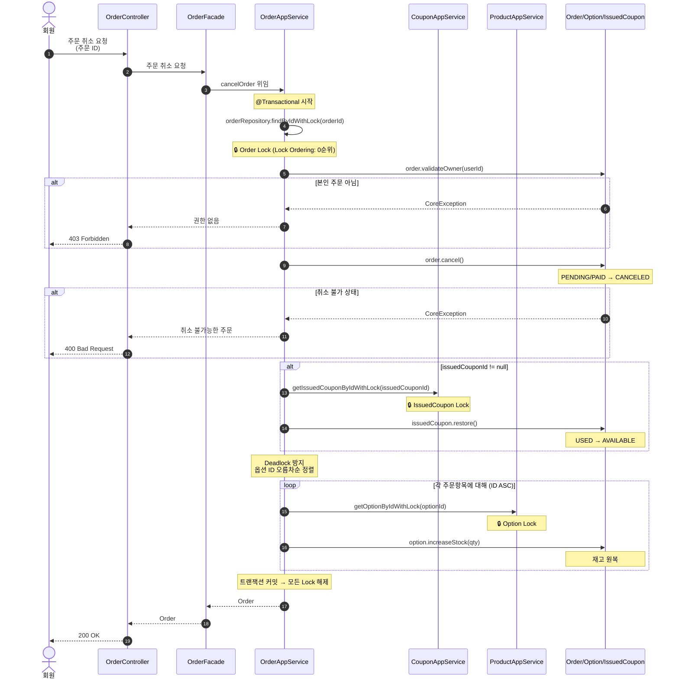
```mermaid
sequenceDiagram
    autonumber
    actor 회원
    participant Controller as OrderController
    participant Facade as OrderFacade
    participant OrderAS as OrderAppService
    participant CouponAS as CouponAppService
    participant ProductAS as ProductAppService
    participant Domain as Order/Option/IssuedCoupon

    회원->>Controller: 주문 취소 요청<br/>(주문 ID)
    Controller->>Facade: 주문 취소 요청
    Facade->>OrderAS: cancelOrder 위임

    Note over OrderAS: @Transactional 시작

    %% 1. 주문 조회 (Lock)
    OrderAS->>OrderAS: orderRepository.findByIdWithLock(orderId)
    Note over OrderAS: 🔒 Order Lock (Lock Ordering: 0순위)

    %% 2. 소유권 검증
    OrderAS->>Domain: order.validateOwner(userId)
    alt 본인 주문 아님
        Domain-->>OrderAS: CoreException
        OrderAS-->>Controller: 권한 없음
        Controller-->>회원: 403 Forbidden
    end

    %% 3. Fail-Fast: 취소 가능 여부 먼저 확인
    OrderAS->>Domain: order.cancel()
    Note over Domain: PENDING/PAID → CANCELED
    alt 취소 불가 상태
        Domain-->>OrderAS: CoreException
        OrderAS-->>Controller: 취소 불가능한 주문
        Controller-->>회원: 400 Bad Request
    end

    %% 4. 쿠폰 복원 (Lock Ordering: 1순위)
    alt issuedCouponId != null
        OrderAS->>CouponAS: getIssuedCouponByIdWithLock(issuedCouponId)
        Note over CouponAS: 🔒 IssuedCoupon Lock
        OrderAS->>Domain: issuedCoupon.restore()
        Note over Domain: USED → AVAILABLE
    end

    %% 5. 재고 복구 (Lock Ordering: 2순위)
    Note over OrderAS: Deadlock 방지<br/>옵션 ID 오름차순 정렬
    loop 각 주문항목에 대해 (ID ASC)
        OrderAS->>ProductAS: getOptionByIdWithLock(optionId)
        Note over ProductAS: 🔒 Option Lock
        OrderAS->>Domain: option.increaseStock(qty)
        Note over Domain: 재고 원복
    end

    Note over OrderAS: 트랜잭션 커밋 → 모든 Lock 해제

    OrderAS-->>Facade: Order
    Facade-->>Controller: Order
    Controller-->>회원: 200 OK
```

### 13.2 핵심 설계 포인트

| 단계 | 책임 객체 | 설명 |
|------|----------|------|
| Fail-Fast | Domain (Order) | cancel()을 락 획득 전에 호출하여 불필요한 락 방지 |
| Lock Ordering | OrderAppService | Order → IssuedCoupon → Option(ID ASC) |
| 쿠폰 복원 | Domain (IssuedCoupon) | USED → AVAILABLE 상태 복원 |
| 재고 복구 | Domain (Option) | 주문 수량만큼 재고 증가 |
| 부분 취소 | 미지원 | 전체 주문 단위로만 취소 |

---

## 14. 쿠폰 발급 (시나리오 M)

### 14.1 다이어그램

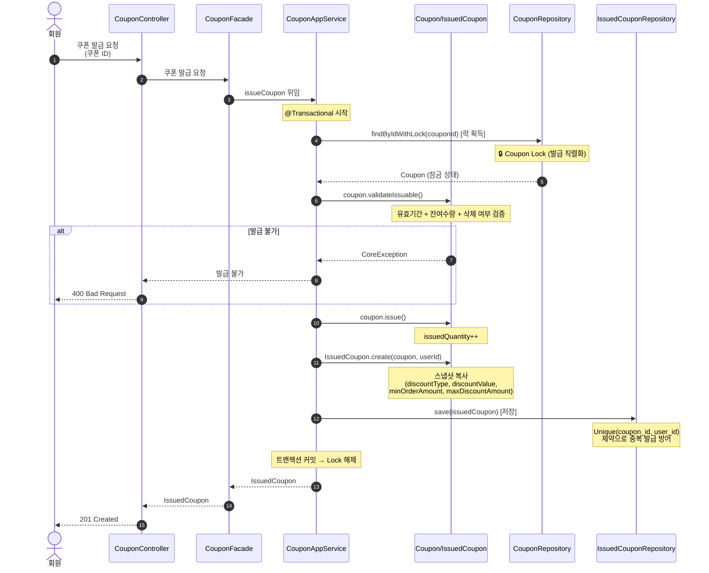
```mermaid
sequenceDiagram
    autonumber
    actor 회원
    participant Controller as CouponController
    participant Facade as CouponFacade
    participant AppService as CouponAppService
    participant Domain as Coupon/IssuedCoupon
    participant CouponRepo as CouponRepository
    participant IssuedRepo as IssuedCouponRepository

    회원->>Controller: 쿠폰 발급 요청<br/>(쿠폰 ID)
    Controller->>Facade: 쿠폰 발급 요청
    Facade->>AppService: issueCoupon 위임

    Note over AppService: @Transactional 시작

    %% 1. 쿠폰 조회 (Lock)
    AppService->>CouponRepo: findByIdWithLock(couponId) [락 획득]
    Note over CouponRepo: 🔒 Coupon Lock (발급 직렬화)
    CouponRepo-->>AppService: Coupon (잠금 상태)

    %% 2. 발급 가능 여부 검증
    AppService->>Domain: coupon.validateIssuable()
    Note over Domain: 유효기간 + 잔여수량 + 삭제 여부 검증
    alt 발급 불가
        Domain-->>AppService: CoreException
        AppService-->>Controller: 발급 불가
        Controller-->>회원: 400 Bad Request
    end

    %% 3. 발급 수량 증가
    AppService->>Domain: coupon.issue()
    Note over Domain: issuedQuantity++

    %% 4. IssuedCoupon 스냅샷 생성
    AppService->>Domain: IssuedCoupon.create(coupon, userId)
    Note over Domain: 스냅샷 복사<br/>(discountType, discountValue,<br/>minOrderAmount, maxDiscountAmount)

    %% 5. 저장
    AppService->>IssuedRepo: save(issuedCoupon) [저장]
    Note over IssuedRepo: Unique(coupon_id, user_id)<br/>제약으로 중복 발급 방어

    Note over AppService: 트랜잭션 커밋 → Lock 해제

    AppService-->>Facade: IssuedCoupon
    Facade-->>Controller: IssuedCoupon
    Controller-->>회원: 201 Created
```

### 14.2 핵심 설계 포인트

| 단계 | 책임 객체 | 설명 |
|------|----------|------|
| 비관적 락 | CouponRepository | 동시 발급 초과 방지 |
| 발급 검증 | Domain (Coupon) | 유효기간, 잔여수량, 삭제 여부 검증 |
| 스냅샷 생성 | Domain (IssuedCoupon) | 발급 시점의 할인 조건 4개 필드 복사 |
| 중복 방어 | DB (Unique 제약) | (coupon_id, user_id) 유일 제약으로 인당 1장 |
| 트랜잭션 경계 | CouponAppService | 쿠폰 수량 증가 + IssuedCoupon 저장 원자적 처리 |
