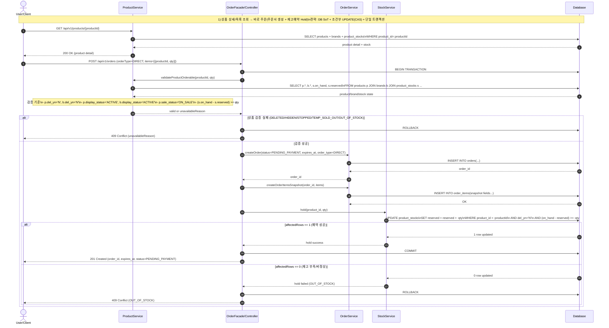
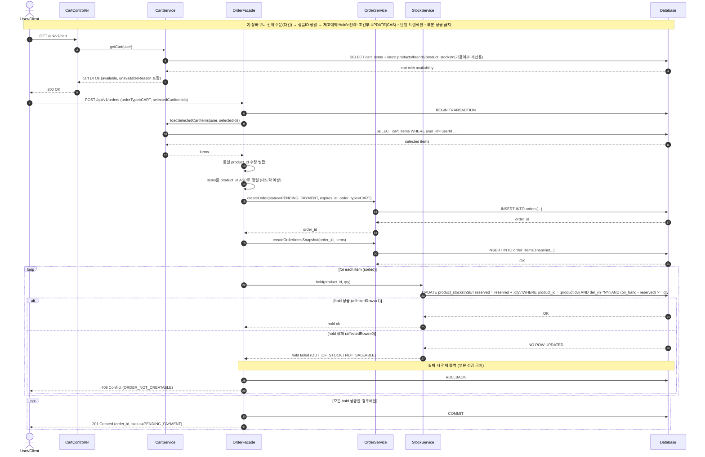
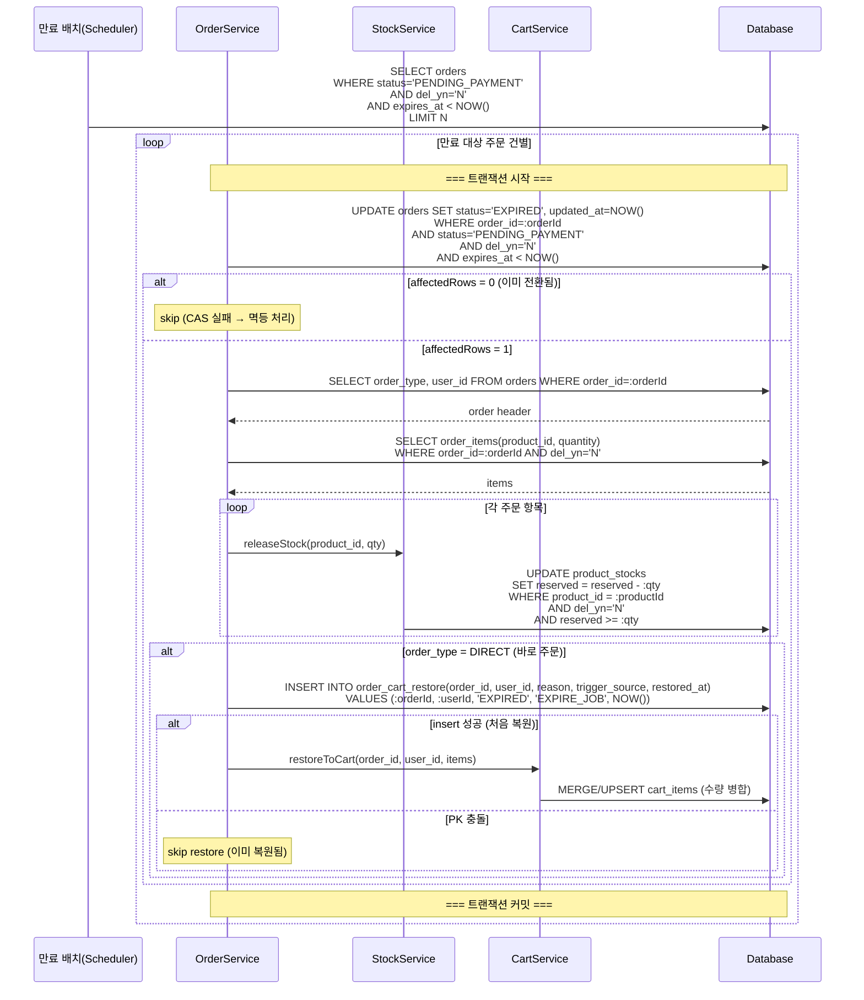
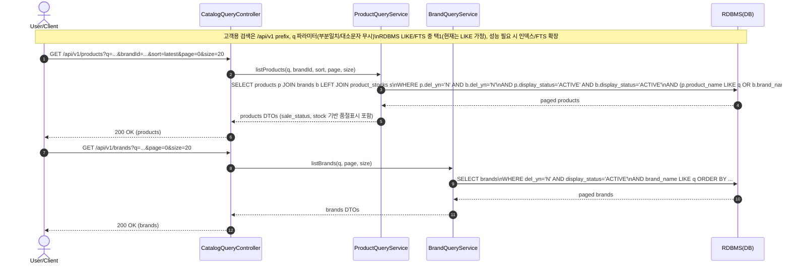
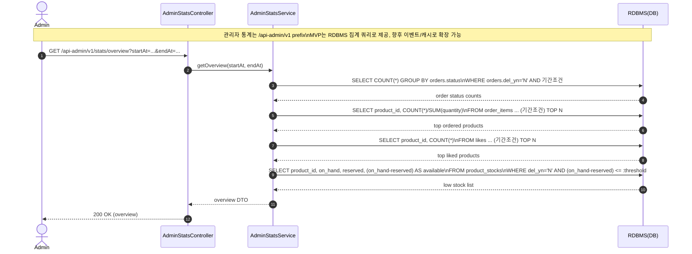

### 1. 바로 주문 (상품 상세에서 주문서 생성 + 재고 예약)
**왜 이 다이어그램이 필요한가:**
주문서 생성과 hold가 **한 트랜잭션**이며, 조건부 UPDATE(CAS)로 오버셀을 막는 흐름을 보여준다.



---

### 2. 장바구니 선택 주문(다건) -> 데드락 방지
**왜 이 다이어그램이 필요한가:**
장바구니 선택 주문의 전체 흐름(조회 → 주문 생성 → 다건 hold)을 보여주고, 다건 재고 예약에서 **정렬 기반 데드락 방지**와 **부분 성공 금지**를 검증한다.



---

### 3. 주문 생성 시퀀스 다이어그램 (공통: DIRECT/CART)
**왜 이 다이어그램이 필요한가:**
재고 확인 → 주문서/스냅샷 저장 → 재고 예약(Hold)이 **단일 트랜잭션** 안에서 원자적으로 처리되어야 하며, 다건 주문 시 **데드락 방지(정렬)** 와 **부분 성공 금지**를 검증하기 위해 필요하다.

```mermaid
sequenceDiagram
  autonumber
  actor U as User/Client
  participant API as OrderController
  participant OF as OrderFacade
  participant OS as OrderService
  participant PS as ProductService
  participant SS as StockService
  participant CR as CartService
  participant DB as Database

  U->>API: POST /api/v1/orders<br/>{items OR selectedCartItemIds, orderType}
  API->>OF: createOrder(user, request)

  Note over OF,DB: === 단일 트랜잭션 시작 ===

  alt orderType = CART
    OF->>CR: loadSelectedCartItems(user, selectedIds)
    CR->>DB: SELECT cart_items WHERE user_id=:userId
    DB-->>CR: items
    CR-->>OF: items
  else orderType = DIRECT
    Note over OF: request.items 사용
  end

  OF->>PS: validateProducts(items)
  PS->>DB: SELECT p.*, b.*, s.on_hand, s.reserved\nFROM products p JOIN brands b JOIN product_stocks s ...
  DB-->>PS: product states
  Note over PS: 검증 기준\n- p.del_yn='N', b.del_yn='N'\n- p.display_status='ACTIVE', b.display_status='ACTIVE'\n- p.sale_status='ON_SALE'\n- available_qty=(s.on_hand-s.reserved)
  PS-->>OF: ok or fail(unavailableReason)

  alt 상품 검증 실패
    Note over OF,DB: === 트랜잭션 롤백 ===
    OF-->>API: 400/409 주문 불가 사유(unavailableReason)
    API-->>U: error
  end

  Note over OF: items 내 동일 product_id 합산 병합
  Note over OF: product_id 오름차순 정렬 (데드락 방지)

  OF->>OS: createOrder(status=PENDING_PAYMENT, expires_at, order_type)
  OS->>DB: INSERT INTO orders(...)
  DB-->>OS: order_id
  OS-->>OF: order_id

  OF->>OS: createOrderItemsSnapshot(order_id, items)
  OS->>DB: INSERT INTO order_items(snapshot...)
  DB-->>OS: OK

  loop 각 주문 항목 (product_id 오름차순)
    OF->>SS: hold(product_id, qty)
    SS->>DB: UPDATE product_stocks<br/>SET reserved = reserved + :qty<br/>WHERE product_id = :productId<br/>AND del_yn='N'<br/>AND (on_hand - reserved) >= :qty
    alt affectedRows = 0 (재고 부족)
      Note over OF,DB: === 트랜잭션 롤백 ===
      OF-->>API: 409 OUT_OF_STOCK
      API-->>U: error
      break
    else affectedRows = 1
      SS-->>OF: ok
    end
  end

  Note over OF,DB: === 트랜잭션 커밋 ===
  OF-->>API: 201 Created (order_id, status=PENDING_PAYMENT)
  API-->>U: order_id, status
```

---

### 4. 주문 취소 (PENDING_PAYMENT에서만)
**왜 이 다이어그램이 필요한가:**
결제 완료/만료 배치와 **경쟁 조건**이 발생할 수 있으므로, 취소는 **상태 CAS 전이**로 멱등하게 처리하고, 성공 시에만 재고 예약을 해제하며(부분 해제 금지), DIRECT 주문은 **장바구니 자동 복원**을 수행해야 한다.

```mermaid
sequenceDiagram
  autonumber
  actor U as User/Client
  participant API as OrderController
  participant OF as OrderFacade
  participant OS as OrderService
  participant SS as StockService
  participant CS as CartService
  participant DB as Database

  U->>API: POST /api/v1/orders/{orderId}/cancel
  API->>OF: cancelOrder(user, orderId)

  Note over OF,DB: === 단일 트랜잭션 시작 ===

  OF->>DB: UPDATE orders SET status='CANCELLED', updated_at=NOW()\nWHERE order_id=:orderId\n  AND user_id=:userId\n  AND status='PENDING_PAYMENT'\n  AND del_yn='N'
  alt affectedRows = 0
    OF->>DB: SELECT status, order_type FROM orders\nWHERE order_id=:orderId AND user_id=:userId AND del_yn='N'
    DB-->>OF: currentStatus
    alt currentStatus = CANCELLED
      Note over OF: 멱등 처리(이미 취소됨)
      OF-->>API: 200 OK (status=CANCELLED)
    else currentStatus = EXPIRED or PAID
      Note over OF: 취소 불가
      OF-->>API: 409 Conflict (NOT_CANCELLABLE)
    end
    API-->>U: response
  else affectedRows = 1
    OF->>OS: loadOrderItems(orderId)
    OS->>DB: SELECT order_items (product_id, quantity)\nWHERE order_id=:orderId AND del_yn='N'
    DB-->>OS: items
    OS-->>OF: items

    Note over OF: product_id 오름차순 정렬 (데드락 방지)
    loop 각 주문 항목 (product_id 오름차순)
      OF->>SS: release(product_id, qty)
      SS->>DB: UPDATE product_stocks<br/>SET reserved = reserved - :qty<br/>WHERE product_id = :productId<br/>AND del_yn='N'<br/>AND reserved >= :qty
      alt affectedRows = 0
        Note over OF,DB: === 트랜잭션 롤백 ===
        OF-->>API: 500 InconsistentReserved
        API-->>U: error
        break
      else affectedRows = 1
        SS-->>OF: ok
      end
    end

    alt order_type = DIRECT
      OF->>DB: INSERT INTO order_cart_restore(order_id, user_id, reason, trigger_source, restored_at)\nVALUES (:orderId, :userId, 'USER_CANCELLED', 'CANCEL_API', NOW())
      alt insert 성공 (처음 복원)
        OF->>CS: restoreToCart(order_id, user_id, items)
        CS->>DB: MERGE/UPSERT cart_items (수량 병합)
      else PK 충돌 (이미 복원됨)
        Note over OF: skip restore (멱등 처리)
      end
    end

    Note over OF,DB: === 트랜잭션 커밋 ===
    OF-->>API: 200 OK (status=CANCELLED)
    API-->>U: status
  end
```

---

### 5. 주문 만료 및 장바구니 복원 시퀀스 다이어그램
**왜 이 다이어그램이 필요한가:**
만료 배치와 장바구니 복원은 비동기적으로 일어나며, **경쟁 조건(결제 vs 만료)** 과 **멱등성(중복 복원 방지)** 을 검증해야 한다.



---

### 6. 상품/브랜드 검색 (고객용)
**목표:** 사용자는 키워드(q)로 브랜드/상품을 빠르게 찾을 수 있어야 한다.



---

### 7. 운영 통계 조회 (관리자 대시보드)
**목표:** 관리자는 기간 기준의 핵심 지표(주문/인기상품/재고)를 조회할 수 있어야 한다.


