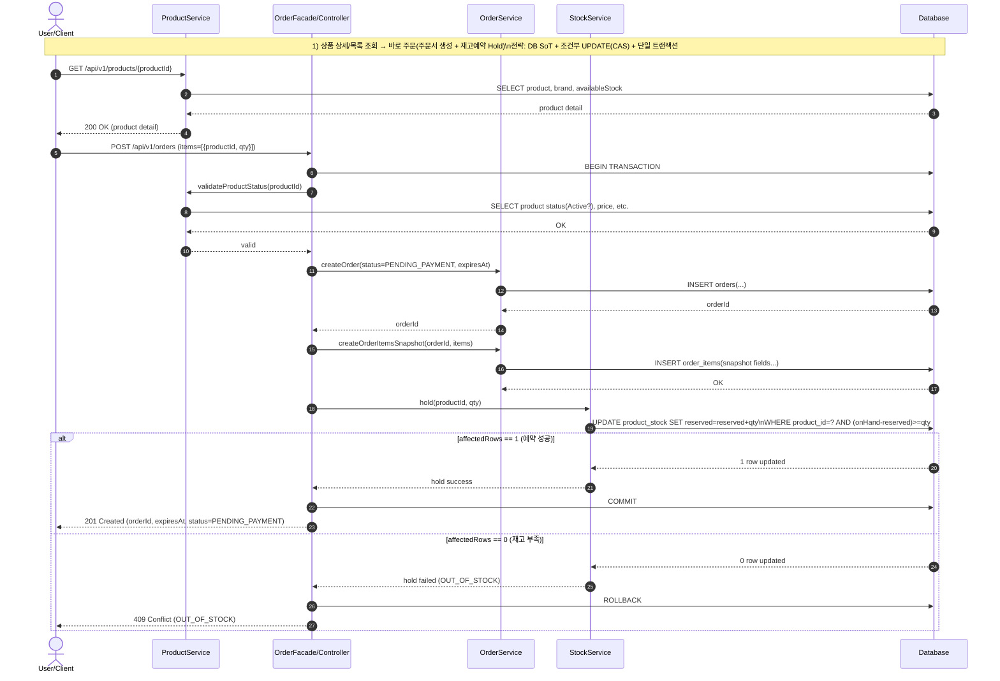
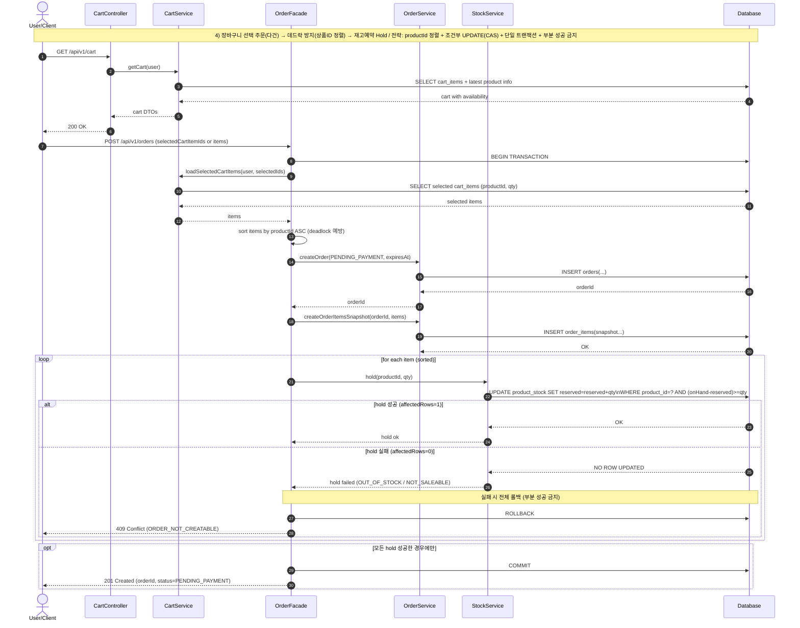
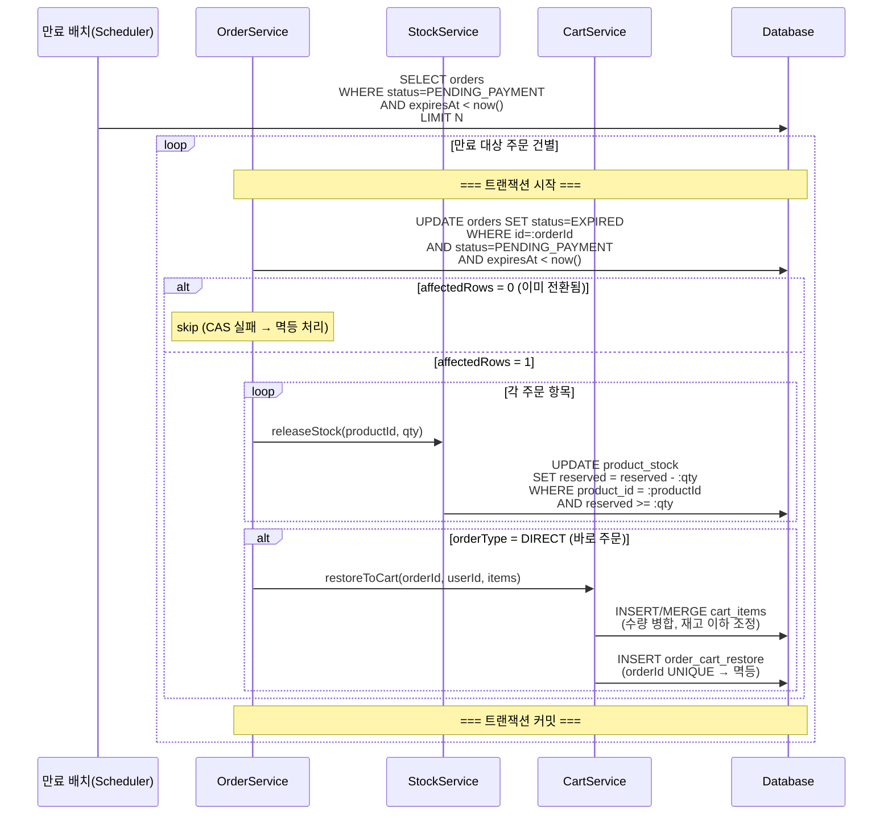

### 1. 바로 주문 (상품 상세에서 주문서 생성 + 재고 예약)
**왜 이 다이어그램이 필요한가:**
주문서 생성과 hold가 "한 트랜잭션"이며ㅑ, 조건부 UPDATE로 오버셀을 막는 걸 보여준다.



### 2. 장바구니 선택 주문(다건) -> 데드락 방지

**왜 이 다이어그램이 필요한가:**
장바구니 부터 결제 다시 장바구니 복원까지 보여주는 주문 전체 프로세스 시퀀스 다이어그램


### 3. 주문 생성 시퀀스 다이어그램 (공통: DIRECT/CART)
**왜 이 다이어그램이 필요한가:**
재고 확인 → 주문서/스냅샷 저장 → 재고 예약(Hold)이 **단일 트랜잭션** 안에서 원자적으로 처리되어야 하며, 다건 주문 시 **데드락 방지(정렬)** 와 **부분 성공 금지**를 검증하기 위해 필요하다.

```mermaid
sequenceDiagram
  autonumber
  actor U as User/Client
  participant API as OrderController
  participant OF as OrderFacade
  participant OS as OrderService
  participant PS as ProductService
  participant SS as StockService
  participant CR as CartService
  participant DB as Database

  U->>API: POST /api/v1/orders<br/>{items OR selectedCartItemIds, orderType}
  API->>OF: createOrder(user, request)

  Note over OF,DB: === 단일 트랜잭션 시작 ===

  alt orderType = CART
    OF->>CR: loadSelectedCartItems(user, selectedIds)
    CR->>DB: SELECT cart_items (productId, qty)
    DB-->>CR: items
    CR-->>OF: items
  else orderType = DIRECT
    Note over OF: request.items 사용
  end

  OF->>PS: validateProducts(items)
  PS->>DB: SELECT products/brands latest 상태 + 가격
  DB-->>PS: product states
  PS-->>OF: ok or fail

  alt 상품 검증 실패 (DELETED/HIDDEN 등)
    Note over OF,DB: === 트랜잭션 롤백 ===
    OF-->>API: 400/409 주문 불가 사유
    API-->>U: error
  end

  Note over OF: items 내 동일 productId 합산 병합
  Note over OF: productId 오름차순 정렬 (데드락 방지)

  OF->>OS: createOrder(status=PENDING_PAYMENT, expiresAt, orderType)
  OS->>DB: INSERT orders(...)
  DB-->>OS: orderId
  OS-->>OF: orderId

  OF->>OS: createOrderItemsSnapshot(orderId, items)
  OS->>DB: INSERT order_items(snapshot...)
  DB-->>OS: OK

  loop 각 주문 항목 (productId 오름차순)
    OF->>SS: hold(productId, qty)
    SS->>DB: UPDATE product_stock<br/>SET reserved = reserved + qty<br/>WHERE product_id = :productId<br/>AND (onHand - reserved) >= :qty
    alt affectedRows = 0 (재고 부족)
      Note over OF,DB: === 트랜잭션 롤백 ===
      OF-->>API: 409 OUT_OF_STOCK
      API-->>U: error
      break
    else affectedRows = 1
      SS-->>OF: ok
    end
  end

  Note over OF,DB: === 트랜잭션 커밋 ===
  OF-->>API: 201 Created (orderId, status=PENDING_PAYMENT)
  API-->>U: orderId, status
```


### 4. 주문 취소 (PENDING_PAYMENT에서만)
**왜 이 다이어그램이 필요한가:**
결제 완료/만료 배치와 **경쟁 조건**이 발생할 수 있으므로, 취소는 **상태 CAS 전이**로 멱등하게 처리하고, 성공 시에만 재고 예약을 해제하며(부분 해제 금지), DIRECT 주문은 **장바구니 자동 복원(B 방식)** 을 수행해야 한다.

```mermaid
sequenceDiagram
  autonumber
  actor U as User/Client
  participant API as OrderController
  participant OF as OrderFacade
  participant OS as OrderService
  participant SS as StockService
  participant CS as CartService
  participant DB as Database

  U->>API: POST /api/v1/orders/{orderId}/cancel
  API->>OF: cancelOrder(user, orderId)

  Note over OF,DB: === 단일 트랜잭션 시작 ===

  OF->>DB: UPDATE orders SET status=CANCELLED<br/>WHERE order_id=:orderId<br/>AND user_id=:userId<br/>AND status=PENDING_PAYMENT
  alt affectedRows = 0
    OF->>DB: SELECT status, order_type FROM orders WHERE order_id=:orderId AND user_id=:userId
    DB-->>OF: currentStatus
    alt currentStatus = CANCELLED
      Note over OF: 멱등 처리(이미 취소됨)
      OF-->>API: 200 OK (status=CANCELLED)
    else currentStatus = EXPIRED or PAID
      Note over OF: 취소 불가
      OF-->>API: 409 Conflict (NOT_CANCELLABLE)
    end
    API-->>U: response
  else affectedRows = 1
    OF->>OS: loadOrderItems(orderId, userId)
    OS->>DB: SELECT order_items (productId, qty) WHERE order_id=:orderId AND user_id=:userId
    DB-->>OS: items
    OS-->>OF: items

    Note over OF: productId 오름차순 정렬 (데드락 방지)
    loop 각 주문 항목 (productId 오름차순)
      OF->>SS: release(productId, qty)
      SS->>DB: UPDATE product_stock<br/>SET reserved = reserved - :qty<br/>WHERE product_id = :productId<br/>AND reserved >= :qty
      alt affectedRows = 0
        Note over OF,DB: === 트랜잭션 롤백 ===
        OF-->>API: 500 InconsistentReserved
        API-->>U: error
        break
      else affectedRows = 1
        SS-->>OF: ok
      end
    end

    alt orderType = DIRECT
      OF->>CS: restoreToCart(orderId, userId, items)
      CS->>DB: INSERT/MERGE cart_items (수량 병합, 재고 이하 조정)
      CS->>DB: INSERT order_cart_restore (멱등 식별자 기준)
    end

    Note over OF,DB: === 트랜잭션 커밋 ===
    OF-->>API: 200 OK (status=CANCELLED)
    API-->>U: status
  end
```


---

### 5. 주문 만료 및 장바구니 복원 시퀀스 다이어그램
**왜 이 다이어그램이 필요한가:**
만료 배치와 장바구니 복원은 비동기적으로 일어나며, **경쟁 조건(결제 vs 만료)** 과 **멱등성(중복 복원 방지)** 을 검증해야 한다.


---

### 6. 상품/브랜드 검색 (고객용)
**목표:** 사용자는 키워드(q)로 브랜드/상품을 빠르게 찾을 수 있어야 한다.

```mermaid
sequenceDiagram
  autonumber
  actor U as User/Client
  participant QC as CatalogQueryController
  participant PQ as ProductQueryService
  participant BQ as BrandQueryService
  participant DB as RDBMS(DB)

  Note over U,DB: 고객용 검색은 /api/v1 prefix, q 파라미터(부분일치/대소문자 무시)
RDBMS LIKE/FTS 중 택1(현재는 LIKE 가정), 성능 필요 시 인덱스/FTS 확장

  U->>QC: GET /api/v1/products?q=...&brandId=...&sort=latest&page=0&size=20
  QC->>PQ: listProducts(q, brandId, sort, page, size)
  PQ->>DB: SELECT products JOIN brands WHERE (product.name LIKE q OR brand.name LIKE q) AND brandId? ORDER BY ...
  DB-->>PQ: paged products
  PQ-->>QC: products DTOs
  QC-->>U: 200 OK (products)

  U->>QC: GET /api/v1/brands?q=...&page=0&size=20
  QC->>BQ: listBrands(q, page, size)
  BQ->>DB: SELECT brands WHERE name LIKE q AND status=ACTIVE ORDER BY ...
  DB-->>BQ: paged brands
  BQ-->>QC: brands DTOs
  QC-->>U: 200 OK (brands)
```

---

### 7. 운영 통계 조회 (관리자 대시보드)
**목표:** 관리자는 기간 기준의 핵심 지표(주문/인기상품/재고)를 조회할 수 있어야 한다.

```mermaid
sequenceDiagram
  autonumber
  actor A as Admin
  participant AC as AdminStatsController
  participant AS as AdminStatsService
  participant DB as RDBMS(DB)

  Note over A,DB: 관리자 통계는 /api-admin/v1 prefix
MVP는 RDBMS 집계 쿼리로 제공, 향후 이벤트/캐시로 확장 가능

  A->>AC: GET /api-admin/v1/stats/overview?startAt=...&endAt=...
  AC->>AS: getOverview(startAt, endAt)
  AS->>DB: SELECT COUNT(*) GROUP BY orders.status (기간조건)
  DB-->>AS: order status counts
  AS->>DB: SELECT productId, COUNT(*)/SUM(qty) FROM order_items ... (기간조건) TOP N
  DB-->>AS: top ordered products
  AS->>DB: SELECT productId, COUNT(*) FROM likes ... (기간조건) TOP N
  DB-->>AS: top liked products
  AS->>DB: SELECT productId, onHand, reserved, (onHand-reserved) as available FROM product_stocks WHERE available <= threshold
  DB-->>AS: low stock list
  AS-->>AC: overview DTO
  AC-->>A: 200 OK (overview)
```
