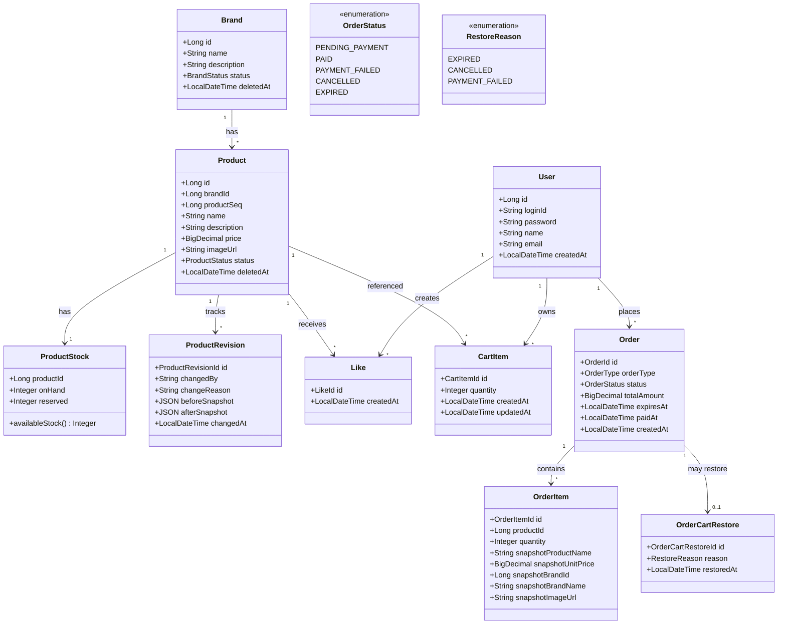
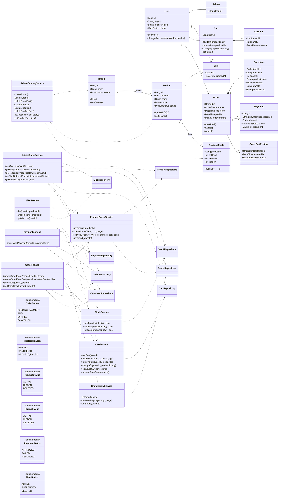

### 1. 클래스 다이어그램 (도메인 모델)
### domain, vo, entitiy 어떻게 나눌지 다시 고민
**왜 이 다이어그램이 필요한가:**
도메인 간 **의존 방향**과 **책임 분리**를 확인하기 위해 필요하다. 특히 Order가 Product를 직접 참조하는지, 스냅샷으로 분리하는지가 핵심.

```mermaid
classDiagram
    class User {
        +Long id
        +String loginId
        +String password
        +String name
        +String email
        +LocalDateTime createdAt
    }

    class Brand {
        +Long id
        +String name
        +String description
        +BrandStatus status
        +LocalDateTime deletedAt
    }

    class Product {
        +Long id
        +Long brandId
        +Long productSeq
        +String name
        +String description
        +BigDecimal price
        +String imageUrl
        +ProductStatus status
        +LocalDateTime deletedAt
    }

    class ProductStock {
        +Long productId
        +Integer onHand
        +Integer reserved
        +availableStock() Integer
    }

    class ProductRevision {
        +ProductRevisionId id
        +String changedBy
        +String changeReason
        +JSON beforeSnapshot
        +JSON afterSnapshot
        +LocalDateTime changedAt
    }

    class Like {
        +LikeId id
        +LocalDateTime createdAt
    }

    class CartItem {
        +CartItemId id
        +Integer quantity
        +LocalDateTime createdAt
        +LocalDateTime updatedAt
    }

    class Order {
        +OrderId id
        +OrderType orderType
        +OrderStatus status
        +BigDecimal totalAmount
        +LocalDateTime expiresAt
        +LocalDateTime paidAt
        +LocalDateTime createdAt
    }

    class OrderItem {
        +OrderItemId id
        +Long productId
        +Integer quantity
        +String snapshotProductName
        +BigDecimal snapshotUnitPrice
        +Long snapshotBrandId
        +String snapshotBrandName
        +String snapshotImageUrl
    }

    class OrderCartRestore {
        +OrderCartRestoreId id
        +RestoreReason reason
        +LocalDateTime restoredAt
    }

    %% =========================
    %% Relations (conceptual)
    %% =========================
    Brand "1" --> "*" Product : has
    Product "1" --> "1" ProductStock : has
    Product "1" --> "*" ProductRevision : tracks
    User "1" --> "*" Like : creates
    Product "1" --> "*" Like : receives
    User "1" --> "*" CartItem : owns
    Product "1" --> "*" CartItem : referenced
    User "1" --> "*" Order : places
    Order "1" --> "*" OrderItem : contains
    Order "1" --> "0..1" OrderCartRestore : may restore


    class OrderStatus {
        <<enumeration>>
        PENDING_PAYMENT
        PAID
        PAYMENT_FAILED
        CANCELLED
        EXPIRED
    }

    class RestoreReason {
        <<enumeration>>
        EXPIRED
        CANCELLED
        PAYMENT_FAILED
    }
```

```mermaid
classDiagram
direction LR
%% =========================
%% Core Actors / Context
%% =========================
class User {
  +Long id
  +String loginId
  +String loginPwHash
  +UserStatus status
  +getProfile()
  +changePassword(currentPw,newPw)
}

class Admin {
  +String ldapId
}

User <|-- Admin

%% =========================
%% Catalog Domain
%% =========================
class Brand {
  +Long id
  +String name
  +BrandStatus status
  +hide()
  +softDelete()
}

class Product {
  +Long id
  +Long brandId
  +String name
  +Money price
  +ProductStatus status
  +updateInfo(...)
  +softDelete()
}

Brand "1" --> "0..*" Product : owns

%% =========================
%% Like Domain
%% =========================
class Like {
  +LikeId id
  +DateTime createdAt
}

User "1" --> "0..*" Like
Product "1" --> "0..*" Like

%% =========================
%% Cart Domain (No snapshot)
%% =========================
class Cart {
  +Long userId
  +addItem(productId, qty)
  +removeItem(productId)
  +changeQty(productId, qty)
  +getItems()
}

class CartItem {
  +CartItemId id
  +int quantity
  +DateTime updatedAt
}

Cart "1" *-- "0..*" CartItem
User "1" --> "1" Cart

%% =========================
%% Stock Domain (DB SoT)
%% =========================
class ProductStock {
  +Long productId
  +int onHand
  +int reserved
  +int version
  +available() int
}

Product "1" --> "1" ProductStock : has

%% =========================
%% Order Domain (Snapshot)
%% =========================
class Order {
  +OrderId id
  +OrderStatus status
  +DateTime expiresAt
  +DateTime paidAt
  +Money orderAmount
  +markPaid()
  +expire()
  +cancel()
}

class OrderItem {
  +OrderItemId id
  +Long productId
  +int quantity
  %% Snapshot fields
  +String productName
  +Money unitPrice
  +Long brandId
  +String brandName
}

Order "1" *-- "1..*" OrderItem
User "1" --> "0..*" Order

%% =========================
%% Payment (Phase2)
%% =========================
class Payment {
  +Long id
  +String paymentTransactionId
  +OrderId orderId
  +PaymentStatus status
  +DateTime createdAt
}

Order "1" --> "0..1" Payment

%% =========================
%% Restore / Audit (idempotency helpers)
%% =========================
class OrderCartRestore {
  +OrderCartRestoreId id
  +DateTime restoredAt
  +RestoreReason reason
}

Order "1" --> "0..1" OrderCartRestore

%% =========================
%% Services (Use-case orchestration)
%% =========================
class OrderFacade {
  +createOrderFromProduct(userId, items)
  +createOrderFromCart(userId, selectedCartItemIds)
  +getOrders(userId, period)
  +getOrderDetail(userId, orderId)
}

class StockService {
  +hold(productId, qty) bool
  +commit(productId, qty) bool
  +release(productId, qty) bool
}

class CartService {
  +getCart(userId)
  +addItem(userId, productId, qty)
  +removeItem(userId, productId)
  +changeQty(userId, productId, qty)
  +cleanupByOrder(orderId)
  +restoreFromOrder(orderId)
}

class LikeService {
  +like(userId, productId)
  +unlike(userId, productId)
  +getMyLikes(userId)
}

class ProductQueryService {
  +getProduct(productId)
  +listProducts(filters, sort, page)
  +listProductsByKeyword(q, brandId, sort, page)
  +getBrand(brandId)
}

class BrandQueryService {
  +listBrands(page)
  +listBrandsByKeyword(q, page)
  +getBrand(brandId)
}

class AdminCatalogService {
  +createBrand()
  +updateBrand()
  +deleteBrandSoft()
  +createProduct()
  +updateProduct()
  +deleteProductSoft()
  +listProductsWithHistory()
  +getProductRevision()
}

class AdminStatsService {
  +getOverview(startAt,endAt)
  +getDailyOrderStats(startAt,endAt)
  +getTopLikedProducts(startAt,endAt,limit)
  +getTopOrderedProducts(startAt,endAt,limit)
  +getLowStock(threshold,limit)
}

class PaymentService {
  +completePayment(orderId, paymentTxId)
}

OrderFacade ..> ProductQueryService
OrderFacade ..> BrandQueryService
OrderFacade ..> CartService
OrderFacade ..> StockService
PaymentService ..> StockService
PaymentService ..> CartService

LikeService ..> ProductQueryService
AdminStatsService ..> LikeRepository

AdminCatalogService ..> Brand
AdminCatalogService ..> Product
AdminCatalogService ..> ProductStock
AdminStatsService ..> StockRepository
AdminStatsService ..> ProductRepository
AdminStatsService ..> BrandRepository
AdminStatsService ..> CartRepository

%% =========================
%% Persistence (Repositories)
%% =========================
class OrderRepository
class OrderItemRepository
class StockRepository
class CartRepository
class LikeRepository
class ProductRepository
class BrandRepository
class PaymentRepository

OrderFacade ..> OrderRepository
OrderFacade ..> OrderItemRepository
StockService ..> StockRepository
CartService ..> CartRepository
LikeService ..> LikeRepository
ProductQueryService ..> ProductRepository
ProductQueryService ..> BrandRepository
BrandQueryService ..> BrandRepository
PaymentService ..> PaymentRepository
PaymentService ..> OrderRepository
AdminStatsService ..> OrderRepository
PaymentService ..> OrderItemRepository
AdminStatsService ..> OrderItemRepository

%% =========================
%% Enums
%% =========================
class OrderStatus {
  <<enumeration>>
  PENDING_PAYMENT
  PAID
  EXPIRED
  CANCELLED
}

class RestoreReason {
  <<enumeration>>
  EXPIRED
  CANCELLED
  PAYMENT_FAILED
}
class ProductStatus {
  <<enumeration>>
  ACTIVE
  HIDDEN
  DELETED
}
class BrandStatus {
  <<enumeration>>
  ACTIVE
  HIDDEN
  DELETED
}
class PaymentStatus {
  <<enumeration>>
  APPROVED
  FAILED
  REFUNDED
}
class UserStatus {
  <<enumeration>>
  ACTIVE
  SUSPENDED
  DELETED
}
```