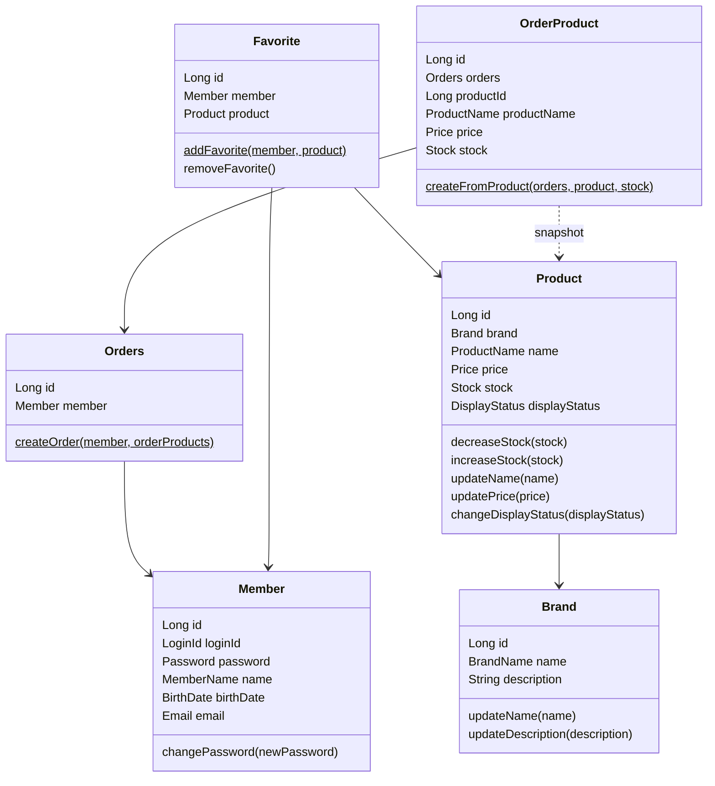

# 03. 클래스 다이어그램

---

## 도메인 모델 관계도

```mermaid
classDiagram
    direction TB

    class Member {
        Long id
        LoginId loginId
        Password password
        MemberName name
        BirthDate birthDate
        Email email
        changePassword(newPassword)
    }

    class Brand {
        Long id
        BrandName name
        String description
        updateName(name)
        updateDescription(description)
    }

    class Product {
        Long id
        Brand brand
        ProductName name
        Price price
        Stock stock
        DisplayStatus displayStatus
        decreaseStock(stock)
        increaseStock(stock)
        updateName(name)
        updatePrice(price)
        changeDisplayStatus(displayStatus)
    }

    class Favorite {
        Long id
        Member member
        Product product
        addFavorite(member, product)$
        removeFavorite()
    }

    class Orders {
        Long id
        Member member
        createOrder(member, orderProducts)$
    }

    class OrderProduct {
        Long id
        Orders orders
        Long productId
        ProductName productName
        Price price
        Stock stock
        createFromProduct(orders, product, stock)$
    }

    Product --> Brand
    Orders --> Member
    Favorite --> Member
    Favorite --> Product
    OrderProduct --> Orders
    OrderProduct ..> Product : snapshot

```
