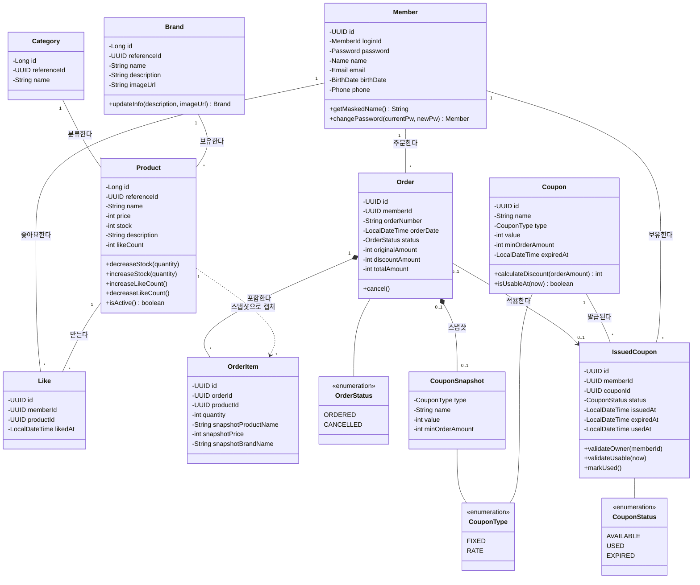

# 클래스 다이어그램

핵심 도메인 엔티티의 책임 분배와 관계 방향을 검증한다. 비즈니스 로직이 Service가 아닌 엔티티에 적절히 위치하는지, OrderItem의 스냅샷 패턴이 Product와 올바르게 분리되었는지, 도메인 간 의존 방향이 올바른지 확인한다.

## 클래스 다이어그램

## 핵심 포인트

- **불변 도메인 객체**: 기존 Member가 record 기반 불변 객체 + Value Object(MemberId, Password, Name, Email, BirthDate) 패턴으로 구현되어 있다. 새 도메인도 동일 패턴 적용.
- **식별자 이중화 전략**: Product/Category/Brand는 DB PK를 `Long(auto increment)`로 사용하고, 외부 API/도메인 노출 식별자는 `UUID referenceId`를 사용한다.
- **엔티티에 비즈니스 로직 배치**: Product.decreaseStock(), Order.cancel() 등 상태 변경 로직이 Service가 아닌 엔티티 자체에 위치하여 빈약한 도메인 방지.
- **스냅샷 분리 (점선)**: OrderItem은 Product의 런타임 참조를 갖지 않는다. 다만 `productId`를 논리 참조로 보관하고, 주문 시점의 상품명/가격/브랜드명 스냅샷을 함께 저장해 변경/삭제에도 주문 이력을 보존한다.
- **Like = 조인 엔티티**: Member-Product 간 N:M 관계를 Like 엔티티로 풀어낸다. DB에서 (memberId + productId) Unique 제약조건으로 중복 방지.
- **Brand.name 불변**: updateInfo()는 description, imageUrl만 수정 가능. name은 생성 시 확정.
- **Category는 Seed 데이터**: 비즈니스 메서드 없음. 조회 전용 참조 테이블.
- **쿠폰 분리 모델**: Coupon(정책)과 IssuedCoupon(개인 소유/상태 전이)을 분리해 단일 사용/만료/소유권 규칙을 명확히 한다.

## Coupon 도메인 설계 (1차)

이번 단계에서는 쿠폰 도메인의 최소 책임과 상태 전이 규칙을 먼저 고정한다.

### Aggregate 경계

- **Coupon**: 할인 정책의 원본(타입, 값, 최소 주문 금액, 만료 시각)을 소유
- **IssuedCoupon**: 사용자에게 발급된 쿠폰 인스턴스(소유자, 상태, 사용 시각)를 소유
- **Order는 IssuedCoupon을 0..1로 참조**: 주문당 쿠폰 1장 규칙 반영
- **Order는 CouponSnapshot을 보관**: 주문 시점 쿠폰 타입/이름/값/최소주문금액을 고정 저장

### 도메인 규칙

- `Coupon`
  - `type=FIXED`면 `value`는 할인 금액(원)
  - `type=RATE`면 `value`는 퍼센트(1~100)
  - `minOrderAmount` 미충족 시 적용 불가
  - `expiredAt` 이후 신규 발급/적용 불가
- `IssuedCoupon`
  - 개인 만료 정책을 위해 `expiredAt`을 별도로 가진다
  - 상태 전이: `AVAILABLE -> USED` 단방향
  - `USED`, `EXPIRED` 상태는 주문 적용 불가
  - 도메인에서 만료 시점 도달 시 `EXPIRED` 상태 전이를 허용한다
  - 소유자(memberId)와 주문 요청자 불일치 시 적용 불가

### 1차 설계 의도

- 쿠폰 정책(Template)과 사용자 소유 상태(Issued)를 분리해 상태 전이 규칙을 단순화
- 주문에서 쿠폰은 선택(`0..1`)으로 유지해 기존 주문 흐름 영향 최소화
- 동시성 제어는 다음 단계에서 트랜잭션/락 설계 문서와 결합해 구체화

## 설계 리스크

- **Product 상태 변경의 동시성**: decreaseStock(), increaseLikeCount() 등이 동시 호출될 때 경합 발생 가능. 엔티티 레벨에서는 검증만 수행하고, 동시성 제어는 인프라(DB 락/조건부 UPDATE)에서 해결.
- **OrderItem 스냅샷 필드 확장**: 현재 `productId(논리 참조)` + 상품명/가격/브랜드명을 저장한다. 향후 카테고리, 이미지 등 스냅샷 대상이 늘어나면 OrderItem이 비대해질 수 있다.
- **쿠폰 상태 전이 경합**: IssuedCoupon의 `AVAILABLE -> USED` 전이에서 경쟁 조건이 발생할 수 있으므로, 전이 조건과 DB 제약으로 단일 사용을 보장해야 한다.
