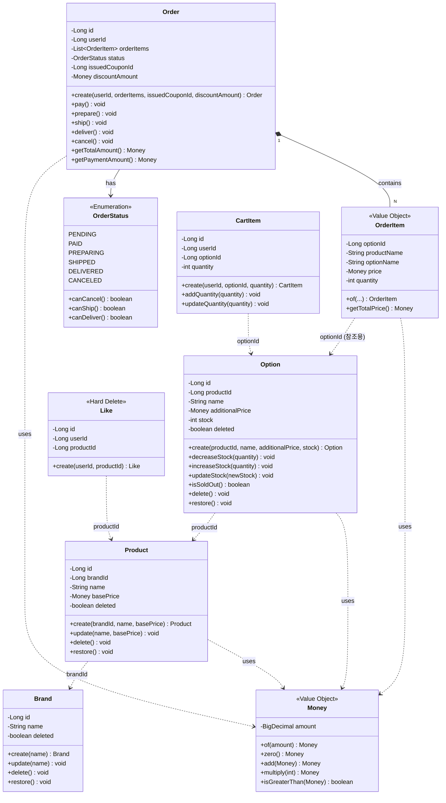

# 03. 도메인 모델 (Domain Model)

멘토 피드백에 따라 ERD보다 **도메인 모델링**에 집중합니다.
어떤 순수 객체(Entity, VO)가 어떤 메시지(행위)를 주고받는지 표현합니다.

---

## 1. Aggregate 구조

| Aggregate | Root Entity | 포함 요소 |
|-----------|-------------|----------|
| **Order** | `Order` | `OrderItem` (VO), `OrderStatus` (Enum) |
| **Product** | `Product` | - |
| **Option** | `Option` | - |
| **Brand** | `Brand` | - |
| **Cart** | `CartItem` | - |
| **Like** | `Like` | Hard Delete 대상 |

---

## 2. 도메인 클래스 다이어그램

---

## 3. Entity 메시지 정리

### 3.1 Order (Aggregate Root)

| 메서드 | 행위 | 상태 전이 |
|--------|------|----------|
| `pay()` | 결제 처리 | PENDING → PAID |
| `prepare()` | 준비 시작 | PAID → PREPARING |
| `ship()` | 배송 시작 | PREPARING → SHIPPED |
| `deliver()` | 배송 완료 | SHIPPED → DELIVERED |
| `cancel()` | 주문 취소 | PENDING/PAID → CANCELED |
| `getTotalAmount()` | 총액 계산 | - |

### 3.2 Option

| 메서드 | 행위 | 비고 |
|--------|------|------|
| `decreaseStock(qty)` | 재고 차감 | 부족 시 예외 |
| `increaseStock(qty)` | 재고 증가 | 취소 시 복구 |
| `isSoldOut()` | 품절 여부 확인 | stock ≤ 0 |
| `delete()` / `restore()` | Soft Delete | - |

### 3.3 Product / Brand

| 메서드 | 행위 |
|--------|------|
| `update(...)` | 정보 수정 |
| `delete()` / `restore()` | Soft Delete |

### 3.4 CartItem

| 메서드 | 행위 |
|--------|------|
| `addQuantity(qty)` | 수량 합산 (동일 옵션 추가 시) |
| `updateQuantity(qty)` | 수량 변경 |

### 3.5 Like

행위 메서드 없음. 생성(`create`)과 삭제(Hard Delete)만 존재.

---

## 4. Value Object 정리

### 4.1 Money

| 메서드 | 설명 |
|--------|------|
| `of(amount)` | 생성 (0 이상 검증) |
| `zero()` | 0원 생성 |
| `add(Money)` | 덧셈 (새 객체 반환) |
| `multiply(int)` | 곱셈 (새 객체 반환) |
| `isGreaterThan(Money)` | 비교 |

### 4.2 OrderItem

| 특징 | 설명 |
|------|------|
| 스냅샷 | 주문 시점의 productName, optionName, price 저장 |
| 불변 | 생성 후 변경 불가 |
| `getTotalPrice()` | price × quantity |

---

## 5. 설계 원칙 요약

| 원칙 | 적용 |
|------|------|
| **순수 도메인** | JPA, DB 기술 의존 없음 |
| **Rich Domain Model** | Entity가 스스로 상태 변경 |
| **Setter 금지** | 도메인 메서드로만 상태 변경 |
| **자가 검증** | 생성자에서 CoreException 발생 |
| **논리적 FK** | ID로만 참조, 물리적 제약 없음 |
