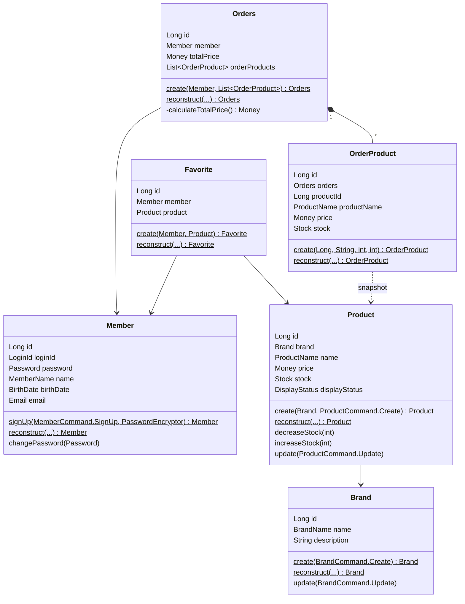
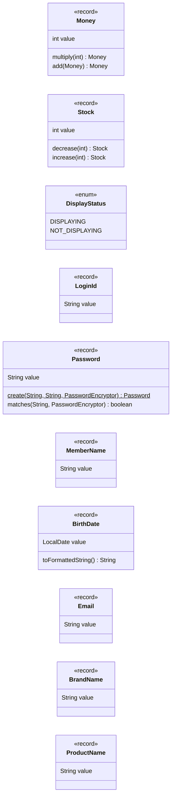
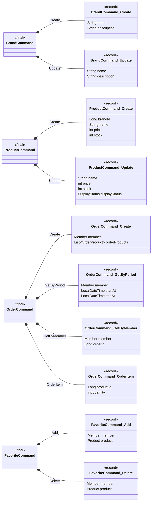
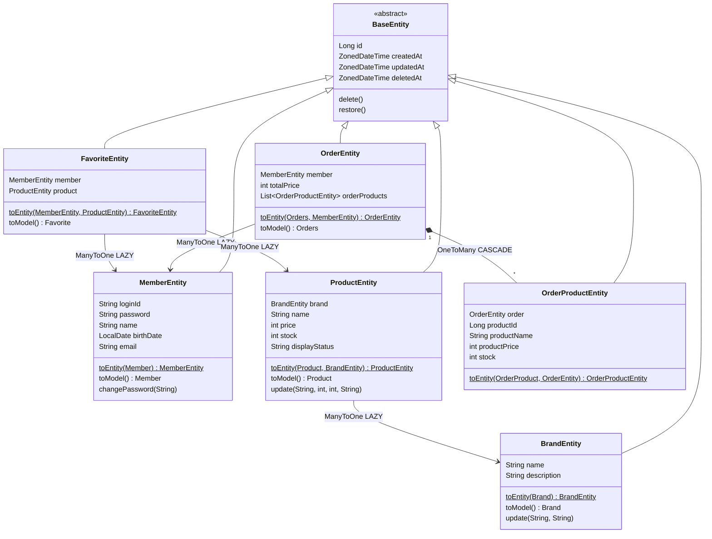

# 03. 클래스 다이어그램

---

## 도메인 모델 관계도

```mermaid
classDiagram
    direction TB

    class Member {
        Long id
        LoginId loginId
        Password password
        MemberName name
        BirthDate birthDate
        Email email
        signUp(MemberCommand.SignUp, PasswordEncryptor)$ Member
        reconstruct(...)$ Member
        changePassword(Password)
    }

    class Brand {
        Long id
        BrandName name
        String description
        create(BrandCommand.Create)$ Brand
        reconstruct(...)$ Brand
        update(BrandCommand.Update)
    }

    class Product {
        Long id
        Brand brand
        ProductName name
        Money price
        Stock stock
        DisplayStatus displayStatus
        create(Brand, ProductCommand.Create)$ Product
        reconstruct(...)$ Product
        decreaseStock(int)
        increaseStock(int)
        update(ProductCommand.Update)
    }

    class Orders {
        Long id
        Member member
        Money totalPrice
        List~OrderProduct~ orderProducts
        create(Member, List~OrderProduct~)$ Orders
        reconstruct(...)$ Orders
        -calculateTotalPrice() Money
    }

    class OrderProduct {
        Long id
        Orders orders
        Long productId
        ProductName productName
        Money price
        Stock stock
        create(Long, String, int, int)$ OrderProduct
        reconstruct(...)$ OrderProduct
    }

    class Favorite {
        Long id
        Member member
        Product product
        create(Member, Product)$ Favorite
        reconstruct(...)$ Favorite
    }

    Product --> Brand
    Orders --> Member
    Orders "1" *-- "*" OrderProduct
    Favorite --> Member
    Favorite --> Product
    OrderProduct ..> Product : snapshot
```

## Value Object

```mermaid
classDiagram
    direction LR

    class Money {
        <<record>>
        int value
        multiply(int) Money
        add(Money) Money
    }

    class Stock {
        <<record>>
        int value
        decrease(int) Stock
        increase(int) Stock
    }

    class DisplayStatus {
        <<enum>>
        DISPLAYING
        NOT_DISPLAYING
    }

    class LoginId {
        <<record>>
        String value
    }

    class Password {
        <<record>>
        String value
        create(String, String, PasswordEncryptor)$ Password
        matches(String, PasswordEncryptor) boolean
    }

    class MemberName {
        <<record>>
        String value
    }

    class BirthDate {
        <<record>>
        LocalDate value
        toFormattedString() String
    }

    class Email {
        <<record>>
        String value
    }

    class BrandName {
        <<record>>
        String value
    }

    class ProductName {
        <<record>>
        String value
    }
```

## Command

```mermaid
classDiagram
    direction LR

    class BrandCommand {
        <<final>>
    }
    class BrandCommand_Create {
        <<record>>
        String name
        String description
    }
    class BrandCommand_Update {
        <<record>>
        String name
        String description
    }
    BrandCommand *-- BrandCommand_Create : Create
    BrandCommand *-- BrandCommand_Update : Update

    class ProductCommand {
        <<final>>
    }
    class ProductCommand_Create {
        <<record>>
        Long brandId
        String name
        int price
        int stock
    }
    class ProductCommand_Update {
        <<record>>
        String name
        int price
        int stock
        DisplayStatus displayStatus
    }
    ProductCommand *-- ProductCommand_Create : Create
    ProductCommand *-- ProductCommand_Update : Update

    class OrderCommand {
        <<final>>
    }
    class OrderCommand_Create {
        <<record>>
        Member member
        List~OrderProduct~ orderProducts
    }
    class OrderCommand_GetByPeriod {
        <<record>>
        Member member
        LocalDateTime startAt
        LocalDateTime endAt
    }
    class OrderCommand_GetByMember {
        <<record>>
        Member member
        Long orderId
    }
    class OrderCommand_OrderItem {
        <<record>>
        Long productId
        int quantity
    }
    OrderCommand *-- OrderCommand_Create : Create
    OrderCommand *-- OrderCommand_GetByPeriod : GetByPeriod
    OrderCommand *-- OrderCommand_GetByMember : GetByMember
    OrderCommand *-- OrderCommand_OrderItem : OrderItem

    class FavoriteCommand {
        <<final>>
    }
    class FavoriteCommand_Add {
        <<record>>
        Member member
        Product product
    }
    class FavoriteCommand_Delete {
        <<record>>
        Member member
        Product product
    }
    FavoriteCommand *-- FavoriteCommand_Add : Add
    FavoriteCommand *-- FavoriteCommand_Delete : Delete
```

## Infrastructure 레이어 (Entity 매핑)

```mermaid
classDiagram
    direction TB

    class BaseEntity {
        <<abstract>>
        Long id
        ZonedDateTime createdAt
        ZonedDateTime updatedAt
        ZonedDateTime deletedAt
        delete()
        restore()
    }

    class MemberEntity {
        String loginId
        String password
        String name
        LocalDate birthDate
        String email
        toEntity(Member)$ MemberEntity
        toModel() Member
        changePassword(String)
    }

    class BrandEntity {
        String name
        String description
        toEntity(Brand)$ BrandEntity
        toModel() Brand
        update(String, String)
    }

    class ProductEntity {
        BrandEntity brand
        String name
        int price
        int stock
        String displayStatus
        toEntity(Product, BrandEntity)$ ProductEntity
        toModel() Product
        update(String, int, int, String)
    }

    class OrderEntity {
        MemberEntity member
        int totalPrice
        List~OrderProductEntity~ orderProducts
        toEntity(Orders, MemberEntity)$ OrderEntity
        toModel() Orders
    }

    class OrderProductEntity {
        OrderEntity order
        Long productId
        String productName
        int productPrice
        int stock
        toEntity(OrderProduct, OrderEntity)$ OrderProductEntity
    }

    class FavoriteEntity {
        MemberEntity member
        ProductEntity product
        toEntity(MemberEntity, ProductEntity)$ FavoriteEntity
        toModel() Favorite
    }

    BaseEntity <|-- MemberEntity
    BaseEntity <|-- BrandEntity
    BaseEntity <|-- ProductEntity
    BaseEntity <|-- OrderEntity
    BaseEntity <|-- OrderProductEntity
    BaseEntity <|-- FavoriteEntity

    ProductEntity --> BrandEntity : ManyToOne LAZY
    OrderEntity --> MemberEntity : ManyToOne LAZY
    OrderEntity "1" *-- "*" OrderProductEntity : OneToMany CASCADE
    FavoriteEntity --> MemberEntity : ManyToOne LAZY
    FavoriteEntity --> ProductEntity : ManyToOne LAZY
```
