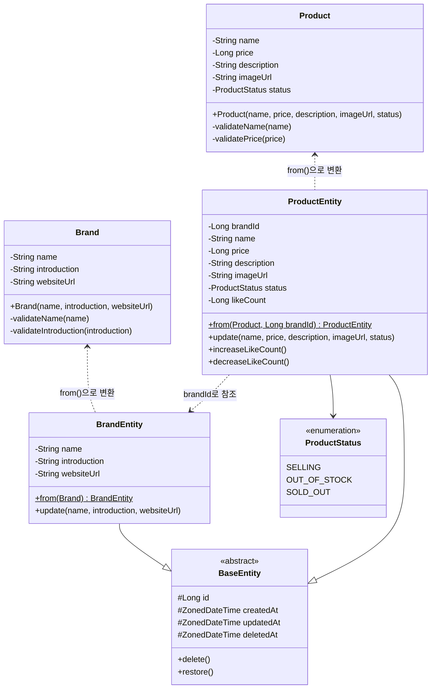
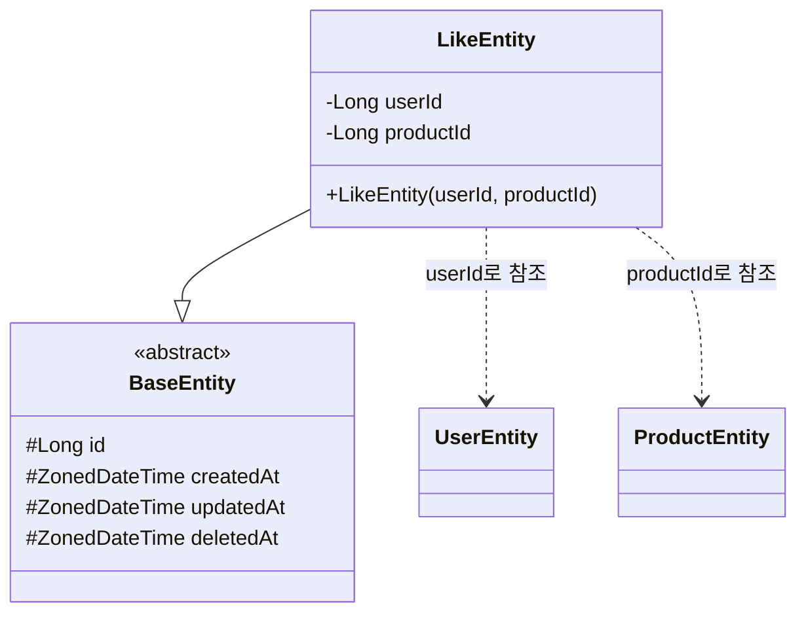
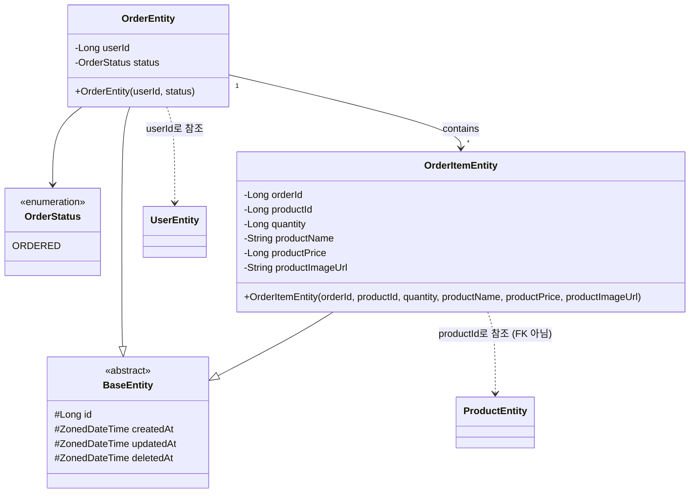
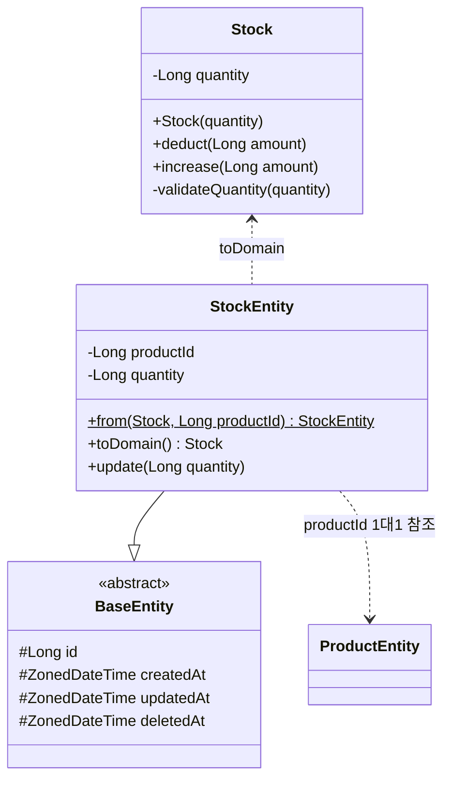
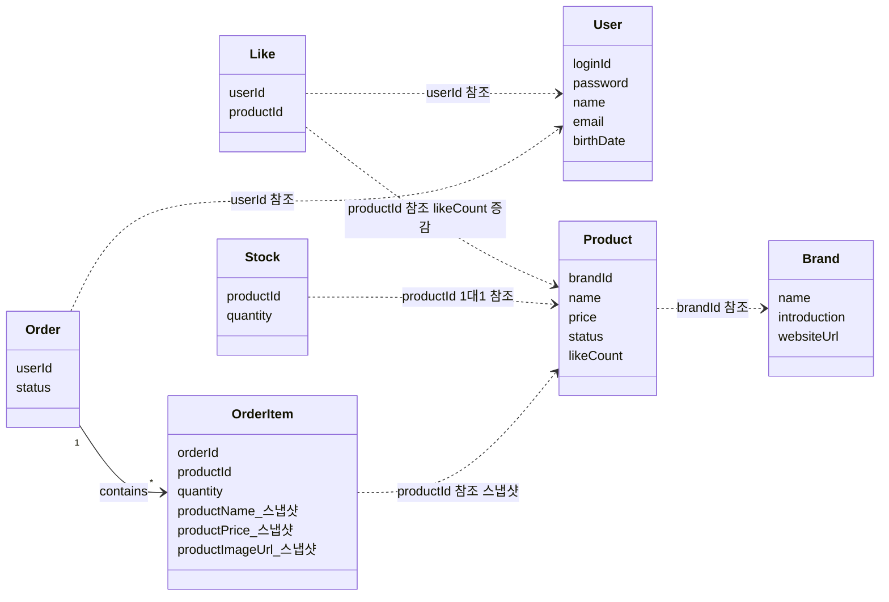

# 클래스 다이어그램

도메인 객체의 책임, 의존 방향, 응집도를 검증하기 위해 작성한다.
레이어 구조(Controller, Facade, Repository 등)는 시퀀스 다이어그램에서 확인하며, 여기서는 도메인 모델에 집중한다.

---

## 1. Brand & Product 도메인

Brand와 Product의 도메인 객체, 엔티티, 그리고 두 도메인 간 관계를 표현한다.

### 포인트
- **Domain ↔ Entity 분리**: Brand, Product는 순수 도메인 객체(유효성 검증), BrandEntity, ProductEntity는 JPA 영속 객체.
- **ProductEntity.brandId**: `@ManyToOne` 대신 Long ID 참조로 도메인 간 결합도 최소화.
- **ProductEntity.likeCount**: 비정규화 필드. Like 도메인과 같은 트랜잭션에서 비관적 락으로 동기화.
- **ProductStatus 3단계**: `SELLING` → `OUT_OF_STOCK`(재고 0 자동) → `SOLD_OUT`(어드민 수동).

---

## 2. Like 도메인

Like는 비즈니스 로직이 단순하여 Domain ↔ Entity 분리 없이 Entity가 도메인 모델을 겸한다.

### 포인트
- **Domain ↔ Entity 분리 안 함**: userId + productId 조합 외에 유효성 검증이나 비즈니스 로직이 없음.
- **Hard delete**: soft delete 시 유니크 키 충돌 문제를 피하기 위해 물리 삭제. BaseEntity를 상속하지만 `deletedAt`은 사용하지 않음.
- **복합 유니크 키**: `(userId, productId)` — 멱등성 보장의 DB 레벨 방어선.

---

## 3. Order & OrderItem 도메인

Order는 현재 상태가 ORDERED 하나이므로 Domain ↔ Entity 분리를 하지 않는다. OrderItem은 주문 시점의 상품 스냅샷을 보존하는 역할.

### 포인트
- **Domain ↔ Entity 분리 안 함**: 상태 전이 로직이 없으므로 Entity가 도메인 모델 겸임. 결제 도입 시 상태가 복잡해지면 그때 분리 검토.
- **OrderItemEntity = 스냅샷**: 주문 시점의 상품 정보(name, price, imageUrl)를 직접 저장. 상품 수정/삭제 후에도 원래 거래 조건 보존.
- **productId는 FK 아님**: 참조 무결성보다 이력 보존을 우선.

---

## 4. Stock 도메인

Stock은 재고 차감/증가 시 유효성 검증(음수 방지)이 필요하므로 Domain ↔ Entity 분리를 적용한다.

### 포인트
- **Domain ↔ Entity 분리 적용**: `Stock.deduct()`, `Stock.increase()`에서 음수 방지, 차감 가능 여부 검증. 비즈니스 룰을 도메인 객체에 캡슐화.
- **비관적 락 대상**: `StockEntity`는 `SELECT FOR UPDATE`로 동시성 제어. Product와 분리하여 좋아요(likeCount 락)와 경합하지 않음.
- **1:1 관계**: `productId` UNIQUE 제약으로 상품당 하나의 재고 레코드 보장.

---

## 5. 도메인 간 의존 관계

전체 도메인의 의존 방향을 표현한다. 화살표는 "의존한다" 방향.

### 포인트
- **Product가 중심 도메인**: Brand, Like, Stock, OrderItem 모두 Product에 의존. likeCount 증감, 상태 변경, 스냅샷 조회 등 다양한 역할.
- **도메인 간 참조는 ID**: `@ManyToOne` 같은 JPA 연관관계 없이 Long ID로 참조. 결합도 최소화.
- **Stock → Product 상태 변경**: 재고 0이면 OUT_OF_STOCK 자동 전환, 재입고 시 SELLING 복원. 유일한 Service 간 직접 의존.

---

## Domain ↔ Entity 분리 기준 요약

| 도메인 | 분리 여부 | 이유 |
|--------|:---:|------|
| Brand | O | 이름, 소개문구 유효성 검증 |
| Product | O | 이름, 가격 유효성 검증 |
| Like | X | 비즈니스 로직 없음 (userId + productId 조합만) |
| Order | X | 현재 상태 하나 (ORDERED). 결제 도입 시 분리 검토 |
| OrderItem | X | 스냅샷 데이터 보존 역할. 비즈니스 로직 없음 |
| Stock | O | 차감/증가 시 음수 방지 등 유효성 검증 필요 |
