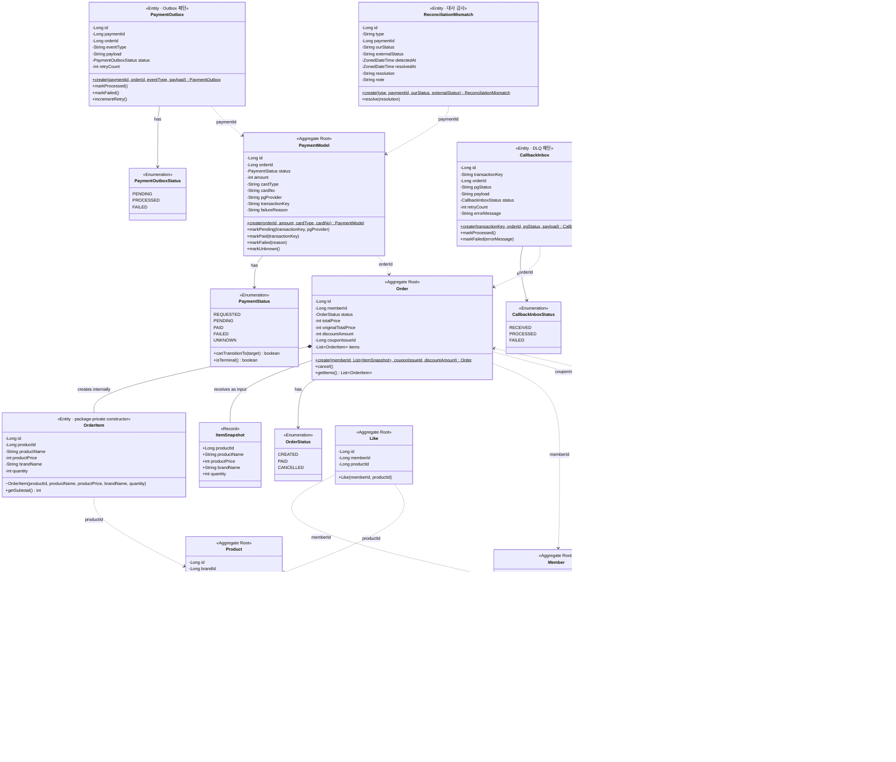

# 클래스 다이어그램

## 1. 개요

이커머스 플랫폼의 도메인 모델을 DDD 관점에서 설계한다.

### 다이어그램 읽는 법

| 표기 | 의미 |
|------|------|
| `<<Aggregate Root>>` | 해당 Aggregate의 진입점. 외부에서는 이 객체를 통해서만 접근 |
| `<<Entity>>` | 고유 식별자를 가지는 객체. Aggregate 내부에서만 존재 |
| `<<Value Object>>` | 불변 객체. 값으로만 비교하며 식별자 없음 |
| `<<Enumeration>>` | 열거형. 미리 정의된 상수 집합 |
| `*--` (컴포지션) | 생명주기를 함께하는 강한 포함 관계 |
| `..>` (점선 화살표) | ID 참조. Aggregate 간 느슨한 결합 |

---

## 2. 레이어드 아키텍처

```mermaid
graph TB
    subgraph Interfaces ["Interfaces Layer — Controller, DTO"]
        BC["BrandController\nBrandAdminController"]
        PC["ProductController\nProductAdminController"]
        OC["OrderController\nOrderAdminController"]
        LC["LikeController"]
        MC["MemberV1Controller"]
        CC["CouponController\nCouponAdminController"]
        PAYC["PaymentV1Controller"]
    end

    subgraph Application ["Application Layer — Facade (유스케이스 조율, 트랜잭션)"]
        BF["BrandFacade\n· 브랜드 CRUD\n· 삭제 시 상품+좋아요 연쇄 처리"]
        PF["ProductFacade\n· 상품 CRUD + 정렬 조회\n· 삭제 시 좋아요 연쇄 처리"]
        OF["OrderFacade\n· 주문 생성 (비관적 락 재고 차감 + 쿠폰 적용)\n· 주문 취소 (재고 복원 + 쿠폰 복원)\n· 권한 검증"]
        LF["LikeFacade\n· 좋아요 추가 (멱등)\n· 좋아요 취소 (멱등)"]
        MF["MemberFacade\n· 회원가입\n· 비밀번호 변경"]
        CF["CouponFacade\n· 쿠폰 CRUD (Admin)\n· 쿠폰 발급/조회\n· 주문 연동 (적용/복원)"]
        PAYF["PaymentFacade\n· 결제 요청 (수동 Retry + Multi-PG)\n· 콜백 수신 + 진주문 전환\n· Polling Hybrid 복구"]
        PRS["PaymentRecoveryService\n· 콜백 비동기 처리\n· 조건부 UPDATE (멱등)\n· 재고/쿠폰 복원"]
        POS["ProvisionalOrderService\n· Redis 가주문 생성 (CB Fallback → DB)\n· 가주문 조회/삭제"]
    end

    subgraph Domain ["Domain Layer — Entity, VO, Repository Interface"]
        direction LR
        BR["«interface»\nBrandRepository"]
        PR["«interface»\nProductRepository"]
        OR["«interface»\nOrderRepository"]
        LR2["«interface»\nLikeRepository"]
        MR["«interface»\nMemberRepository"]
        CR["«interface»\nCouponRepository"]
        CIR["«interface»\nCouponIssueRepository"]
        PAYR["«interface»\nPaymentRepository"]
        POR["«interface»\nPaymentOutboxRepository"]
        CIBR["«interface»\nCallbackInboxRepository"]
        RMR["«interface»\nReconciliationMismatchRepository"]
    end

    subgraph Infrastructure ["Infrastructure Layer — Repository 구현체 + PG + Resilience"]
        BRI["BrandRepositoryImpl\nBrandJpaRepository"]
        PRI["ProductRepositoryImpl\nProductJpaRepository"]
        ORI["OrderRepositoryImpl\nOrderJpaRepository"]
        LRI["LikeRepositoryImpl\nLikeJpaRepository"]
        MRI["MemberRepositoryImpl\nMemberJpaRepository"]
        CRI2["CouponRepositoryImpl\nCouponJpaRepository"]
        CIRI["CouponIssueRepositoryImpl\nCouponIssueJpaRepository"]
        PAYRI["PaymentRepositoryImpl\nPaymentOutboxRepositoryImpl\nCallbackInboxRepositoryImpl\nReconciliationMismatchRepositoryImpl"]
        PGR["PgRouter → «interface» PgClient\nSimulatorPgClient (Primary)\nTossSandboxPgClient (Fallback)"]
        RESL["SlidingWindowRateLimiter (50/sec)\nPaymentRateLimiterInterceptor (AOP)\nProgressiveBackoffCustomizer"]
        WAL["PaymentWalWriter\n(로컬 WAL — 크래시 복구)"]
    end

    BC --> BF
    PC --> PF
    OC --> OF
    LC --> LF
    MC --> MF
    CC --> CF
    PAYC --> PAYF

    BF --> BR
    BF --> PR
    BF --> LR2
    PF --> PR
    PF --> BR
    PF --> LR2
    OF --> OR
    OF --> PR
    OF --> BR
    OF --> CF
    LF --> LR2
    LF --> PR
    MF --> MR
    CF --> CR
    CF --> CIR
    PAYF --> PAYR
    PAYF --> POR
    PAYF --> PRS
    PAYF --> POS
    PRS --> PAYR
    PRS --> CIBR
    PRS --> RMR

    BRI -.->|implements| BR
    PRI -.->|implements| PR
    ORI -.->|implements| OR
    LRI -.->|implements| LR2
    MRI -.->|implements| MR
    CRI2 -.->|implements| CR
    CIRI -.->|implements| CIR
    PAYRI -.->|implements| PAYR
    PAYRI -.->|implements| POR
    PAYRI -.->|implements| CIBR
    PAYRI -.->|implements| RMR
    PGR -.->|PG 호출| PAYF
    RESL -.->|Rate Limit + CB| PGR
    WAL -.->|크래시 복구| PRS
```



### 의존 방향

```
Interfaces → Application → Domain ← Infrastructure
```

- Domain은 다른 레이어에 의존하지 않는다
- Infrastructure가 Domain의 Repository 인터페이스를 구현한다 (DIP)

### Facade별 책임

| Facade | 주요 책임 | 의존하는 Repository |
|--------|----------|-------------------|
| BrandFacade | 브랜드 CRUD, 삭제 시 상품+좋아요 연쇄 처리 | Brand, Product, Like |
| ProductFacade | 상품 CRUD, 정렬 조회, 삭제 시 좋아요 연쇄 처리 | Product, Brand, Like |
| OrderFacade | 주문 생성(비관적 락 재고 차감 + 쿠폰 적용 + 스냅샷), 취소(재고 복원 + 쿠폰 복원), 권한 검증 | Order, Product, Brand, CouponFacade |
| LikeFacade | 좋아요 추가/취소(멱등) | Like, Product |
| CouponFacade | 쿠폰 템플릿 CRUD, 발급, 내 쿠폰 조회, 주문 연동(적용/복원) | Coupon, CouponIssue |
| MemberFacade | 회원가입, 비밀번호 변경 | Member |
| PaymentFacade | 결제 요청(수동 Retry + Rate Limiter + CB + Multi-PG), 콜백 처리, Polling Hybrid | Payment, PaymentOutbox, PaymentRecoveryService, ProvisionalOrderService |
| PaymentRecoveryService | 콜백 비동기 처리, 조건부 UPDATE(멱등), 재고/쿠폰 복원, PG 폴링 | Payment, CallbackInbox, ReconciliationMismatch |
| ProvisionalOrderService | Redis 가주문 CRUD, CB Open 시 DB Fallback | Redis, Order |

---

## 3. Aggregate 구조 개요

```
┌─────────────────┐   ┌─────────────────┐   ┌─────────────────┐
│   Brand Agg     │   │  Product Agg    │   │   Order Agg     │
├─────────────────┤   ├─────────────────┤   ├─────────────────┤
│ Brand (Root)    │   │ Product (Root)  │   │ Order (Root)    │
│                 │   │ ├ Price (VO)    │   │ ├ OrderItem     │
│                 │   │ └ Stock (VO)    │   │ ├ ItemSnapshot  │
│                 │   │                 │   │ └ OrderStatus   │
└─────────────────┘   └─────────────────┘   └─────────────────┘

┌─────────────────┐   ┌─────────────────┐   ┌─────────────────┐
│   Like Agg      │   │  Member Agg     │   │  Coupon Agg     │
├─────────────────┤   ├─────────────────┤   ├─────────────────┤
│ Like (Root)     │   │ Member (Root)   │   │ Coupon (Root)   │
│                 │   │ ├ LoginId (VO)  │   │ ├ DiscountType  │
│                 │   │ ├ Password (VO) │   │                 │
│                 │   │ ├ Email (VO)    │   │ CouponIssue     │
│                 │   │ └ BirthDate(VO) │   │ ├ CouponIssue   │
│                 │   │                 │   │ │   Status       │
└─────────────────┘   └─────────────────┘   └─────────────────┘

┌─────────────────────────────────────────────────────────────┐
│                   Payment Aggregate Group                    │
├──────────────┬──────────────┬──────────────┬────────────────┤
│ PaymentModel │ PaymentOutbox│ CallbackInbox│ Reconciliation │
│ (Root)       │ (Outbox 패턴)│ (DLQ 패턴)   │ Mismatch       │
│ ├ PaymentSt. │ ├ OutboxSt.  │ ├ InboxSt.   │ (대사 감사)     │
│ ├ orderId    │ ├ paymentId  │ ├ txnKey     │ ├ paymentId    │
│ ├ amount     │ ├ payload    │ ├ payload    │ ├ ourStatus    │
│ ├ pgProvider │ ├ retryCount │ ├ retryCount │ ├ externalSt.  │
│ └ txnKey     │              │              │ └ resolution   │
└──────────────┴──────────────┴──────────────┴────────────────┘

ID 참조: brandId, memberId, productId, couponId, couponIssueId, orderId, paymentId
```

---

## 4. 전체 클래스 다이어그램



---

## 5. Aggregate 라이프사이클 통제

### 원칙

> Aggregate Root가 자식의 생성/삭제를 통제한다.
> 외부에서 자식 Entity를 직접 생성할 수 없어야 한다.

### 점검 결과

| Aggregate Root | 자식 | 관계 | 통제 방식 | 판정 |
|---|---|---|---|---|
| **Order** | OrderItem | `@OneToMany` Entity | `Order.create(ItemSnapshot)` + package-private 생성자 | **완벽** |
| **Product** | Price, Stock | `@Embedded` VO | 불변 VO, 생성자 자기검증 | **정상** (VO는 통제 대상 아님) |
| **Member** | LoginId 등 | `@Embedded` VO | 불변 VO, 생성자 자기검증 | **정상** (VO는 통제 대상 아님) |

### Order Aggregate 상세

```
외부 (OrderFacade)              Order Aggregate 내부
┌────────────────────┐          ┌─────────────────────────────────┐
│                    │          │                                 │
│  ItemSnapshot ─────┼────▶     Order.create(snapshots)          │
│  (데이터만 전달)    │          │    └─▶ new OrderItem(...)       │
│                    │          │         (package-private)       │
│  new OrderItem() ──┼──✕──▶   │                                 │
│  (컴파일 에러)      │          │                                 │
└────────────────────┘          └─────────────────────────────────┘
```

- Facade는 `Order.ItemSnapshot`(데이터)만 전달
- OrderItem 생성은 `Order.create()` 내부에서만 발생
- OrderItem 생성자가 package-private이라 외부 패키지에서 직접 생성 불가

### VO는 왜 통제 대상이 아닌가

| 구분 | Entity (OrderItem) | Value Object (Price, Stock) |
|------|-------------------|---------------------------|
| 식별자 | 있음 (ID) | 없음 (값 동등성) |
| 가변성 | 상태 변경 가능 | 불변 |
| 라이프사이클 | 부모와 함께 | 없음 (값일 뿐) |
| 통제 필요성 | **필수** — 부모 없이 존재하면 안 됨 | **불필요** — 어디서 만들든 같은 값 |

---

## 6. 연관관계 방향

| 관계 | 방향 | 참조 방식 |
|------|------|----------|
| Product → Brand | 단방향 | `brandId` (ID 참조) |
| Order → Member | 단방향 | `memberId` (ID 참조) |
| Order → OrderItem | Aggregate 내부 | 객체 참조 (`@OneToMany`) |
| Order → CouponIssue | 단방향 | `couponIssueId` (ID 참조, nullable) |
| OrderItem → Product | 단방향 | `productId` (ID 참조, 스냅샷) |
| Like → Member | 단방향 | `memberId` (ID 참조) |
| Like → Product | 단방향 | `productId` (ID 참조) |
| Coupon → DiscountType | Aggregate 내부 | enum 참조 |
| CouponIssue → Coupon | 단방향 | `couponId` (ID 참조) |
| CouponIssue → Member | 단방향 | `memberId` (ID 참조) |
| CouponIssue → Order | 단방향 | `usedOrderId` (ID 참조, nullable) |
| PaymentModel → Order | 단방향 | `orderId` (ID 참조, UNIQUE) |
| PaymentOutbox → PaymentModel | 단방향 | `paymentId` (ID 참조) |
| CallbackInbox → Order | 단방향 | `orderId` (ID 참조, nullable) |
| ReconciliationMismatch → PaymentModel | 단방향 | `paymentId` (ID 참조) |
| PgRouter → PgClient | 다형성 | `List<PgClient>` (Strategy, @Order 기반 우선순위) |

**원칙**:
- **Aggregate 간 참조는 ID로**: 다른 Aggregate의 Root Entity를 직접 참조하지 않음
- **Aggregate 내부는 객체 참조**: Order와 OrderItem은 같은 Aggregate

---

## 7. 잠재 리스크

| 리스크 | 현재 상태 | 대응 방안 |
|--------|----------|----------|
| **Stock VO 동시성** | 비관적 락 적용 (SELECT ... FOR UPDATE) | ID 정렬 후 일괄 락으로 데드락 방지 |
| **좋아요 수 조회 비용** | COUNT(*) GROUP BY 배치 조회 | 극단적 트래픽 시 캐시 도입 고려 |
| **쿠폰 이중 사용** | 조건부 UPDATE로 원자적 처리 | affected rows = 0이면 이미 사용/만료 |
| **Aggregate 경계 넘는 참조** | ID로만 참조 | 성능을 위해 Join이 필요하면 읽기 전용 Query 모델 분리 고려 |
| **OrderItem 목록 크기** | 제한 없음 | 한 주문에 너무 많은 상품 시 트랜잭션 비대화. 최대 개수 제한 권장 |
| **Order 상태 전이** | 단순 enum + cancel() 검증 | 복잡해지면 상태 머신 패턴 또는 이벤트 소싱 고려 |
| **PaymentStatus 상태 전이 검증** | `canTransitionTo()` + 조건부 UPDATE | 동시 실행(콜백/배치/폴링) 시 1건만 성공, 나머지는 멱등 무시 |
| **PG 타임아웃 시 유령 결제** | UNKNOWN + Polling Hybrid + 배치 복구 | 타임아웃 시 Fallback 전환 불가 (중복 결제 방지) |
| **Redis-DB 재고 이중 존재** | Lua Script 원자적 보정 (30초) | DB가 SOT, Redis는 DB 기준으로 보정 |
| **Payment Aggregate 크기** | 4개 Entity가 독립적 라이프사이클 | Aggregate로 묶지 않음. ID 참조로 느슨한 결합 유지 |
| **PgClient 추가 확장** | Strategy 패턴 + @Order | 새 PG 추가 시 PgClient 구현 + @Order 설정만으로 확장 |
