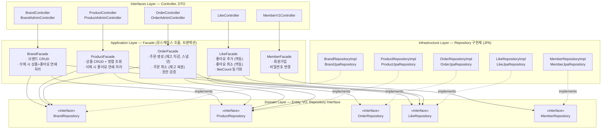
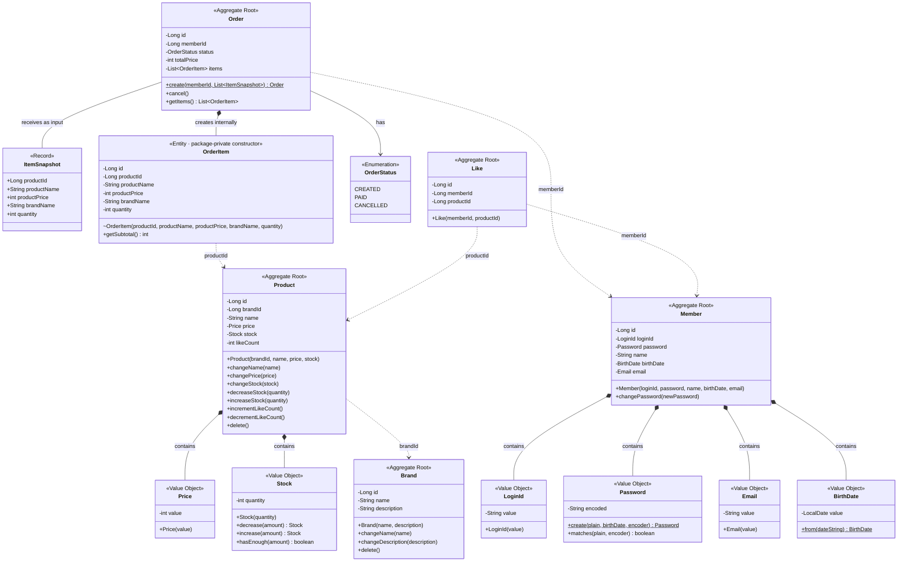

# 클래스 다이어그램

## 1. 개요

이커머스 플랫폼의 도메인 모델을 DDD 관점에서 설계한다.

### 다이어그램 읽는 법

| 표기 | 의미 |
|------|------|
| `<<Aggregate Root>>` | 해당 Aggregate의 진입점. 외부에서는 이 객체를 통해서만 접근 |
| `<<Entity>>` | 고유 식별자를 가지는 객체. Aggregate 내부에서만 존재 |
| `<<Value Object>>` | 불변 객체. 값으로만 비교하며 식별자 없음 |
| `<<Enumeration>>` | 열거형. 미리 정의된 상수 집합 |
| `*--` (컴포지션) | 생명주기를 함께하는 강한 포함 관계 |
| `..>` (점선 화살표) | ID 참조. Aggregate 간 느슨한 결합 |

---

## 2. 레이어드 아키텍처



### 의존 방향

```
Interfaces → Application → Domain ← Infrastructure
```

- Domain은 다른 레이어에 의존하지 않는다
- Infrastructure가 Domain의 Repository 인터페이스를 구현한다 (DIP)

### Facade별 책임

| Facade | 주요 책임 | 의존하는 Repository |
|--------|----------|-------------------|
| BrandFacade | 브랜드 CRUD, 삭제 시 상품+좋아요 연쇄 처리 | Brand, Product, Like |
| ProductFacade | 상품 CRUD, 정렬 조회, 삭제 시 좋아요 연쇄 처리 | Product, Brand, Like |
| OrderFacade | 주문 생성(재고 차감+스냅샷), 취소(재고 복원), 권한 검증 | Order, Product, Brand |
| LikeFacade | 좋아요 추가/취소(멱등), likeCount 동기화 | Like, Product |
| MemberFacade | 회원가입, 비밀번호 변경 | Member |

---

## 3. Aggregate 구조 개요

```
┌─────────────────┐   ┌─────────────────┐   ┌─────────────────┐   ┌─────────────────┐   ┌─────────────────┐
│   Brand Agg     │   │  Product Agg    │   │   Order Agg     │   │   Like Agg      │   │  Member Agg     │
├─────────────────┤   ├─────────────────┤   ├─────────────────┤   ├─────────────────┤   ├─────────────────┤
│ Brand (Root)    │   │ Product (Root)  │   │ Order (Root)    │   │ Like (Root)     │   │ Member (Root)   │
│                 │   │ ├ Price (VO)    │   │ ├ OrderItem     │   │                 │   │ ├ LoginId (VO)  │
│                 │   │ └ Stock (VO)    │   │ ├ ItemSnapshot  │   │                 │   │ ├ Password (VO) │
│                 │   │                 │   │ └ OrderStatus   │   │                 │   │ ├ Email (VO)    │
│                 │   │                 │   │                 │   │                 │   │ └ BirthDate(VO) │
└─────────────────┘   └─────────────────┘   └─────────────────┘   └─────────────────┘   └─────────────────┘
        │                     │                     │                     │
        └─────────────────────┼─────────────────────┼─────────────────────┘
                              │                     │
                      brandId (ID 참조)      memberId, productId (ID 참조)
```

---

## 4. 전체 클래스 다이어그램



---

## 5. Aggregate 라이프사이클 통제

### 원칙

> Aggregate Root가 자식의 생성/삭제를 통제한다.
> 외부에서 자식 Entity를 직접 생성할 수 없어야 한다.

### 점검 결과

| Aggregate Root | 자식 | 관계 | 통제 방식 | 판정 |
|---|---|---|---|---|
| **Order** | OrderItem | `@OneToMany` Entity | `Order.create(ItemSnapshot)` + package-private 생성자 | **완벽** |
| **Product** | Price, Stock | `@Embedded` VO | 불변 VO, 생성자 자기검증 | **정상** (VO는 통제 대상 아님) |
| **Member** | LoginId 등 | `@Embedded` VO | 불변 VO, 생성자 자기검증 | **정상** (VO는 통제 대상 아님) |

### Order Aggregate 상세

```
외부 (OrderFacade)              Order Aggregate 내부
┌────────────────────┐          ┌─────────────────────────────────┐
│                    │          │                                 │
│  ItemSnapshot ─────┼────▶     Order.create(snapshots)          │
│  (데이터만 전달)    │          │    └─▶ new OrderItem(...)       │
│                    │          │         (package-private)       │
│  new OrderItem() ──┼──✕──▶   │                                 │
│  (컴파일 에러)      │          │                                 │
└────────────────────┘          └─────────────────────────────────┘
```

- Facade는 `Order.ItemSnapshot`(데이터)만 전달
- OrderItem 생성은 `Order.create()` 내부에서만 발생
- OrderItem 생성자가 package-private이라 외부 패키지에서 직접 생성 불가

### VO는 왜 통제 대상이 아닌가

| 구분 | Entity (OrderItem) | Value Object (Price, Stock) |
|------|-------------------|---------------------------|
| 식별자 | 있음 (ID) | 없음 (값 동등성) |
| 가변성 | 상태 변경 가능 | 불변 |
| 라이프사이클 | 부모와 함께 | 없음 (값일 뿐) |
| 통제 필요성 | **필수** — 부모 없이 존재하면 안 됨 | **불필요** — 어디서 만들든 같은 값 |

---

## 6. 연관관계 방향

| 관계 | 방향 | 참조 방식 |
|------|------|----------|
| Product → Brand | 단방향 | `brandId` (ID 참조) |
| Order → Member | 단방향 | `memberId` (ID 참조) |
| Order → OrderItem | Aggregate 내부 | 객체 참조 (`@OneToMany`) |
| OrderItem → Product | 단방향 | `productId` (ID 참조, 스냅샷) |
| Like → Member | 단방향 | `memberId` (ID 참조) |
| Like → Product | 단방향 | `productId` (ID 참조) |

**원칙**:
- **Aggregate 간 참조는 ID로**: 다른 Aggregate의 Root Entity를 직접 참조하지 않음
- **Aggregate 내부는 객체 참조**: Order와 OrderItem은 같은 Aggregate

---

## 7. 잠재 리스크

| 리스크 | 현재 상태 | 대응 방안 |
|--------|----------|----------|
| **Stock VO 동시성** | 단순 decrease 메서드 | 락이 없으면 동시 주문 시 재고 불일치. DB 레벨 락 필요 |
| **Aggregate 경계 넘는 참조** | ID로만 참조 | 성능을 위해 Join이 필요하면 읽기 전용 Query 모델 분리 고려 |
| **OrderItem 목록 크기** | 제한 없음 | 한 주문에 너무 많은 상품 시 트랜잭션 비대화. 최대 개수 제한 권장 |
| **likeCount와 실제 Like 수 불일치** | 트랜잭션 동기화 | 장애 상황에서 불일치 가능. 주기적 배치 보정 필요 |
| **Order 상태 전이** | 단순 enum + cancel() 검증 | 복잡해지면 상태 머신 패턴 또는 이벤트 소싱 고려 |
