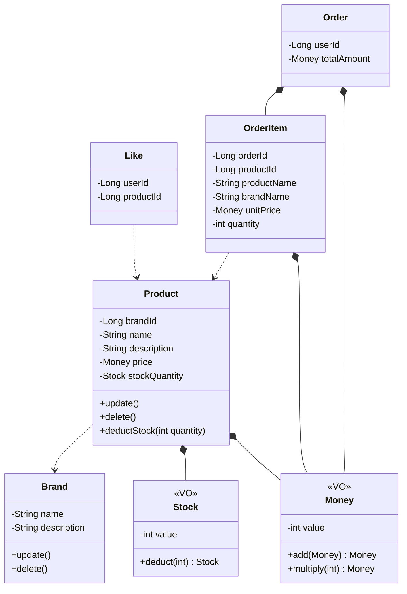

# Class Diagram

### 객체 책임

| 객체 | 책임 |
| --- | --- |
| Brand | 브랜드 정보 수정, 삭제 상태 변경 |
| Product | 상품 정보 수정, 삭제 상태 변경, 재고 차감 |
| Like | 사용자-상품 간 관심 표시 |
| Order | 주문 항목 구성, 총액 계산 |
| OrderItem | 주문 시점 상품 정보 스냅샷 보존 |
| Money | 금액 검증, 덧셈/곱셈 연산 |
| Stock | 재고 검증, 차감 |

### VO 설계 기준

| VO | 독립적 의미 단위 | 현재 분리 실익 | 이유 |
| --- | --- | --- | --- |
| Money | O (금액) | O | 가격 수정 시 0 이상 검증, 주문 총액 계산(add, multiply) |
| Stock | O (재고 수량) | O | 재고 차감 시 부족 여부 검증, 음수 방지 |

**기준**: 독립적 의미 단위이면서 현재 분리 실익이 있을 때만 VO로 분리한다.