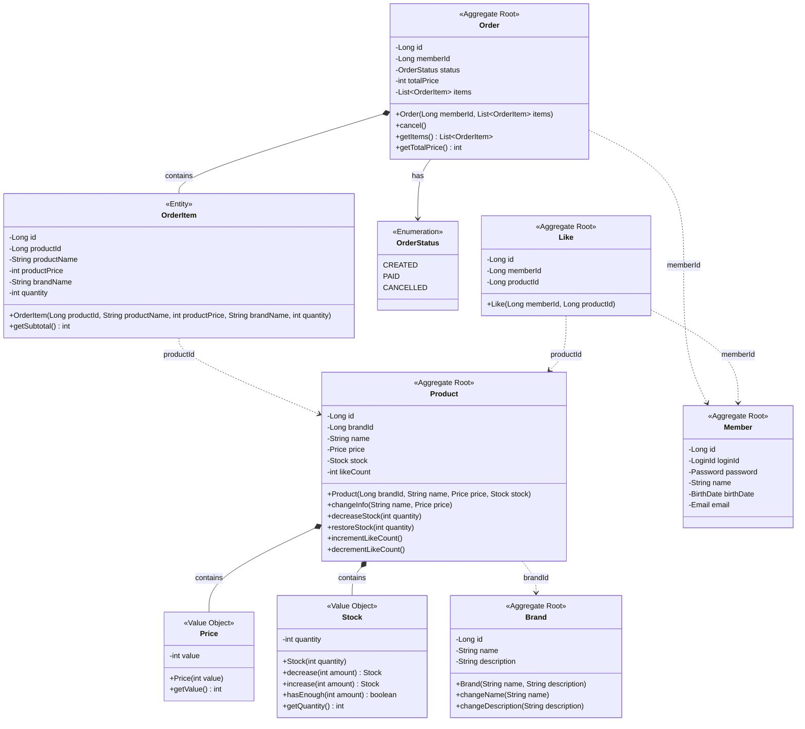
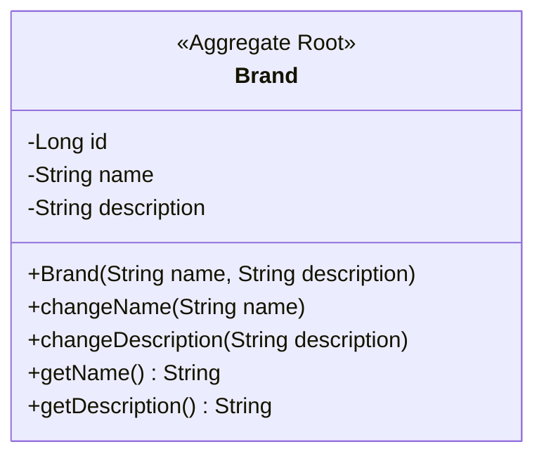
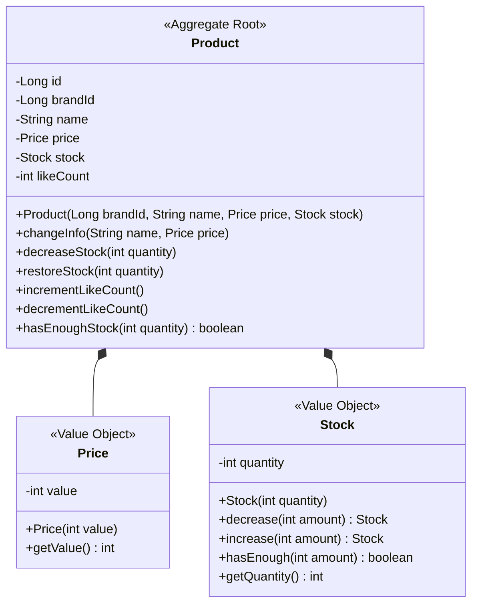
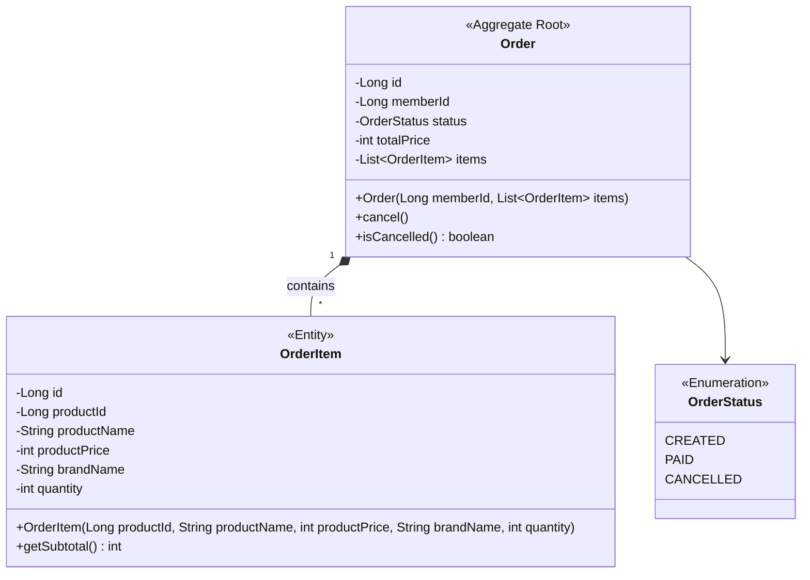
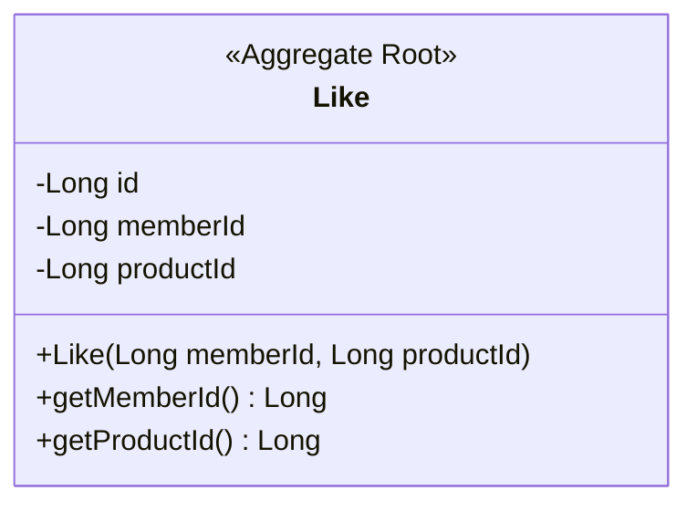

# 클래스 다이어그램

## 1. 개요

이커머스 플랫폼의 도메인 모델을 DDD 관점에서 설계한다.

### 다이어그램 읽는 법

| 표기 | 의미 |
|------|------|
| `<<Aggregate Root>>` | 해당 Aggregate의 진입점. 외부에서는 이 객체를 통해서만 접근 |
| `<<Entity>>` | 고유 식별자를 가지는 객체. Aggregate 내부에서만 존재 |
| `<<Value Object>>` | 불변 객체. 값으로만 비교하며 식별자 없음 |
| `<<Enumeration>>` | 열거형. 미리 정의된 상수 집합 |
| `*--` (컴포지션) | 생명주기를 함께하는 강한 포함 관계 |
| `..>` (점선 화살표) | ID 참조. Aggregate 간 느슨한 결합 |

---

## 2. Aggregate 구조 개요

```
┌─────────────────┐   ┌─────────────────┐   ┌─────────────────┐   ┌─────────────────┐
│   Brand Agg     │   │  Product Agg    │   │   Order Agg     │   │   Like Agg      │
├─────────────────┤   ├─────────────────┤   ├─────────────────┤   ├─────────────────┤
│ Brand (Root)    │   │ Product (Root)  │   │ Order (Root)    │   │ Like (Root)     │
│                 │   │ - Price (VO)    │   │ - OrderItem     │   │                 │
│                 │   │ - Stock (VO)    │   │ - OrderStatus   │   │                 │
└─────────────────┘   └─────────────────┘   └─────────────────┘   └─────────────────┘
       │                     │                     │                     │
       └─────────────────────┼─────────────────────┼─────────────────────┘
                             │                     │
                     brandId (ID 참조)      productId (ID 참조)
```

---

## 3. 전체 클래스 다이어그램



---

## 4. Aggregate별 상세 설계

### 4.1 Brand Aggregate



**설계 포인트**:
- 단순한 Aggregate, VO 없이 Entity만 존재
- `name`: 필수값, 비어있으면 생성 실패
- Soft Delete는 `BaseEntity.delete()` 사용

---

### 4.2 Product Aggregate



**설계 포인트**:

| 요소 | 설계 | 이유 |
|------|------|------|
| `Price` | VO | 불변성, 음수 방지 검증 캡슐화 |
| `Stock` | VO | 불변성, 차감/복원 로직 캡슐화 |
| `brandId` | ID 참조 | Aggregate 간 참조는 ID로 |
| `likeCount` | 비정규화 | 정렬 성능 우선 |

**Price VO**:
```java
public record Price(int value) {
    public Price {
        if (value <= 0) {
            throw new CoreException(ErrorType.BAD_REQUEST, "가격은 0보다 커야 합니다.");
        }
    }
}
```

**Stock VO**:
```java
public record Stock(int quantity) {
    public Stock {
        if (quantity < 0) {
            throw new CoreException(ErrorType.BAD_REQUEST, "재고는 0 이상이어야 합니다.");
        }
    }

    public Stock decrease(int amount) {
        if (!hasEnough(amount)) {
            throw new CoreException(ErrorType.BAD_REQUEST, "재고가 부족합니다.");
        }
        return new Stock(this.quantity - amount);
    }

    public Stock increase(int amount) {
        return new Stock(this.quantity + amount);
    }

    public boolean hasEnough(int amount) {
        return this.quantity >= amount;
    }
}
```

---

### 4.3 Order Aggregate



**설계 포인트**:

| 요소 | 설계 | 이유 |
|------|------|------|
| `OrderItem` | Entity (Order 내부) | 별도 lifecycle 없이 Order와 함께 생성/삭제 |
| `productId` | 원본 ID 유지 | 상품 페이지 이동, 재주문 기능용 (삭제 시 404 허용) |
| `totalPrice` | Order에 저장 | 매번 계산하지 않고 저장 (불변) |

**스냅샷 필드** (`productName`, `productPrice`, `brandName`):
- 판단 기준: "주문 상세 화면을 독립적으로 렌더링할 수 있는가?"
- 원본 상품이 변경/삭제되어도 주문 상세 페이지가 깨지지 않고 온전하게 표시되어야 함
- `imageUrl` 제외: 현재 상품 스펙에 이미지 필드 없음 (오버엔지니어링 방지)

**Order 생성 시 totalPrice 계산**:
```java
public class Order extends BaseEntity {
    private int totalPrice;
    private List<OrderItem> items;

    public Order(Long memberId, List<OrderItem> items) {
        this.memberId = memberId;
        this.items = new ArrayList<>(items);
        this.totalPrice = calculateTotalPrice();
        this.status = OrderStatus.CREATED;
    }

    private int calculateTotalPrice() {
        return items.stream()
            .mapToInt(OrderItem::getSubtotal)
            .sum();
    }
}
```

---

### 4.4 Like Aggregate



**설계 포인트**:
- 매우 단순한 Aggregate
- `memberId + productId` 조합으로 유일성 보장
- Soft Delete 불필요 (Hard Delete)

---

## 5. 연관관계 방향

| 관계 | 방향 | 참조 방식 |
|------|------|----------|
| Product → Brand | 단방향 | `brandId` (ID 참조) |
| Order → Member | 단방향 | `memberId` (ID 참조) |
| Order → OrderItem | 양방향 (Aggregate 내부) | 객체 참조 |
| OrderItem → Product | 단방향 | `productId` (ID 참조) |
| Like → Member | 단방향 | `memberId` (ID 참조) |
| Like → Product | 단방향 | `productId` (ID 참조) |

**원칙**:
- **Aggregate 간 참조는 ID로**: 다른 Aggregate의 Root Entity를 직접 참조하지 않음
- **Aggregate 내부는 객체 참조**: Order와 OrderItem은 같은 Aggregate

---

## 6. 레이어별 책임

```
┌─────────────────────────────────────────────────────────────┐
│                    Presentation Layer                        │
│  Controller, DTO (Request/Response)                          │
└─────────────────────────────────────────────────────────────┘
                              │
                              ▼
┌─────────────────────────────────────────────────────────────┐
│                    Application Layer                         │
│  Service (유스케이스 조율, 트랜잭션 관리)                      │
│  - OrderService, ProductService, LikeService, BrandService  │
└─────────────────────────────────────────────────────────────┘
                              │
                              ▼
┌─────────────────────────────────────────────────────────────┐
│                      Domain Layer                            │
│  Entity, Value Object, Domain Service                        │
│  - Order, OrderItem, Product, Brand, Like                    │
│  - Price, Stock (VO)                                         │
│  - OrderStatus (Enum)                                        │
└─────────────────────────────────────────────────────────────┘
                              │
                              ▼
┌─────────────────────────────────────────────────────────────┐
│                   Infrastructure Layer                       │
│  Repository 구현체, JPA Entity Mapping                       │
│  - OrderRepositoryImpl, ProductRepositoryImpl, ...          │
└─────────────────────────────────────────────────────────────┘
```

---

## 7. Repository 인터페이스

```java
// Domain Layer에 정의
public interface ProductRepository {
    Product save(Product product);
    Optional<Product> findById(Long id);
    List<Product> findAllByDeletedAtIsNull();
    List<Product> findAllByBrandIdAndDeletedAtIsNull(Long brandId);
    void incrementLikeCount(Long productId);
    void decrementLikeCount(Long productId);
}

public interface OrderRepository {
    Order save(Order order);
    Optional<Order> findById(Long id);
    List<Order> findAllByMemberIdAndDeletedAtIsNull(Long memberId);
    List<Order> findAllByMemberIdAndCreatedAtBetween(Long memberId, LocalDateTime startAt, LocalDateTime endAt);
}

public interface LikeRepository {
    Like save(Like like);
    void delete(Like like);
    Optional<Like> findByMemberIdAndProductId(Long memberId, Long productId);
    boolean existsByMemberIdAndProductId(Long memberId, Long productId);
    List<Like> findAllByMemberId(Long memberId);
    void deleteByProductId(Long productId);
    void deleteByBrandId(Long brandId);
}

public interface BrandRepository {
    Brand save(Brand brand);
    Optional<Brand> findById(Long id);
    List<Brand> findAllByDeletedAtIsNull();
}
```

---

## 8. 잠재 리스크

| 리스크 | 현재 상태 | 대응 방안 |
|--------|----------|----------|
| **Stock VO 동시성** | 단순 decrease 메서드 | 락이 없으면 동시 주문 시 재고 불일치. DB 레벨 락 필요 |
| **Aggregate 경계 넘는 참조** | ID로만 참조 | 성능을 위해 Join이 필요하면 읽기 전용 Query 모델 분리 고려 |
| **OrderItem 목록 크기** | 제한 없음 | 한 주문에 너무 많은 상품 시 트랜잭션 비대화. 최대 개수 제한 권장 |
| **like_count와 실제 Like 수 불일치** | 트랜잭션 동기화 | 장애 상황에서 불일치 가능. 주기적 배치 보정 필요 |
| **Order 상태 전이** | 단순 enum | 복잡해지면 상태 머신 패턴 또는 이벤트 소싱 고려 |
