### 1. 클래스 다이어그램 (ERD 기준 정렬본)

**왜 이 다이어그램이 필요한가:**  
ERD를 기준으로 도메인 객체/서비스/리포지토리의 책임을 맞추고, 상태 모델(`display_status`, `sale_status`, soft delete), 주문 스냅샷, 재고 hold, 장바구니 복원 멱등성(`order_cart_restore`)을 일관되게 설계하기 위해 필요하다.

> 정렬 원칙
> - **ERD를 기준**으로 클래스/속성/상태값을 맞춘다.
> - 상품/브랜드의 삭제는 `delYn + deletedAt`(soft delete)로 관리한다.
> - 상품 상태는 `displayStatus`와 `saleStatus`를 분리한다.
> - 주문은 `orderId` 단일 PK 기준으로 모델링한다.

```mermaid
classDiagram
direction LR

%% =========================
%% Core Entities (ERD-aligned)
%% =========================
class User {
  +String userId
  +String passwordHash
  +String userName
  +LocalDate birthday
  +String email
  +String address
  +YesNo delYn
  +LocalDateTime deletedAt
  +LocalDateTime createdAt
  +LocalDateTime updatedAt
}

class Brand {
  +String brandId
  +String brandName
  +String description
  +String address
  +DisplayStatus displayStatus
  +String attachFile
  +YesNo delYn
  +LocalDateTime deletedAt
  +LocalDateTime createdAt
  +LocalDateTime updatedAt
  +hide()
  +activate()
  +softDelete()
  +restore()
}

class Product {
  +String productId
  +Long revisionSeq
  +String brandId
  +String productName
  +String description
  +BigDecimal price
  +String category
  +String color
  +String size
  +String option
  +String imageUrl
  +String attachFile
  +DisplayStatus displayStatus
  +ProductSaleStatus saleStatus
  +YesNo delYn
  +LocalDateTime deletedAt
  +LocalDateTime createdAt
  +LocalDateTime updatedAt
  +updateInfo(...)
  +changeDisplayStatus(status)
  +changeSaleStatus(status)
  +softDelete()
  +restore()
}

class ProductStock {
  +String productId
  +int onHand
  +int reserved
  +YesNo delYn
  +LocalDateTime deletedAt
  +LocalDateTime createdAt
  +LocalDateTime updatedAt
  +availableQty() int
  +canHold(qty) bool
}

class ProductRevision {
  +String productId
  +Long revisionSeq
  +ProductRevisionAction action
  +String changedBy
  +String changeReason
  +Json beforeSnapshot
  +Json afterSnapshot
  +LocalDateTime changedAt
}

class Like {
  +String userId
  +String productId
  +LocalDateTime createdAt
}

class CartItem {
  +String userId
  +String productId
  +int quantity
  +LocalDateTime createdAt
  +LocalDateTime updatedAt
  +changeQuantity(qty)
}

class Order {
  +String orderId
  +String userId
  +OrderType orderType
  +OrderStatus status
  +BigDecimal totalAmount
  +LocalDateTime expiresAt
  +LocalDateTime paidAt
  +YesNo delYn
  +LocalDateTime deletedAt
  +LocalDateTime createdAt
  +LocalDateTime updatedAt
  +cancel()
  +expire()
  +markPaid()
  +markPaymentFailed()
}

class OrderItem {
  +String orderId
  +int orderItemSeq
  +String userId
  +String productId
  +int quantity
  +String snapshotProductName
  +BigDecimal snapshotUnitPrice
  +String snapshotBrandId
  +String snapshotBrandName
  +String snapshotImageUrl
  +YesNo delYn
  +LocalDateTime deletedAt
  +LocalDateTime createdAt
  +LocalDateTime updatedAt
}

class OrderCartRestore {
  +String orderId
  +String userId
  +RestoreReason reason
  +RestoreTriggerSource triggerSource
  +LocalDateTime restoredAt
}

%% =========================
%% Relations (conceptual)
%% =========================
User  "1" --> "0..*" Like : creates
Product "1" --> "0..*" Like : receives

User  "1" --> "0..*" CartItem : owns
Product "1" --> "0..*" CartItem : referenced

Brand   "1" --> "0..*" Product : has
Product "1" --> "1"    ProductStock : has
Product "1" --> "0..*" ProductRevision : hasHistory

User  "1" --> "0..*" Order : places
Order "1" *-- "1..*" OrderItem : contains
Order "1" --> "0..1" OrderCartRestore : restoredOnce

%% =========================
%% Info DTOs (domain 패키지에 위치)
%% =========================
class UserInfo {
  <<record>>
  +from(UserModel) UserInfo
}

class BrandInfo {
  <<record>>
  +from(BrandModel) BrandInfo
}

class ProductInfo {
  <<record>>
  +from(ProductModel, ProductStockModel) ProductInfo
}

class LikeInfo {
  <<record>>
  +from(LikeModel) LikeInfo
}

class CartInfo {
  <<record>>
  +from(CartItemModel, ProductModel, BrandModel, ProductStockModel) CartInfo
}

class OrderInfo {
  <<record>>
  +from(OrderModel, List~OrderItemModel~) OrderInfo
}

class StatsInfo {
  <<record>>
  +from(집계결과) StatsInfo
}

%% =========================
%% Services — 단순 도메인 (Controller가 직접 호출)
%% =========================
class UserService {
  +register(loginId, rawPw, ...) UserInfo
  +authenticate(loginId, rawPw) UserInfo
  +getMyInfo(loginId) UserInfo
  +changePassword(loginId, currentPw, newPw)
}

class BrandService {
  +createBrand(...) BrandInfo
  +updateBrand(...) BrandInfo
  +softDeleteBrand(brandId)
  +findVisibleById(brandId) BrandInfo
  +findAllVisible(keyword, page) List~BrandInfo~
}

class LikeService {
  +addLike(userId, productId)
  +removeLike(userId, productId)
  +getMyLikes(userId) List~LikeInfo~
  +countByProductId(productId) long
}

class StatsService {
  +getOverview(startAt,endAt) StatsInfo
  +getDailyOrderStats(startAt,endAt) StatsInfo
  +getTopLikedProducts(startAt,endAt,limit) StatsInfo
  +getTopOrderedProducts(startAt,endAt,limit) StatsInfo
  +getLowStock(threshold,limit) StatsInfo
}

%% =========================
%% Services — 복잡한 도메인 (Facade 경유)
%% =========================
class ProductService {
  +createProduct(...) ProductInfo
  +updateProduct(...) ProductInfo
  +findById(productId) ProductModel
  +findOrderableById(productId) ProductModel
  +findAllForCustomer(filters) List~ProductModel~
  +softDeleteProduct(productId)
  +softDeleteByBrandId(brandId)
  +getRevisions(productId) List
}

class StockService {
  +hold(productId, qty) bool
  +release(productId, qty) bool
  +commit(productId, qty) bool
}

class CartService {
  +getCart(userId) List~CartInfo~
  +addItem(userId, productId, qty)
  +removeItem(userId, productId)
  +changeQty(userId, productId, qty)
  +deletePurchasedItems(userId, orderId)
  +restoreFromOrder(orderId)
}

class OrderService {
  +createDirectOrder(userId, items) OrderInfo
  +createCartOrder(userId, items) OrderInfo
  +cancelOrder(userId, orderId) OrderInfo
  +expireOrder(orderId)
  +getOrders(userId, period) List~OrderInfo~
  +getOrderDetail(userId, orderId) OrderInfo
}

%% =========================
%% Facades — 복잡한 도메인만 (3개)
%% =========================
class ProductFacade {
  +getProductDetail(productId) ProductInfo
  +listProducts(filters) List~ProductInfo~
  +createProduct(...) ProductInfo
  +updateProduct(...) ProductInfo
  +deleteProduct(productId)
}

class CartFacade {
  +getCart(loginId, loginPw) List~CartInfo~
  +addItem(loginId, loginPw, productId, qty)
  +changeQty(loginId, loginPw, productId, qty)
  +removeItem(loginId, loginPw, productId)
}

class OrderFacade {
  +createDirectOrder(loginId, loginPw, items) OrderInfo
  +createCartOrder(loginId, loginPw, selectedIds) OrderInfo
  +cancelOrder(loginId, loginPw, orderId) OrderInfo
  +getOrders(loginId, loginPw, period) List~OrderInfo~
  +getOrderDetail(loginId, loginPw, orderId) OrderInfo
}

class PaymentService {
  +completePayment(orderId, paymentTxId)
  +failPayment(orderId, reason)
}

%% Facade 의존
ProductFacade ..> ProductService
ProductFacade ..> StockService
ProductFacade ..> BrandService

CartFacade ..> CartService
CartFacade ..> UserService
CartFacade ..> ProductService
CartFacade ..> StockService

OrderFacade ..> OrderService
OrderFacade ..> UserService
OrderFacade ..> ProductService
OrderFacade ..> StockService
OrderFacade ..> CartService

PaymentService ..> OrderService
PaymentService ..> StockService
PaymentService ..> CartService

%% Service → Repository 의존
UserService ..> UserRepository
BrandService ..> BrandRepository
ProductService ..> ProductRepository
ProductService ..> ProductRevisionRepository
ProductService ..> BrandService
StockService ..> StockRepository
LikeService ..> LikeRepository
LikeService ..> ProductService
CartService ..> CartRepository
CartService ..> ProductService
CartService ..> StockService
CartService ..> BrandService
OrderService ..> OrderRepository
OrderService ..> OrderItemRepository
OrderService ..> OrderCartRestoreRepository
OrderService ..> StockService
OrderService ..> CartService
StatsService ..> StatsRepository

%% =========================
%% Repositories
%% =========================
class UserRepository
class BrandRepository
class ProductRepository
class StockRepository
class ProductRevisionRepository
class LikeRepository
class CartRepository
class OrderRepository
class OrderItemRepository
class OrderCartRestoreRepository
class PaymentRepository

%% =========================
%% Enums / Value Objects
%% =========================
class YesNo {
  <<enumeration>>
  Y
  N
}

class DisplayStatus {
  <<enumeration>>
  ACTIVE
  HIDDEN
}

class ProductSaleStatus {
  <<enumeration>>
  ON_SALE
  TEMP_SOLD_OUT
  STOPPED
}

class OrderType {
  <<enumeration>>
  DIRECT
  CART
}

class OrderStatus {
  <<enumeration>>
  PENDING_PAYMENT
  PAID
  PAYMENT_FAILED
  CANCELLED
  EXPIRED
}

class ProductRevisionAction {
  <<enumeration>>
  CREATE
  UPDATE
  HIDE
  SALE_STATUS_CHANGE
  DELETE
  RESTORE
}

class RestoreReason {
  <<enumeration>>
  USER_CANCELLED
  PAYMENT_FAILED
  EXPIRED
  PG_CANCELLED
}

class RestoreTriggerSource {
  <<enumeration>>
  CANCEL_API
  PG_WEBHOOK
  EXPIRE_JOB
  MANUAL
}

class UnavailableReason {
  <<enumeration>>
  DELETED
  HIDDEN
  STOPPED
  TEMP_SOLD_OUT
  OUT_OF_STOCK
  INVALID_QUANTITY
}

class Json
```

---

### 설계 메모 (ERD 기준)

- `Product.displayStatus`와 `Product.saleStatus`를 분리해 **노출 상태**와 **판매 상태**의 의미 충돌을 방지한다.
- soft delete는 `delYn + deletedAt`를 함께 사용하되, **정합성 규칙**은 아래와 같이 고정한다.
    - `delYn = N` -> `deletedAt = null`
    - `delYn = Y` -> `deletedAt != null`
- `Product.revisionSeq`는 **현재 버전 포인터**, `ProductRevision`은 **변경 이력 누적 저장소** 역할을 가진다.
- `OrderCartRestore`는 "바로주문 실패/만료/취소 후 장바구니 복원"의 **멱등 보장**을 위한 안전장치다.
    - 구현 시에는 `order_cart_restore` 기록을 먼저 생성(중복 체크)한 뒤 `cart_items` 복원을 수행한다.
- `UnavailableReason`는 DB 컬럼이 아니라, `displayStatus / saleStatus / delYn+deletedAt / product_stocks(onHand,reserved)`를 기반으로 서비스가 계산하는 응답 코드다.

### 설계 메모 (Facade 개선 — [07-facade-analysis.md](./07-facade-analysis.md))

- **Info DTO는 `domain/` 패키지에 위치**한다. Service가 직접 Info를 반환하여, 단순 도메인(User, Brand, Like, Stats)은 Facade 없이 Controller → Service 직접 호출이 가능하다.
- **Facade는 여러 서비스 조합이 필요한 경우에만 사용**한다: `ProductFacade`(3개 서비스), `CartFacade`(4개 서비스), `OrderFacade`(5개 서비스).
- 의존 방향: `Controller → domain/Info` (interfaces → domain 방향으로 정상), `Controller → domain/Model` (금지 — Entity 노출 금지).
