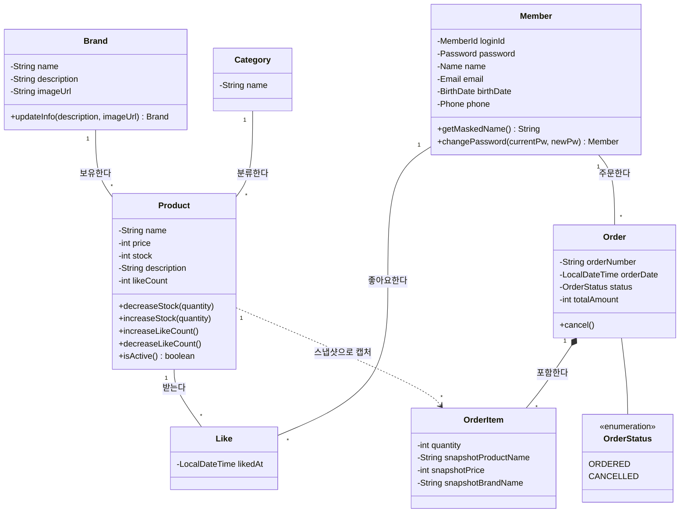

# 클래스 다이어그램

핵심 도메인 엔티티의 책임 분배와 관계 방향을 검증한다. 비즈니스 로직이 Service가 아닌 엔티티에 적절히 위치하는지, OrderItem의 스냅샷 패턴이 Product와 올바르게 분리되었는지, 도메인 간 의존 방향이 올바른지 확인한다.

## 클래스 다이어그램

## 핵심 포인트

- **불변 도메인 객체**: 기존 Member가 record 기반 불변 객체 + Value Object(MemberId, Password, Name, Email, BirthDate) 패턴으로 구현되어 있다. 새 도메인도 동일 패턴 적용.
- **엔티티에 비즈니스 로직 배치**: Product.decreaseStock(), Order.cancel() 등 상태 변경 로직이 Service가 아닌 엔티티 자체에 위치하여 빈약한 도메인 방지.
- **스냅샷 분리 (점선)**: OrderItem은 Product의 런타임 참조를 갖지 않는다. 주문 시점의 상품명/가격/브랜드명을 스냅샷 필드로 복사하여 Product 변경/삭제에 영향받지 않음.
- **Like = 조인 엔티티**: Member-Product 간 N:M 관계를 Like 엔티티로 풀어낸다. DB에서 (memberId + productId) Unique 제약조건으로 중복 방지.
- **Brand.name 불변**: updateInfo()는 description, imageUrl만 수정 가능. name은 생성 시 확정.
- **Category는 Seed 데이터**: 비즈니스 메서드 없음. 조회 전용 참조 테이블.

## 설계 리스크

- **Product 상태 변경의 동시성**: decreaseStock(), increaseLikeCount() 등이 동시 호출될 때 경합 발생 가능. 엔티티 레벨에서는 검증만 수행하고, 동시성 제어는 인프라(DB 락/조건부 UPDATE)에서 해결.
- **OrderItem 스냅샷 필드 확장**: 현재 상품명/가격/브랜드명 3개. 향후 카테고리, 이미지 등 스냅샷 대상이 늘어나면 OrderItem이 비대해질 수 있다. 현재 요구사항에서는 3개로 충분.
