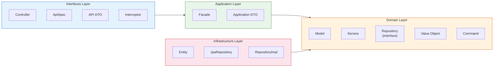
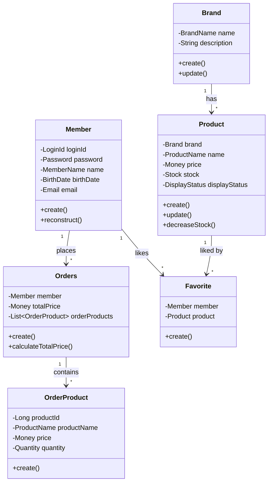

# 04. 아키텍처 설계

---

## 1. 레이어 구조



---

## 2. 의존성 방향

```
interfaces → application → domain ← infrastructure
```

- **상위 계층은 하위 계층에만 의존**한다.
- **도메인 계층은 어디에도 의존하지 않는다** (순수 비즈니스 로직).
- **인프라 계층은 도메인 계층에 의존**한다 (의존성 역전 원칙).

---

## 3. 레이어별 책임과 데이터 변환 흐름

### Interfaces Layer
- HTTP 요청/응답 처리, Swagger 문서 정의
- 주요 클래스: Controller, ApiSpec, API DTO, Interceptor
- **API DTO → Application DTO 변환**: Controller에서 `ApiReqDto.toDto()` 호출
- **Application DTO → API DTO 변환**: Controller에서 `ApiResDto.from(appDto)` 호출

### Application Layer
- 여러 Service를 조합하여 유스케이스 처리, 트랜잭션 경계 설정
- 주요 클래스: Facade, Application DTO
- **Application DTO → VO/Command 변환**: Facade에서 `reqDto.toCommand()` 호출하여 도메인 객체로 변환

### Domain Layer
- 비즈니스 로직 수행, 도메인 규칙 검증
- 주요 클래스: Model, Service, Repository(interface), VO, Command
- **VO 자기 검증**: VO 생성 시점에 유효성 자동 검증 (예: `new Email("...")`)
- **Model 생성**: `Model.create(VO...)` 팩토리 메서드로 도메인 객체 생성

### Infrastructure Layer
- 데이터베이스 연동, 도메인 Repository 인터페이스 구현
- 주요 클래스: Entity, JpaRepository, RepositoryImpl
- **Model → Entity 변환**: RepositoryImpl에서 `Entity.toEntity(model)` 호출하여 저장
- **Entity → Model 변환**: RepositoryImpl에서 `entity.toModel()` 호출하여 조회 결과 반환

### 전체 데이터 변환 흐름

```
[요청] API DTO → Application DTO → VO/Command → Model → Entity → DB
[응답] DB → Entity → Model → Application DTO → API DTO
```

---

## 4. 도메인 구성



| 도메인 | Value Objects | 삭제 방식 | 비고 |
|--------|--------------|----------|------|
| **Member** | `LoginId`, `Password`, `Email`, `MemberName`, `BirthDate` | Soft Delete | 비밀번호 BCrypt 암호화 |
| **Brand** | `BrandName` | Soft Delete | 삭제 시 연관 상품도 삭제 |
| **Product** | `ProductName`, `Money`, `Stock`, `DisplayStatus` | Soft Delete | Brand 연관 |
| **Order** | `Quantity` | Soft Delete | 주문 시점 상품 스냅샷 저장 |
| **Favorite** | - | **Hard Delete** | 유일하게 물리 삭제 |

---

## 5. 주요 설계 원칙

### 원칙 1: VO 자기 검증
값 객체는 생성 시점에 스스로 유효성을 검증한다. VO가 존재하는 것 자체가 유효한 값임을 보장한다.

### 원칙 2: 의존성 역전 (DIP)
도메인 계층에 인터페이스를 정의하고, 인프라 계층에서 구현한다.
- `Repository` (interface) → `RepositoryImpl` (구현체)
- `PasswordEncryptor` (interface) → `BcryptPasswordEncryptor` (구현체)

### 원칙 3: 레이어 단일 책임
각 레이어는 자신만의 고유 책임을 가지며, 동일 작업이 여러 레이어에서 반복되지 않는다.

| 레이어 | 책임 |
|--------|------|
| Controller | HTTP 요청/응답 처리 |
| Facade | 유스케이스 흐름 조합, DTO ↔ VO 변환 |
| Service | 도메인 비즈니스 로직, 트랜잭션 |
| Repository | 데이터 접근(CRUD)만 |

### 원칙 4: Soft Delete
`BaseEntity.delete()` 호출로 `deletedAt` 타임스탬프를 설정하고, `@SQLRestriction("deleted_at IS NULL")`으로 조회 시 자동 필터링한다. Favorite만 예외적으로 Hard Delete.

### 원칙 5: 관리자 인증 분리
`AdminAuthInterceptor` + `WebMvcConfig`로 `/api/v1/admin/**` 경로에 대한 인증을 횡단 관심사로 처리한다. 개별 컨트롤러 메서드에서 인증 로직을 중복하지 않는다.

---

## 6. 패키지 구조

```
com.loopers
├── interfaces/api/           ← Interfaces Layer
│   ├── member/
│   │   ├── MemberV1Controller
│   │   ├── MemberV1ApiSpec
│   │   └── dto/ (API DTO)
│   ├── brand/
│   ├── product/
│   ├── order/
│   ├── favorite/
│   ├── support/ (Interceptor, WebMvcConfig)
│   ├── ApiResponse
│   └── ApiControllerAdvice
│
├── application/              ← Application Layer
│   ├── member/
│   │   ├── MemberFacade
│   │   └── dto/ (Application DTO)
│   ├── brand/
│   ├── product/
│   ├── order/
│   └── favorite/
│
├── domain/                   ← Domain Layer
│   ├── member/
│   │   ├── model/ (Member, MemberCommand)
│   │   ├── service/ (MemberService, PasswordEncryptor)
│   │   ├── repository/ (MemberRepository)
│   │   └── vo/ (LoginId, Password, Email, ...)
│   ├── brand/
│   ├── product/
│   ├── order/
│   └── favorite/
│
├── infrastructure/           ← Infrastructure Layer
│   ├── member/
│   │   ├── entity/ (MemberEntity)
│   │   ├── repository/ (MemberJpaRepository)
│   │   │   └── impl/ (MemberRepositoryImpl)
│   │   └── BcryptPasswordEncryptor
│   ├── brand/
│   ├── product/
│   ├── order/
│   └── favorite/
│
└── support/                  ← 공통 지원
    └── error/ (CoreException, ErrorType)
```
