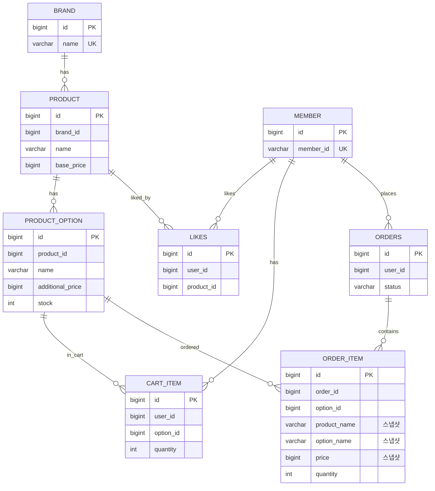

# 04. ERD (Entity Relationship Diagram)

---

## 1. 전체 ERD

> 모든 관계선은 **논리적 연결**이며, 물리적 FK 제약조건은 적용하지 않음

---

## 2. 삭제 정책

| 테이블 | 삭제 방식 | 이유 |
|--------|----------|------|
| BRAND | Soft Delete | 이력 보존, Product와 논리적 연결 유지 |
| PRODUCT | Soft Delete | 주문 내역에서 참조 가능성 |
| PRODUCT_OPTION | Soft Delete | 주문 내역에서 참조 가능성 |
| **LIKES** | **Hard Delete** | 이력 보존 가치 낮음, 토글 로직 단순화 |
| CART_ITEM | Hard Delete | 임시 데이터 |
| ORDERS | 삭제 불가 | 거래 이력 필수 보존 |
| ORDER_ITEM | 삭제 불가 | 거래 이력 필수 보존 |

---

## 3. 스냅샷 정책

**ORDER_ITEM**은 주문 시점의 상품명, 옵션명, 가격을 복사 저장한다.
원본(Product, Option)이 변경/삭제되어도 주문 내역은 그대로 유지된다.
