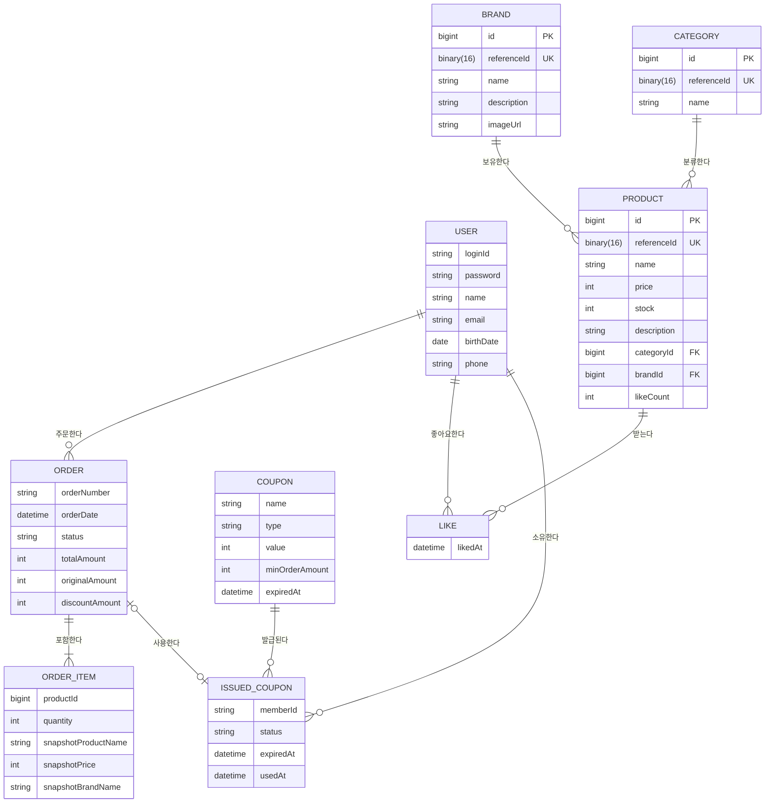

# ERD (논리적 관계)

## ERD

## 핵심 포인트
- **Like = Member-Product N:M 조인 엔티티**: Member와 Product 간 N:M 관계를 Like 엔티티로 풀어냈다. DB에서 (memberId + productId) Unique 제약조건으로 중복 방지. Like 자체에 비즈니스 속성은 없으므로 속성 블록을 생략했다.
- **식별자 분리 전략**: Product/Category/Brand는 내부 조인/인덱스를 위해 `bigint PK`를 사용하고, 외부 노출 및 API 경로 식별자는 `referenceId(UUID)`를 사용한다.
- **OrderItem 스냅샷 비정규화**: OrderItem은 Product와 FK 관계가 없다. 다만 `productId`를 논리 참조로 함께 저장해 역추적성을 확보하고, 주문 시점의 상품명/가격/브랜드명은 스냅샷으로 고정한다. ERD에서 Product-OrderItem 간 관계선이 없는 이유.
- **Order-OrderItem 컴포지션**: Order 삭제 시 OrderItem도 함께 삭제되는 강한 소유 관계. 최소 1개 이상의 OrderItem이 필요하다 (`||--|{`).
- **쿠폰 모델 분리**: 쿠폰 정책(COUPON)과 개인 보유 쿠폰(ISSUED_COUPON)을 분리해 소유권/상태 전이를 표현한다.
- **ERD 만료 정책(B안)**: ISSUED_COUPON의 상태는 `AVAILABLE`/`USED`만 저장하고, 만료는 `expiredAt` 비교로 판단한다.

## 엔티티 삭제 전략
| 엔티티 | 삭제 전략 | 이유 |
|--------|-----------|------|
| USER | Soft Delete | 주문/좋아요 이력 참조 및 감사 추적 필요 |
| BRAND | Soft Delete | 상품 이력 참조 정합성 유지 필요 |
| CATEGORY | Soft Delete | 상품 분류 이력 및 참조 무결성 유지 필요 |
| PRODUCT | Soft Delete | 주문 스냅샷 및 좋아요 이력과의 추적성 유지 |
| ORDER | Soft Delete | 감사/정산 목적 보관 필요 |
| ORDER_ITEM | Soft Delete | 주문 감사 추적 일관성 유지 |
| COUPON | Soft Delete | 과거 발급/사용 이력 추적 필요 |
| ISSUED_COUPON | Soft Delete | 주문 이력 정합성 및 감사 추적 필요 |
| LIKE | Hard Delete | 사용자 취소 가능한 임시 관계 데이터 |

## 설계 리스크
- **likeCount 비정규화**: Product.likeCount는 Like 테이블의 COUNT와 동기화되어야 한다. 좋아요 등록/취소 시 별도 트랜잭션에서 업데이트하므로, 일시적 불일치 가능성 있음. 선택지: (A) 현재 설계 유지 + 주기적 보정 배치 (B) likeCount 제거하고 매번 COUNT 쿼리.
- **OrderItem-Product 논리 참조**: `productId`는 FK 없이 보관하므로 삭제된 상품에 대해 조인 무결성은 강제되지 않는다. 조회/리포트 로직은 `productId` 미해결 케이스를 허용하도록 설계해야 한다.
- **쿠폰 단일 사용 경쟁 조건**: ISSUED_COUPON 상태 전이(AVAILABLE->USED)는 동시 요청에서 경쟁이 발생할 수 있다. 상태 조건 업데이트 + 제약조건으로 보장해야 한다.
- **만료 판정 일관성**: ERD는 B안(시간 기반)이라 `EXPIRED` 상태를 저장하지 않는다. 조회 계층에서 `now > expiredAt && status=AVAILABLE`이면 EXPIRED로 해석한다.
