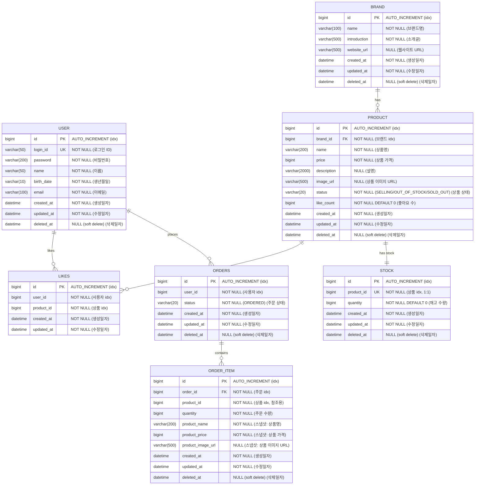

## ERD

영속성 구조와 관계, 인덱스 전략을 검증하기 위해 작성합니다. 특히 상품 목록의 다중 정렬 요구사항과 검색 요구사항에 대한 인덱스 설계, 좋아요의 멱등성 보장을 위한 복합 유니크 키, 주문 스냅샷의 독립성, Stock 분리에 따른 락 범위 최소화가 핵심 포인트입니다.

## 인덱스 전략 (좋아요 & 주문)

| 테이블 | 인덱스 | 유형 | 컬럼 | 용도 |
|--------|--------|------|------|------|
| LIKES | `uk_likes_user_product` | UNIQUE | `(user_id, product_id)` | 멱등성 보장. 동일 사용자가 같은 상품에 중복 좋아요 방지 |
| LIKES | `idx_likes_user_id` | INDEX | `(user_id)` | 좋아요 목록 조회 성능 (유니크 키의 선행 컬럼이므로 별도 인덱스 불필요할 수 있음) |
| STOCK | `uk_stock_product_id` | UNIQUE | `(product_id)` | 상품 1:1 관계 보장 |
| ORDERS | `idx_orders_user_id` | INDEX | `(user_id)` | 사용자별 주문 목록 조회 |
| ORDERS | `idx_orders_user_created` | INDEX | `(user_id, created_at)` | 기간 필터 + 사용자별 조회 |
| ORDER_ITEM | `idx_order_item_order_id` | INDEX | `(order_id)` | 주문별 항목 조회 |

## 설계 포인트

### 1. LIKES 테이블 — hard delete 채택

LIKES는 BaseEntity의 `deletedAt` 패턴을 따르지 않는다. 좋아요 취소 시 레코드를 물리적으로 삭제(hard delete)한다.

**이유**: soft delete 적용 시 복합 유니크 키에 `deletedAt`을 포함해야 하는데, 이는 좋아요 → 취소 → 재좋아요 흐름에서 유니크 키 충돌 문제를 야기한다. hard delete로 단순화하면 `(user_id, product_id)` 유니크 키만으로 멱등성을 보장할 수 있다.

### 2. ORDER_ITEM.product_id — FK 미설정

`product_id`는 원본 상품 추적용 참조 ID일 뿐, FK 제약을 설정하지 않는다.

**이유**: 주문 스냅샷은 주문 시점의 상품 정보를 독립적으로 보존하는 것이 목적. 상품이 soft delete되어도 주문 이력은 영향받지 않아야 한다. 스냅샷 필드(product_name, product_price, product_image_url)가 원본 상품과 무관하게 보존된다.

### 3. STOCK 분리 — 락 범위 최소화

Stock을 Product 내 필드가 아닌 별도 테이블로 분리한다.

**이유**: 주문 시 재고 차감은 비관적 락(`SELECT FOR UPDATE`)을 사용하는데, Product에 stock 필드를 두면 좋아요(likeCount 비관적 락)와 주문(stock 비관적 락)이 같은 행에서 경합한다. 분리하면 두 락이 독립적으로 동작한다.

### 4. ORDERS 기간 인덱스

사용자 주문 목록은 `startAt`, `endAt` 기간 필터를 지원하므로 `(user_id, created_at)` 복합 인덱스를 설정한다.

### 5. ProductStatus 확장

기존 `SELLING`, `SOLD_OUT`에 `OUT_OF_STOCK`이 추가된다.

| 상태 | 의미 | 전환 주체 |
|------|------|----------|
| SELLING | 판매 중 | 기본 상태, 재입고 시 자동 복원 |
| OUT_OF_STOCK | 일시적 품절 | 재고 0 시 자동 전환 (StockService) |
| SOLD_OUT | 영구 판매 중지 | 어드민 수동 설정 |