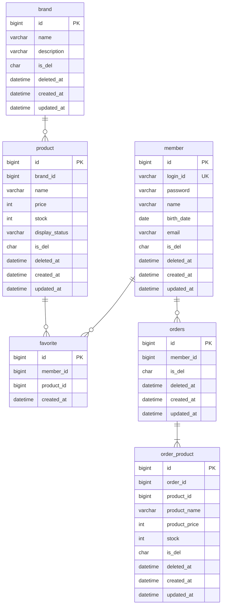

# 04. ERD

---

## 전체 테이블 구조

**핵심 포인트:**

- **FK 미사용**: 모든 테이블 간 FK 제약을 설정하지 않으며, 데이터 정합성은 애플리케이션 레벨(Service)에서 관리한다.
- **Soft Delete**: `favorite`를 제외한 모든 테이블은 `is_del`(char)과 `deleted_at`(datetime) 컬럼으로 논리 삭제를 처리한다.
  - `is_del`: 삭제 여부 플래그, `deleted_at`: 삭제 시점 기록 (BaseEntity 제공).
  - `favorite`는 등록/취소가 빈번하므로 물리 삭제(hard delete)로 처리한다.
- **데이터 정합성**:
  - `favorite` 테이블에 `(member_id, product_id)` 유니크 제약을 설정하여 중복 좋아요를 방지한다.
  - `member.login_id`에 유니크 제약을 설정한다.
  - 브랜드 삭제 시 해당 브랜드의 상품도 함께 soft delete 처리한다.
- **스냅샷 패턴**:
  - `order_product`는 주문 시점의 상품 정보(`product_name`, `product_price`, `stock`)를 스냅샷으로 저장한다.
  - `order_product.product_id`는 원본 상품 참조용이며, 상품 삭제와 무관하게 주문 이력을 보존한다.
- **관계**:
  - `brand : product` = 1:N (하나의 브랜드에 여러 상품)
  - `member : favorite : product` = N:M (중간 테이블로 풀어냄)
  - `member : orders` = 1:N (한 회원이 여러 주문)
  - `orders : order_product` = 1:N (하나의 주문에 하나 이상의 주문 상품)
