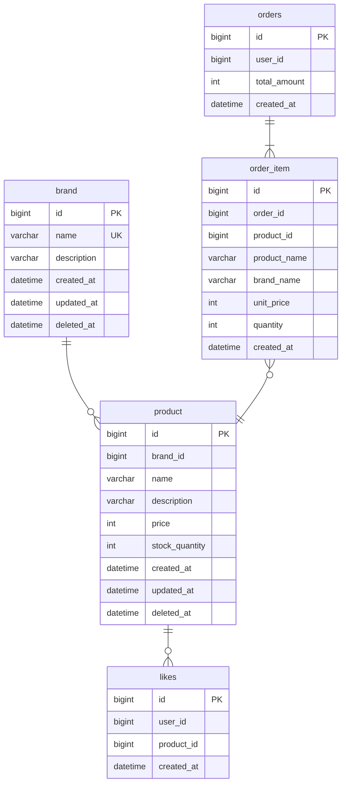

# Entity Relationship Diagram

### 연관 관계

> 모든 관계는 논리적 연관이며, 물리적 FK 제약조건은 적용하지 않는다.
> 참조 무결성은 애플리케이션 레벨에서 보장한다.

### 삭제 정책

| 테이블 | 삭제 방식 | deleted_at | 이유 |
| --- | --- | --- | --- |
| brand | Soft Delete | O | 이력 보존, 하위 상품 연쇄 삭제 |
| product | Soft Delete | O | 주문 스냅샷 참조 안전성 |
| likes | Hard Delete | X | 이력 보존 가치 없음 |
| orders | 삭제 불가 | X | 정산, CS, 법적 보관 의무 |
| order_item | 삭제 불가 | X | 스냅샷 불변 |

### 제약 조건

| 테이블 | 제약 | 컬럼 | 설명 |
| --- | --- | --- | --- |
| likes | UNIQUE | user_id, product_id | 1인 1좋아요 보장 |