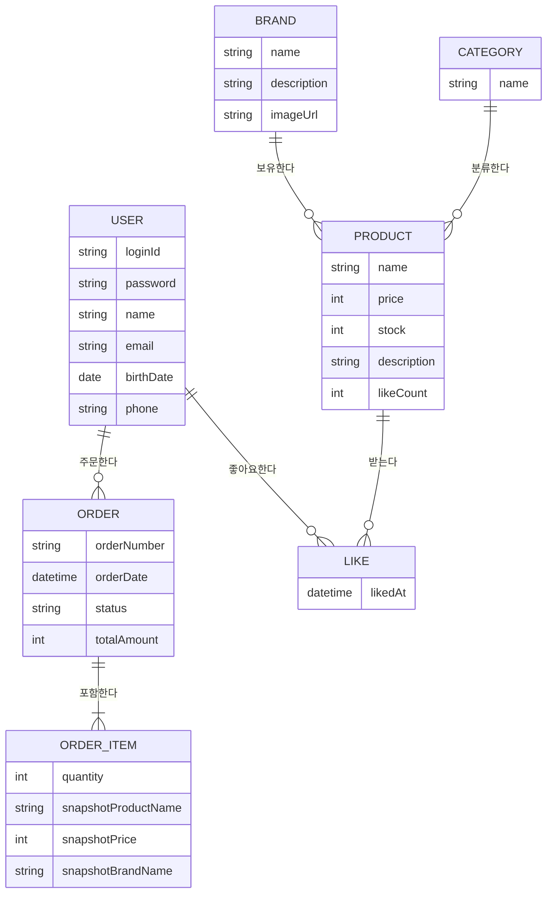

# ERD (논리적 관계)

## ERD

## 핵심 포인트
- **Like = Member-Product N:M 조인 엔티티**: Member와 Product 간 N:M 관계를 Like 엔티티로 풀어냈다. DB에서 (memberId + productId) Unique 제약조건으로 중복 방지. Like 자체에 비즈니스 속성은 없으므로 속성 블록을 생략했다.
- **OrderItem 스냅샷 비정규화**: OrderItem은 Product와 FK 관계가 없다. 주문 시점의 상품명/가격/브랜드명을 자체 필드에 복사하여, Product 변경/삭제에 영향받지 않는 독립적 데이터로 존재한다. ERD에서 Product-OrderItem 간 관계선이 없는 이유.
- **Order-OrderItem 컴포지션**: Order 삭제 시 OrderItem도 함께 삭제되는 강한 소유 관계. 최소 1개 이상의 OrderItem이 필요하다 (`||--|{`).

## 엔티티 삭제 전략
| 엔티티 | 삭제 전략 | 이유 |
|--------|-----------|------|
| USER | Soft Delete | 주문/좋아요 이력 참조 및 감사 추적 필요 |
| BRAND | Soft Delete | 상품 이력 참조 정합성 유지 필요 |
| CATEGORY | Soft Delete | 상품 분류 이력 및 참조 무결성 유지 필요 |
| PRODUCT | Soft Delete | 주문 스냅샷 및 좋아요 이력과의 추적성 유지 |
| ORDER | Soft Delete | 감사/정산 목적 보관 필요 |
| ORDER_ITEM | Soft Delete | 주문 감사 추적 일관성 유지 |
| LIKE | Hard Delete | 사용자 취소 가능한 임시 관계 데이터 |

## 설계 리스크
- **likeCount 비정규화**: Product.likeCount는 Like 테이블의 COUNT와 동기화되어야 한다. 좋아요 등록/취소 시 별도 트랜잭션에서 업데이트하므로, 일시적 불일치 가능성 있음. 선택지: (A) 현재 설계 유지 + 주기적 보정 배치 (B) likeCount 제거하고 매번 COUNT 쿼리.
- **OrderItem-Product 참조 부재**: 스냅샷 패턴으로 런타임 참조가 없으므로, "이 주문 항목이 어떤 상품이었는지" 역추적이 스냅샷 필드(상품명)에 의존한다. 선택지: (A) 현재 설계 유지 (B) productId를 참조용으로 보관 (FK 아닌 논리적 참조).
