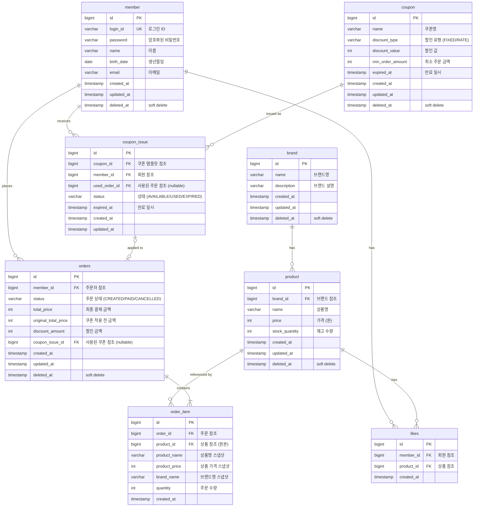

# ERD (Entity Relationship Diagram)

## 1. 개요

이커머스 플랫폼의 핵심 도메인 테이블 구조를 정의한다.

---

## 2. ERD 다이어그램



---

## 3. 테이블 상세 명세

### 3.1 member (회원)

> 1주차에 구현 완료. 참고용으로 포함.

| 컬럼명 | 타입 | 제약조건 | 설명 |
|--------|------|----------|------|
| id | BIGINT | PK, AUTO_INCREMENT | 회원 고유 ID |
| login_id | VARCHAR(50) | UK, NOT NULL | 로그인 ID |
| password | VARCHAR(255) | NOT NULL | 암호화된 비밀번호 |
| name | VARCHAR(50) | NOT NULL | 이름 |
| birth_date | DATE | NOT NULL | 생년월일 |
| email | VARCHAR(100) | NOT NULL | 이메일 |
| created_at | TIMESTAMP | NOT NULL | 생성 일시 |
| updated_at | TIMESTAMP | NOT NULL | 수정 일시 |
| deleted_at | TIMESTAMP | NULL | 삭제 일시 (soft delete) |

---

### 3.2 brand (브랜드)

| 컬럼명 | 타입 | 제약조건 | 설명 |
|--------|------|----------|------|
| id | BIGINT | PK, AUTO_INCREMENT | 브랜드 고유 ID |
| name | VARCHAR(100) | NOT NULL | 브랜드명 |
| description | VARCHAR(500) | NULL | 브랜드 설명 |
| created_at | TIMESTAMP | NOT NULL | 생성 일시 |
| updated_at | TIMESTAMP | NOT NULL | 수정 일시 |
| deleted_at | TIMESTAMP | NULL | 삭제 일시 (soft delete) |

**인덱스**:
- `idx_brand_deleted_at`: deleted_at (목록 조회 시 필터링)

---

### 3.3 product (상품)

| 컬럼명 | 타입 | 제약조건 | 설명 |
|--------|------|----------|------|
| id | BIGINT | PK, AUTO_INCREMENT | 상품 고유 ID |
| brand_id | BIGINT | FK (논리적) | 브랜드 참조 |
| name | VARCHAR(200) | NOT NULL | 상품명 |
| price | INT | NOT NULL, CHECK(price > 0) | 가격 (원) |
| stock_quantity | INT | NOT NULL, DEFAULT 0, CHECK(stock_quantity >= 0) | 재고 수량 |
| created_at | TIMESTAMP | NOT NULL | 생성 일시 |
| updated_at | TIMESTAMP | NOT NULL | 수정 일시 |
| deleted_at | TIMESTAMP | NULL | 삭제 일시 (soft delete) |

**인덱스**:
- `idx_product_brand_id`: brand_id (브랜드별 상품 조회)
- `idx_product_deleted_at`: deleted_at (목록 조회 시 필터링)

**설계 결정**:
- `like_count` 컬럼 제거: UNIQUE 제약 + COUNT(*) 파생 방식으로 전환. 좋아요 추가/삭제 시 Product 행 경합을 원천 제거
- 인기순 정렬은 Application Layer에서 배치 COUNT(GROUP BY) 후 정렬

---

### 3.4 likes (좋아요)

| 컬럼명 | 타입 | 제약조건 | 설명 |
|--------|------|----------|------|
| id | BIGINT | PK, AUTO_INCREMENT | 좋아요 고유 ID |
| member_id | BIGINT | FK (논리적), NOT NULL | 회원 참조 |
| product_id | BIGINT | FK (논리적), NOT NULL | 상품 참조 |
| created_at | TIMESTAMP | NOT NULL | 생성 일시 |

**인덱스**:
- `uk_likes_member_product`: (member_id, product_id) UNIQUE - 중복 좋아요 방지
- `idx_likes_member_id`: member_id (회원별 좋아요 목록 조회)
- `idx_likes_product_id`: product_id (상품별 좋아요 조회)

**설계 결정**:
- Hard Delete 사용 (soft delete 불필요)
- 상품/브랜드 삭제 시 연쇄 삭제

---

### 3.5 orders (주문)

| 컬럼명 | 타입 | 제약조건 | 설명 |
|--------|------|----------|------|
| id | BIGINT | PK, AUTO_INCREMENT | 주문 고유 ID |
| member_id | BIGINT | FK (논리적), NOT NULL | 주문자 참조 |
| status | VARCHAR(20) | NOT NULL | 주문 상태 |
| total_price | INT | NOT NULL, CHECK(total_price >= 0) | 총 주문 금액 |
| original_total_price | INT | NOT NULL, DEFAULT 0 | 쿠폰 적용 전 금액 |
| discount_amount | INT | NOT NULL, DEFAULT 0 | 할인 금액 |
| coupon_issue_id | BIGINT | NULL | 사용된 쿠폰 참조 |
| created_at | TIMESTAMP | NOT NULL | 생성 일시 |
| updated_at | TIMESTAMP | NOT NULL | 수정 일시 |
| deleted_at | TIMESTAMP | NULL | 삭제 일시 (soft delete) |

**인덱스**:
- `idx_orders_member_id`: member_id (회원별 주문 조회)
- `idx_orders_status`: status (상태별 필터링)
- `idx_orders_member_created_at`: (member_id, created_at) (회원별 날짜 범위 조회)

**주문 상태 값**:
| 상태 | 설명 |
|------|------|
| CREATED | 주문 생성됨 (현재는 이게 곧 완료) |
| PAID | 결제 완료 (미래 확장용) |
| CANCELLED | 취소됨 |

---

### 3.6 order_item (주문 항목)

| 컬럼명 | 타입 | 제약조건 | 설명 |
|--------|------|----------|------|
| id | BIGINT | PK, AUTO_INCREMENT | 주문 항목 고유 ID |
| order_id | BIGINT | FK (논리적), NOT NULL | 주문 참조 |
| product_id | BIGINT | FK (논리적), NOT NULL | 상품 참조 (원본) |
| product_name | VARCHAR(200) | NOT NULL | 상품명 **스냅샷** |
| product_price | INT | NOT NULL | 상품 가격 **스냅샷** |
| brand_name | VARCHAR(100) | NOT NULL | 브랜드명 **스냅샷** |
| quantity | INT | NOT NULL, CHECK(quantity > 0) | 주문 수량 |
| created_at | TIMESTAMP | NOT NULL | 생성 일시 |

**인덱스**:
- `idx_order_item_order_id`: order_id (주문별 항목 조회)

**설계 결정 (스냅샷)**:

스냅샷 범위 판단 기준: **"주문 상세 화면을 독립적으로 렌더링할 수 있는가?"**

| 컬럼 | 스냅샷 이유 |
|------|------------|
| `product_name` | 필수. 없으면 주문 상세 화면 성립 불가 |
| `product_price` | 필수. 정산/환불 기준, 금액 증빙 |
| `brand_name` | 권장. 주문 내역 UI에 거의 항상 표시 |

- `image_url` 제외: 현재 상품 스펙에 이미지 필드 없음 (요구사항에 없는 필드를 미리 넣는 건 오버엔지니어링)
- `description` 제외: 주문 상세가 아닌 상품 상세 페이지 영역
- `product_id`는 원본 참조용으로 유지 (상품 페이지 이동, 재주문 기능용. 삭제 시 404 반환은 허용)

---

### 3.7 coupon (쿠폰 템플릿)

| 컬럼명 | 타입 | 제약조건 | 설명 |
|--------|------|----------|------|
| id | BIGINT | PK, AUTO_INCREMENT | 쿠폰 고유 ID |
| name | VARCHAR(100) | NOT NULL | 쿠폰명 |
| discount_type | VARCHAR(20) | NOT NULL | 할인 유형 (FIXED/RATE) |
| discount_value | INT | NOT NULL | 할인 값 |
| min_order_amount | INT | NOT NULL, DEFAULT 0 | 최소 주문 금액 |
| expired_at | TIMESTAMP | NOT NULL | 만료 일시 |
| created_at | TIMESTAMP | NOT NULL | 생성 일시 |
| updated_at | TIMESTAMP | NOT NULL | 수정 일시 |
| deleted_at | TIMESTAMP | NULL | 삭제 일시 (soft delete) |

---

### 3.8 coupon_issue (발급된 쿠폰)

| 컬럼명 | 타입 | 제약조건 | 설명 |
|--------|------|----------|------|
| id | BIGINT | PK, AUTO_INCREMENT | 발급 고유 ID |
| coupon_id | BIGINT | FK (논리적), NOT NULL | 쿠폰 템플릿 참조 |
| member_id | BIGINT | FK (논리적), NOT NULL | 회원 참조 |
| used_order_id | BIGINT | NULL | 사용된 주문 참조 |
| status | VARCHAR(20) | NOT NULL | 상태 (AVAILABLE/USED/EXPIRED) |
| expired_at | TIMESTAMP | NOT NULL | 만료 일시 |
| created_at | TIMESTAMP | NOT NULL | 생성 일시 |
| updated_at | TIMESTAMP | NOT NULL | 수정 일시 |

**인덱스**:
- `idx_coupon_issue_coupon_id`: coupon_id (쿠폰별 발급 내역 조회)
- `idx_coupon_issue_member_id`: member_id (회원별 쿠폰 조회)

**설계 결정**:
- 동시성 제어: 조건부 UPDATE (`WHERE status='AVAILABLE' AND expired_at > now`)로 비관적 락 없이 이중 사용 방지
- status는 DB 컬럼이지만, AVAILABLE 상태에서 만료시간이 지난 경우 조회 시 EXPIRED로 표시 (getEffectiveStatus)

---

## 4. 관계 요약

| 관계 | 카디널리티 | 설명 |
|------|-----------|------|
| member - orders | 1:N | 회원은 여러 주문 가능 |
| member - likes | 1:N | 회원은 여러 좋아요 가능 |
| brand - product | 1:N | 브랜드는 여러 상품 보유 |
| product - likes | 1:N | 상품은 여러 좋아요 받음 |
| product - order_item | 1:N | 상품은 여러 주문에 포함 |
| orders - order_item | 1:N | 주문은 여러 항목 포함 |
| coupon - coupon_issue | 1:N | 쿠폰 템플릿에서 여러 번 발급 |
| member - coupon_issue | 1:N | 회원은 여러 쿠폰 보유 |
| coupon_issue - orders | 1:0..1 | 쿠폰은 최대 1건 주문에 사용 |

---

## 5. FK 제약 정책

| 관계 | FK 제약 | 이유 |
|------|---------|------|
| product → brand | 논리적 (제약 없음) | 브랜드 삭제 시 soft delete, 애플리케이션에서 검증 |
| likes → member/product | 논리적 | 상품 삭제 시 좋아요 연쇄 삭제, 애플리케이션 처리 |
| orders → member | 논리적 | 회원 삭제 시에도 주문 이력 보존 |
| order_item → orders | 논리적 | 주문과 항목은 항상 함께 관리 |
| order_item → product | 논리적 | 스냅샷이 있어 원본 삭제 가능 |
| coupon_issue → coupon | 논리적 | 쿠폰 삭제(soft) 후에도 발급 이력 보존 |
| coupon_issue → member | 논리적 | 회원 삭제 시에도 쿠폰 이력 보존 |
| orders → coupon_issue | 논리적 | 쿠폰 없는 주문도 가능 (nullable) |

**참고**: 대규모 트래픽에서 FK 제약은 데드락, Cascading 이슈를 유발할 수 있어 논리적 관계로 설계. 데이터 정합성은 애플리케이션 레벨에서 보장.

---

## 6. DDL 예시

```sql
-- 브랜드 테이블
CREATE TABLE brand (
    id BIGINT AUTO_INCREMENT PRIMARY KEY,
    name VARCHAR(100) NOT NULL,
    description VARCHAR(500),
    created_at TIMESTAMP NOT NULL DEFAULT CURRENT_TIMESTAMP,
    updated_at TIMESTAMP NOT NULL DEFAULT CURRENT_TIMESTAMP ON UPDATE CURRENT_TIMESTAMP,
    deleted_at TIMESTAMP NULL,
    INDEX idx_brand_deleted_at (deleted_at)
);

-- 상품 테이블
CREATE TABLE product (
    id BIGINT AUTO_INCREMENT PRIMARY KEY,
    brand_id BIGINT NOT NULL,
    name VARCHAR(200) NOT NULL,
    price INT NOT NULL,
    stock_quantity INT NOT NULL DEFAULT 0,
    created_at TIMESTAMP NOT NULL DEFAULT CURRENT_TIMESTAMP,
    updated_at TIMESTAMP NOT NULL DEFAULT CURRENT_TIMESTAMP ON UPDATE CURRENT_TIMESTAMP,
    deleted_at TIMESTAMP NULL,
    INDEX idx_product_brand_id (brand_id),
    INDEX idx_product_deleted_at (deleted_at),
    CONSTRAINT chk_product_price CHECK (price > 0),
    CONSTRAINT chk_product_stock CHECK (stock_quantity >= 0)
);

-- 좋아요 테이블
CREATE TABLE likes (
    id BIGINT AUTO_INCREMENT PRIMARY KEY,
    member_id BIGINT NOT NULL,
    product_id BIGINT NOT NULL,
    created_at TIMESTAMP NOT NULL DEFAULT CURRENT_TIMESTAMP,
    UNIQUE KEY uk_likes_member_product (member_id, product_id),
    INDEX idx_likes_member_id (member_id),
    INDEX idx_likes_product_id (product_id)
);

-- 주문 테이블
CREATE TABLE orders (
    id BIGINT AUTO_INCREMENT PRIMARY KEY,
    member_id BIGINT NOT NULL,
    status VARCHAR(20) NOT NULL,
    total_price INT NOT NULL,
    original_total_price INT NOT NULL DEFAULT 0,
    discount_amount INT NOT NULL DEFAULT 0,
    coupon_issue_id BIGINT NULL,
    created_at TIMESTAMP NOT NULL DEFAULT CURRENT_TIMESTAMP,
    updated_at TIMESTAMP NOT NULL DEFAULT CURRENT_TIMESTAMP ON UPDATE CURRENT_TIMESTAMP,
    deleted_at TIMESTAMP NULL,
    INDEX idx_orders_member_id (member_id),
    INDEX idx_orders_status (status),
    INDEX idx_orders_member_created_at (member_id, created_at),
    CONSTRAINT chk_orders_total_price CHECK (total_price >= 0)
);

-- 주문 항목 테이블
CREATE TABLE order_item (
    id BIGINT AUTO_INCREMENT PRIMARY KEY,
    order_id BIGINT NOT NULL,
    product_id BIGINT NOT NULL,
    product_name VARCHAR(200) NOT NULL,
    product_price INT NOT NULL,
    brand_name VARCHAR(100) NOT NULL,
    quantity INT NOT NULL,
    created_at TIMESTAMP NOT NULL DEFAULT CURRENT_TIMESTAMP,
    INDEX idx_order_item_order_id (order_id),
    CONSTRAINT chk_order_item_quantity CHECK (quantity > 0)
);

-- 쿠폰 템플릿 테이블
CREATE TABLE coupon (
    id BIGINT AUTO_INCREMENT PRIMARY KEY,
    name VARCHAR(100) NOT NULL,
    discount_type VARCHAR(20) NOT NULL,
    discount_value INT NOT NULL,
    min_order_amount INT NOT NULL DEFAULT 0,
    expired_at TIMESTAMP NOT NULL,
    created_at TIMESTAMP NOT NULL DEFAULT CURRENT_TIMESTAMP,
    updated_at TIMESTAMP NOT NULL DEFAULT CURRENT_TIMESTAMP ON UPDATE CURRENT_TIMESTAMP,
    deleted_at TIMESTAMP NULL
);

-- 발급된 쿠폰 테이블
CREATE TABLE coupon_issue (
    id BIGINT AUTO_INCREMENT PRIMARY KEY,
    coupon_id BIGINT NOT NULL,
    member_id BIGINT NOT NULL,
    used_order_id BIGINT NULL,
    status VARCHAR(20) NOT NULL DEFAULT 'AVAILABLE',
    expired_at TIMESTAMP NOT NULL,
    created_at TIMESTAMP NOT NULL DEFAULT CURRENT_TIMESTAMP,
    updated_at TIMESTAMP NOT NULL DEFAULT CURRENT_TIMESTAMP ON UPDATE CURRENT_TIMESTAMP,
    INDEX idx_coupon_issue_coupon_id (coupon_id),
    INDEX idx_coupon_issue_member_id (member_id)
);
```

---

## 7. 잠재 리스크

| 리스크 | 현재 상태 | 대응 방안 |
|--------|----------|----------|
| **FK 제약 없음** | 논리적 관계만 정의 | 데이터 정합성은 애플리케이션에서 보장. 정기적 정합성 체크 배치 필요 |
| **좋아요 COUNT 파생** | COUNT(*) GROUP BY 조회 | 대량 상품 목록 시 쿼리 비용. 배치 COUNT로 최적화 완료, 극단적 트래픽 시 캐시 고려 |
| **soft delete 쿼리 복잡도** | WHERE deleted_at IS NULL 필수 | 조회 쿼리마다 조건 누락 위험. 기본 스코프 또는 뷰 활용 권장 |
| **order_item 스냅샷 중복** | 같은 상품 여러 주문 시 반복 저장 | 데이터 증가. 스냅샷 테이블 분리 또는 압축 고려 (대량 트래픽 시) |
| **인덱스 과다** | 정렬/필터용 여러 인덱스 | 쓰기 성능 저하 가능. 실제 쿼리 패턴 분석 후 최적화 |
| **orders.status VARCHAR** | 문자열 저장 | ENUM 타입으로 변경하거나 코드 테이블 분리 고려 |
| **쿠폰 조건부 UPDATE 경합** | WHERE 조건으로 원자적 처리 | 동일 쿠폰 동시 사용 시 1건만 성공. 실패한 요청은 "이미 사용" 에러 |
