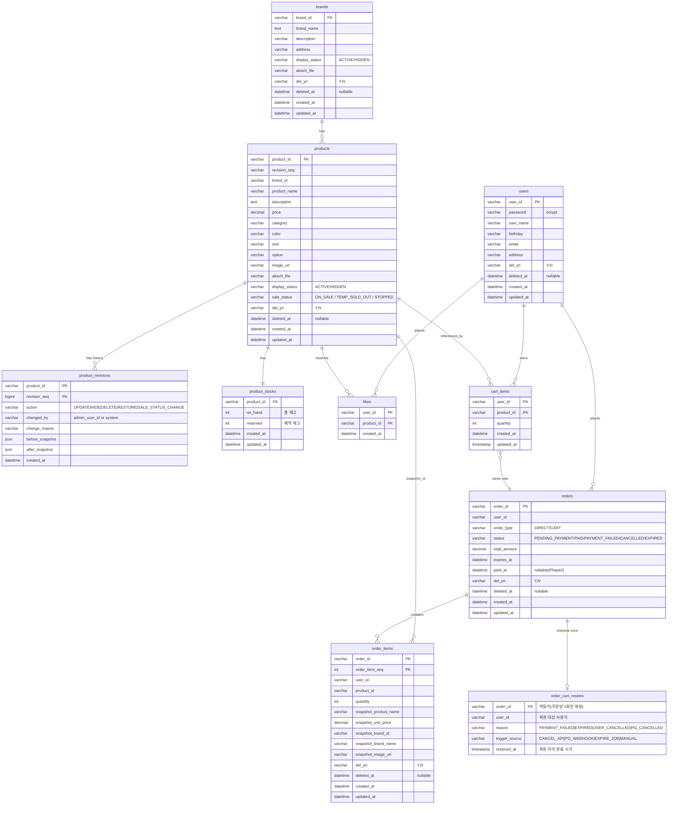

### 4.4 ERD (Entity Relationship Diagram)
### 제약 최소화(복합 PK 중심) 
**왜 이 다이어그램이 필요한가:**
영속성 구조, 관계의 주인, 인덱스 전략을 검증하기 위해 필요하다. 특히 **재고 테이블의 분리**, **주문 만료 인덱스**, **좋아요/장바구니의 복합 PK(중복 방지)** 등 DB 설계의 핵심 결정을 확인한다.

