# 감성 이커머스 MVP 종합 아키텍처 설계서

> **목적**: 프로젝트에 새로 합류한 개발자가 시스템의 "큰 그림"을 빠르게 파악할 수 있도록 아키텍처 관점에서 전체를 조감한다.
> 각 섹션의 상세 내용은 기존 설계 문서를 참조하며, 이 문서는 중복 없이 **요약 + 참조** 형태로 구성한다.

---

## 1. 시스템 개요

### 1.1 프로젝트 목적

"좋아요 → 장바구니 → 주문(결제 대기)" 흐름을 가지는 **감성 이커머스 MVP**를 구현한다. 사용자는 여러 브랜드의 상품을 탐색하고, 좋아요를 남기며, 장바구니 또는 바로 주문을 통해 구매할 수 있다. 관리자는 브랜드/상품 카탈로그를 운영하고 주문 현황을 모니터링한다.

### 1.2 기술 스택 요약

| 구분 | 기술 |
|------|------|
| Language | Java 21 |
| Framework | Spring Boot 3.4.4 |
| Build | Gradle Kotlin DSL (멀티모듈) |
| ORM | Spring Data JPA + QueryDSL |
| DB | MySQL 8.0 |
| Cache | Redis 7.0 (Master-Replica) |
| Messaging | Apache Kafka (KRaft 모드) |
| Monitoring | Micrometer + Prometheus + Grafana |
| Test | JUnit 5 + Mockito + AssertJ + Testcontainers |
| Docs | SpringDoc OpenAPI (Swagger UI) |

### 1.3 범위

- **Phase1 (MVP)**: 회원, 브랜드, 상품, 좋아요, 장바구니, 주문(결제 대기/취소/만료), 관리자 운영, 통계, 만료 배치
- **Phase2 (확장)**: 결제 프로세스(PAID, PAYMENT_FAILED), 쿠폰, 랭킹/추천

### 1.4 C4 Context 다이어그램

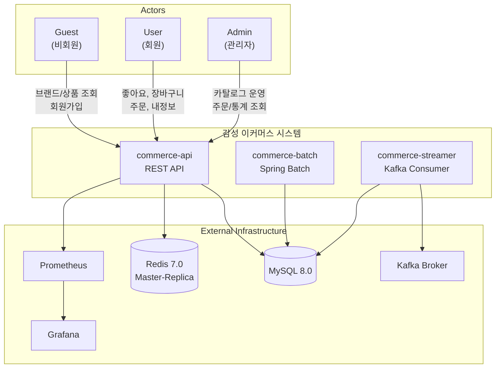

---

## 2. 멀티모듈 구조

### 2.1 3계층 모듈 분류

| 계층 | 모듈 | 책임 | BootJar |
|------|------|------|---------|
| **apps** | `commerce-api` | REST API 서버 (Web, Swagger, Actuator) | O |
| | `commerce-batch` | Spring Batch 배치 잡 | O |
| | `commerce-streamer` | Kafka Consumer 스트리머 | O |
| **modules** | `jpa` | JPA + QueryDSL + MySQL 설정, `BaseEntity`/`BaseStringIdEntity` 제공 | X |
| | `redis` | Spring Data Redis 설정 | X |
| | `kafka` | Spring Kafka 설정 | X |
| **supports** | `jackson` | Jackson 직렬화 설정 | X |
| | `logging` | Logback + Slack Appender 설정 | X |
| | `monitoring` | Micrometer + Prometheus 메트릭 설정 | X |

**규칙**: `apps/*` 모듈만 `BootJar`가 활성화된다. `modules/*`, `supports/*`는 `java-library`로 빌드되어 plain Jar를 생성한다.

### 2.2 모듈 의존성 그래프

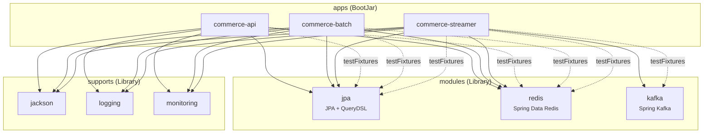

> 점선(-.->)은 `testFixtures` 의존성을 나타낸다. `modules/jpa`와 `modules/redis`는 Testcontainers 기반 테스트 인프라를 testFixtures로 제공한다.

---

## 3. 레이어드 아키텍처 (commerce-api)

### 3.1 4레이어 구조

의존 방향이 **안쪽(domain)을 향하는** 레이어드 아키텍처를 따른다. `domain` 레이어는 어떤 외부 레이어에도 의존하지 않으며, `infrastructure`는 domain이 정의한 인터페이스를 구현한다 (DIP).

**Facade 적용 기준**: 여러 도메인 서비스를 조합(orchestration)하는 경우에만 Facade를 사용한다. 단일 서비스만 호출하는 단순 도메인은 Controller가 Service를 직접 호출한다.

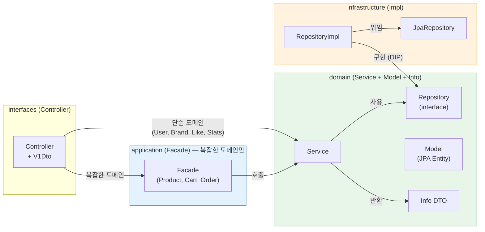

| 구분 | 구조 | 해당 도메인 | 이유 |
|------|------|------------|------|
| **단순 도메인** | Controller → Service (returns Info) → Repository | User, Brand, Like, Stats, Example | Service 1개만 사용, 오케스트레이션 불필요 |
| **복잡한 도메인** | Controller → Facade → 여러 Service → Repository | Product(3), Cart(4), Order(5) | 여러 서비스 조합 필요 |

> 상세 분석은 [07-facade-analysis.md](./07-facade-analysis.md) 참조

### 3.2 각 레이어 역할과 네이밍 컨벤션

| 레이어 | 역할 | 클래스 네이밍 | DTO 네이밍 |
|--------|------|--------------|-----------|
| **interfaces** | HTTP 수신/응답, Bean Validation | `*V1Controller` | `*V1Dto.XxxRequest/Response` |
| **application** | 복잡한 유스케이스 오케스트레이션 (여러 Service 조합), 트랜잭션 경계 | `*Facade` (`@Service`) — **Product, Cart, Order만** | - |
| **domain** | 비즈니스 로직, 엔티티 검증, 리포지토리 인터페이스 정의, **Model → Info 변환** | `*Service`, `*Model`, `*Repository` | `*Info` |
| **infrastructure** | 리포지토리 인터페이스 구현, DB 접근 | `*RepositoryImpl`, `*JpaRepository` | - |

### 3.3 DTO 변환 체인

**단순 도메인** (Controller → Service):
```
V1Dto.Request → (Service 파라미터) → Model(Entity) → Info(domain) → V1Dto.Response
```

**복잡한 도메인** (Controller → Facade → Services):
```
V1Dto.Request → (Facade 파라미터) → 여러 Service 조합 → Model → Info(domain) → V1Dto.Response
```

- **Request DTO**: Bean Validation 어노테이션(`@NotBlank`, `@Size` 등) 적용
- **Response DTO**: `static from(Info)` 팩토리 메서드로 변환
- **Info DTO**: domain 패키지에 위치. Service가 직접 반환하여 domain Model을 외부에 노출하지 않는 역할
- **모든 응답**은 `ApiResponse<T>` record로 래핑

### 3.4 트랜잭션 전략

- **단순 도메인**: Service 클래스 레벨 `@Transactional(readOnly = true)`, 쓰기 메서드 `@Transactional` 오버라이드
- **복잡한 도메인**: Facade 클래스 레벨 `@Transactional(readOnly = true)`, 쓰기 메서드 `@Transactional` 오버라이드 (Facade가 트랜잭션 경계)

---

## 4. 도메인 모델 개요

### 4.1 도메인 요약

| 도메인 | 설명 | 구현 상태 |
|--------|------|-----------|
| **Member** | 회원가입, 내정보 조회, 비밀번호 변경 (레거시) | 기존 구현 (Long PK, BaseEntity) |
| **User** | 회원가입, 내정보 조회, 비밀번호 변경. Like/Cart/Order 등 신규 도메인이 참조 | 신규 (String PK, BaseStringIdEntity) |
| **Brand** | 브랜드 CRUD, 소프트 삭제, display_status 관리 | 신규 (String PK) |
| **Product** | 상품 CRUD, 소프트 삭제, display/sale_status, revision 이력 | 신규 (String PK) |
| **ProductStock** | 재고 관리 (on_hand, reserved), CAS hold/release/commit | 신규 |
| **Like** | 상품 좋아요 등록/취소 (멱등), 복합 PK | 신규 |
| **Cart** | 장바구니 CRUD, 주문 연계 복원, 복합 PK | 신규 |
| **Order** | 주문 생성(DIRECT/CART), 취소, 만료, 스냅샷 저장 | 신규 (String PK) |
| **Stats** | 운영 통계 (주문 현황, 인기 상품, 재고 현황) | 신규 |

### 4.2 도메인 관계도

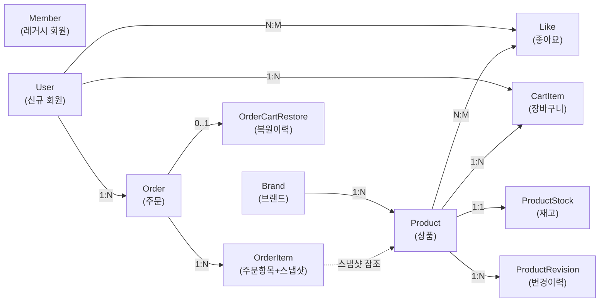

> 상세 ERD는 [04-erd.md](./04-erd.md) 참조

---

## 5. API 아키텍처

### 5.1 API 구분

| 구분 | Prefix | 대상 | 인증 방식 |
|------|--------|------|-----------|
| 고객 API | `/api/v1` | Guest, User | `X-Loopers-LoginId` + `X-Loopers-LoginPw` |
| 관리자 API | `/api-admin/v1` | Admin | `X-Loopers-Ldap: loopers.admin` |

- 인증/인가는 주요 스코프가 아니므로 **헤더 기반 식별**으로 대체
- 유저 본인 리소스는 `/users/me` 형태로 접근 (userId 비노출)

### 5.2 공통 응답 형식

```java
public record ApiResponse<T>(Metadata meta, T data) {
    public record Metadata(Result result, String errorCode, String message) {
        public enum Result { SUCCESS, FAIL }
    }
}
```

- 성공: `{ "meta": { "result": "SUCCESS" }, "data": { ... } }`
- 실패: `{ "meta": { "result": "FAIL", "errorCode": "...", "message": "..." }, "data": null }`

### 5.3 주요 API 엔드포인트 요약

| 메서드 | 엔드포인트 | 설명 | Actor |
|--------|-----------|------|-------|
| POST | `/api/v1/users` | 회원가입 | Guest |
| GET | `/api/v1/users/me` | 내 정보 조회 | User |
| PATCH | `/api/v1/users/me/password` | 비밀번호 변경 | User |
| GET | `/api/v1/brands` | 브랜드 목록 (q 검색) | Guest/User |
| GET | `/api/v1/brands/{brandId}` | 브랜드 상세 | Guest/User |
| GET | `/api/v1/products` | 상품 목록 (q, brandId, sort, page) | Guest/User |
| GET | `/api/v1/products/{productId}` | 상품 상세 | Guest/User |
| POST/DELETE | `/api/v1/products/{productId}/likes` | 좋아요 등록/취소 | User |
| GET | `/api/v1/users/me/likes` | 내 좋아요 목록 | User |
| GET | `/api/v1/cart` | 장바구니 조회 | User |
| POST | `/api/v1/cart/items` | 장바구니 등록 | User |
| PATCH | `/api/v1/cart/items/{productId}` | 장바구니 수량 변경 | User |
| DELETE | `/api/v1/cart/items/{productId}` | 장바구니 삭제 | User |
| POST | `/api/v1/orders` | 주문 생성 (DIRECT/CART) | User |
| GET | `/api/v1/orders` | 주문 목록 (기간 조건) | User |
| GET | `/api/v1/orders/{orderId}` | 주문 상세 (스냅샷 포함) | User |
| POST | `/api/v1/orders/{orderId}/cancel` | 주문 취소 | User |
| CRUD | `/api-admin/v1/brands/**` | 브랜드 운영 | Admin |
| CRUD | `/api-admin/v1/products/**` | 상품 운영 (revision 포함) | Admin |
| GET | `/api-admin/v1/orders/**` | 주문 조회 | Admin |
| GET | `/api-admin/v1/users/{userId}/cart` | 회원 장바구니 조회 | Admin |
| GET | `/api-admin/v1/stats/**` | 운영 통계 | Admin |

### 5.4 인증 요청 흐름

**단순 도메인 (Controller → Service 직접 호출)**:
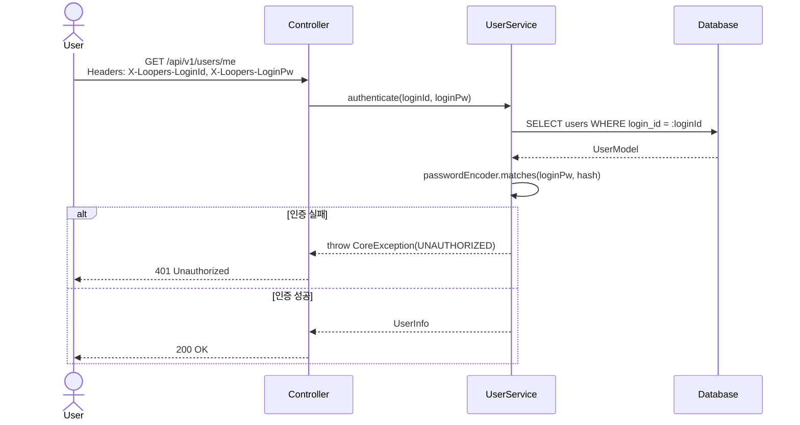

**복잡한 도메인 (Controller → Facade → 여러 Service 조합)**:
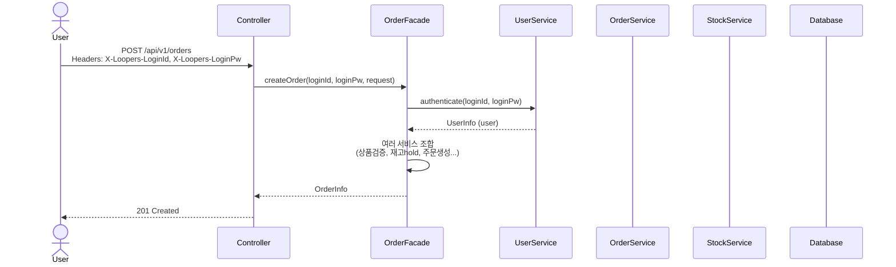

---

## 6. 핵심 설계 패턴

### 6.1 String PK (BaseStringIdEntity)

기존 `BaseEntity`는 `Long` 타입 auto-increment PK를 사용하지만, 신규 도메인은 ERD에 따라 **String(UUID) PK**를 사용한다.

| 항목 | BaseEntity (기존) | BaseStringIdEntity (신규) |
|------|-------------------|--------------------------|
| PK 타입 | `Long` (auto-increment) | `String` (UUID 36자) |
| PK 컬럼명 | `id` (고정) | 서브클래스에서 `@Id @UuidGenerator`로 직접 정의 (user_id, brand_id, product_id, order_id) |
| 삭제 방식 | `deletedAt` 단일 | `del_yn` + `deletedAt` 이중 관리 |
| 생성 전략 | `@GeneratedValue(IDENTITY)` | `@PrePersist`에서 UUID 자동 생성 |
| 적용 대상 | `MemberModel` | User, Brand, Product, Order 등 신규 도메인 |

두 Base 엔티티는 **공존**하며, 기존 Member 도메인은 `BaseEntity`를 유지한다.

### 6.2 CAS 재고 관리

**Compare-And-Set** 패턴의 조건부 UPDATE로 오버셀(초과 판매)을 방지한다. `SELECT ... FOR UPDATE` 대비 락 경합이 적다.

| 연산 | SQL 패턴 | 성공 조건 |
|------|----------|-----------|
| **hold** (예약) | `SET reserved = reserved + :qty WHERE (on_hand - reserved) >= :qty` | affectedRows = 1 |
| **release** (해제) | `SET reserved = reserved - :qty WHERE reserved >= :qty` | affectedRows = 1 |
| **commit** (차감, Phase2) | `SET reserved = reserved - :qty, on_hand = on_hand - :qty WHERE reserved >= :qty` | affectedRows = 1 |

- 다건 주문 시 **productId 오름차순 정렬**로 동일한 락 획득 순서를 보장하여 데드락을 방지한다.
- 하나라도 실패하면 전체 트랜잭션 롤백 (부분 성공 금지)

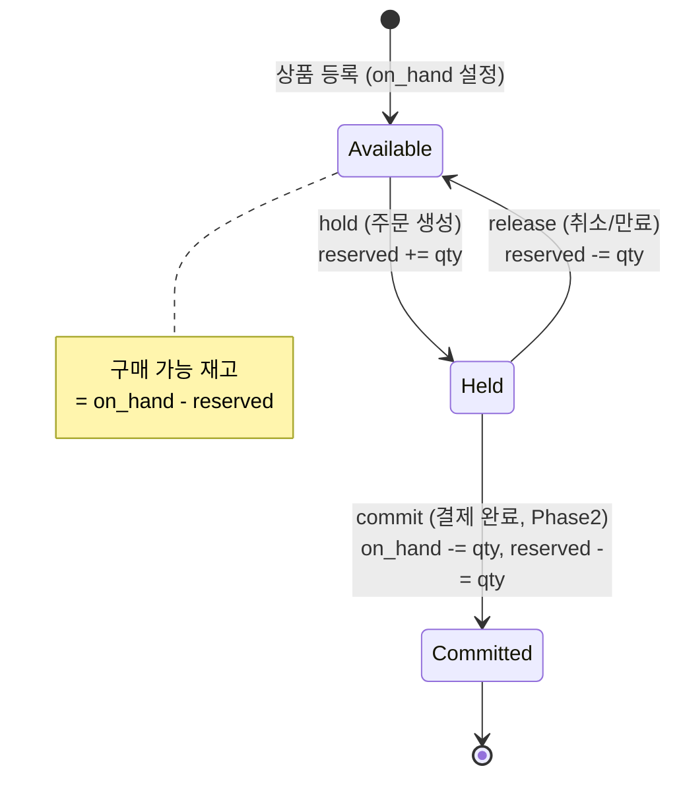

### 6.3 소프트 삭제

브랜드, 상품 등 운영 엔티티는 **소프트 삭제**로 처리하여 과거 주문 내역과 운영 통계를 유지한다.

| 규칙 | 설명 |
|------|------|
| `del_yn='N'` ↔ `deleted_at IS NULL` | 활성 상태 |
| `del_yn='Y'` ↔ `deleted_at IS NOT NULL` | 삭제 상태 |
| 두 컬럼은 **항상 함께** 갱신 | 정합성 보장 |
| 브랜드 삭제 시 | 소속 상품도 **연쇄 소프트 삭제** (정책 A) |
| 고객 조회 | `del_yn='N'` AND `display_status='ACTIVE'` 조건 필수 |
| 장바구니 | 삭제 상품도 항목 반환, `available=false` + `unavailableReason` 제공 |

### 6.4 상품 변경 이력 (ProductRevision)

- `product_revisions` 테이블: **복합 PK** (`product_id` + `revision_seq`)
- `products.revision_seq`: 최신 이력을 가리키는 **포인터**(현재 버전)
- 상품 수정/삭제/복구/판매상태 변경 시 이력 레코드 생성
- `before_snapshot`/`after_snapshot`: JSON 타입으로 변경 전/후 전체 상품 상태 저장
- 관리자 API: `GET /api-admin/v1/products/{productId}/revisions` → 이력 목록/상세 조회

### 6.5 장바구니 복원 멱등성

바로 주문(DIRECT)이 취소/만료되면 주문 품목을 장바구니로 **자동 복원**한다. `order_cart_restore` 테이블의 PK(`order_id`)로 **1회 복원을 보장**한다.

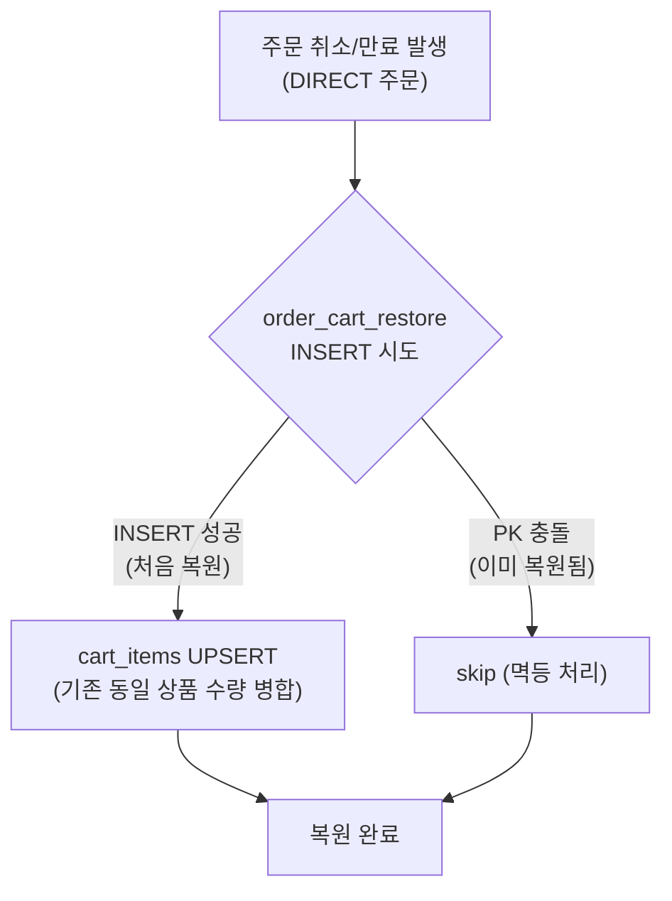

- **CART 주문** 취소/만료 시에는 장바구니 항목을 제거하지 않음 (유지)
- 복원 시 `reason`(USER_CANCELLED, EXPIRED 등)과 `trigger_source`(CANCEL_API, EXPIRE_JOB 등) 기록

### 6.6 주문 상태 머신

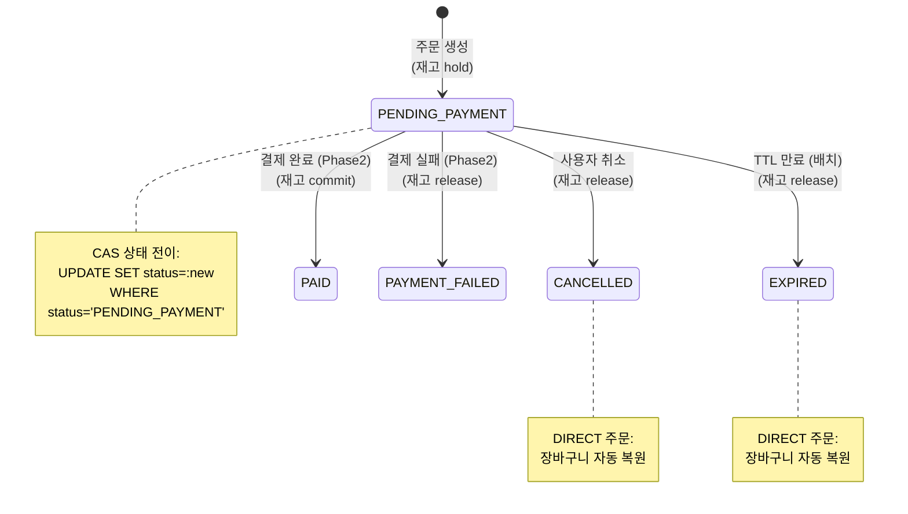

- **MVP 상태**: `PENDING_PAYMENT`, `CANCELLED`, `EXPIRED`
- **Phase2 확장**: `PAID`, `PAYMENT_FAILED`
- 모든 상태 전이는 **CAS(Compare-And-Set)** 패턴으로 경쟁 조건 방지

---

## 7. 에러 처리 아키텍처

### 7.1 에러 처리 흐름

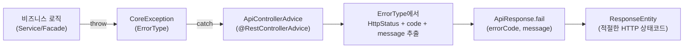

### 7.2 핵심 구성 요소

| 구성 요소 | 역할 |
|-----------|------|
| `CoreException` | 모든 비즈니스 예외의 런타임 예외. `ErrorType`을 필수로 받고, 선택적 `customMessage` 지원 |
| `ErrorType` (enum) | `HttpStatus` + `code`(String) + `message`(String). 도메인별로 확장 |
| `ApiControllerAdvice` | `@RestControllerAdvice`. `CoreException` → `ApiResponse.fail()` 변환. 추가로 타입 불일치, 누락 파라미터, JSON 파싱 오류 등 처리 |

### 7.3 ErrorType 분류 (MVP 확장분)

| 도메인 | ErrorType | HttpStatus |
|--------|-----------|------------|
| User | `USER_NOT_FOUND`, `DUPLICATE_USER_ID` | 404, 409 |
| Brand | `BRAND_NOT_FOUND`, `DUPLICATE_BRAND` | 404, 409 |
| Product | `PRODUCT_NOT_FOUND`, `PRODUCT_NOT_ORDERABLE`, `INVALID_STOCK_UPDATE` | 404, 409, 400 |
| Stock | `STOCK_NOT_ENOUGH` | 409 |
| Like | `LIKE_PRODUCT_NOT_FOUND` | 404 |
| Cart | `CART_ITEM_NOT_FOUND`, `CART_LIMIT_EXCEEDED`, `CART_STOCK_EXCEEDED` | 404, 400, 400 |
| Order | `ORDER_NOT_FOUND`, `ORDER_NOT_CANCELLABLE`, `ORDER_NOT_CREATABLE`, `ORDER_ITEM_EMPTY`, `ORDER_PENDING_LIMIT_EXCEEDED` | 404, 409, 409, 400, 409 |
| Admin | `ADMIN_UNAUTHORIZED` | 401 |

> 기존 범용 에러(`INTERNAL_ERROR`, `BAD_REQUEST`, `NOT_FOUND`, `CONFLICT`) 및 회원 에러(`DUPLICATE_LOGIN_ID`, `UNAUTHORIZED` 등)는 유지

---

## 8. 데이터 흐름도 (핵심 3개 흐름)

> 각 흐름의 상세 시퀀스 다이어그램은 [02-sequencediagram.md](./02-sequencediagram.md) 참조

### 8.1 주문 생성 흐름

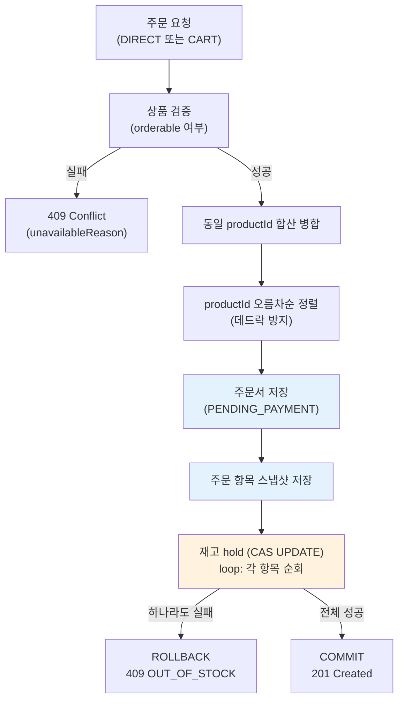

> 검증 → 정렬 → 주문 저장 → 스냅샷 → CAS hold가 **단일 DB 트랜잭션** 내에서 원자적으로 처리된다.

### 8.2 주문 취소 + 장바구니 복원 흐름

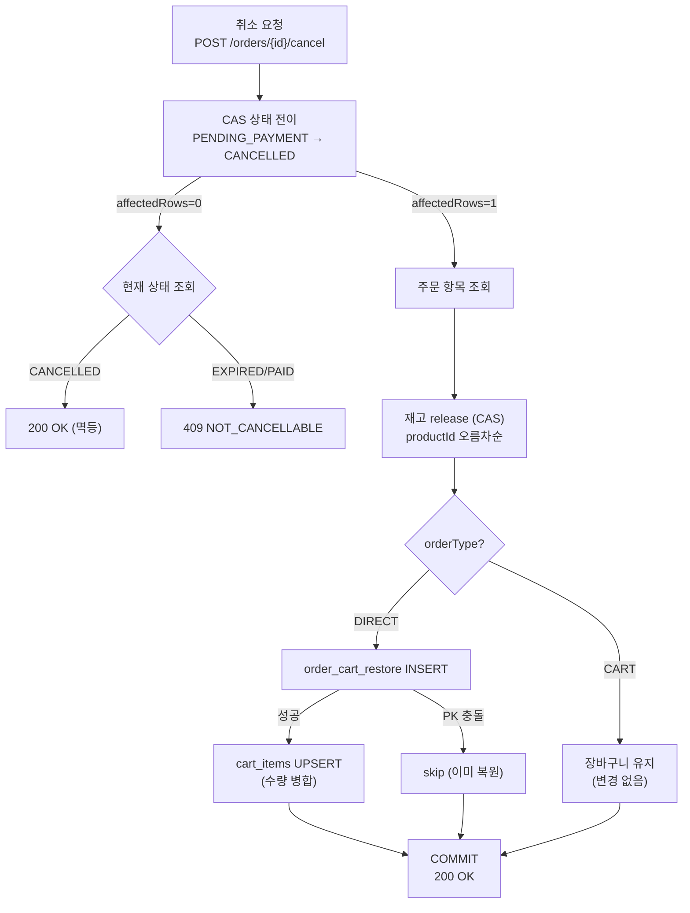

### 8.3 만료 배치 흐름

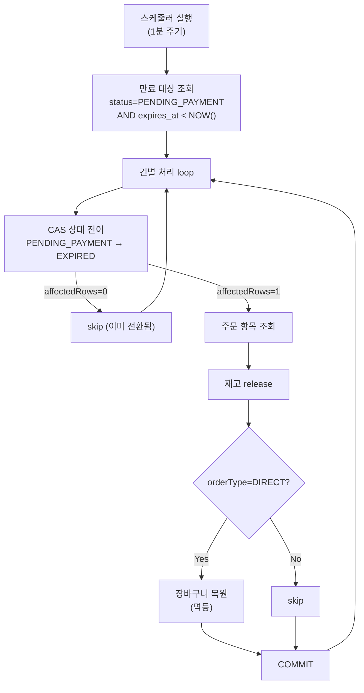

---

## 9. 인프라스트럭처

### 9.1 Docker Compose 구성

| 파일 | 서비스 | 용도 |
|------|--------|------|
| `docker/infra-compose.yml` | MySQL, Redis Master/Replica, Kafka, Kafka UI | 애플리케이션 인프라 |
| `docker/monitoring-compose.yml` | Prometheus, Grafana | 모니터링 |

### 9.2 접속 정보

| 서비스 | 호스트:포트 | 비고 |
|--------|------------|------|
| MySQL | `localhost:3306` | user: application / pw: application / db: loopers |
| Redis Master | `localhost:6379` | 쓰기용 |
| Redis Replica | `localhost:6380` | 읽기 전용 |
| Kafka Broker | `localhost:19092` | 호스트 리스너 |
| Kafka UI | `http://localhost:9099` | 브로커 모니터링 |
| Swagger UI | `http://localhost:8080/swagger-ui.html` | API 문서 |
| Prometheus | `http://localhost:9090` | 메트릭 수집 |
| Grafana | `http://localhost:3000` | admin/admin |

### 9.3 환경 프로파일

| 프로파일 | 용도 | 특이사항 |
|----------|------|----------|
| `local` | 로컬 개발 | Docker Compose 인프라 사용 |
| `test` | 자동화 테스트 | Testcontainers (MySQL, Redis) |
| `dev` | 개발 서버 | - |
| `qa` | QA 서버 | - |
| `prd` | 운영 서버 | - |

### 9.4 인프라 토폴로지

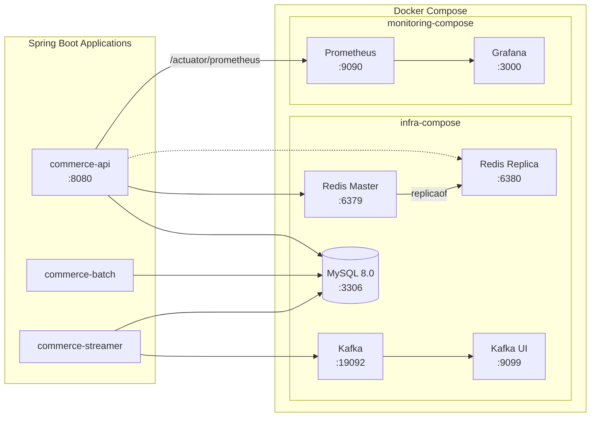

---

## 10. 테스트 전략

### 10.1 테스트 피라미드

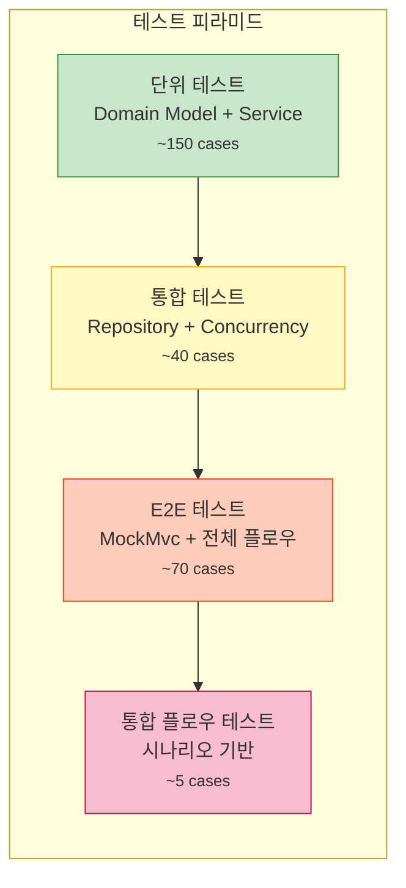

### 10.2 테스트 유형별 패턴

| 유형 | 어노테이션 | 도구 | 특징 |
|------|-----------|------|------|
| **단위 테스트** (`*Test`) | `@ExtendWith(MockitoExtension.class)` | `@Mock`, `@InjectMocks`, AssertJ | 외부 의존성 모킹 |
| **통합 테스트** (`*IntegrationTest`) | `@SpringBootTest` | Testcontainers | 실제 DB/Redis 사용 |
| **E2E 테스트** (`*E2ETest`) | `@SpringBootTest` + `@AutoConfigureMockMvc` + `@Transactional` | MockMvc | 전체 HTTP 요청/응답, 자동 롤백 |
| **리포지토리 테스트** | `@DataJpaTest` | testFixtures | JPA 슬라이스 테스트 |
| **동시성 테스트** | `@SpringBootTest` | `ExecutorService` + `CountDownLatch` | CAS 동시성 검증 |

### 10.3 테스트 컨벤션

- **네이밍**: `methodName_WithCondition_ShouldExpectedResult`
- **DisplayName**: 한국어 `@DisplayName` 어노테이션 필수
- **Assertion**: AssertJ 사용 (`assertThat(...).isEqualTo(...)`)
- **Testcontainers**: `modules/jpa`의 `MySqlTestContainersConfig`, `modules/redis`의 `RedisTestContainersConfig`

### 10.4 예상 테스트 규모

| 카테고리 | 파일 수 | 예상 케이스 수 |
|----------|---------|---------------|
| Domain Model 단위 | ~13 | ~105 |
| Domain Service 단위 (Info DTO 반환 포함) | ~8 | ~78 |
| Application Facade 단위 (Product, Cart, Order만) | ~3 | ~15 |
| Infrastructure 통합 | ~8 | ~42 |
| E2E (고객 API) | ~6 | ~48 |
| E2E (관리자 API) | ~5 | ~25 |
| 동시성 | ~2 | ~5 |
| 통합 플로우 | ~1 | ~6 |
| **합계** | **~46** | **~324** |

> Facade가 9개 → 3개로 축소됨에 따라 Facade 단위 테스트가 감소. 단순 도메인의 Info 변환 로직은 Service 단위 테스트에서 함께 검증한다.

---

## 11. 참조 문서

| 문서 | 경로 | 내용 |
|------|------|------|
| 요구사항 명세서 | [01-requirements.md](./01-requirements.md) | 유저 시나리오, 기능/비기능 요구사항, API 매핑 |
| 시퀀스 다이어그램 | [02-sequencediagram.md](./02-sequencediagram.md) | 7개 핵심 흐름 상세 (주문/취소/만료/검색/통계) |
| 클래스 다이어그램 | [03-class-diagram.md](./03-class-diagram.md) | 엔티티/서비스/리포지토리/Enum 설계 |
| ERD | [04-erd.md](./04-erd.md) | 데이터베이스 스키마 (복합 PK, 인덱스 전략) |
| Facade 분석 | [07-facade-analysis.md](./07-facade-analysis.md) | Facade 필요성 분석, Info DTO 위치 개선안 |
| 분석서 | [ANALYSIS.md](./ANALYSIS.md) | 설계 결정사항, 갭 분석, 잠재 리스크 |
| 구현 계획 | [PLAN.md](./PLAN.md) | TDD 9 Phase 구현 계획, 테스트 케이스 목록 |
| 체크리스트 | [TASK.md](./TASK.md) | 구현 진행 체크리스트 |
