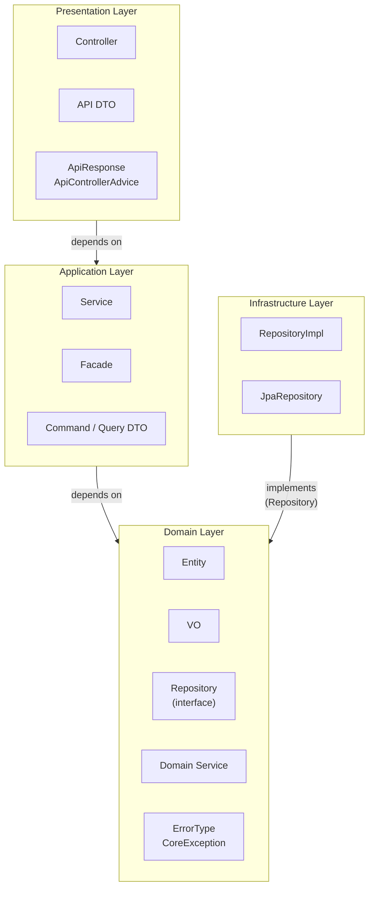
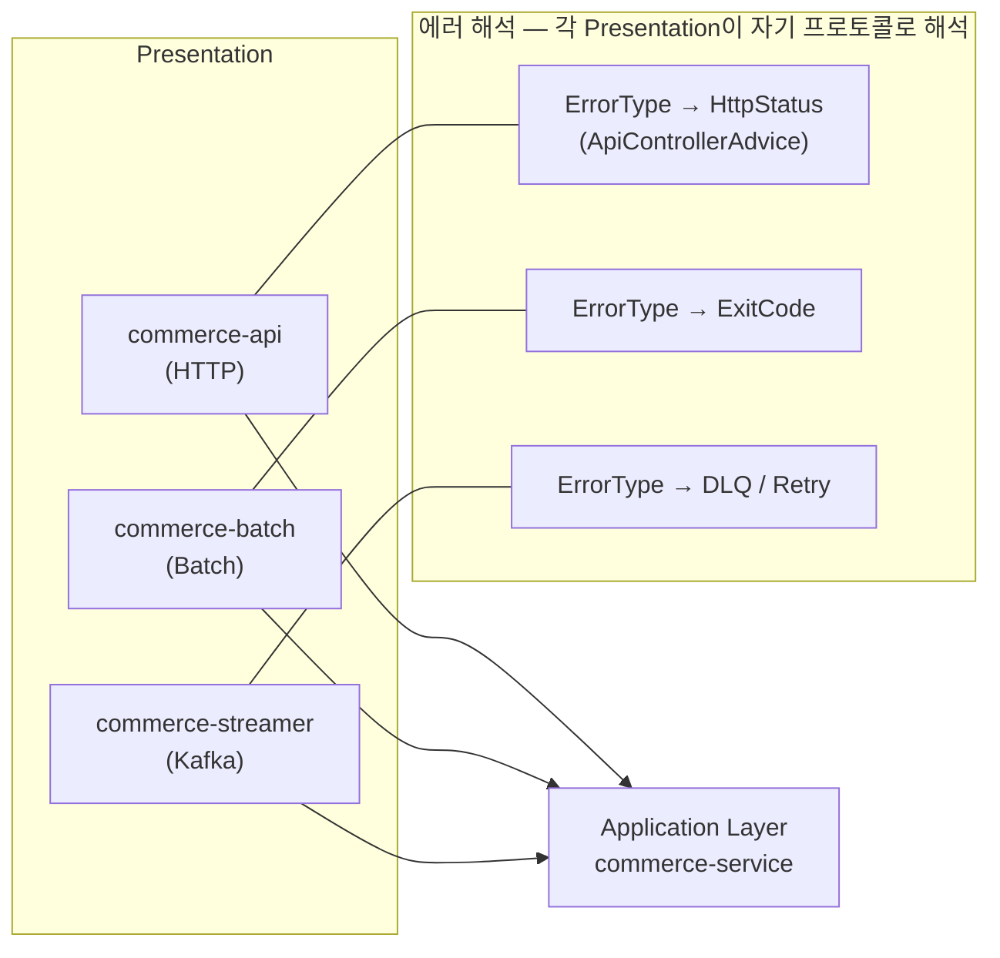
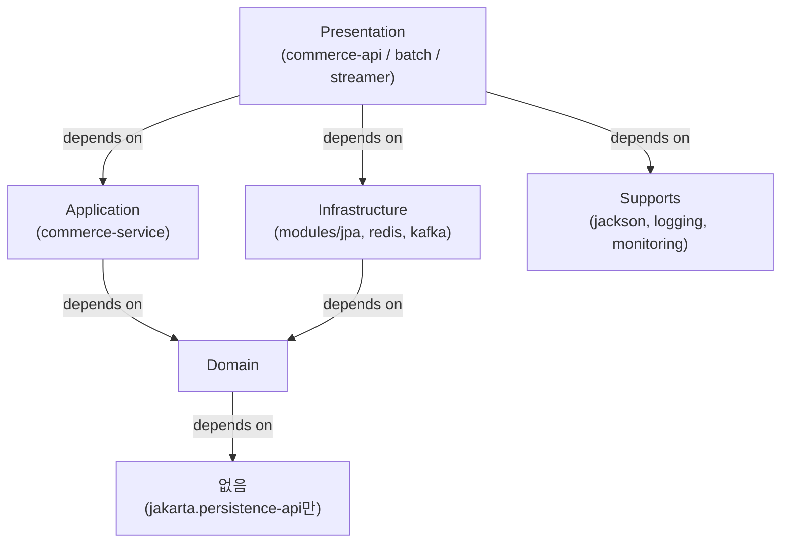
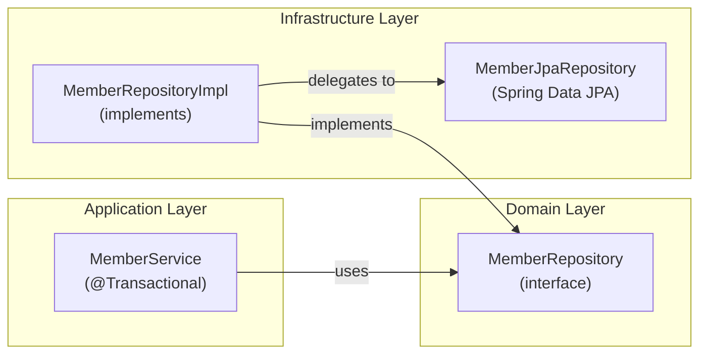
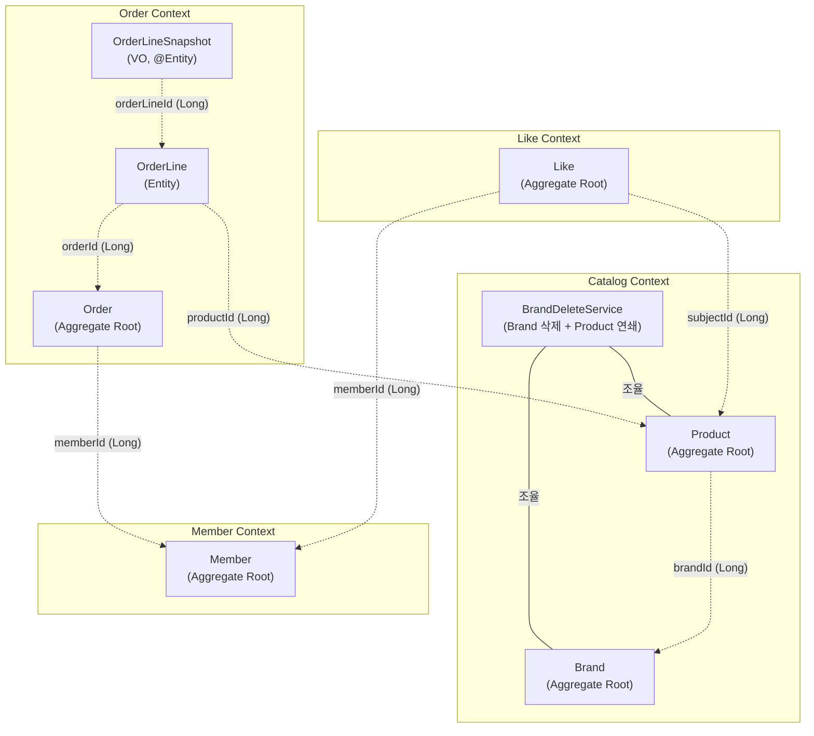
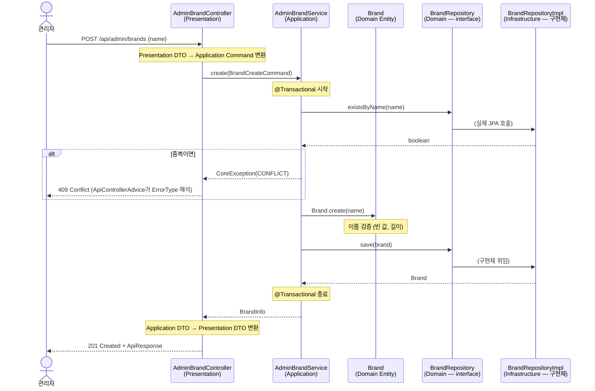
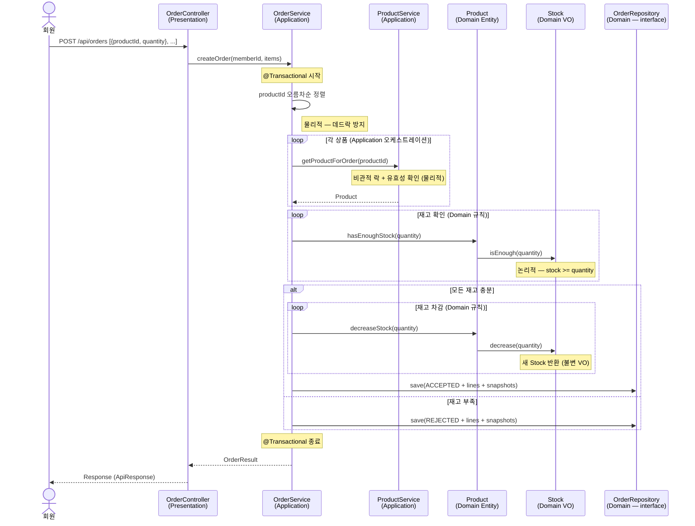
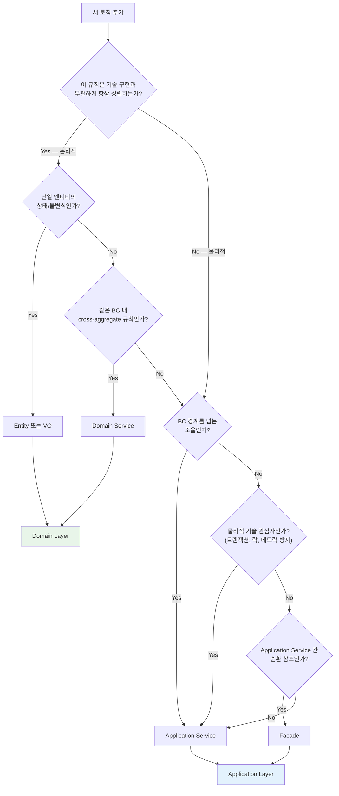

# 아키텍처 설계서

> 작성일: 2026-02-22
> 
> 기반 문서: `01-requirements.md` ~ `05-domain-model.md`

---

## 1. 이 문서의 목적

이 문서는 다음 세 가지 질문에 답한다.

1. **WHY** — 왜 이 레이어 구조인가? 각 레이어는 어떤 문제를 해결하기 위해 존재하는가?
2. **WHERE** — 새 기능이 추가될 때 코드는 어디에 놓는가?
3. **BOUNDARY** — 현재 구조가 어떤 확장을 지원하고, 어떤 제약이 있는가?

기존 설계 문서(01~05)는 요구사항, 시퀀스, 클래스, ERD, 도메인 모델을 각각 다룬다. 이 문서는 그것들 위에서 **"왜 이 구조인가"를 종합**하는 조감도 역할이다.

---

## 2. 아키텍처 전체 조감도

### 2-1. 레이어 구성도



### 2-2. 읽는 포인트

- **의존 방향은 항상 Domain을 향한다.** Domain은 아무것도 의존하지 않는다.
- **Infrastructure는 Domain의 Repository를 구현**한다. Domain이 정의한 Repository(interface)를 Infrastructure가 RepositoryImpl로 구현한다.
- **Presentation이 3개**(HTTP, Batch, Kafka)다. 같은 Application을 서로 다른 프로토콜로 노출한다. ErrorType에 HttpStatus를 넣지 않은 이유가 여기에 있다.

### 2-3. 물리적 디렉토리 구조

```
Root
├── domain/                    [Domain Layer]
├── application/
│   └── commerce-service/      [Application Layer]
├── presentation/
│   ├── commerce-api/          [Presentation — REST API]
│   ├── commerce-batch/        [Presentation — Spring Batch]
│   └── commerce-streamer/     [Presentation — Kafka Consumer]
├── modules/
│   ├── jpa/                   [Infrastructure — DB]
│   ├── redis/                 [Infrastructure — Cache]
│   └── kafka/                 [Infrastructure — Messaging]
└── supports/
    ├── jackson/               [Cross-cutting — Serialization]
    ├── logging/               [Cross-cutting — Logging]
    └── monitoring/            [Cross-cutting — Metrics]
```

---

## 3. 레이어 상세 설계

### 3-1. Domain Layer (논리적 영역)

#### 존재 이유

**"기술 구현과 무관하게 항상 성립하는 비즈니스 규칙"**을 격리한다.

Spring Boot가 Django로 바뀌어도, MySQL이 MongoDB로 바뀌어도, 이 레이어의 코드는 변하지 않아야 한다. "재고는 음수가 될 수 없다", "같은 회원이 같은 상품에 중복 좋아요 불가" — 이런 규칙은 기술 스택과 무관하다.

#### 허용 / 금지

| 허용 | 금지 |
|------|------|
| JPA 매핑 어노테이션 (`@Entity`, `@Embeddable`, `@MappedSuperclass`, `@Table`, `@Column`) | `@Transactional`, `@Service` |
| `@Component` (Domain Service용) | `HttpStatus`, Spring Web |
| Repository (interface 정의) | Kafka, Redis, 외부 HTTP 클라이언트 |

> **왜 JPA 어노테이션과 `@Component`를 허용하는가?**
> `jakarta.persistence-api`는 인터페이스 수준의 표준 스펙이다. `spring-context`의 `@Component`도 Domain Service를 빈으로 등록하기 위한 최소한의 의존이다. 순수성을 고집하면 `@Bean` Config 클래스가 필요해져 Domain Service 추가마다 관리 포인트가 늘어난다. 이 프로젝트에서 Spring을 벗어날 가능성은 현실적으로 없으므로, 실용성을 우선한다.

#### 클래스 목록

**공통 기반**

| 클래스 | 종류 | 책임 |
|--------|------|------|
| `BaseTimeEntity` | @MappedSuperclass | `id`, `createdAt`, `updatedAt` 자동 관리. soft-delete가 불필요한 엔티티용 |
| `BaseEntity` | @MappedSuperclass | `BaseTimeEntity` 상속 + `deletedAt`, `delete()`, `restore()`. soft-delete가 필요한 엔티티용 |
| `ErrorType` | enum | 비즈니스 실패 분류. `code`와 `message`만 보유. **HttpStatus를 모른다** |
| `CoreException` | RuntimeException | `ErrorType` + 선택적 `customMessage` |

> **왜 BaseTimeEntity / BaseEntity를 분리하는가?**
> 삭제 정책을 **상속 구조로 명시**하기 위해서다. Like(hard-delete)와 Order(삭제 없음)에 `deletedAt` 컬럼은 불필요하다. 어떤 엔티티가 `BaseEntity`를 상속하면 "이 엔티티는 soft-delete를 사용한다"는 설계 의도가 코드 레벨에서 드러난다.

```java
BaseTimeEntity (id, createdAt, updatedAt)
  ├── BaseEntity + deletedAt
  │   ├── Brand      (soft-delete)
  │   └── Product    (soft-delete)
  │
  └── BaseTimeEntity만
      ├── Member     (탈퇴 미구현, 향후 결정)
      ├── Like       (hard-delete)
      └── Order      (삭제 없음, 불변)
```

**BC별 클래스**

| BC | 클래스 | 종류 | 책임 |
|----|--------|------|------|
| Member | `Member` | Entity | 회원 등록, 비밀번호 검증/변경. VO에 규칙 위임 |
| Member | `LoginId`, `Password`, `MemberName`, `Email` | VO (@Embeddable) | 각 필드의 자체 규칙 캡슐화 (길이, 형식, 암호화) |
| Member | `MemberRepository` | interface | 회원 조회/저장 계약 |
| Member | `MemberExceptionMessage` | enum | 예외 메시지 상수 |
| Catalog | `Brand` | Entity | 브랜드 CRUD, `delete()` override (guardNotDeleted + name suffix로 UNIQUE 해소) |
| Catalog | `Product` | Entity | 상품 CRUD, VO 위임 (`hasEnoughStock`, `decreaseStock`) |
| Catalog | `Price` | VO (@Embeddable) | 가격 > 0 자체 검증 |
| Catalog | `Stock` | VO (@Embeddable) | 재고 >= 0 자체 검증, `isEnough(Quantity)`, `decrease(Quantity)` |
| Catalog | `BrandDeleteService` | Domain Service | Brand 삭제 시 소속 Product 연쇄 soft-delete |
| Catalog | `BrandRepository`, `ProductRepository` | interface | Catalog 조회/저장 계약 |
| Like | `Like` | Entity | 관계 레코드 (hard-delete). `subjectType(enum) + subjectId(Long)` |
| Like | `LikeRepository` | interface | 좋아요 조회/저장 계약 |
| Order | `Order` | Entity | Aggregate Root. `place()`로 불변식 검증(빈 주문, 중복 상품), `assignOrderLines()`로 하위 소속 관리, `isOwnedBy(memberId)` |
| Order | `OrderLine` | Entity | 주문 항목. `orderId(Long)`로 Order 참조. `of()`에서 스냅샷 내부 생성. `assignToOrder()` / `assignSnapshot()`은 self 반환(연산의 닫힘) |
| Order | `OrderLineSnapshot` | VO (@Entity) | 주문 시점 불변 스냅샷. `orderLineId(Long)`로 OrderLine 참조. 정규화를 위해 별도 테이블 |
| Order | `Quantity` | VO (@Embeddable) | 수량 > 0 자체 검증 |
| Order | `OrderRepository` | interface | 주문 조회/저장 계약 |

#### 패키지 구조

Domain 레이어는 **BC 단위로 패키지를 구성**한다. Brand와 Product는 같은 Catalog BC이므로 `catalog/` 하위에 배치하여, 디렉토리만 봐도 BC 경계가 드러나게 한다.

> 상위 레이어(Application, Presentation, Infrastructure)는 BC 기준 패키지를 적용하지 않는다. 상위 레이어는 Admin/User 분리, Cross-BC 조합 등 도메인 경계와 다른 기준으로 클래스가 구성되므로, 별도의 패키지 전략을 적용한다.

```
com.loopers
├── domain/
│   ├── BaseTimeEntity.java
│   ├── BaseEntity.java
│   ├── member/
│   │   ├── Member.java
│   │   ├── MemberRepository.java
│   │   ├── MemberExceptionMessage.java
│   │   └── vo/
│   │       ├── LoginId.java
│   │       ├── Password.java
│   │       ├── MemberName.java
│   │       └── Email.java
│   ├── catalog/
│   │   ├── BrandDeleteService.java
│   │   ├── brand/
│   │   │   ├── Brand.java
│   │   │   ├── BrandRepository.java
│   │   │   └── BrandExceptionMessage.java
│   │   └── product/
│   │       ├── Product.java
│   │       ├── ProductRepository.java
│   │       ├── ProductExceptionMessage.java
│   │       └── vo/
│   │           ├── Price.java
│   │           └── Stock.java
│   ├── like/
│   │   ├── Like.java
│   │   ├── LikeRepository.java
│   │   └── LikeSubjectType.java
│   └── order/
│       ├── Order.java
│       ├── OrderRepository.java
│       ├── OrderLine.java
│       ├── OrderLineSnapshot.java
│       ├── OrderStatus.java
│       └── vo/
│           └── Quantity.java
└── support/
    └── error/
        ├── ErrorType.java
        └── CoreException.java
```

---

### 3-2. Application Layer (물리적 영역)

#### 존재 이유

**Domain만으로 해결할 수 없는 "물리적/기술적 관심사"**를 처리한다.

Domain이 "논리적으로 항상 성립하는 규칙"이라면, Application은 "그 규칙을 실행하기 위해 필요한 기술적 조율"이다.

#### Application으로 올라오는 3가지 조건

1. **BC 경계를 넘는 조율**: 서로 다른 BC의 도메인 객체/서비스를 조합해야 할 때
   - 예: LikeService가 ProductService를 호출하여 상품 유효성 확인
2. **외부 인프라 의존**: 변경점이 많은 프레임워크/서비스를 써야 할 때
   - 예: HTTP 클라이언트, Kafka Producer, Redis Cache
3. **물리적 기술 관심사**: 트랜잭션 경계, 데드락 방지 정렬, 락 획득 순서 등
   - 예: OrderService에서 productId 오름차순 정렬 후 비관적 락 획득

#### 허용 / 금지

| 허용 | 금지 |
|------|------|
| `@Service`, `@Transactional` | `@Controller`, `@RequestMapping` |
| Domain 객체 사용, Repository 호출 | HttpStatus, HttpServletRequest |
| Domain Service 호출 | Presentation DTO 직접 사용 |

> **왜 spring-web을 포함하지 않는가?**
> Application 모듈의 `build.gradle.kts`에는 `spring-tx`와 `spring-context`만 있다. `spring-web`이 없으므로 Application은 HTTP의 존재를 모른다. 이것이 같은 Application을 HTTP(commerce-api), Batch(commerce-batch), Kafka(commerce-streamer) 세 가지 Presentation에서 재사용할 수 있는 근본 이유다.

```kotlin
// application/commerce-service/build.gradle.kts
dependencies {
    api(project(":domain"))
    implementation("org.springframework:spring-tx")       // @Transactional
    implementation("org.springframework:spring-context")  // @Service, DI
    // spring-web 없음
}
```

#### 클래스 목록

| 클래스 | BC | 책임 |
|--------|-----|------|
| `MemberService` | Member | 회원 등록, 조회, 비밀번호 변경 오케스트레이션 |
| `BrandService` | Catalog | 활성 브랜드 목록 조회 (User) |
| `AdminBrandService` | Catalog | 브랜드 CRUD. 삭제 시 BrandDeleteService 호출 |
| `AdminProductService` | Catalog | 상품 CRUD. 등록 시 Brand 활성 여부 확인 |
| `ProductService` | Catalog | 상품 조회, 수정, 삭제, 주문용 락 조회 |
| `LikeService` | Like | 좋아요 등록/취소/조회. Cross-BC 유효성 확인 (ProductService 호출) |
| `OrderService` | Order | 주문 생성 오케스트레이션 (정렬, 락, 스냅샷, 수락/거절) |

**DTO 분류**

| 종류      | 역할 | 네이밍 규칙 | 예시 |
|---------|------|-----------|------|
| Command | 외부 → Application 요청 (상태 변경) | `{Domain}{Action}Command` | `BrandCreateCommand`, `MemberRegisterCommand` |
| Info    | Application → 외부 응답 (조회 결과) | `{Domain}Info` | `BrandInfo`, `MemberInfo` |

> DTO는 Java `record`로 구현한다. 불변이며, HTTP 관심사(status code, header)를 알지 않는다.

#### Domain Service 호출 규칙

```
Controller → Application Service → Domain Service → Repository
              (@Transactional)        (트랜잭션 안에서 동작)
```

**Controller → Domain Service 직접 호출을 금지하는 이유**: Domain Service가 `Repository.save()`를 호출하는데, 트랜잭션 없이 save가 실행되면 DB 일관성이 깨진다. Application Service가 `@Transactional` 경계를 소유하므로, Domain Service는 이 경계 안에서만 동작해야 한다.

#### Facade 규칙

Facade는 **Application Service 간 순환 참조를 해소**하기 위해서만 도입한다. 같은 BC 내 cross-aggregate 규칙은 Facade가 아닌 Domain Service로 해결한다.

| 구분 | Facade | Domain Service |
|------|--------|----------------|
| 위치 | Application 레이어 | Domain 레이어 |
| 역할 | Application Service 간 순환 참조 해소 | 같은 BC 내 cross-aggregate 규칙 |
| 예시 | (현재 해당 없음) | BrandDeleteService (Brand 삭제 → Product 연쇄) |
| 의존 | 여러 Application Service 주입 | 도메인 객체 + Repository |

#### 패키지 구조

```
com.loopers.application
├── service/
│   ├── MemberService.java
│   ├── BrandService.java
│   ├── AdminBrandService.java
│   ├── AdminProductService.java
│   ├── ProductService.java
│   ├── LikeService.java
│   ├── OrderService.java
│   └── dto/
│       ├── BrandCreateCommand.java
│       ├── BrandUpdateCommand.java
│       ├── BrandInfo.java
│       ├── MemberRegisterCommand.java
│       ├── MemberInfo.java
│       └── ...
└── facade/
    └── (현재 비어 있음 — 순환 참조 발생 시 도입)
```

---

### 3-3. Presentation Layer

#### 존재 이유

**"어떤 프로토콜로 외부와 소통하는가"**를 격리한다.

같은 비즈니스 로직(Application)을 HTTP, Batch, Kafka 세 가지 인터페이스로 노출할 수 있다. 이것이 ErrorType에서 HttpStatus를 분리한 근본 이유다.



> **ErrorType은 "무슨 종류의 실패인가"만 표현한다.** "어떻게 응답할 것인가"는 Presentation이 결정한다. commerce-api는 HttpStatus로, commerce-batch는 ExitCode로, commerce-streamer는 DLQ/Retry로 해석한다. 이것이 Domain에 HttpStatus를 넣지 않은 이유다.

#### ErrorType → HttpStatus 매핑 (commerce-api)

```java
// ApiControllerAdvice.java — Presentation 레이어에서 해석
private HttpStatus toHttpStatus(ErrorType errorType) {
    return switch (errorType) {
        case BAD_REQUEST -> HttpStatus.BAD_REQUEST;       // 400
        case NOT_FOUND -> HttpStatus.NOT_FOUND;           // 404
        case CONFLICT -> HttpStatus.CONFLICT;             // 409
        case UNAUTHORIZED -> HttpStatus.UNAUTHORIZED;     // 401
        case INTERNAL_ERROR -> HttpStatus.INTERNAL_SERVER_ERROR; // 500
    };
}
```

#### 클래스 목록 (commerce-api 기준)

| 클래스 | 책임 |
|--------|------|
| `ApiResponse<T>` | 통합 응답 래퍼. `Metadata(result, errorCode, message) + data` |
| `ApiControllerAdvice` | `CoreException` → `ErrorType` → `HttpStatus` 매핑. 프레임워크 예외도 일관된 응답으로 변환 |
| `MemberController` | 회원 HTTP 엔드포인트. 헤더 인증 |
| `BrandController` | 사용자용 브랜드 조회 |
| `AdminBrandController` | 관리자용 브랜드 CRUD |
| `ProductController` | 사용자용 상품 조회 |
| `AdminProductController` | 관리자용 상품 CRUD |
| `LikeController` | 좋아요 등록/취소/조회 |
| `OrderController` | 회원 주문 생성/조회 |
| `AdminOrderController` | 관리자 주문 조회 |
| `Presentation DTO` | API 전용 Request/Response. Application DTO와 분리 |

#### Presentation DTO vs Application DTO

| 레이어 | DTO 위치 | 역할 | 예시 |
|--------|---------|------|------|
| Presentation | `interfaces/api/{도메인}/dto/` | HTTP 계약 (Request Body, Response Body) | `BrandCreateApiRequest`, `BrandApiResponse` |
| Application | `application/service/dto/` | Use Case 계약 (프로토콜 무관) | `BrandCreateCommand`, `BrandInfo` |

> **왜 분리하는가?** Presentation DTO는 API 클라이언트와의 계약이고, Application DTO는 Use Case의 계약이다. 분리하면 API 스펙 변경이 Domain/Application에 영향을 주지 않고, 같은 Application을 다른 Presentation(Batch, Kafka)에서도 재사용할 수 있다.

#### 패키지 구조 (commerce-api)

```
com.loopers.interfaces.api
├── ApiResponse.java
├── ApiControllerAdvice.java
├── member/
│   ├── MemberController.java
│   └── dto/ ...
├── brand/
│   ├── BrandController.java
│   ├── AdminBrandController.java
│   └── dto/ ...
├── product/ ...
├── like/ ...
└── order/ ...
```

---

### 3-4. Infrastructure Layer (modules/)

#### 존재 이유

**Repository 인터페이스의 구현체**가 위치한다. Domain이 정의한 Repository(interface)를 JPA/Redis/Kafka로 구현한다.

#### 클래스 목록 (modules/jpa 기준)

| 클래스 | 종류 | 책임 |
|--------|------|------|
| `MemberJpaRepository` | Spring Data JPA | JPA 쿼리 정의 (`findByLoginId_Value`) |
| `MemberRepositoryImpl` | 구현체 | `MemberRepository` 인터페이스 구현, JpaRepository에 위임 |
| `BrandJpaRepository` | Spring Data JPA | Brand JPA 쿼리 |
| `BrandRepositoryImpl` | 구현체 | `BrandRepository` 인터페이스 구현 |
| `JpaConfig` | Configuration | `@EntityScan`, `@EnableJpaRepositories` |
| `QueryDslConfig` | Configuration | `JPAQueryFactory` 빈 등록 |
| `DataSourceConfig` | Configuration | DataSource 설정 (HikariCP) |

#### Repository 추상체 — 구현체

```
Domain (추상체 정의)         Infrastructure (구현체)
┌─────────────────┐        ┌─────────────────────────┐
│ MemberRepository │◄───────│ MemberRepositoryImpl    │
│ (interface)      │        │ (@Repository)           │
└─────────────────┘        │   └── MemberJpaRepository│
                           │       (Spring Data JPA)  │
                           └─────────────────────────┘
```

> **@Embedded 필드 쿼리 규칙**: VO가 `@Embeddable`일 때 Spring Data JPA는 `findByLoginId_Value` 형태(언더스코어로 내부 필드 접근)를 사용한다.

#### 패키지 구조

```
com.loopers
├── config/
│   └── jpa/
│       ├── JpaConfig.java
│       ├── QueryDslConfig.java
│       └── DataSourceConfig.java
└── infrastructure/
    ├── member/
    │   ├── MemberJpaRepository.java
    │   └── MemberRepositoryImpl.java
    ├── brand/ ...
    ├── product/ ...
    └── ...
```

---

### 3-5. Cross-cutting Concerns (supports/)

#### 존재 이유

모든 Presentation 모듈이 공유하는 인프라 설정이다. **레이어가 아닌 add-on** 성격이며, 비즈니스 로직을 모른다.

| 모듈 | 책임 |
|------|------|
| `supports/jackson` | ObjectMapper 설정 (JSR-310, NON_NULL, FAIL_ON_UNKNOWN_PROPERTIES 비활성화) |
| `supports/logging` | Logback 설정 + Slack Appender (에러 알림) |
| `supports/monitoring` | Prometheus + Micrometer 메트릭 노출 |

---

## 4. 의존 방향과 DIP

### 4-1. 의존 방향



**핵심**: 모든 화살표가 Domain을 향한다. Domain은 프레임워크에 의존하지 않는다.

### 4-2. Repository 추상체와 구현체



**왜 Repository 인터페이스를 Domain에 두는가?** `MemberService`는 `MemberRepository` **인터페이스에만** 의존한다. JPA 구현체를 모르므로, DB가 바뀌어도 Application/Domain은 변하지 않는다. 테스트에서 `FakeMemberRepository`를 주입하면 DB 없이 순수 단위 테스트가 가능하다.

### 4-3. 실제 Gradle 의존성

```kotlin
// domain/build.gradle.kts — 프레임워크 의존 최소화
dependencies {
    api("jakarta.persistence:jakarta.persistence-api")
}

// application/commerce-service/build.gradle.kts — Domain만 의존, HTTP 모름
dependencies {
    api(project(":domain"))
    implementation("org.springframework:spring-tx")
    implementation("org.springframework:spring-context")
}

// modules/jpa/build.gradle.kts — Domain의 Repository를 구현
dependencies {
    api(project(":domain"))
    api("org.springframework.boot:spring-boot-starter-data-jpa")
}
```

---

## 5. 바운디드 컨텍스트 매핑

### 5-1. BC 경계와 Aggregate



**점선(`..>`) = ID(Long) 참조**. 객체 참조가 아니다.

### 5-2. 무FK 정책

BC 간 참조뿐 아니라 **같은 BC 내(Product → Brand)에서도 FK를 사용하지 않는다.**

| 이유 | 설명 |
|------|------|
| 도메인 규칙 명시적 제어 | 삭제 연쇄를 DB CASCADE 대신 BrandDeleteService로 제어. 삭제 순서(상품 먼저 → 브랜드 나중)와 부가 로직을 코드에 명시적으로 표현 |
| 운영 유연성 | 데이터 마이그레이션, 벌크 작업 시 FK가 제약이 됨 |

참조 무결성은 **애플리케이션 레벨에서 보장**한다 (상세: `04-erd.md` 5절).

### 5-3. Brand↔Product가 독립 Aggregate인 이유

Brand와 Product는 같은 Catalog BC에 속하지만 **독립 Aggregate**이다.

| 기준 | 판단 |
|------|------|
| 독립적 생명주기 | Product 없이 Brand만 존재 가능 |
| 규모 차이 | Brand 1개에 Product 수천 개 가능. Brand Aggregate에 포함하면 메모리/성능 문제 |
| 독립 변경 | Product 가격/재고 수정 시 Brand를 잠글 필요 없음 |

Cross-aggregate 규칙(삭제 연쇄)은 **BrandDeleteService**에서 처리한다. 상품 등록 시 Brand 활성 검증은 Application Service에서 오케스트레이션한다.

---

## 6. 요청 흐름 추적

### 6-1. 단순 흐름 — 브랜드 등록

레이어 경계가 participant로 드러나는 시퀀스 다이어그램.



#### 읽는 포인트

- **DTO 변환이 두 번** 일어난다: Presentation → Application (요청), Application → Presentation (응답)
- **이름 검증(논리적)**은 Brand Entity가, **중복 검증(물리적 — DB 조회 필요)**은 Application Service가 수행한다
- **에러 해석**은 ApiControllerAdvice(Presentation)가 담당한다: `ErrorType.CONFLICT → HttpStatus.CONFLICT(409)`

### 6-2. 복합 흐름 — 주문 생성 (Cross-BC)

논리적(Domain)과 물리적(Application)의 경계가 드러나는 흐름.



#### 읽는 포인트

이 흐름에서 **논리적(Domain)과 물리적(Application)의 경계**가 드러난다.

| 로직 | 레이어 | 이유 |
|------|--------|------|
| productId 오름차순 정렬 | Application (물리적) | 데드락 방지 = 기술 관심사 |
| 비관적 락 획득 | Application (물리적) | 동시성 제어 = 기술 관심사 |
| `Stock.isEnough(quantity)` | Domain (논리적) | "재고 >= 수량" = 기술 무관한 규칙 |
| `Stock.decrease(quantity)` | Domain (논리적) | 재고 차감 = 기술 무관한 규칙 |
| 수락/거절 판단 | Domain (논리적) | "전부 충분하면 수락" = 비즈니스 규칙 |
| 위 흐름의 조율 | Application (물리적) | 트랜잭션 + Cross-BC 오케스트레이션 |

---

## 7. 새 기능은 어디에 놓는가 — 의사결정 프레임워크

### 7-1. 판별 플로우



### 7-2. 구체적 예시

| 시나리오 | 결정 | 이유 |
|---------|------|------|
| "재고는 음수가 될 수 없다" | `Stock` VO (Domain) | 기술 무관한 불변식 |
| "가격은 0보다 커야 한다" | `Price` VO (Domain) | 기술 무관한 불변식 |
| "이미 삭제된 브랜드는 다시 삭제 불가" | `Brand.guardNotDeleted()` (Domain) | 엔티티 자기 상태 검증 |
| "Brand 삭제 시 Product 연쇄 삭제" | `BrandDeleteService` (Domain) | 같은 BC 내 cross-aggregate 규칙 |
| "productId 오름차순 정렬 (데드락 방지)" | `OrderService` (Application) | 물리적 기술 관심사 |
| "좋아요 등록 시 상품 유효성 확인" | `LikeService` (Application) | Cross-BC 조율 (Like → Catalog) |
| "ErrorType → HttpStatus 매핑" | `ApiControllerAdvice` (Presentation) | 프로토콜 해석 |
| "MemberRepository 구현" | `MemberRepositoryImpl` (Infrastructure) | Repository 구현체 |

### 7-3. 핵심 원칙

1. **판단 주체는 규칙을 아는 객체**다. Service가 `if (stock >= quantity)`를 직접 검사하지 않는다. `Stock.isEnough(quantity)`를 호출한다.
2. **같은 BC 내 cross-aggregate 규칙은 Domain Service**다. Facade가 아니다.
3. **Application Service는 조율자**다. 규칙 자체를 구현하지 않고, Domain 객체에 위임한다.
4. **Facade는 순환 참조 해소 전용**이다. "BC 간 조율"이 Facade의 역할이 아니다.

---

## 8. 설계 결정 기록 (ADR)

아키텍처 레벨 결정만 정리한다. 클래스 레벨 결정은 `03-class-diagram.md` 6절 참조.

| # | 결정 | 맥락 | 선택 이유 | 대안 |
|---|------|------|----------|------|
| 1 | Domain에 JPA 어노테이션 허용 | 순수 POJO vs 실용적 매핑 | `jakarta.persistence-api`는 인터페이스 수준 스펙. 매핑 레이어 추가 비용 > 이득 | 순수 POJO + 별도 매핑 레이어 |
| 2 | ErrorType에 HttpStatus 미포함 | Presentation이 3개 (HTTP, Batch, Kafka) | Batch/Kafka에서 HttpStatus는 무의미. 각 Presentation이 자기 프로토콜로 해석해야 한다 | ErrorType에 HttpStatus 포함 |
| 3 | Repository 인터페이스를 Domain에 배치 | 의존 역전 | Domain이 추상체를 소유하고 Infrastructure가 구현하면 의존 방향이 안쪽을 향한다. 테스트 시 Fake 주입 가능 | Repository를 Infrastructure에 배치 |
| 4 | Application에 spring-web 미포함 | Application의 프로토콜 독립성 | 트랜잭션(`@Transactional`)과 DI(`@Service`)만 필요. HTTP는 Presentation의 책임 | spring-web 포함 |
| 5 | BC 간/내 모두 FK 없음 | 도메인 규칙 명시적 제어 | 삭제 연쇄를 DB CASCADE 대신 BrandDeleteService로 제어. 규칙이 코드에 표현된다 | FK 사용 |
| 6 | BaseTimeEntity / BaseEntity 분리 | 삭제 정책을 상속으로 표현 | Like(hard-delete), Order(삭제 없음)에 `deletedAt`은 불필요. 상속이 의도를 코드로 드러낸다 | BaseEntity 하나만 |
| 7 | Domain Service 필요할 때만 도입 | YAGNI | 현재 BrandDeleteService만 실제 필요. Member BC에 DomainService는 불필요 | 모든 BC에 미리 생성 |
| 8 | presentation에서만 Spring Boot 플러그인 | Library 모듈에 bootJar 불필요 | domain, application, modules는 `java-library`. bootJar는 실행 모듈(presentation)만 | 전체 모듈에 적용 |

---

## 9. 기반 문서 참조

| 문서 | 내용 | 본 문서와의 관계 |
|------|------|----------------|
| `01-requirements.md` | 기능 정의서 | 아키텍처가 지원해야 하는 유스케이스의 원천 |
| `02-sequence-diagrams.md` | 시퀀스 다이어그램 | 6절(요청 흐름)의 세부 참조. 각 API 흐름의 객체 간 메시지 |
| `03-class-diagram.md` | 클래스 다이어그램 | 3절(레이어 상세)의 클래스 설계 원천. 엔티티/VO 분류, 책임 분산 점검 |
| `04-erd.md` | ERD | VO → 컬럼 매핑, 무FK 운영 규약 세부 |
| `05-domain-model.md` | 도메인 모델 정의서 | BC 경계, 레이어 책임 규칙, Service 분류 기준의 원천 (SoT) |
