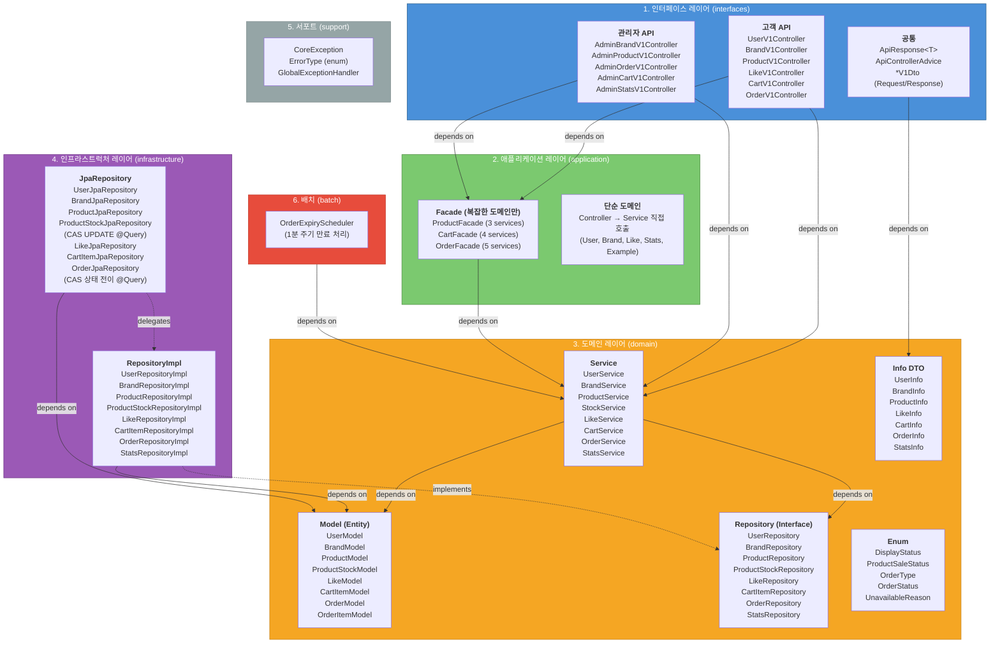

# 레이어별 클래스 구성 및 책임 정의서

> **목적**: 시스템의 각 레이어에 어떤 클래스들이 존재하고, 각 클래스가 어떤 책임을 가지는지 한눈에 파악한다.
> 기존 구현(Member, Example)과 신규 구현(Brand~Stats) 클래스를 모두 포함한다.

---

## 아키텍처 개요



> **의존 방향 (depends on)**: 실선 화살표 (`-->`)
> - `Controller → Facade/Service`: Controller는 Facade 또는 Service에 의존
> - `Facade → Service`: Facade는 여러 Service를 조합하여 오케스트레이션
> - `Service → Repository(IF), Model, PasswordEncoder(IF)`: Service는 도메인 인터페이스와 엔티티에 의존
> - `V1Dto → Info`: Response DTO는 Info의 `from()` 팩토리 메서드로 변환
> - 단순 도메인(User, Brand, Like, Stats)은 Controller가 Service를 직접 호출
> - 복잡한 도메인(Product, Cart, Order)만 Facade를 경유
>
> **구현 관계 (implements)**: 점선 화살표 (`-.->`)
> - `RepositoryImpl -.-> Repository(IF)`: 인프라 구현체가 도메인 인터페이스를 구현 (DIP)
> - `RepositoryImpl / JpaRepository → Model`: 인프라 레이어는 JPA 엔티티(Model)에 의존 (저장/조회에 필요)
> - 인프라 레이어는 **Info DTO에는 의존하지 않음** — Info 변환은 도메인 Service에서 수행
> - `JpaRepository -.-> RepositoryImpl`: RepositoryImpl이 JpaRepository에 위임

---

## 레이어 구조 요약

```
apps/commerce-api/src/main/java/com/loopers/
├── interfaces/          ← 1. 인터페이스 레이어 (HTTP 입출력)
│   ├── api/             ← 고객 API (/api/v1)
│   └── api-admin/       ← 관리자 API (/api-admin/v1)  [신규]
├── application/         ← 2. 애플리케이션 레이어 (유스케이스 오케스트레이션)
├── domain/              ← 3. 도메인 레이어 (비즈니스 로직)
├── infrastructure/      ← 4. 인프라스트럭처 레이어 (외부 시스템 연동)
├── support/             ← 5. 서포트 (공통 유틸리티)
└── batch/               ← 6. 배치 (스케줄러)  [신규]
```

**의존 방향**: `interfaces → application → domain ← infrastructure`

---

## 1. 인터페이스 레이어 (interfaces)

> HTTP 요청 수신, Bean Validation, Facade 호출, ApiResponse 래핑 후 반환.
> 비즈니스 로직을 포함하지 않는다.

### 1.1 공통

| 클래스 | 유형 | 책임 |
|--------|------|------|
| `ApiResponse<T>` | record | 모든 API의 공통 응답 래퍼. `Metadata(result, errorCode, message)` + `data` 구조. `success()`, `fail()` 정적 팩토리 제공 |
| `ApiControllerAdvice` | `@RestControllerAdvice` | 전역 예외 처리기. `CoreException` → `ApiResponse.fail()` 변환, `MethodArgumentTypeMismatchException`, `HttpMessageNotReadableException` 등 공통 예외 처리 |
| `GlobalExceptionHandler` | 클래스 (비활성) | 예비 전역 예외 처리기. 현재 `@RestControllerAdvice` 비활성 상태 |

### 1.2 고객 API (api/)

#### Member (기존)

| 클래스 | 유형 | 책임 |
|--------|------|------|
| `MemberV1Controller` | `@RestController` | 회원 API 엔드포인트 3개 제공: `POST /api/v1/members` (회원가입), `GET /me` (내 정보 조회), `PATCH /me/password` (비밀번호 변경). 인증 헤더(`X-Loopers-LoginId/Pw`) 파싱, `MemberService` 직접 호출, `ApiResponse` 반환 |
| `MemberV1Dto` | DTO 래퍼 | 내부 static class로 Request/Response DTO 정의. `RegisterRequest`(Bean Validation), `ChangePasswordRequest`, `RegisterResponse`(`from(MemberInfo)`), `MyInfoResponse`(`from(MemberInfo)` 마스킹 적용) |

#### User (신규)

| 클래스 | 유형 | 책임 |
|--------|------|------|
| `UserV1Controller` | `@RestController` | 회원 API 엔드포인트 3개 제공: `POST /api/v1/users` (회원가입), `GET /api/v1/users/me` (내 정보 조회), `PATCH /api/v1/users/me/password` (비밀번호 변경). 인증 헤더(`X-Loopers-LoginId/Pw`) 파싱, `UserService` 직접 호출, `ApiResponse` 반환 |
| `UserV1Dto` | DTO 래퍼 | 내부 static class로 Request/Response DTO 정의. `RegisterRequest`(Bean Validation), `ChangePasswordRequest`, `RegisterResponse`(`from(UserInfo)`), `MyInfoResponse`(`from(UserInfo)` 마스킹 적용) |

#### Brand (신규)

| 클래스 | 유형 | 책임 |
|--------|------|------|
| `BrandV1Controller` | `@RestController` | 고객용 브랜드 조회: `GET /api/v1/brands` (목록, q 검색), `GET /api/v1/brands/{brandId}` (상세). ACTIVE + del_yn='N' 브랜드만 반환. `BrandService` 직접 호출 |
| `BrandV1Dto` | DTO 래퍼 | `BrandListResponse`, `BrandDetailResponse` (`from(BrandInfo)` 팩토리) |

#### Product (신규)

| 클래스 | 유형 | 책임 |
|--------|------|------|
| `ProductV1Controller` | `@RestController` | 고객용 상품 조회: `GET /api/v1/products` (목록, q/brandId/sort/page), `GET /api/v1/products/{productId}` (상세). ACTIVE + del_yn='N' 상품만 반환. `ProductFacade` 호출 (StockService 조합 필요) |
| `ProductV1Dto` | DTO 래퍼 | `ProductListResponse`(availableStock 포함), `ProductDetailResponse` |

#### Like (신규)

| 클래스 | 유형 | 책임 |
|--------|------|------|
| `LikeV1Controller` | `@RestController` | 좋아요 API: `POST /api/v1/products/{productId}/likes` (등록, 멱등), `DELETE /api/v1/products/{productId}/likes` (취소, 멱등), `GET /api/v1/users/me/likes` (내 좋아요 목록). `LikeService` + `UserService` 직접 호출 |
| `LikeV1Dto` | DTO 래퍼 | `LikeResponse`, `MyLikeListResponse` |

#### Cart (신규)

| 클래스 | 유형 | 책임 |
|--------|------|------|
| `CartV1Controller` | `@RestController` | 장바구니 API: `GET /api/v1/cart` (목록, available/unavailableReason 포함), `POST /cart/items` (등록, 중복 시 수량 병합), `PATCH /cart/items/{productId}` (수량 변경), `DELETE /cart/items/{productId}` (삭제, 멱등). `CartFacade` 호출 (4개 서비스 조합) |
| `CartV1Dto` | DTO 래퍼 | `AddItemRequest`(productId, quantity), `ChangeQuantityRequest`, `CartItemResponse`(available, unavailableReason, availableStock 포함) |

#### Order (신규)

| 클래스 | 유형 | 책임 |
|--------|------|------|
| `OrderV1Controller` | `@RestController` | 주문 API: `POST /api/v1/orders` (주문 생성, DIRECT/CART), `GET /api/v1/orders` (목록, startAt/endAt), `GET /api/v1/orders/{orderId}` (상세, 스냅샷 포함), `POST /api/v1/orders/{orderId}/cancel` (취소). `OrderFacade` 호출 (5개 서비스 조합) |
| `OrderV1Dto` | DTO 래퍼 | `CreateOrderRequest`(orderType, items/selectedCartItemIds), `OrderListResponse`, `OrderDetailResponse`(스냅샷 포함), `OrderItemSnapshotResponse` |

#### Example (기존)

| 클래스 | 유형 | 책임 |
|--------|------|------|
| `ExampleV1Controller` | `@RestController` | 예제 CRUD API (GET/POST/PUT/DELETE `/api/v1/examples`) |
| `ExampleV1ApiSpec` | interface | Swagger OpenAPI 스펙 정의 (어노테이션 분리용) |
| `ExampleV1Dto` | DTO 래퍼 | `CreateRequest`, `UpdateRequest`, `ExampleResponse` |

### 1.3 관리자 API (api-admin/) [신규]

#### Admin Brand

| 클래스 | 유형 | 책임 |
|--------|------|------|
| `AdminBrandV1Controller` | `@RestController` | 브랜드 운영: `GET /api-admin/v1/brands` (HIDDEN/삭제 포함 조회), `POST` (등록), `PUT /{brandId}` (수정), `DELETE /{brandId}` (소프트삭제). `X-Loopers-Ldap` 헤더 검증. `BrandService` 직접 호출 |
| `AdminBrandV1Dto` | DTO 래퍼 | `CreateBrandRequest`, `UpdateBrandRequest`, `AdminBrandResponse` |

#### Admin Product

| 클래스 | 유형 | 책임 |
|--------|------|------|
| `AdminProductV1Controller` | `@RestController` | 상품 운영: `GET /api-admin/v1/products` (includeDeleted 지원), `POST` (등록), `PUT /{productId}` (수정, brandId 변경 불가), `DELETE /{productId}` (소프트삭제), `GET /{productId}/revisions` (이력 목록), `GET /{productId}/revisions/{seq}` (이력 상세). `ProductFacade` 호출 (StockService 조합 필요) |
| `AdminProductV1Dto` | DTO 래퍼 | `CreateProductRequest`(brandId 필수, 초기재고), `UpdateProductRequest`, `AdminProductResponse`, `RevisionListResponse`, `RevisionDetailResponse` |

#### Admin Order

| 클래스 | 유형 | 책임 |
|--------|------|------|
| `AdminOrderV1Controller` | `@RestController` | 주문 모니터링: `GET /api-admin/v1/orders` (목록), `GET /api-admin/v1/orders/{orderId}` (상세) |
| `AdminOrderV1Dto` | DTO 래퍼 | `AdminOrderListResponse`, `AdminOrderDetailResponse` |

#### Admin Cart

| 클래스 | 유형 | 책임 |
|--------|------|------|
| `AdminCartV1Controller` | `@RestController` | 회원 장바구니 조회: `GET /api-admin/v1/users/{userId}/cart` |
| `AdminCartV1Dto` | DTO 래퍼 | `AdminCartItemResponse` (available, unavailableReason 포함) |

#### Admin Stats

| 클래스 | 유형 | 책임 |
|--------|------|------|
| `AdminStatsV1Controller` | `@RestController` | 운영 통계: `GET /api-admin/v1/stats/overview`, `/stats/orders/daily`, `/stats/products/top-liked`, `/stats/products/top-ordered`, `/stats/stocks/low`. `StatsService` 직접 호출 |
| `AdminStatsV1Dto` | DTO 래퍼 | `OverviewResponse`, `DailyOrderStatsResponse`, `TopProductResponse`, `LowStockResponse` |

---

## 2. 애플리케이션 레이어 (application)

> Facade 패턴. **여러 도메인 서비스를 조합(orchestration)하는 경우에만** 존재한다.
> 트랜잭션 경계를 설정하고, 복잡한 유스케이스를 완성한다.
> **Domain Model을 외부(interfaces)에 직접 노출하지 않는다** — 이 규칙은 Info DTO를 domain 패키지로 이동하여 Service가 직접 Info를 반환하는 방식으로 유지한다.
>
> 상세 분석: [07-facade-analysis.md](./07-facade-analysis.md)

### 2.1 Facade 적용 기준

| 구분 | 구조 | 해당 도메인 | 이유 |
|------|------|------------|------|
| **단순 도메인** | Controller → Service (returns Info) | User, Brand, Like, Stats, Example | Service 1개만 사용, 오케스트레이션 불필요 |
| **복잡한 도메인** | Controller → **Facade** → 여러 Service | Product(3), Cart(4), Order(5) | 여러 서비스 조합 필요 |

### 2.2 Facade 클래스 (3개 — 복잡한 도메인만)

| 클래스 | 의존하는 서비스 | 책임 |
|--------|----------------|------|
| `ProductFacade` (신규) | `ProductService`, `StockService`, `BrandService` | 고객용 상품 조회(available stock 포함), 관리자용 상품 CRUD + revision 이력 조회. 여러 서비스 조합 |
| `CartFacade` (신규) | `CartService`, `UserService`, `ProductService`, `StockService` | 장바구니 CRUD(인증 후), 각 항목의 available/unavailableReason 계산 후 반환 |
| `OrderFacade` (신규) | `OrderService`, `UserService`, `ProductService`, `StockService`, `CartService` | **가장 복잡한 Facade**. 바로 주문(DIRECT)/장바구니 주문(CART) 생성, 주문 취소(재고 release + 장바구니 복원), 주문 조회 |

### 2.3 Facade를 제거한 도메인 (기존 대비 변경)

| 이전 Facade | 이전 의존 서비스 수 | 변경 후 | 이유 |
|-------------|:---:|---------|------|
| ~~`MemberFacade`~~ (기존) | 1 | Controller → `MemberService` 직접 | 단순 위임(pass-through) |
| ~~`UserFacade`~~ (신규) | 1 | Controller → `UserService` 직접 | 단순 위임 |
| ~~`BrandFacade`~~ (신규) | 1 | Controller → `BrandService` 직접 | 단순 위임 |
| ~~`LikeFacade`~~ (신규) | 2 | Controller → `LikeService` 직접 | 인증+호출뿐, 오케스트레이션 아님 |
| ~~`StatsFacade`~~ (신규) | 1 | Controller → `StatsService` 직접 | 단순 위임 |
| ~~`ExampleFacade`~~ (기존) | 1 | Controller → `ExampleService` 직접 | 단순 위임 |

### 2.4 Info DTO 클래스 (domain 패키지에 위치)

> **Info DTO는 `domain/` 패키지에 위치**한다. Service가 직접 Info를 반환하므로, Controller가 `domain/*Info`를 아는 것은 `interfaces → domain` 방향으로 의존 방향이 정상이다.

| 클래스 | 패키지 | 용도 | 변환 팩토리 |
|--------|--------|------|------------|
| `MemberInfo` (기존) | `domain/member/` | 회원 정보 전달 (maskedName 포함) | `from(MemberModel)` |
| `UserInfo` (신규) | `domain/user/` | 회원 정보 전달 (userId, loginId, maskedName, birthday, email, address) | `from(UserModel)` |
| `BrandInfo` (신규) | `domain/brand/` | 브랜드 정보 전달 | `from(BrandModel)` |
| `ProductInfo` (신규) | `domain/product/` | 상품 정보 전달 (availableStock, saleStatus 포함) | `from(ProductModel, ProductStockModel)` |
| `LikeInfo` (신규) | `domain/like/` | 좋아요 정보 전달 | `from(LikeModel)` |
| `CartInfo` (신규) | `domain/cart/` | 장바구니 항목 전달 (available, unavailableReason, 최신 상품 정보 포함) | `from(CartItemModel, ProductModel, BrandModel, ProductStockModel)` |
| `OrderInfo` (신규) | `domain/order/` | 주문 정보 전달 (주문 항목 스냅샷 포함) | `from(OrderModel, List<OrderItemModel>)` |
| `StatsInfo` (신규) | `domain/stats/` | 통계 정보 전달 | `from(집계 결과)` |
| `ExampleInfo` (기존) | `domain/example/` | 예제 정보 전달 | `from(ExampleModel)` |

---

## 3. 도메인 레이어 (domain)

> 비즈니스 로직의 핵심. Service + Model(JPA Entity) + Repository 인터페이스로 구성.
> **외부 레이어에 의존하지 않는다** (DIP: 인프라 인터페이스를 도메인에서 정의).

### 3.1 Member 도메인 (기존)

| 클래스 | 유형 | 책임 |
|--------|------|------|
| `MemberModel` | `@Entity` | 회원 엔티티. Long PK (auto-increment). 비밀번호 정책 검증(`validatePassword`), 이름 마스킹(`getMaskedName`), 비밀번호 갱신(`updatePassword`). private 생성자 + `createWithEncodedPassword()` 정적 팩토리 |
| `MemberInfo` | record | 회원 정보 전달 DTO. `static from(MemberModel)` 팩토리. maskedName 포함 |
| `MemberService` | `@Service` | 회원가입(중복 확인, 비밀번호 암호화, 저장), 회원 조회(`findByLoginId`), 비밀번호 변경(현재 비번 검증 → 동일 검사 → 유효성 검증 → 암호화 → 갱신), 인증(`authenticate`). **Info를 직접 반환** |
| `MemberRepository` | interface | 도메인이 정의하는 저장소 인터페이스. `save`, `findByLoginId`, `existsByLoginId` |
| `PasswordEncoder` | interface | 비밀번호 암호화 인터페이스. `encode`, `matches`. **도메인이 정의하고 인프라가 구현** (DIP) |

### 3.2 User 도메인 (신규)

> 기존 Member 도메인은 레거시로 유지한다. 신규 User는 ERD의 `users` 테이블 기반으로, **BaseStringIdEntity(UUID PK) + loginId(unique)** 구조로 구현한다. Like, Cart, Order 등 신규 도메인은 User를 참조한다.

| 클래스 | 유형 | 책임 |
|--------|------|------|
| `UserModel` | `@Entity` | 회원 엔티티. extends `BaseStringIdEntity` (UUID PK). `@Table(name = "users")`, `@Id @UuidGenerator @Column(name = "user_id") private String userId`. 필드: loginId(unique), password(bcrypt), userName, birthday(String), email, address. 팩토리: `createWithEncodedPassword()`. 정적 검증: `validatePassword(rawPassword, birthday)` — 8~16자, 특수문자, 생년월일 불가. 비즈니스: `getMaskedName()`, `updatePassword(encodedPassword)`. 소프트 삭제: BaseStringIdEntity 상속 (softDelete/restore) |
| `UserInfo` | record | 회원 정보 전달 DTO. `static from(UserModel)` 팩토리. userId, loginId, maskedName, birthday, email, address |
| `UserService` | `@Service` | 회원가입(중복 확인, 비밀번호 암호화, 저장), 회원 조회(`findById`, `findByLoginId`), 비밀번호 변경(현재 비번 검증 → 동일 검사 → 유효성 검증 → 암호화 → 갱신), 인증(`authenticate`). **Info를 직접 반환** |
| `UserRepository` | interface | 도메인이 정의하는 저장소 인터페이스. `save`, `findById`, `findByLoginId`, `existsByLoginId` |
| `PasswordEncoder` | interface | 비밀번호 암호화 인터페이스. `encode`, `matches`. Member의 것과 동일 구조이나 `domain/user/` 패키지에 별도 정의 (DIP) |

### 3.3 Brand 도메인 (신규)

| 클래스 | 유형 | 책임 |
|--------|------|------|
| `BrandModel` | `@Entity` | 브랜드 엔티티. extends `BaseStringIdEntity` (UUID PK). `@Id @UuidGenerator @Column(name = "brand_id") private String brandId`. 필드: brandName, description, address, displayStatus, attachFile. 메서드: `create()` 팩토리, `hide()`, `activate()`, `softDelete()`, `restore()`, `updateInfo()`, `isVisibleForCustomer()` |
| `BrandInfo` | record | 브랜드 정보 전달 DTO. `static from(BrandModel)` 팩토리 |
| `BrandService` | `@Service` | 브랜드 CRUD 비즈니스 로직. 고객 조회(ACTIVE + 미삭제만), 키워드 검색, 소프트삭제(연쇄 상품 삭제 포함). **Info를 직접 반환** |
| `BrandRepository` | interface | `save`, `findById`, `findAllByCondition`, `findByKeyword` |

### 3.4 Product 도메인 (신규)

| 클래스 | 유형 | 책임 |
|--------|------|------|
| `ProductModel` | `@Entity` | 상품 엔티티. extends `BaseStringIdEntity`. `@Id @UuidGenerator @Column(name = "product_id") private String productId`. 필드: brandId, productName, description, price(BigDecimal), category, color, size, option, imageUrl, displayStatus, saleStatus, revisionSeq. 메서드: `create()`, `updateInfo()`, `changeSaleStatus()`, `changeDisplayStatus()`, `softDelete()`, `restore()`, `isOrderable()` (ACTIVE + ON_SALE + 미삭제), `incrementRevisionSeq()` |
| `ProductStockModel` | `@Entity` | 재고 엔티티. PK: productId (Product와 1:1). 필드: onHand, reserved. 메서드: `getAvailableQty()` (onHand - reserved), `canHold(qty)`, `updateOnHand()` (reserved 이하로 변경 불가) |
| `ProductRevisionModel` | `@Entity` | 상품 변경 이력 엔티티. 복합 PK: productId + revisionSeq (`@IdClass`). 필드: action(enum), changedBy, changeReason, beforeSnapshot(JSON), afterSnapshot(JSON), changedAt |
| `ProductRevisionId` | Serializable | `ProductRevisionModel`의 복합키 클래스 |
| `ProductInfo` | record | 상품 정보 전달 DTO. `static from(ProductModel, ProductStockModel)` 팩토리. availableStock, saleStatus 포함 |
| `ProductService` | `@Service` | 상품 CRUD (브랜드 존재 검증, brandId 변경 불가), 고객용 조회(ACTIVE + 미삭제), 키워드/브랜드 필터 검색, revision 이력 생성 (수정/삭제/복구/상태변경 시), revision 목록/상세 조회 |
| `StockService` | `@Service` | **CAS 재고 관리 전담**. `hold(productId, qty)`: 예약 (조건부 UPDATE), `release(productId, qty)`: 해제, `commit(productId, qty)`: 차감 (Phase2). affectedRows=0이면 `CoreException(STOCK_NOT_ENOUGH)` 발생 |
| `ProductRepository` | interface | 상품 조회/저장. 고객용 조건(ACTIVE + 미삭제), 관리자용 조건(includeDeleted) 지원 |
| `ProductStockRepository` | interface | **CAS UPDATE 메서드 포함**. `reserveStock(productId, qty)`, `releaseStock(productId, qty)`, `commitStock(productId, qty)` → 각각 affectedRows 반환 |
| `ProductRevisionRepository` | interface | revision 이력 저장/조회 |

### 3.5 Like 도메인 (신규)

| 클래스 | 유형 | 책임 |
|--------|------|------|
| `LikeModel` | `@Entity` | 좋아요 엔티티. 복합 PK: userId + productId (`@IdClass`). 필드: createdAt. DB 레벨 중복 방지 |
| `LikeId` | Serializable | `LikeModel`의 복합키 클래스 |
| `LikeInfo` | record | 좋아요 정보 전달 DTO. `static from(LikeModel)` 팩토리 |
| `LikeService` | `@Service` | 좋아요 등록(멱등: 이미 존재하면 no-op), 취소(멱등: 없으면 no-op), 내 좋아요 목록 조회, 상품별 좋아요 수 집계. **Info를 직접 반환** |
| `LikeRepository` | interface | `save`, `delete`, `findByUserId`, `existsById`, `countByProductId` |

### 3.6 Cart 도메인 (신규)

| 클래스 | 유형 | 책임 |
|--------|------|------|
| `CartItemModel` | `@Entity` | 장바구니 항목 엔티티. 복합 PK: userId + productId (`@IdClass`). 필드: quantity, createdAt, updatedAt. 메서드: `create()`, `changeQuantity(qty)` (1 이상 검증), `mergeQuantity(qty)` (수량 합산) |
| `CartItemId` | Serializable | `CartItemModel`의 복합키 클래스 |
| `CartInfo` | record | 장바구니 항목 전달 DTO. `static from(CartItemModel, ProductModel, BrandModel, ProductStockModel)` 팩토리. available, unavailableReason, 최신 상품 정보 포함 |
| `CartService` | `@Service` | 장바구니 등록(중복 시 수량 병합, 재고 초과 검증, 상품 주문가능 검증), 수량 변경(재고 초과 검증), 삭제(멱등), 목록 조회(**unavailableReason 계산 로직** 포함), 주문 연계 복원(`restoreFromOrder`: cart_items UPSERT 수량 병합), 결제 성공 시 항목 제거(`deleteByUserIdAndProductIds`, Phase2) |
| `CartItemRepository` | interface | `save`, `findById`, `delete`, `findAllByUserId`, `deleteByUserIdAndProductIdIn` |

**UnavailableReason 계산 로직** (CartService 내부):

```
1. product.isDeleted()         → DELETED
2. brand.isDeleted()           → BRAND_DELETED
3. product.displayStatus=HIDDEN → HIDDEN
4. brand.displayStatus=HIDDEN   → BRAND_HIDDEN
5. product.saleStatus=STOPPED   → STOPPED
6. product.saleStatus=TEMP_SOLD_OUT → TEMP_SOLD_OUT
7. stock.availableQty < quantity → OUT_OF_STOCK
8. 위 조건 모두 해당 없음       → null (available=true)
```

### 3.7 Order 도메인 (신규)

| 클래스 | 유형 | 책임 |
|--------|------|------|
| `OrderModel` | `@Entity` | 주문 엔티티. extends `BaseStringIdEntity` (UUID PK). `@Id @UuidGenerator @Column(name = "order_id") private String orderId`. 필드: userId, orderType(DIRECT/CART), status(OrderStatus enum), totalAmount(BigDecimal), expiresAt, paidAt. 메서드: `create()` (status=PENDING_PAYMENT, expiresAt=now+15분), `cancel()`, `expire()`, `markPaid()` (Phase2), `canCancel()`, `isExpired()` |
| `OrderInfo` | record | 주문 정보 전달 DTO. `static from(OrderModel, List<OrderItemModel>)` 팩토리. 주문 항목 스냅샷 포함 |
| `OrderItemModel` | `@Entity` | 주문 항목 엔티티. 복합 PK: orderId + orderItemSeq (`@IdClass`). **스냅샷 필드**: snapshotProductName, snapshotUnitPrice(BigDecimal), snapshotBrandId, snapshotBrandName, snapshotImageUrl. 메서드: `create()`, `getSubtotal()` (unitPrice * quantity) |
| `OrderItemId` | Serializable | `OrderItemModel`의 복합키 클래스 |
| `OrderCartRestoreModel` | `@Entity` | 장바구니 복원 이력 엔티티. PK: orderId (주문당 1회 복원 멱등키). 필드: userId, reason(RestoreReason enum), triggerSource(RestoreTriggerSource enum), restoredAt |
| `OrderService` | `@Service` | **가장 복잡한 Service**. (1) 바로 주문 생성: 상품 검증 → productId 정렬 → 주문/스냅샷 저장 → CAS hold (부분 성공 금지). (2) 장바구니 주문 생성: 선택 항목 로드 → 동일 productId 합산 → 상품 검증 → 정렬 → 저장 → CAS hold. (3) 주문 취소: CAS 상태 전이(PENDING_PAYMENT → CANCELLED) → 재고 release → DIRECT이면 장바구니 복원(멱등). (4) 주문 만료: CAS 상태 전이(PENDING_PAYMENT → EXPIRED) → 재고 release → DIRECT이면 장바구니 복원(멱등). (5) 조회: 본인 주문만 조회 가능, 만료 대상 조회 |
| `OrderRepository` | interface | `save`, `findById`, `findByIdAndUserId`, `findAllByUserIdAndPeriod`, `casUpdateStatus(orderId, from, to)` → affectedRows 반환, `findExpiredPendingOrders()` |
| `OrderItemRepository` | interface | `saveAll`, `findAllByOrderId` |
| `OrderCartRestoreRepository` | interface | `save` (PK 충돌 시 예외 → 멱등 판단), `existsByOrderId` |

### 3.8 Stats 도메인 (신규)

| 클래스 | 유형 | 책임 |
|--------|------|------|
| `StatsInfo` | record | 통계 정보 전달 DTO. `static from(집계 결과)` 팩토리 |
| `StatsService` | `@Service` | 운영 통계 조회: 주문 상태별 건수(getOverview), 일별 주문 통계(getDailyOrderStats), 인기 상품-좋아요 TOP N(getTopLikedProducts), 인기 상품-주문 TOP N(getTopOrderedProducts), 저재고 목록(getLowStockProducts). **Info를 직접 반환** |
| `StatsRepository` | interface | RDBMS 집계 쿼리 인터페이스. 기간 조건 지원 |

### 3.9 Example 도메인 (기존)

| 클래스 | 유형 | 책임 |
|--------|------|------|
| `ExampleModel` | `@Entity` | 예제 엔티티. extends `BaseEntity` (Long PK). 필드: name, description |
| `ExampleInfo` | record | 예제 정보 전달 DTO. `static from(ExampleModel)` 팩토리 |
| `ExampleService` | `@Service` | 예제 CRUD. **Info를 직접 반환** |
| `ExampleRepository` | interface | 예제 저장/조회 |

### 3.10 Enum 클래스 (support/enums/) [신규]

| Enum | 값 | 용도 |
|------|-----|------|
| `DisplayStatus` | `ACTIVE`, `HIDDEN` | 브랜드/상품 노출 상태 |
| `ProductSaleStatus` | `ON_SALE`, `TEMP_SOLD_OUT`, `STOPPED` | 상품 판매 상태. `isOrderable()` 메서드 제공 |
| `OrderType` | `DIRECT`, `CART` | 주문 유형 (바로 주문 / 장바구니 주문) |
| `OrderStatus` | `PENDING_PAYMENT`, `CANCELLED`, `EXPIRED`, `PAID`(Phase2), `PAYMENT_FAILED`(Phase2) | 주문 상태. `canCancel()` 메서드 제공 |
| `ProductRevisionAction` | `CREATE`, `UPDATE`, `HIDE`, `SALE_STATUS_CHANGE`, `DELETE`, `RESTORE` | 상품 변경 이력 액션 |
| `RestoreReason` | `USER_CANCELLED`, `EXPIRED`, `PAYMENT_FAILED`, `PG_CANCELLED` | 장바구니 복원 사유 |
| `RestoreTriggerSource` | `CANCEL_API`, `PG_WEBHOOK`, `EXPIRE_JOB`, `MANUAL` | 장바구니 복원 트리거 |
| `UnavailableReason` | `DELETED`, `HIDDEN`, `BRAND_DELETED`, `BRAND_HIDDEN`, `STOPPED`, `TEMP_SOLD_OUT`, `OUT_OF_STOCK`, `INVALID_QUANTITY` | 주문 불가 사유 (서비스 계산값, DB 컬럼 아님) |

---

## 4. 인프라스트럭처 레이어 (infrastructure)

> 도메인 레이어의 Repository 인터페이스를 구현한다 (DIP).
> Spring Data JPA의 `JpaRepository`에 위임(Delegation)하는 패턴을 사용한다.
> `@Query`를 사용한 CAS UPDATE 등 DB 특화 로직을 포함한다.

### 4.1 Member (기존)

| 클래스 | 유형 | 책임 |
|--------|------|------|
| `MemberRepositoryImpl` | `@Repository` | `MemberRepository` 구현. `MemberJpaRepository`에 위임 |
| `MemberJpaRepository` | `JpaRepository<MemberModel, Long>` | Spring Data JPA 인터페이스. `findByLoginId`, `existsByLoginId` 쿼리 메서드 |
| `BCryptPasswordEncoder` | `@Component` | `PasswordEncoder` 인터페이스 구현. Spring Security의 BCrypt 사용. `encode()`, `matches()` |

### 4.2 User (신규)

| 클래스 | 유형 | 책임 |
|--------|------|------|
| `UserRepositoryImpl` | `@Repository` | `UserRepository` 구현. `UserJpaRepository`에 위임 |
| `UserJpaRepository` | `JpaRepository<UserModel, String>` | Spring Data JPA 인터페이스. `findByLoginId`, `existsByLoginId` 쿼리 메서드 |
| `BCryptPasswordEncoder` | `@Component` | User 도메인 `PasswordEncoder` 인터페이스 구현. Spring Security의 BCrypt 사용 (기존 Member 패턴 재활용) |

### 4.3 Brand (신규)

| 클래스 | 유형 | 책임 |
|--------|------|------|
| `BrandRepositoryImpl` | `@Repository` | `BrandRepository` 구현. `BrandJpaRepository`에 위임 |
| `BrandJpaRepository` | `JpaRepository<BrandModel, String>` | 브랜드 조회/저장. 키워드 검색 쿼리 메서드, 조건부 조회 (displayStatus, delYn) |

### 4.4 Product (신규)

| 클래스 | 유형 | 책임 |
|--------|------|------|
| `ProductRepositoryImpl` | `@Repository` | `ProductRepository` 구현. QueryDSL `JPAQueryFactory` 활용 (키워드 + brandId + 페이징 동적 쿼리) |
| `ProductJpaRepository` | `JpaRepository<ProductModel, String>` | 기본 상품 CRUD |
| `ProductStockRepositoryImpl` | `@Repository` | `ProductStockRepository` 구현. **CAS UPDATE 쿼리 위임** |
| `ProductStockJpaRepository` | `JpaRepository<ProductStockModel, String>` | **`@Modifying @Query` CAS UPDATE 메서드**: `reserveStock` (`SET reserved = reserved + :qty WHERE (on_hand - reserved) >= :qty`), `releaseStock` (`SET reserved = reserved - :qty WHERE reserved >= :qty`), `commitStock` (`SET on_hand = on_hand - :qty, reserved = reserved - :qty WHERE reserved >= :qty`) → 각각 int(affectedRows) 반환 |
| `ProductRevisionRepositoryImpl` | `@Repository` | `ProductRevisionRepository` 구현 |
| `ProductRevisionJpaRepository` | `JpaRepository<ProductRevisionModel, ProductRevisionId>` | revision 이력 조회/저장 |

### 4.5 Like (신규)

| 클래스 | 유형 | 책임 |
|--------|------|------|
| `LikeRepositoryImpl` | `@Repository` | `LikeRepository` 구현 |
| `LikeJpaRepository` | `JpaRepository<LikeModel, LikeId>` | 복합키 기반 CRUD, `countByProductId`, `findAllByUserId` |

### 4.6 Cart (신규)

| 클래스 | 유형 | 책임 |
|--------|------|------|
| `CartItemRepositoryImpl` | `@Repository` | `CartItemRepository` 구현 |
| `CartItemJpaRepository` | `JpaRepository<CartItemModel, CartItemId>` | 복합키 기반 CRUD, `findAllByUserId`, `deleteByUserIdAndProductIdIn` |

### 4.7 Order (신규)

| 클래스 | 유형 | 책임 |
|--------|------|------|
| `OrderRepositoryImpl` | `@Repository` | `OrderRepository` 구현. **CAS 상태 전이 UPDATE** 위임 |
| `OrderJpaRepository` | `JpaRepository<OrderModel, String>` | **`@Modifying @Query` CAS 상태 전이**: `casUpdateStatus(orderId, fromStatus, toStatus)` → int 반환. 만료 대상 조회: `findByStatusAndExpiresAtBefore(PENDING_PAYMENT, now)` |
| `OrderItemRepositoryImpl` | `@Repository` | `OrderItemRepository` 구현 |
| `OrderItemJpaRepository` | `JpaRepository<OrderItemModel, OrderItemId>` | 주문 항목 저장/조회 |
| `OrderCartRestoreRepositoryImpl` | `@Repository` | `OrderCartRestoreRepository` 구현 |
| `OrderCartRestoreJpaRepository` | `JpaRepository<OrderCartRestoreModel, String>` | PK(orderId) 기반 멱등 복원 |

### 4.8 Stats (신규)

| 클래스 | 유형 | 책임 |
|--------|------|------|
| `StatsRepositoryImpl` | `@Repository` | `StatsRepository` 구현. **QueryDSL `JPAQueryFactory`** 활용하여 집계 쿼리 (주문 상태별 COUNT, 일별 GROUP BY, 좋아요/주문 TOP N JOIN, 저재고 on_hand - reserved 필터) |

### 4.9 Example (기존)

| 클래스 | 유형 | 책임 |
|--------|------|------|
| `ExampleRepositoryImpl` | `@Repository` | `ExampleRepository` 구현 |
| `ExampleJpaRepository` | `JpaRepository<ExampleModel, Long>` | 기본 CRUD |

---

## 5. 서포트 (support)

> 레이어 횡단 관심사. 에러 처리, 공통 유틸리티.

| 클래스 | 유형 | 책임 |
|--------|------|------|
| `CoreException` | `RuntimeException` | 모든 비즈니스 예외의 기반 클래스. `ErrorType`(필수) + `customMessage`(선택) 보유. 절대 `IllegalArgumentException` 사용 금지 |
| `ErrorType` | enum | 에러 유형 정의. `HttpStatus` + `code`(String) + `message`(String). 범용 에러(INTERNAL_ERROR, BAD_REQUEST, NOT_FOUND, CONFLICT), 회원 에러(DUPLICATE_LOGIN_ID, UNAUTHORIZED 등), 신규 도메인 에러(BRAND_NOT_FOUND, STOCK_NOT_ENOUGH, ORDER_NOT_CANCELLABLE 등) |
| `GlobalExceptionHandler` | 클래스 (비활성) | 예비 예외 처리기 (`@RestControllerAdvice` 비활성) |

---

## 6. 배치 (batch) [신규]

> 스케줄러 기반 배치 처리.

| 클래스 | 유형 | 책임 |
|--------|------|------|
| `OrderExpiryScheduler` | `@Component` | 주문 만료 스케줄러. 1분 주기(`@Scheduled(fixedDelay=60000)`)로 실행. `status='PENDING_PAYMENT' AND expires_at < NOW()` 대상 조회 → 건별 `OrderService.expireOrder()` 호출. 개별 건 실패 시 로그 후 다음 건 계속 처리 |

---

## 7. 모듈 공통 클래스 (modules / supports)

### 7.1 modules/jpa

| 클래스 | 패키지 | 책임 |
|--------|--------|------|
| `BaseEntity` | `domain` | 기존 Base 엔티티. Long PK (auto-increment), createdAt, updatedAt, deletedAt. `guard()` 훅, `delete()`/`restore()` 멱등 처리. **MemberModel, ExampleModel이 상속** |
| `BaseStringIdEntity` (신규) | `domain` | 신규 Base 엔티티. 공통 필드: del_yn(default 'N'), deleted_at, created_at, updated_at. PK는 소유하지 않으며, 서브클래스에서 `@Id @UuidGenerator`로 직접 정의. `softDelete()`/`restore()` 멱등 처리, `isDeleted()`, `guard()` 훅. UserModel, BrandModel, ProductModel, OrderModel이 상속 |
| `DataSourceConfig` | `config.jpa` | MySQL DataSource 설정 |
| `JpaConfig` | `config.jpa` | JPA EntityManager, 트랜잭션 매니저 설정 |
| `QueryDslConfig` | `config.jpa` | QueryDSL `JPAQueryFactory` 빈 등록 |

### 7.2 modules/jpa testFixtures

| 클래스 | 책임 |
|--------|------|
| `MySqlTestContainersConfig` | Testcontainers MySQL 컨테이너 설정. 시스템 프로퍼티로 datasource URL 주입 |
| `DatabaseCleanUp` | 테스트 후 DB 정리 유틸리티 |

### 7.3 modules/redis

| 클래스 | 책임 |
|--------|------|
| `RedisConfig` | Redis Master/Replica 연결 설정, `RedisTemplate` 빈 등록 |
| `RedisProperties` | Redis 접속 정보 프로퍼티 바인딩 |
| `RedisNodeInfo` | Redis 노드(host, port) 정보 |

### 7.4 modules/redis testFixtures

| 클래스 | 책임 |
|--------|------|
| `RedisTestContainersConfig` | Testcontainers Redis 컨테이너 설정 |
| `RedisCleanUp` | 테스트 후 Redis 정리 유틸리티 |

### 7.5 modules/kafka

| 클래스 | 책임 |
|--------|------|
| `KafkaConfig` | Kafka Producer/Consumer 설정 |

### 7.6 supports/jackson

| 클래스 | 책임 |
|--------|------|
| `JacksonConfig` | Jackson ObjectMapper 설정 (JSR-310 날짜 직렬화 등) |

### 7.7 supports/logging

Java 클래스 없음. Logback XML 설정 파일만 존재:
- `logback.xml`: 프로파일별 로그 설정
- `json-console-appender.xml`, `plain-console-appender.xml`: 콘솔 출력
- `slack-appender.xml` + `slack-log-*.xml`: Slack 알림 (dev/qa/prd)

### 7.8 supports/monitoring

Java 클래스 없음. `monitoring.yml` 설정 파일만 존재 (Micrometer + Prometheus).

---

## 8. 클래스 수 요약

> Facade 개선안 반영: 9개 Facade → 3개로 축소 (Product, Cart, Order만 유지)
> Info DTO가 `application/` → `domain/` 패키지로 이동

| 레이어 | 기존 | 신규 | 합계 | 변경 사항 |
|--------|------|------|------|-----------|
| interfaces (Controller + DTO) | 7 | ~24 | ~31 | 변경 없음 |
| application (Facade만) | 2 | ~3 | ~5 | **20 → 5** (Facade 6개 제거, Info 9개를 domain으로 이동) |
| domain (Service + Model + Repository + Enum + **Info**) | 7 | ~48 | ~55 | **46 → 55** (Info 9개 추가) |
| infrastructure (Impl + JpaRepository) | 5 | ~23 | ~28 | 변경 없음 |
| support (Error) | 3 | 0 | 3 | 변경 없음 |
| batch (Scheduler) | 0 | 1 | 1 | 변경 없음 |
| modules/supports (공통) | 10 | 1 | 11 | 변경 없음 |
| **합계** | **34** | **~100** | **~134** | **~140 → ~134** (Facade 6개 감소) |
