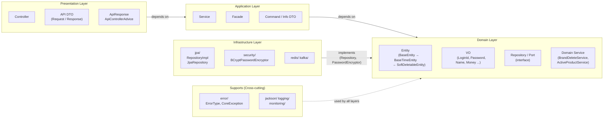

# 공명선

## mermaid 코드

## Domain Layer

기술 구현과 상관 없는 **기능적인 요구사항(공책 게임으로 구현할 수 있는 요구사항)**을 구현하는 레이어

### Entity, VO

JPA `@Entity`, `@Embeddable` 를 사용: 순수 도메인 엔티티보다 **현재 프로젝트에서는 JPA 엔티티로 구현했을 때 단점이 더 작다**고 판단하였기 때문. ⇒ 하지만 이 생각은 Deprecated 됨.

#### 순수한 도메인 엔티티로 사용했을 때 단점

- **JPA만의 편의성을 잃어버림:** JPA의 영속성 컨텍스트 사용 불가해 직접 구현해야 함
- **코드 복잡도 상승:** 관리해야 하는 레이어 및 코드 증가

#### JPA 엔티티로 사용했을 때 단점

- **비즈니스 로직 가독성 저하:** 엔티티의 기능 구현 시 JPA 고려해야 함
- **테스트 코드 작성 시 영속성 컨텍스트 고려:** 엔티티에 JPA가 강하게 의존
- **프레임워크 변경 시 엔티티 코드도 수정:** 도메인 레이어에 JPA가 강하게 의존

위 단점들을 비교해봤을 때 **현재 프로젝트**인 감성 이커머스에서는 J**PA 엔티티로 구현했을 때의 단점이 순수 도메인 엔티티로 구현했을 때보다 작다**고 판단함. 또한, 만약 예상치 못한 이유로 순수 도메인으로 변경해야 한다면 AI 로 빠르게 변경할 수 있다고 판단하여 JPA Entity 로 구현하게 됨.

### Domain Service

Domain Service 나만의 정의: Domain Service는 **단일 엔티티에서 구현 불가능**하지만, **하나의 BC 내에서 책임을 맡는 기능을 구현**

- Service 의 의미는 Input 과 Output 을 가지며 상태를 가지지 않는다는 걸 기반

  ⇒ **`Service == 함수의 객체화`** 라고 정의

- Domain Service도 하나의 객체라는 판단 하에 SRP 를 적용

  ⇒ **단일 엔티티에서 구현 불가능**하지만, **하나의 BC 내에서 책임을 맡는 기능**이라면 Domain Service에 해당

### Repository

- 도메인 레이어는 알 수 없는 저장소랑 상호작용(저장, 조회, 수정, 삭제)하는 용도.
- 공책 게임으로 치면 연필로 쓰고, 지우개로 지우고 하며 정보를 작성하는 것이라고 판단→ Domain 레이어에서 호출하는 것을 정당하다고 생각함. 그것 또한 도메인 레이어가 담당하는 것이 아닐까?

### CoreException(Custom Exception)

- AOP를 통해 예외 처리를 간단하게 처리하기 위해 커스텀 예외 클래스를 만듦
  - 기존처럼 레이어를 나누면 커스텀 예외 클래스를 모든 레이어마다 만들고 매핑해야 한다는 것을 깨달음
  - 예외 클래스에 대해서만 예외적으로 공통적인 클래스를 사용하는 것으로 우회함
- ⇒ Support Layer 로 이동할 예정

### 260223 Kev님 멘토링 듣고 나서 든 생각

- 처음에는 DIP를 빼버려야겠다 ! 생각함
  - 근데 DIP를 과제로 내주셨다는 것 == DIP는 요구사항이고, 기획의 의도가 담긴 것이 아닐까? 우리가 아직은 모르는 Repository 나 Entity의 변경사항이 이후 주차에서 생기기 때문에 DIP를 구현하는 것이 아닐까 ? 하는 생각이 들었음
  - ⇒ 결론적으로,  Repository, Entity 를 순수하게 유지하는 것이 결국 현재 프로젝트의 요구사항이라고 받아들여 Domain 레이어를 순수하게 유지히자고 생각함.
- Aggreagate 인가? BC 인가? ⇒ 트랜잭션을 배우고 나서 정해지지 않을까? 나는 BC 로 해야겠다
- Repository 는 실제로 쓸 때는 각각 어디에 두어야 하는가? (조회할 때는 어디에? 수정할 때는 어디에? 삭제할 때는 어디에? 생성할 때는 어디에 ???) ⇒ Domain 에 두되, 그걸 위해 필요한 정보들을 DTO로 내려주는 게 더 좋지 않을까?

## Application Layer

**비기능적인 요구사항(트랜잭션 등)**을 구현하거나, 도메인 레이어에서 해결하지 못하는 **여러 BC들을 조합하여 기능**을 구현하는 레이어.

### Application Service

여러 도메인 계층의 BC나 외부 기술 등을 응용하여 비즈니스 로직으로 조합시켜 만드는, 인풋과 아웃풋이 분명한 함수 같은 객체

### Facade

Service 들을 가져와서 조합해야 하는데 Service 사이의 순환 참조가 발생할 때, 이를 막기 위해 만들어진 패턴

## Presentation Layer (Interfaces Layer)

클래스를 매핑하여 **사용자나 다른 서버 등 인터페이스로 값을 표현**하는 레이어.

### API DTO

(컨트롤러 기준) Application 의 Command / Query DTO 로부터 API 요청값 및 응답값을 매핑해 레이어 사이 또는 다른 개체(클라이언트, 서버 등)와 통신함.

### ApiControllerAdvice

Domain 레이어의 ErrorType을 HttpStatus로 매핑

## Infrastructure Layer

Domain Layer 에서 DB 와 연결하여 도메인 객체를 가져다 쓸 수 있도록 하기 위해 **기존의 의존 방향을 뒤집어, Domain Layer 의 변경을 최소화**하기 위해 만들어진 레이어.

### RepositoryImpl

Domain 레이어의 Repository 를 구현해 DIP 를 만족하도록 구현하는 구현체. 실제 기능은 JpaRepository 에 위임

### JpaRepository

Spring Data Jpa 로 만들어둔 DB에서 값을 가져다 쓸 수 있는 Repository 객체
