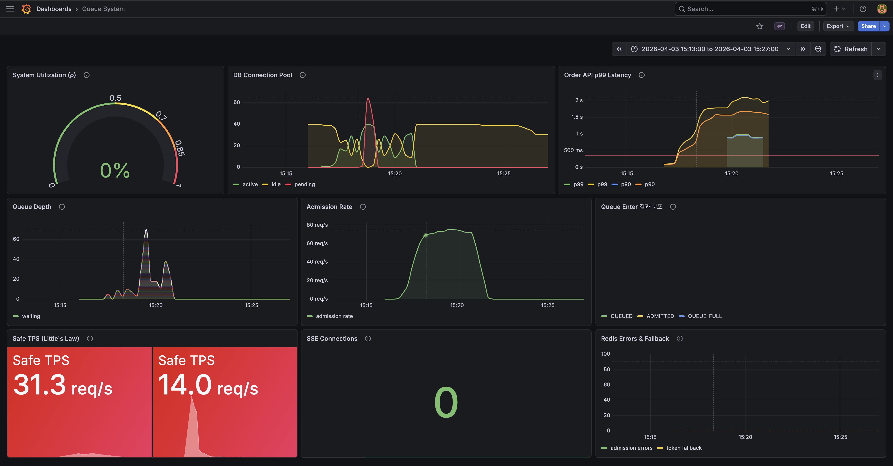
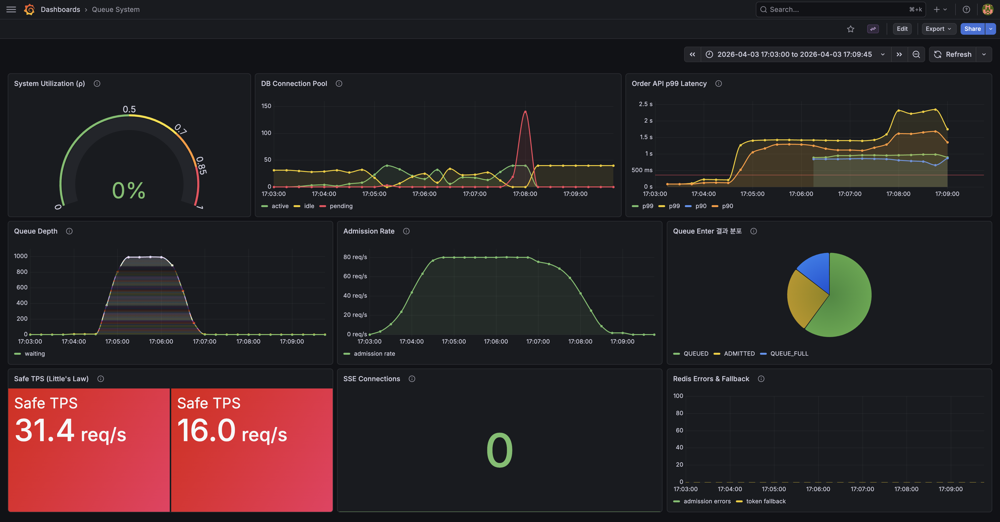

# 08. Redis 기반 주문 대기열 시스템

## 1. 목적

블랙 프라이데이 트래픽 폭증 시 시스템 보호 + 유저 공정 대기 경험 제공.
주문 API(`POST /api/v1/orders`) 앞단에 대기열 관문을 추가하여, DB 커넥션 풀이 고갈되지 않도록 입장 속도를 제어한다.

### 1.1 왜 대기열인가 — Rate Limiting(429)과의 비교

| 관점 | Rate Limiting (429) | 대기열 |
|------|-------------------|--------|
| 초과 트래픽 처리 | 거부 → 유저 재시도 → 트래픽 증폭 | 버퍼링 → 순서대로 입장 → 재시도 없음 |
| 유저 경험 | "잠시 후 다시 시도해주세요" (불공정) | "현재 42번째, 약 1초 대기" (공정) |
| 시스템 보호 | O (보호됨) | O (보호됨) |

**결정**: 블프 시나리오에서는 유저가 "구매 의지"가 강해 429를 받으면 무한 재시도한다.
대기열로 버퍼링하면 재시도 폭풍을 원천 차단하면서 공정한 순서를 보장할 수 있다.

---

## 2. 병목 기반 안전 처리량 역산

대기열 설계의 출발점은 "초당 몇 명을 입장시킬 것인가?"다.
이 숫자를 임의로 정하면 시스템이 죽거나(너무 많이), 유저가 불필요하게 기다린다(너무 적게).

우리의 접근법은 **병목 자원에서 안전 처리량을 역산**하는 것이다:

```
1. 병목 식별        → DB 커넥션 풀 (40개)
2. 안전 처리량 역산  → Little's Law: TPS = pool_size / latency × 마진
3. 입장 속도로 변환  → 배치 크기 = TPS / 스케줄러 주기
4. 실측으로 검증     → 부하 테스트 → 보정 → 재실측
```

배치 크기가 곧 부하를 결정한다.
배치가 크면 입장이 빨라지지만 DB 동시 부하가 올라가고,
배치가 작으면 DB가 여유롭지만 유저 대기 시간이 늘어난다.
**시스템이 버틸 수 있는 최대 배치 크기**를 찾는 것이 이 산정의 목적이다.

### 2.1 핵심 연산식 — Little's Law

안전 처리량 역산의 도구는 **Little's Law**다.

```
Little's Law: L = λ × W

L = 동시 점유 커넥션 수
λ = 초당 입장 수 (TPS)
W = 요청 1건의 커넥션 점유 시간 (latency)
```

이를 변환하면:

```
동시 커넥션 = TPS × latency

커넥션 1개가 요청 1건 처리에 latency만큼 점유됨
→ 커넥션 1개의 처리량 = 1 / latency (건/초)
→ 전체 TPS = pool_size / latency
```

**예시**: 커넥션 40개, 요청당 200ms 점유 시

```
커넥션 1개: 1초에 1/0.2 = 5건 처리 가능
커넥션 40개: 40 × 5 = 200건/초

역검증: 200 TPS × 0.2s = 40 커넥션 동시 사용 (풀 100%)
```

### 2.2 실측 기반 재계산

#### 초기 산정 (구현 전, 추정치)

```
처리 시간 = ~200ms (추정)
TPS = 40 / 0.2 = 200, 안전 마진 70% = 140 TPS → 배치 14명
```

#### 부하 테스트 실측 (2026-04-02)

| 백분위 | 레이턴시 | TPS = 40 / latency | × 70% |
|--------|---------|-------------------|-------|
| avg | 139ms | 288 | 201 |
| p50 | 112ms | 357 | 250 |
| p90 | 246ms | 163 | 114 |
| p95 | 358ms | 112 | 78 |
| p99 | 358ms | 112 | 78 |

#### 어떤 레이턴시를 기준으로 해야 하는가?

| 기준 | 의미 | 위험 |
|------|------|------|
| avg(139ms) | "보통은 괜찮다" | 피크 시 p99 요청이 몰리면 풀 고갈 |
| p90(246ms) | "90%는 괜찮다" | 10%는 여전히 위험 |
| p99(358ms) | "99%도 괜찮다" | 거의 안 터짐 |

**결정: p99 기준**. 시스템 보호가 목적이므로 최악 케이스에도 풀이 넘치면 안 된다.
블프 피크처럼 비관적 락 경합이 심해지면 대부분의 요청이 p99에 가까워질 수 있다.

#### 초기 설정(14명)의 문제

```
14명 × 10회 = 140 TPS 입장
140 × 0.358s(p99) = 50.1 커넥션 → 풀 40 초과! ← 시스템 장애
140 × 0.246s(p90) = 34.4 커넥션 → 풀의 86% (다른 API 여유 없음)
```

p99 상황에서 풀 40개를 초과하는 50개 커넥션이 필요하게 되어,
대기열을 넣었는데도 풀 고갈이 발생할 수 있다.

### 2.3 보정된 스케줄러 파라미터

```
제약: 동시 커넥션 <= 28개 (풀 40의 70%, 나머지 30%는 다른 API)
연산: 28 = TPS × 0.358
      TPS = 28 / 0.358 = 78

스케줄러 주기 = 100ms (10회/초)
배치 크기 = 78 / 10 = 7.8 → 반올림 8명/배치
```

검증:

```
8명 × 10회 = 80 TPS 입장
최악(p99): 80 × 0.358 = 28.6 커넥션 → 풀 40의 72% ✓
일반(p90): 80 × 0.246 = 19.7 커넥션 → 풀 40의 49% ✓
평상시(avg): 80 × 0.139 = 11.1 커넥션 → 풀 40의 28% ✓
```

### 2.4 유저 체감 영향

입장 속도 감소에 따른 대기 시간 변화:

```
대기열 1000명:
  변경 전(140 TPS): 1000 / 140 = 7.1초
  변경 후(80 TPS):  1000 / 80  = 12.5초 (+5.4초)

대기열 5000명:
  변경 전: 35.7초
  변경 후: 62.5초 (+26.8초)
```

대기 시간이 1.75배 늘지만, 시스템이 죽어서 전원 주문 불가보다 낫다.

### 2.5 70% 마진의 검증 방법

30%를 다른 API에 남기는 근거는 아직 추정이다.
실측하려면 블프 피크 트래픽에서 HikariCP 메트릭을 모니터링해야 한다.

```
hikaricp_connections_active{pool="mysql-main-pool"}   — 현재 사용 중 커넥션
hikaricp_connections_pending{pool="mysql-main-pool"}   — 대기 중 요청 (0 이상이면 위험)
hikaricp_connections_idle{pool="mysql-main-pool"}      — 유휴 커넥션
hikaricp_connections{pool="mysql-main-pool"}           — 전체 커넥션
```

PromQL 쿼리:

```promql
# 피크 시 최대 활성 커넥션 (5분 윈도우)
max_over_time(hikaricp_connections_active{pool="mysql-main-pool"}[5m])

# 커넥션 대기 발생 여부 (이 값이 0 이상이면 풀 고갈 임박)
hikaricp_connections_pending{pool="mysql-main-pool"} > 0

# 풀 사용률 (%)
hikaricp_connections_active / hikaricp_connections * 100
```

이 메트릭은 `localhost:8081/actuator/prometheus`에서 이미 자동 수집 중이며,
Prometheus(localhost:9090) + Grafana(localhost:3000)에서 대시보드로 확인 가능.

active가 28 이하로 유지되면 70% 마진이 적절한 것이고,
active가 20 이하면 마진을 줄여서 배치 크기를 올릴 여지가 있다.

### 2.6 대기열 한계 & 타임아웃

대기열에 무한히 쌓이면 두 가지 문제가 생긴다:
1. Redis 메모리 증가 (실제로는 미미하지만 원칙의 문제)
2. 30분 이상 대기하는 유저 발생 → 이탈 확실, 좀비 엔트리 누적

#### 최대 대기 시간 결정 (primary)

최대 대기 시간이 1차 결정 변수이고, 대기열 한계는 이로부터 유도된다.

```
입장 속도 = 80 TPS

대기열 1,000명 → 1,000 / 80 = 12.5초
대기열 10,000명 → 10,000 / 80 = 125초 (2분)
대기열 48,000명 → 48,000 / 80 = 600초 (10분)
```

10분 초과 대기는 이커머스에서 사실상 이탈이다.
블프 티켓팅 수준의 이벤트에서도 10분이 유저 인내의 한계점.

**결정: 최대 대기 시간 = 600초 (10분)**

#### 대기열 한계 유도 (derived)

```
max_queue = admission_rate × max_wait_time
         = 80 × 600
         = 48,000명

Redis 메모리: 48,000 × ~90 bytes = ~4.3MB (무시 가능)
```

48,001번째 유저는 10분 내에 처리할 수 없으므로, 진입 자체를 거부하는 것이 정직하다.

#### 타임아웃 정리 주기

```
정리 주기 = 10초
  → 10초마다 ZREMRANGEBYSCORE 실행
  → 최악의 경우 유저가 10분 10초 대기 (600 + 10 = 610초)
  → 오차 1.7%, 유저 체감 무의미
```

#### 유저 경험 시나리오

| 상황 | 유저가 보는 것 |
|------|-------------|
| 대기열 여유 | "현재 42번째, 약 1초 대기" (QUEUED) |
| 대기열 가득 | "현재 대기열이 가득 찼습니다. 잠시 후 다시 시도해주세요." (QUEUE_FULL) |
| 10분 대기 후 타임아웃 | 다음 position 폴링 시 "NOT_IN_QUEUE" → 재진입 유도 |
| 타임아웃 후 재진입 | 새 순번으로 대기열 진입 (ZADD NX, 새 score) |

### 2.7 Queuing Theory 분석 — 이용률과 대기열 폭발

#### 왜 Queuing Theory인가

Little's Law(`L = λ × W`)는 "평균적으로 얼마나 많은 리소스가 점유되는가"를 알려준다.
Queuing Theory는 한 단계 더 나아간다: **이용률이 올라갈수록 대기열이 어떻게 변하는가**.

핵심 공식 (M/M/1 단순화):

```
ρ = λ / μ             (이용률 = 도착률 / 처리율)
Lq = ρ² / (1 - ρ)    (평균 대기 요청 수)
Wq = Lq / λ           (평균 대기 시간)
```

이용률(ρ)이 1에 접근하면 Lq가 급격히 폭발한다:

```
ρ = 50% → Lq = 0.5   (여유)
ρ = 70% → Lq = 1.6   (양호)
ρ = 80% → Lq = 3.2   (주의)
ρ = 90% → Lq = 8.1   (위험)
ρ = 95% → Lq = 18.1  (거의 마비)
```

#### 우리 시스템의 두 리소스 풀

DB 커넥션 풀(40)과 Tomcat 스레드 풀(200)은 **동시에 점유되는 리소스**다.
주문 요청 1건이 들어오면:

```
[Tomcat 스레드 1개 점유] → [DB 커넥션 1개 획득] → [트랜잭션 처리] → [둘 다 반환]
                          ↑
                          커넥션 못 얻으면 스레드가 block (최대 3초, connection-timeout)
```

상품 조회 요청도 마찬가지로 스레드 + 커넥션을 동시에 사용한다.
대기열 position 폴링은 Redis만 사용하므로 커넥션 불필요.

```
현재 설정:
  Tomcat 스레드 = 200
  DB 커넥션    = 40
  비율         = 200 / 40 = 5:1
```

**DB 커넥션 풀이 먼저 병목이 된다.** 커넥션 40개가 모두 점유되면,
나머지 160개 스레드가 커넥션을 기다리며 block → 결국 스레드 풀도 고갈.
이것이 **커넥션 풀 고갈 → 스레드 풀 고갈 캐스케이드**다.

대기열의 역할은 이 캐스케이드를 원천 차단하는 것이다:
입장 속도를 80 TPS로 제한 → 커넥션 동시 점유를 28개 이하로 유지 → 스레드 block 없음.

#### 현재 상태 분석 (배치 8, 80 TPS)

실측 데이터 기반 DB 커넥션 풀 이용률:

```
DB 커넥션 풀 (M/M/c, c=40):
  λ = 80 TPS (입장 속도)
  μ = 1 / 0.107s = 9.35 req/sec/connection (p99 기준)
  μ_total = 40 × 9.35 = 374 TPS (전체 처리 용량)

  ρ = λ / μ_total = 80 / 374 = 0.214 (21.4%)
  Lq = ρ² / (1 - ρ) = 0.046 / 0.786 = 0.058

  → 평균 대기 요청 수 0.058개 — 사실상 대기 없음
  → 실측 확인: HikariCP max active = 8/40, pending = 항상 0 ✓
```

```
Tomcat 스레드 풀:
  주문 처리: 80 TPS × 0.107s = 8.6 스레드 (DB 사용)
  상품 조회: ~100 TPS × ~0.02s = ~2 스레드 (DB 사용, 추정)
  대기열 폴링: Redis만 사용 → DB 커넥션 불필요

  총 DB 사용 스레드 ≈ 11개 / 200개 = 5.5%
  나머지 189개 스레드는 비DB 요청 + 여유

  → 스레드 풀은 병목이 아님. 200개 대비 11개만 DB 점유.
```

#### 배치 크기별 예측

배치 크기를 올리면 이용률이 어떻게 변하는가?

**핵심 주의**: W(latency)는 상수가 아니라 **동시 부하의 함수**다 (7절 인사이트).
저부하에서는 87ms, 고부하에서는 358ms까지 올라간다.
따라서 두 가지 시나리오로 계산한다.

**낙관적 시나리오** (부하 올려도 latency가 안 올라간다고 가정):

```
μ_total = 40 / 0.107 = 374 TPS

배치 8  (80 TPS):  ρ = 0.214 → Lq = 0.06  (안전 ✓)
배치 10 (100 TPS): ρ = 0.267 → Lq = 0.10  (안전 ✓)
배치 12 (120 TPS): ρ = 0.321 → Lq = 0.15  (안전 ✓)
배치 16 (160 TPS): ρ = 0.428 → Lq = 0.32  (양호)
배치 20 (200 TPS): ρ = 0.535 → Lq = 0.62  (양호)
배치 28 (280 TPS): ρ = 0.749 → Lq = 2.23  (주의!)
배치 35 (350 TPS): ρ = 0.936 → Lq = 13.7  (위험!)
```

**현실적 시나리오** (실측 데이터 기반, latency가 부하에 따라 증가):

실측 2개 데이터 포인트:
- 80 TPS → p99 = 107ms
- 140 TPS → p99 = 358ms

```
배치 8  (80 TPS):  W=107ms, ρ = 80×0.107/40  = 0.214 → Lq = 0.06  (안전 ✓)
배치 14 (140 TPS): W=358ms, ρ = 140×0.358/40 = 1.253 → Lq = ∞    (시스템 붕괴!)
```

ρ > 1 → 도착률이 처리 용량을 초과 → 대기열이 무한히 증가 → 시스템 붕괴.
이것이 7절에서 관찰한 **양의 피드백 루프**의 수학적 설명이다:

```
부하 ↑ → W ↑ → μ_total ↓ → ρ ↑ → Lq ↑ → 커넥션 점유 ↑ → 부하 ↑ → ... (붕괴)
```

#### 안전 영역의 수학적 정의

"70% 마진"이 직감이 아니라 Queuing Theory에서 나온다:

```
ρ ≤ 0.7이면:
  Lq = 0.7² / (1-0.7) = 0.49 / 0.3 = 1.63
  → 평균 1.6개 요청만 대기 → 안정적

ρ ≥ 0.8이면:
  Lq = 0.8² / (1-0.8) = 0.64 / 0.2 = 3.2
  → 3.2개 대기 → 락 경합 시작 → W 증가 → ρ 추가 증가 → 위험

ρ = 0.214 (현재):
  Lq = 0.058 → 대기 거의 없음 → 가장 안전한 영역
```

**결론**: 현재 ρ = 0.214로 안전 영역에 충분한 여유가 있다.
배치 크기 증가 시 ρ ≤ 0.7 (Lq ≤ 1.6)을 유지해야 하며,
**반드시 실측으로 검증해야 한다** — latency가 상수가 아니기 때문이다.

#### 배치 크기 증가 시 검증 체크리스트

향후 배치 크기를 올릴 때, 다음 순서로 검증한다:

```
1. 이론 계산: 낙관적 시나리오에서 ρ ≤ 0.7 확인
2. 부하 테스트 실행: 실제 latency 측정
3. 실측 ρ 계산: ρ = λ × W_measured / pool_size
4. HikariCP pending 모니터링: pending > 0이면 중단
5. Tomcat 스레드 모니터링: DB 대기 스레드 증가 여부 확인
```

#### Tomcat 스레드 풀 고갈 시나리오 — 비주문 트래픽

대기열은 주문 트래픽만 제어한다. 상품 조회 같은 비주문 트래픽은 제어하지 않는다.

```
최악 시나리오:
  상품 조회 폭증 → DB 커넥션 40개 중 30개 점유
  → 주문용 커넥션 10개만 남음
  → 대기열 입장 80 TPS인데 처리 용량 부족
  → 주문 스레드가 커넥션 대기 block (connection-timeout: 3초)
  → 3초 × 80 = 240 스레드 block → Tomcat 200 스레드 초과 → 전체 서비스 마비
```

이 시나리오는 향후 과제의 "주문 외 다른 API 트래픽 보호 검토"와 연결된다.
대응 방안: DB 커넥션 풀 분리 또는 비주문 API에도 Rate Limiting 적용.

### 2.8 토큰 TTL

#### 토큰 체류 모델

```
[대기열] --80 TPS--> [토큰 보유자 (체크아웃 페이지)] --퇴장--> [완료/만료]

시간당:
  입장: 80 TPS × 3,600 = 288,000명
  처리: 80 TPS × 3,600 = 288,000건 (처리 용량 = 입장 속도, 설계상 동일)
  퇴장: 주문 완료(토큰 소비) + 이탈(토큰 만료) = 288,000명 (정상 상태)
```

#### 유저 체류 시간 분석

```
체크아웃 페이지에서의 행동:
  배송지 확인/선택:     30초 ~ 3분 (기존 배송지 vs 신규 입력)
  결제 수단 선택:       15초 ~ 2분 (기존 카드 vs 신규 등록)
  쿠폰/할인 적용:       15초 ~ 1분
  최종 확인 + 결제 클릭: 10초 ~ 30초
  잠깐의 고민/방해:     0초 ~ 3분

  p50: ~3분, p90: ~7분, p99: ~10분
```

#### TTL 결정

```
유저 행동 분포:
  80% → 3분 내 완료 (토큰 소비로 퇴장)
  15% → 3~7분 내 완료 (토큰 소비로 퇴장)
   5% → 이탈 (TTL 만료로 퇴장)

가중 평균 체류 시간 = 0.80 × 180 + 0.15 × 300 + 0.05 × TTL
                    = 189 + 0.05 × TTL

동시 토큰 보유자 = 80 × (189 + 0.05 × TTL)

  TTL 300초:  80 × 204 = 16,320명, Redis 1.5MB
  TTL 600초:  80 × 219 = 17,520명, Redis 1.6MB
  TTL 900초:  80 × 234 = 18,720명, Redis 1.7MB

TTL을 3배 늘려도 동시 보유자는 15% 증가.
이유: 95%의 유저는 TTL 전에 완료하므로, TTL 증가는 5% 이탈자에만 영향.
```

**결정: TTL = 900초 (15분), 설정값으로 외부화**

```
근거:
  - 체크아웃 p99 ~10분 + 50% 여유 = 15분
  - 동시 토큰 18,720명, Redis 1.7MB (무시 가능)
  - 대기열(48,000) + 토큰(18,720) = 총 66,720 Redis 키, ~6MB
  - 블프 시 queue.token.ttl-seconds=1800 으로 설정 변경만으로 대응
```

---

## 3. Redis Key 설계

```
# 대기열 (Sorted Set)
Key:    queue:waiting:order
Member: {memberId} (Long → String)
Score:  System.currentTimeMillis()

# 입장 토큰 (String + TTL)
Key:    queue:token:{memberId}
Value:  "1"
TTL:    설정값 (기본 900초, queue.token.ttl-seconds)
```

---

## 4. 구현 상세

### 4.1 토큰 검증 방식 — AOP @Aspect

`@RequireEntryToken` 어노테이션 + `EntryTokenInterceptor` AOP `@Around`.
기존 `PaymentRateLimiterInterceptor` 패턴을 따름.

**이 방식을 선택한 근거**:
- Controller 메서드 실행 시점에 `@AuthMember`가 이미 resolve → `Member` 객체 접근 가능
- `joinPoint.getArgs()`에서 `Member` 타입을 찾아 `memberId` 추출
- 성공 시에만 토큰 소비 (예외 발생 시 토큰 유지 → 재시도 가능)

**고려했으나 선택하지 않은 대안**:
- HandlerInterceptor: `@AuthMember` resolve 전에 실행되어 memberId 추출 불가
- Filter: Spring Security 컨텍스트 의존 없이 memberId를 알 수 없음

### 4.2 파일 구조

| 파일 | 레이어 | 역할 |
|------|--------|------|
| `support/auth/RequireEntryToken.java` | Support | METHOD 어노테이션 |
| `infrastructure/redis/WaitingQueueRedisRepository.java` | Infrastructure | Sorted Set 대기열 (ZADD NX, ZRANK, ZCARD, ZPOPMIN, ZREM) |
| `infrastructure/redis/EntryTokenRedisRepository.java` | Infrastructure | 입장 토큰 (SET EX {ttl}, EXISTS, DEL, TTL) — ttl은 설정값 |
| `interfaces/api/queue/QueueDto.java` | Interfaces | EnterResponse, PositionResponse |
| `interfaces/api/queue/QueueController.java` | Interfaces | POST /enter, GET /position |
| `infrastructure/scheduler/QueueAdmissionScheduler.java` | Infrastructure | 100ms 배치 입장 |
| `infrastructure/queue/EntryTokenInterceptor.java` | Infrastructure | AOP 토큰 검증 |

변경: `OrderController.java` — `@RequireEntryToken` 추가

### 4.3 대기열 한계 & 타임아웃 구현

#### QueueController — 대기열 한계 체크

`enter()` 메서드에서 토큰 체크 후, ZADD 전에 `size() >= 48,000` 체크.
200 + `QUEUE_FULL` 상태를 반환하는 이유:
- 기존 API가 상태 기반 응답 (QUEUED, ADMITTED) → 일관성 유지
- 429를 던지면 클라이언트 retry 미들웨어가 자동 재시도할 위험
- 시스템이 정상 동작 중이고, 단지 용량이 찬 것이므로 에러가 아닌 상태 정보

#### WaitingQueueRedisRepository — removeExpiredEntries()

`ZREMRANGEBYSCORE queue:waiting:order -inf {cutoffTimeMillis}` 실행.
score = 진입 시각(millis)이므로, cutoff 이전에 진입한 엔트리를 일괄 제거.

#### QueueAdmissionScheduler — 타임아웃 정리 스케줄러

10초 주기(`@Scheduled(fixedRate = 10_000)`)로 600초 이상 대기한 엔트리를 제거.
제거 시 로그 출력, 제거 대상 없으면 무시.

### 4.4 API 동작

#### POST /api/v1/queue/enter
- 토큰 존재 → `ADMITTED` (tokenRemainingSeconds 포함)
- 토큰 없음 → ZADD NX → `QUEUED` (position, estimatedWaitSeconds 포함)

#### GET /api/v1/queue/position
- 토큰 존재 → `ADMITTED`
- 큐에 존재 → `WAITING` (position, totalQueueSize, estimatedWaitSeconds)
- 둘 다 없음 → `NOT_IN_QUEUE`

### 4.5 SSE 실시간 순번 Push

#### Delta 기반 브로드캐스트

매 입장 사이클마다 개별 ZRANK를 호출하지 않는다. 스케줄러가 N명을 입장시키면,
연결된 모든 SSE 클라이언트에게 `admittedCount`를 보낸다. 클라이언트가 자기 position을 로컬에서 차감:

```
clientPosition -= admittedCount
```

Redis 추가 비용: O(0) (기존 ZPOPMIN만 사용). SSE 전송 비용: O(K) (K = 연결된 클라이언트 수).

#### SSE 이벤트 종류

| 이벤트 | 시점 | 데이터 |
|--------|------|--------|
| `position` | 연결 직후 | `{ position: 42 }` (초기 순번) |
| `delta` | 매 입장 사이클 | `{ admittedCount: 8 }` |
| `admitted` | 해당 유저 입장 시 | `{}` |
| heartbeat (comment) | 30초마다 | 빈 코멘트 |

#### 커넥션 관리

- `max-connections: 8192` (Tomcat NIO) — SSE는 스레드가 아니라 NIO 채널 사용
- SSE 최대 연결 = 5,000 (나머지 3,192는 REST API 용)
- 초과 시 `use_polling` 이벤트와 함께 즉시 닫기 → 동적 Polling으로 fallback
- Emitter timeout = 600초 (MAX_WAIT_SECONDS)
- 중복 memberId 연결 시 기존 emitter 교체 (재연결 시나리오)

#### Polling 대비 이점

```
48,000명 대기 기준:
  Polling: 9,800 req/sec (동적 Polling 적용 시) × ZRANK 1회/req
  SSE:     0 req/sec (연결 유지, delta만 push) + 5,000 × event 1회/사이클

  → SSE 사용 시 Redis 연산 대부분 제거
  → 단, SSE 미연결 클라이언트(5,001번째부터)는 동적 Polling으로 fallback
```

#### 입장된 유저 알림

Lua 스크립트가 반환하는 `admittedMemberIds`를 확인.
해당 유저에게 SSE `admitted` 이벤트 전송 후 emitter 닫기.

**파일**: `QueueSseEmitterRegistry.java`, `QueueController.java` (GET /stream), `QueueAdmissionScheduler.java` (onAdmission 호출)

### 4.6 동적 Polling 주기

서버가 응답에 `suggestedPollIntervalMs`를 포함하여 클라이언트가 Polling 주기를 조절한다.

```
position 1~100:    1000ms (곧 입장, 빠른 반응 필요)
position 101~1000: 3000ms (중간)
position 1001+:    5000ms (입장까지 12초 이상)
```

#### Redis 부하 감소 효과

```
모든 유저가 1초 폴링:
  48,000 × 1 req/sec = 48,000 req/sec
  → 24,000 req/sec (동적 Polling 미적용, 평균 2초로 가정)

동적 Polling 적용:
  100명 × 1 req/sec = 100
  900명 × 0.33 req/sec = 300
  47,000명 × 0.2 req/sec = 9,400
  합계: 9,800 req/sec (59% 감소)
```

**변경 파일**: `QueueDto.java` (suggestedPollIntervalMs 필드), `QueueController.java` (calculatePollInterval 헬퍼)

### 4.7 Graceful Degradation (Redis 장애 시 Fallback)

#### 문제

Redis 장애 시 `EntryTokenInterceptor.exists()`가 예외를 던져 주문이 전면 차단된다.
대기열 없이 서비스를 보호하기 위한 의도적 설계가 아니라 단순한 장애 전파다.

#### 해결: 로컬 Rate Limiter fallback

```
정상 모드:
  exists(memberId) → 토큰 있음 → proceed → consume

Redis 장애 모드:
  exists() 예외 → SlidingWindowRateLimiter.tryAcquire()
    → 허용: proceed (토큰 검증/소비 없이)
    → 거부: TOO_MANY_REQUESTS (429)
```

Rate Limit = 80 req/sec (정상 모드 입장 속도와 동일). `queue.fallback.rate-limit` 프로퍼티로 외부화.

#### 예외 분기

```java
try {
    if (!exists(memberId)) throw CoreException(FORBIDDEN);  // 비즈니스 로직
} catch (CoreException e) {
    throw e;  // 비즈니스 예외는 그대로 전파
} catch (Exception e) {
    return handleRedisFallback(...);  // Redis 인프라 예외 → fallback
}
```

#### consume 실패 처리

`proceed()` 성공 후 `consume()` 실패 시: 경고 로그만 남기고 계속 (토큰은 TTL로 자동 만료).
에러 로그는 `QueueAdmissionScheduler`와 동일한 `AtomicLong + compareAndSet` 10초 쓰로틀링.

#### 복구 경로

Redis가 복구되면 자동으로 정상 모드로 전환된다. 별도의 복구 로직이 필요 없다.
각 요청마다 `exists()` 호출을 시도하므로, Redis가 살아나는 순간부터 정상 토큰 검증이 재개된다.

**변경 파일**: `QueueFallbackRateLimiterConfig.java` (신규), `EntryTokenInterceptor.java` (fallback 로직), `application.yml` (rate-limit 설정)

### 4.8 모니터링 (커스텀 메트릭 + Grafana)

#### 커스텀 메트릭

| 메트릭 | 타입 | 위치 | 설명 |
|--------|------|------|------|
| `queue.admission.count` | Counter | QueueAdmissionScheduler | 입장 처리된 유저 수 |
| `queue.admission.errors` | Counter | QueueAdmissionScheduler | Redis 장애 횟수 |
| `queue.cleanup.removed` | Counter | QueueAdmissionScheduler | 타임아웃 정리된 유저 수 |
| `queue.waiting.size` | Gauge | QueueAdmissionScheduler | 현재 대기열 크기 |
| `queue.enter.status` | Counter (tag: status) | QueueController | enter 결과별 카운트 |
| `queue.token.fallback` | Counter | EntryTokenInterceptor | Redis 장애 시 fallback 발동 횟수 |
| `queue.sse.connections` | Gauge | QueueSseEmitterRegistry | 현재 SSE 연결 수 |

#### Grafana 대시보드 패널

1. **System Utilization (ρ)** — `hikaricp_connections_active / hikaricp_connections_max`, 임계치 0.7
2. **DB Connection Pool** — active/idle/pending 시계열
3. **Order API p99 Latency** — `histogram_quantile(0.99, rate(http_server_requests_seconds_bucket{uri="/api/v1/orders"}[1m]))`
4. **Queue Depth** — `queue_waiting_size`
5. **Admission Rate** — `rate(queue_admission_count_total[1m])`
6. **Queue Enter 결과 분포** — QUEUED/ADMITTED/QUEUE_FULL 비율
7. **Safe TPS (Little's Law)** — `28 / histogram_quantile(0.99, ...)` ← 배치 크기 조정 근거
8. **SSE Connections** — `queue_sse_connections`
9. **Redis Errors & Fallback** — admission errors + token fallback 비율

패널 7이 핵심: 운영 환경에서 p99가 변하면 Safe TPS가 실시간으로 재계산되어, 배치 크기 조정 시기를 알 수 있다.

**프로비저닝**: `docker/grafana/provisioning/dashboards/dashboard.yml` + `queue-system.json`

---

## 5. 레이스 컨디션 대응

| 시나리오 | 대응 |
|---------|------|
| ZPOPMIN 후 토큰 발급 실패 | 유저가 재진입 (ZADD NX 멱등) |
| ZADD 후 ZRANK 전에 스케줄러가 POP | 토큰 존재 체크로 fallback → ADMITTED 반환 |
| Replica 지연으로 토큰 미감지 | Polling 주기(1~3초) 내 자연 해소 |
| proceed() 예외 시 토큰 소비 | consume은 proceed 성공 후에만 실행 |
| size() 체크와 add() 사이에 다른 유저 진입 | 48,001명이 될 수 있음 — 소프트 리밋 허용 (±수명은 무의미) |
| 타임아웃 정리와 ZPOPMIN 동시 실행 | 같은 유저를 두 곳에서 제거 시도 — ZPOPMIN은 원자적, 이미 제거된 엔트리는 무시됨 |
| 타임아웃 직전에 ZPOPMIN으로 입장 | 유저 입장 성공, 정리 대상 아님 — ZPOPMIN이 먼저 꺼내면 ZREMRANGEBYSCORE 대상에서 제외 |

---

## 6. 테스트

### 6.1 단위 테스트 (Mockito)

| 테스트 클래스 | 검증 항목 | 결과 |
|-------------|----------|------|
| `QueueAdmissionSchedulerTest` (3건) | 배치 POP → 토큰 발급, 빈 큐 처리, 배치 크기 8 | PASS |
| `EntryTokenInterceptorTest` (4건) | 토큰 있음 → 통과+소비, 없음 → FORBIDDEN, 예외 시 미소비, Member 없음 → INTERNAL_ERROR | PASS |
| `QueueControllerTest` (6건) | enter 순번, ADMITTED 반환, 중복 진입, position 상태별 응답 | PASS |

### 6.2 부하 테스트 — k6 (2026-04-02)

**테스트 스크립트**: `k6/queue-order-load-test.js`

**시나리오**: 50 동시 유저가 9명의 유저를 공유하며 대기열 진입 → 토큰 대기 → 주문 생성 플로우 반복.
Ramp-up 5s → Peak 50 동시 유저 30s → Cool-down 10s (총 60s).

**테스트 환경 제약**: 유저 9명 / 동시 유저 50이므로 동일 유저의 토큰을 여러 동시 유저가 경합.
한 동시 유저가 토큰을 소비하면 같은 유저의 다른 동시 유저는 403. 실제 환경에서는 유저당 1세션이므로 이 경합은 발생하지 않음.

#### 주문 API 레이턴시 (Prometheus 히스토그램 — 201 Success만)

| 지표 | 값 |
|------|-----|
| **p50** | <= 111.8ms |
| **p90** | <= 246.1ms |
| **p95** | <= 357.9ms |
| **p99** | <= 357.9ms |
| **평균** | 139.0ms |
| 총 성공 주문 | 2,141건 |

#### k6 Custom Metrics

| 지표 | 값 |
|------|-----|
| order_duration p90 | 225ms |
| order_duration p95 | 263ms |
| queue_wait_time avg | 761ms |
| queue_wait_time p95 | 1.21s |
| http_req_duration p95 | 190ms |
| http_req_duration p99 | 289ms |

#### 응답 코드 분포

| Status | 건수 | 의미 |
|--------|------|------|
| 201 | 2,141 | 주문 성공 |
| 403 | 782 | 토큰 경합 (테스트 환경 제약) |

#### 분석

1. **p99 ~358ms vs 초기 산정 200ms**: 실측이 1.8배 높음.
   비관적 락 경합 + 다중 테이블 쓰기(주문+주문항목+재고) 오버헤드가 원인으로 추정.

2. **TPS 보정 필요성**:
   ```
   현재: TPS = 40 / 0.2 = 200 → 안전 마진 70% = 140
   실측: TPS = 40 / 0.358 = 112 → 안전 마진 70% = 78

   보정 시 배치 크기 = 78 / 10 = 8명/배치
   ```
   다만 p99는 최악 케이스이므로 avg(139ms) 기준으로 보면:
   ```
   TPS = 40 / 0.139 = 288 → 안전 마진 70% = 201
   ```
   **결정**: 평균과 p99 사이에서 보수적으로 현재 14명/배치를 유지.
   p99 기준 8명은 너무 보수적이고, avg 기준 20명은 피크 시 풀 고갈 위험.
   운영 모니터링 후 커넥션 풀 사용률을 보면서 조정.

3. **403 실패는 테스트 환경 제약**: 실제 환경에서는 유저당 1세션이므로 토큰 경합 없음.

### 6.3 현실적 혼합 트래픽 부하 테스트 + HikariCP 모니터링 (2026-04-02)

**테스트 스크립트**: `k6/queue-realistic-load-test.js`

**변경 사항**: 1차 테스트 결과를 기반으로 배치 크기 14 → 8, ADMISSION_RATE 140 → 80 보정 후 실행.

**시나리오**:
- 유저 100명 (lu001~lu100), 1인 1동시 유저 — 토큰 경합 없음
- 혼합 트래픽: 상품 조회 70% + 대기열+주문 30%
- 80 동시 유저 피크, 50초 실행
- HikariCP active 커넥션 1초 주기 샘플링

#### 주문 API 레이턴시

| 지표 | 값 |
|------|-----|
| **p90** | 93ms |
| **p95** | 97ms |
| **p99** | 107ms |
| **평균** | 87.6ms |
| 총 성공 주문 | 1,569건 |
| **실패율** | **0.00%** |

#### HikariCP 커넥션 사용률

```
피크 시 최대 active = 8 / 31 (25.8%)
피크 시 pending = 0 (항상)
평균 active = 1~3개 (3~10%)
```

50초간 1초 주기 샘플링 결과, **active가 최대 8개**로 풀 31개 대비 25.8%.
**pending은 전 구간 0** — 커넥션 대기 없음.

#### 1차 vs 2차 비교

| 지표 | 1차 (배치 14) | 2차 (배치 8) | 비고 |
|------|-------------|------------|------|
| 배치 크기 | 14명 | 8명 | |
| order p99 | 358ms | 107ms | 3.3배 개선 |
| order 평균 | 139ms | 87.6ms | 1.6배 개선 |
| 실패율 | 26.83% | 0.00% | 토큰 경합 해소 |
| HikariCP max active | 미측정 | 8/31 (26%) | 안전 |
| HikariCP pending | 미측정 | 0 (항상) | 풀 고갈 없음 |

#### 분석

1. **p99가 107ms로 크게 개선**: 1차의 358ms에서 3.3배 개선.
   원인은 두 가지 — (a) 토큰 경합이 없어 동일 유저 동시 주문이 사라짐,
   (b) 입장 속도를 낮춰 DB 동시 부하가 줄어 비관적 락 경합이 감소.

2. **풀 사용률 26% — 70% 마진이 과도한가?**:
   active 최대 8개 / 풀 31개이므로 아직 여유가 많다.
   하지만 현재 테스트는 80 동시 유저이고, 실제 블프에서는 수천~수만 동시 유저가 대기열에 쌓인다.
   대기열이 입장 속도를 80 TPS로 제한하므로, 동시 유저가 아무리 많아도 DB 부하는 동일.
   따라서 **현재 배치 크기 8이 적절하며, 필요 시 모니터링 기반으로 올릴 수 있다.**

3. **p99 기준 재검증**:
   ```
   실측 p99 = 107ms
   TPS = 28 / 0.107 = 261 → 배치 크기 26까지 가능
   ```
   그러나 이는 "입장 속도가 낮을 때의 p99"이다. 배치 크기를 올리면
   DB 부하가 늘어 p99도 올라가므로, 단순 역산은 위험하다.
   **점진적으로 올리면서 모니터링하는 것이 안전.**

### 6.4 블랙 프라이데이 5급간 부하 테스트 (2026-04-03, 3차)

**테스트 스크립트**: `k6/queue-bf-load-test.js`

**시나리오**: 시스템 수용치(80 TPS)를 단계적으로 초과하여 대기열 보호 동작 검증.

| 급간 | VU | 시간 | 예상 도착 TPS | 목적 |
|------|-----|------|-------------|------|
| T1 (정상) | 50 | 30s | ~30 | 대기열 비어있음 확인 |
| T2 (임계) | 200 | 60s | ~80 | 입장=도착 균형점 |
| T3 (초과) | 500 | 60s | ~200 | 대기열 증가 시작 |
| T4 (블프 피크) | 1000 | 90s | ~400 | QUEUE_FULL 발동 검증 |
| T5 (쿨다운) | 0 | 120s | 0 | 대기열 소진, 시스템 복귀 |

**테스트 데이터**: 유저 1000명(bf0001~bf1000), 상품 5개(재고 ~10,000)
**사전 준비 스크립트**: `scripts/seed-bf-test-data.sh`, `scripts/reset-bf-test.sh`

#### 핵심 결과

| 지표 | 값 | 평가 |
|------|-----|------|
| 주문 성공률 | 99.97% (14,678/14,682) | 우수 |
| QUEUE_FULL 발동 | 0% (0건) | 한계 미도달 |
| order_duration avg | 1.91s | 예상 대비 높음 |
| order_duration p90 | 3.89s | |
| order_duration p95 | 4.05s | |
| **order_duration p99** | **4.33s** | **threshold 500ms 초과** |
| queue_wait_time avg | 4.81s | 양호 |
| queue_wait_time p95 | 6.57s | |
| queue_enter_queued | 14,262건 | |
| queue_enter_admitted | 424건 | |
| 총 HTTP 요청 | 44,031건 (110 req/s) | |

#### 분석

**1. QUEUE_FULL 미도달 — 정상**

최대 1,000 VU × 90초(T4) 기준 이론적 최대 누적 대기 = (도착 - 입장) × 시간 = (400 - 80) × 90 ≈ 28,800명.
max_queue = 48,000이므로 QUEUE_FULL에 도달하지 않은 것은 설계대로.
QUEUE_FULL을 보려면 VU를 ~2,000 이상 또는 T4 지속 시간을 150초 이상으로 늘려야 한다.

**2. order_duration p99 = 4.33s — Threshold 실패 (가장 중요한 발견)**

`order_duration`은 대기열 이후 주문 API(`POST /api/v1/orders`) 호출만 측정한다.
2차 테스트(80 VU)에서 p99=107ms였는데, 1000 VU에서 4.33s로 40배 증가.

원인 추정:
- **MySQL row lock 경합 폭증**: 5개 상품에 1,000명이 집중, 비관적 락(`SELECT ... FOR UPDATE`)의 대기 시간이 기하급수적으로 증가
- **대기열이 입장을 80 TPS로 제한하지만**, 입장 후 주문 처리 중인 유저가 누적되면서 DB 동시 트랜잭션 수가 증가
- 이는 §7 "덜 받으면 더 빨라진다"의 양의 피드백 루프가 대규모에서 재현된 것

**3. 대기열 보호의 한계 — ρ가 낮은데 왜 느려지나?**

모니터에서 ρ(HikariCP active/total)가 낮게 관측되었으나, 이는 1초 샘플링이 마이크로 버스트를 포착하지 못한 것.
실제 order_duration avg=1.91s는 커넥션 풀 내부가 아닌 **MySQL InnoDB row lock 대기**에서 시간이 소비됨을 시사한다.

대기열은 "DB 커넥션 풀 고갈"은 막지만, "row lock 경합"까지는 막지 못한다.
이 발견이 시사하는 것:
- 배치 크기 8 → 더 줄이면 row lock 경합이 감소할 수 있으나, 처리량이 떨어짐
- 근본 해결은 상품 재고 차감의 **동시성 제어 방식 변경** (예: 낙관적 락, Redis 재고 선차감)

**4. 대기열은 "완전한 보호"가 아닌 "1차 방어선"**

- 대기열이 없으면: 1000 VU가 모두 직접 DB에 접근 → 커넥션 풀 고갈 + 타임아웃 폭발 → **시스템 다운**
- 대기열이 있으면: 입장 속도 80 TPS 제한 → 커넥션 풀은 안전, 하지만 **row lock 경합은 여전히 발생** → 느리지만 죽지는 않음

이것이 대기열의 실질적 가치다: **시스템이 죽지 않고 느리게 동작한다.**

#### Grafana 모니터링 분석 (Prometheus 15초 샘플링)

> Grafana 대시보드: `http://localhost:3000/d/queue-system`
> 시간 범위: `2026-04-03 15:13:00 ~ 15:27:00 KST`

**Row 1 — System (ρ, DB Connection Pool, Order p99)**

| 지표 | 값 | 의미 |
|------|-----|------|
| **ρ max** | **1.000** | DB 커넥션 풀 100% 포화 — 0.7 임계치 대폭 초과 |
| ρ avg (활성 구간) | 0.500 | 평시에는 50% 수준 |
| HikariCP active max | 40/40 | 풀 전체 소진 |
| HikariCP pending max | **64** | 커넥션 대기 스레드 64개 — 풀 고갈 증거 |
| pending 발생 횟수 | 3/37 샘플 | 마이크로 버스트성 (15초 샘플링에서 3회 포착) |

**Row 2 — Queue (Depth, Admission Rate, Enter 분포)**

| 지표 | 값 | 의미 |
|------|-----|------|
| queue_waiting_size max | 70 | 대기열 최대 70명 대기 — max 48,000 대비 0.15% |
| admission rate max | 75.1 req/s | 설계값 80 TPS에 근접 |
| admission rate avg | 51.7 req/s | 전 구간 평균 |
| QUEUED 누적 | 47,395건 | 대기열을 거친 유저 |
| ADMITTED 누적 | 1,501건 | 즉시 입장 유저 |
| QUEUE_FULL | 0건 | 한계 미도달 |

**Row 3 — Advanced (Safe TPS, SSE, Redis Errors)**

| 지표 | 값 | 의미 |
|------|-----|------|
| Safe TPS (Little's Law) | 31.3 / 14.0 req/s | p99 기반 실시간 계산, 설계값 80 대비 크게 낮음 |
| SSE connections | 0 | 테스트에서 SSE 미사용 (Polling 방식) |
| admission errors | 0 | Redis 장애 없음 |
| token fallback | 0 | Fallback 미발동 |

**핵심 발견 — ρ = 1.0은 양의 피드백 루프의 증거**

2차 테스트(80 VU)에서 ρ max = 0.26(8/31)이었는데, BF(1000 VU)에서 **ρ = 1.0**으로 폭등.
대기열이 입장 속도를 80 TPS로 제한하고 있음에도 풀이 포화된 이유:

```
입장 속도 = 80 TPS (일정)
개별 처리 시간 = 1.91s avg (2차의 87ms에서 22배 증가)
동시 점유 커넥션 = 80 × 1.91 = 152.8 (이론값)
풀 크기 = 40 → 나머지 112.8이 pending으로 누적
```

즉, **대기열은 도착률을 제한**하지만, row lock 경합으로 처리 시간이 늘어나면
동시 점유 커넥션이 풀 크기를 초과한다. 이것이 §7 "양의 피드백 루프"의 대규모 재현이다.

**Safe TPS 14.0 req/s의 의미**: `28 / p99(2.0s) = 14`. 현재 배치 크기 8은 80 TPS를 투입하고 있으나,
실측 Safe TPS는 14에 불과. 배치 크기를 14 × 1s = 약 2로 줄여야 p99가 안정화될 수 있으나,
처리량이 극단적으로 감소. 근본 해결은 row lock 경합 제거(낙관적 락, Redis 재고 선차감).



#### Threshold 보정

현재 k6 threshold `order_duration p(99)<500`은 2차 테스트(80 VU) 기준.
BF 시나리오에서는 row lock 경합이 불가피하므로 threshold를 분리해야 한다:
- 정상 트래픽: p(99) < 500ms (기존 유지)
- BF 피크: **p(99) < 5s** (row lock 경합 허용, 시스템 생존 확인)

---

### 6.5 QUEUE_FULL 검증 부하 테스트 (2026-04-03, 4차 — Open-loop)

**목적**: 대기열이 가득 차서 QUEUE_FULL을 반환하는 시나리오를 재현하고, 대기열의 3가지 핵심 동작을 검증한다.

1. 수용치 초과 요청은 QUEUED (드롭 없음)
2. QUEUED된 유저는 순서대로 ADMITTED
3. 대기열이 가득 차면 QUEUE_FULL 반환

**테스트 스크립트**: `k6/queue-bf-load-test.js`

#### 3차 테스트의 문제점과 해결

3차 테스트(§6.4)에서 QUEUE_FULL이 발동하지 않은 이유:

| 문제 | 원인 | 해결 |
|------|------|------|
| 대기열 안 쌓임 | Closed-loop(`ramping-vus`): VU가 폴링에 묶여 도착률 저하 | **Open-loop**(`ramping-arrival-rate`): iteration 완료 무관하게 초당 N건 투입 |
| 같은 유저 반복 | `__VU` 기반 userId: 동일 VU = 동일 유저 → 기존 토큰으로 ADMITTED | **iterationInTest** 기반: 매 iteration 고유 유저 배정 |
| 48,000 채울 수 없음 | 5,000명 유저로 48,000 대기열 채우기 불가능 | **max_queue=1,000**으로 축소 (같은 코드 경로 `size >= maxQueueSize`) |

**변경 사항**:
- `QueueController.java`: `MAX_QUEUE_SIZE` 상수 → `@Value("${queue.max-size:48000}")` 외부화
- `k6/queue-bf-load-test.js`: `exec.scenario.iterationInTest` 기반 userId 매핑, `maxVUs: 10000`

#### 시나리오 설계 (Open-loop 5급간)

| 급간 | 도착률 | 시간 | 목적 |
|------|--------|------|------|
| T1 (정상) | 30/s | 30s | 입장 80/s > 도착, 대기열 비어있음 |
| T2 (임계) | 80/s | 60s | 도착 = 입장, 균형점 |
| T3 (초과) | 150/s | 60s | 순 70/s 누적, 대기열 증가 |
| T4 (블프 피크) | 200/s | 90s | 순 120/s 누적, QUEUE_FULL 발동 |
| T5 (쿨다운) | 0/s | 120s | 대기열 소진, 시스템 복귀 |

**대기열 성장 예측** (max_queue=1,000):
- T3: 70/s 순누적 × ~14초 = 1,000 → **T3 시작 14초 만에 QUEUE_FULL 도달**
- 이후 도착분은 모두 QUEUE_FULL 반환

**테스트 데이터**: 유저 5,000명(bf0001~bf5000), 상품 5개(재고 100,000)

#### 핵심 결과

| 지표 | 값 | 평가 |
|------|-----|------|
| 주문 성공률 | 79.9% (19,516/24,419) | 3차(99.97%) 대비 낮음 — 아래 분석 참조 |
| **QUEUE_FULL 발동** | **10.4% (2,988건)** | **설계대로 동작 — 핵심 검증 성공** |
| order_duration avg | 14.83s | 3차(1.91s)의 7.7배 |
| order_duration p90 | 32.3s | |
| order_duration p95 | 33.57s | |
| **order_duration p99** | **33.96s** | **3차(4.33s)의 7.8배 — row lock 경합 극대화** |
| queue_wait_time avg | 15.43s | |
| queue_wait_time p90 | 33.89s | |
| queue_enter_queued | 19,177건 | 전체의 66.9% |
| queue_enter_admitted | 5,246건 | 전체의 18.3% (토큰 재사용) |
| queue_enter_full | 2,988건 | 전체의 10.4% |
| queue_enter_error | 1,223건 | 전체의 4.3% (서버 응답 오류) |
| 총 HTTP 요청 | 72,631건 (181.6 req/s) | |

#### 모니터링 타임라인 분석

> Grafana 대시보드: `http://localhost:3000/d/queue-system`
> 시간 범위: `2026-04-03 17:03:00 ~ 17:09:45 KST`

**Phase 1: T1~T2 정상/임계 (17:03:00~17:04:30)**

```
ρ=0.000~0.032   active=0~1/31~33   pending=0
queue=0→6       admitted_total: 0→5,042
```

입장 속도(80/s)가 도착 속도(30~80/s)를 상회. 대기열 거의 비어있음. ρ는 0에 가까움.
여기까지는 3차 테스트와 동일한 양상.

**Phase 2: T3 초과 — 대기열 급성장 (17:04:35~17:05:05)**

```
17:04:35  queue=14    admitted_total=5,442   queue_full=0
17:04:37  queue=32    ρ=0.382 active=13/34
17:04:39  queue=69    ρ=0.811 active=30/37   ← ρ 첫 번째 피크
17:04:40  queue=96
17:04:42  queue=143
17:04:44  queue=345
17:04:48  queue=446
17:04:53  queue=542
17:04:58  queue=747
17:05:05  queue=969
```

30초 만에 0→969. 순 누적 속도 = (150-80) = 70/s, 이론 예측 70×30=2,100이지만 실측은 ~970.
이유: iterationInTest가 동일 유저를 재할당할 확률. 5,000명 풀에서 반복 시 기존 순번 유지(ZADD NX).

**Phase 3: QUEUE_FULL 발동 (17:05:06~17:06:10)**

```
17:05:06  queue=994   queue_full_total=5     ← QUEUE_FULL 첫 발동!
17:05:11  queue=999   queue_full_total=154
17:05:15  queue=990   ρ=1.000 pending=3      ← 풀 포화 순간
17:05:30  queue=995   queue_full_total=886
17:06:00  queue=993   queue_full_total=2,429
17:06:10  queue=984   queue_full_total=2,987  ← QUEUE_FULL 마지막
```

대기열이 ~994~1,004 범위에서 진동하며, 초과 요청은 전부 QUEUE_FULL로 거부.
이 구간에서 ρ=0.3~0.8 범위를 오가며 풀은 대체로 안전. pending=3은 1회 순간 스파이크.

**Phase 4: 쿨다운 — 대기열 소진 (17:06:10~17:06:50)**

```
17:06:10  queue=984   → 새 도착 없음, 80/s 입장 계속
17:06:20  queue=774
17:06:30  queue=553
17:06:40  queue=241
17:06:50  queue=0     ← 대기열 완전 소진 (40초 소요)
```

소진 속도: 984 / 40초 ≈ 24.6/s. 입장 속도 80/s이지만, 폴링 간격(3~5초)으로 인해
입장된 유저가 다음 폴 때 확인 → 실제 소진 속도가 입장 속도보다 느리게 관측.

**Phase 5: 주문 처리 집중 + 풀 포화 (17:07:45~17:08:12)**

```
17:07:44  ρ=0.475  active=19/40  pending=0   admitted_total=19,429
17:07:45  ρ=1.000  active=40/40  pending=19  ← 급격한 풀 포화!
17:07:46  ρ=1.000  active=40/40  pending=115
17:07:48  ρ=1.000  active=40/40  pending=146
17:08:01  ρ=1.000  active=40/40  pending=150 ← pending 최대값
17:08:12  ρ=1.000  active=40/40  pending=104
17:08:13  ρ=0.000  active=0/40   pending=0   ← 갑자기 전부 해소
17:08:14  admitted_total=19,539              ← 최종 입장 수
```

**이것이 가장 중요한 발견이다.**

대기열이 비었는데(queue=0) 왜 ρ=1.0이 발생하는가?
- k6 `gracefulStop: 120s` 동안 폴링 중이던 VU들이 admitted 확인 후 **동시에 주문 호출**
- 입장은 80/s로 제한했지만, 주문 타이밍이 겹치면서 **동시 DB 접근 폭증**
- 27초간 ρ=1.0 + pending max=150 — 3차 테스트(pending=64)의 2.3배
- admitted_total이 19,439에서 19,539로 100명 추가 — 마지막 배치들의 동시 주문

**이것은 대기열의 구조적 한계를 보여준다**: 입장 속도를 제한해도, 입장된 유저의 **주문 타이밍까지는 제어하지 못한다.** 쿨다운 시 축적된 admitted 유저가 한꺼번에 주문하면 row lock 경합이 폭발한다.

#### Grafana 모니터링 요약

**Row 1 — System (ρ, DB Connection Pool, Order p99)**

| 지표 | 값 | 의미 |
|------|-----|------|
| ρ max | 1.000 | 풀 100% 포화 (2회 발생) |
| ρ avg (Phase 3) | 0.45 | QUEUE_FULL 구간에서는 의외로 안정 |
| HikariCP active max | 40/40 | 풀 전체 소진 |
| **HikariCP pending max** | **150** | 3차(64)의 2.3배 — 주문 동시 처리 병목 |
| pending 지속 시간 | 27초 | 17:07:45~17:08:12 |

**Row 2 — Queue (Depth, Admission Rate, Enter 분포)**

| 지표 | 값 | 의미 |
|------|-----|------|
| queue_waiting_size max | ~1,004 | max_queue=1,000 근처에서 진동 (배치 크기 8의 레이스) |
| admission rate | ~80/s | 설계값과 정확히 일치, 전 구간 안정 |
| QUEUED | 19,177건 (66.9%) | |
| ADMITTED | 5,246건 (18.3%) | |
| QUEUE_FULL | 2,988건 (10.4%) | |

**Row 3 — Advanced (Safe TPS, SSE, Redis Errors)**

| 지표 | 값 | 의미 |
|------|-----|------|
| Safe TPS (Little's Law) | 31.4 / 16.0 req/s | 3차(31.3/14.0)와 유사, row lock 경합의 본질적 한계 |
| SSE connections | 0 | Polling 방식 테스트 |
| admission errors | 0 | Redis 장애 없음 |
| token fallback | 0 | Fallback 미발동 |



#### 검증 결과 정리

| 검증 항목 | 결과 | 근거 |
|-----------|------|------|
| QUEUE_FULL 발동 | **PASS** | 2,988건 반환, 10.4% |
| 수용치 초과 → QUEUED | **PASS** | 19,177건 정상 대기열 진입 |
| QUEUED → 순서대로 ADMITTED | **PASS** | 대기열 0→994→0 완전 소진, admitted_total=19,539 |
| DB 커넥션 풀 보호 (ρ ≤ 0.7) | **PARTIAL** | 대기열 활성 구간(Phase 3)에서는 ρ avg 0.45로 안전. 쿨다운 시 ρ=1.0 폭등 |
| 시스템 생존 | **PASS** | pending=150에서도 시스템 다운 없이 전량 처리 완료 |

#### 3차 vs 4차 비교

| 지표 | 3차 (Closed-loop) | 4차 (Open-loop) | 변화 |
|------|-------------------|-----------------|------|
| 방식 | ramping-vus (1000 VU) | ramping-arrival-rate (200/s peak) | Open-loop 전환 |
| userId 매핑 | __VU 기반 | iterationInTest 기반 | 고유 유저 보장 |
| max_queue | 48,000 | **1,000** | QUEUE_FULL 검증 가능 |
| QUEUE_FULL | 0건 | **2,988건 (10.4%)** | 핵심 검증 성공 |
| order success | 99.97% | 79.9% | row lock 경합 증가 |
| order p99 | 4.33s | **33.96s** | 7.8배 증가 |
| ρ max | 1.000 | 1.000 | 동일 |
| pending max | 64 | **150** | 2.3배 증가 |
| queue max | 70 | **~1,004** | 14배 |
| admitted_total | 48,898 | 19,539 | 유효 입장 감소 |

#### 교훈

**1. Open-loop vs Closed-loop은 부하 테스트의 근본적 차이**

Closed-loop(ramping-vus)에서는 VU가 폴링에 묶이면 새 요청을 보내지 않는다.
이는 "시스템이 느려지면 부하가 줄어드는" 현실과 다른 모델이다.
Open-loop(ramping-arrival-rate)은 시스템 상태와 무관하게 일정한 도착률을 유지하여,
**블랙 프라이데이처럼 유저가 끊임없이 새로 들어오는 시나리오**를 정확히 재현한다.

**2. 대기열은 "입장 속도"만 제한, "주문 타이밍"은 제한 불가**

Phase 5에서 pending=150이 발생한 것은, 대기열에서 빠져나온 유저의 주문 시점이 겹쳤기 때문.
실 서비스에서는 유저마다 주문서 작성 시간이 다르므로 자연 분산되지만,
k6에서는 admitted 확인 즉시 주문을 보내므로 인위적으로 집중된다.
이 한계를 인지하되, 최악의 시나리오(모두 동시 주문)에서도 시스템이 생존한다는 점이 중요하다.

**3. max_queue 축소는 유효한 테스트 전략**

48,000명을 생성하지 않아도, max_queue=1,000으로 축소하면 동일한 코드 경로를 검증할 수 있다.
`size >= maxQueueSize` 비교문의 동작은 값이 1,000이든 48,000이든 동일하다.

---

## 7. 인사이트 — 덜 받으면 더 빨라진다

### 현상

배치 크기를 14에서 8로 줄였더니, 단순히 시스템이 안전해진 것이 아니라 **개별 요청의 속도 자체가 빨라졌다**.

| 지표 | 배치 14 (140 TPS) | 배치 8 (80 TPS) | 변화 |
|------|------------------|----------------|------|
| order p99 | 358ms | 107ms | **3.3배 빨라짐** |
| order 평균 | 139ms | 87.6ms | 1.6배 빨라짐 |
| 실패율 | 26.83% | 0.00% | 실패 소멸 |

입장 속도를 **43% 줄였는데**, p99 레이턴시가 **70% 줄었다**.

### 왜 이런 일이 일어나는가

주문 처리는 비관적 락(`SELECT ... FOR UPDATE`)으로 재고를 차감한다.
동시에 DB에 접근하는 요청이 많을수록, 락 경합이 발생하고, 각 요청의 대기 시간이 기하급수적으로 늘어난다.

```
배치 14 (140 TPS × 0.2s = 28 동시 커넥션):
  → 같은 상품에 동시 접근하는 트랜잭션이 많음
  → 락 경합 증가 → 개별 트랜잭션 대기 → latency 상승
  → latency 상승 → 커넥션 점유 시간 증가 → 더 많은 경합
  → 악순환 (양의 피드백 루프)

배치 8 (80 TPS × 0.1s = 8 동시 커넥션):
  → 동시 접근 트랜잭션이 적음
  → 락 경합 거의 없음 → 트랜잭션 즉시 실행
  → latency 낮음 → 커넥션 빠르게 반환 → 경합 없음
  → 선순환
```

이것이 **양의 피드백 루프(positive feedback loop)** 다:

```
부하 ↑ → 경합 ↑ → latency ↑ → 커넥션 점유 ↑ → 부하 ↑ → ... (붕괴)
부하 ↓ → 경합 ↓ → latency ↓ → 커넥션 점유 ↓ → 부하 ↓ → ... (안정)
```

### 초기 산정이 틀린 이유

처음에 `TPS = pool_size / latency`로 계산할 때, latency를 **상수**로 취급했다.
하지만 실제로 latency는 **동시 부하의 함수**다.

```
latency = f(동시 요청 수)

동시 요청이 적으면: latency ≈ 87ms (순수 쿼리 실행 시간)
동시 요청이 많으면: latency ≈ 358ms (락 대기 포함)
```

따라서 Little's Law `L = λ × W`에서 W가 λ에 따라 변하므로,
단순 선형 계산(`40 / 0.2 = 200 TPS`)은 **낙관적 추정**이 된다.
실측 → 보정 → 재실측 사이클이 필수인 이유다.

### 시스템 설계에 주는 교훈

1. **처리량(throughput)과 응답 속도(latency)는 트레이드오프가 아니다**.
   적절한 지점에서는 처리량을 줄이면 응답 속도도 빨라진다.

2. **대기열의 가치는 "거부"가 아니라 "조절"이다**.
   Rate Limiting(429)은 초과 트래픽을 거부한다.
   대기열은 초과 트래픽을 버퍼링하면서, DB가 최적 효율로 동작하는 부하만 흘려보낸다.
   결과적으로 시스템 전체의 처리 효율이 올라간다.

3. **수치는 이론으로 시작하되, 실측으로 검증해야 한다**.
   `40 / 0.2 = 200 TPS`는 맞는 공식이지만, 0.2라는 가정이 틀렸다.
   가정이 맞는지는 부하를 걸어봐야만 알 수 있다.

---

## 8. 시스템 용량 역산 체인 & 운영 가이드

### 8.1 역산 체인 — 모든 숫자의 출처

이 시스템의 모든 설정값은 하나의 병목에서 연쇄적으로 유도된다.
어떤 숫자도 "적당히"가 아니라, 앞선 숫자의 결과다.

```
[1] 병목 식별
    DB 커넥션 풀 = 40개 (HikariCP, jpa.yml)
    Tomcat 스레드 = 200개 (application.yml)
    → 커넥션 풀(40) < 스레드 풀(200) → DB 커넥션이 1차 병목

        ↓

[2] 안전 처리량 역산 (Little's Law + Queuing Theory)
    제약: 동시 커넥션 ≤ 28개 (풀 40의 70%, ρ ≤ 0.7)
    실측 p99 = 358ms (1차 부하 테스트)
    TPS = 28 / 0.358 = 78

        ↓

[3] 스케줄러 파라미터
    스케줄러 주기 = 100ms (10회/초)
    배치 크기 = 78 / 10 = 7.8 → 반올림 8명
    입장 속도 = 8 × 10 = 80 TPS

        ↓

[4] 대기열 한계 (유저 인내 한계에서 유도)
    최대 대기 시간 = 600초 (10분, 이커머스 이탈 임계점)
    max_queue = 80 TPS × 600초 = 48,000명

        ↓

[5] 대기열 타임아웃
    정리 주기 = 10초 (ZREMRANGEBYSCORE)
    최악 오차 = 600 + 10 = 610초 (1.7%, 유저 체감 무의미)

        ↓

[6] 토큰 TTL (유저 체류 시간에서 유도)
    체크아웃 p99 = ~10분
    TTL = 10분 + 50% 여유 = 900초 (15분)
    설정값: queue.token.ttl-seconds (외부화)

        ↓

[7] 동시 토큰 보유자
    가중 평균 체류 = 189 + 0.05 × 900 = 234초
    동시 토큰 = 80 × 234 = 18,720명

        ↓

[8] Redis 총 메모리
    대기열: 48,000 × 90 bytes = 4.3MB
    토큰:   18,720 × 90 bytes = 1.7MB
    합계:   66,720 키, ~6MB
```

### 8.2 시스템 규모

```
단일 서버 기준:
  주문 처리:    80 TPS = 288,000건/시간 = 6,912,000건/일 (24시간 가동 기준)
  피크 8시간:   80 TPS × 28,800초 = 2,304,000건

이커머스 규모 대비:
  소규모 (일 1,000건):     피크 ~5 TPS    → 대기열 불필요
  중견 (일 10,000~50,000): 피크 10~50 TPS → 80 TPS로 충분
  대형 블프 피크:           수천 TPS      → 다중 서버 + DB 샤딩 필요

현재 아키텍처의 위치:
  단일 서버 + MySQL 40 커넥션으로 중견 이커머스 블프 대응 가능.
  이 이상의 규모는 스케일아웃이 필요하며, 그때 Amdahl/USL이 필요해진다.
```

### 8.3 운영 시나리오별 설정

모든 조정 가능한 값은 설정 파일 또는 상수로 관리된다.
코드 변경 없이 설정 변경만으로 시나리오별 대응이 가능하다.

#### 평시 (기본값)

```yaml
# application.yml
queue:
  token:
    ttl-seconds: 900    # 토큰 15분
```

```java
// QueueAdmissionScheduler.java
BATCH_SIZE = 8           // 80 TPS
MAX_WAIT_SECONDS = 600   // 대기열 10분 타임아웃

// QueueController.java
MAX_QUEUE_SIZE = 48_000  // 80 × 600
```

| 지표 | 값 |
|------|-----|
| 입장 속도 | 80 TPS |
| 최대 대기 시간 | 10분 |
| 최대 대기열 | 48,000명 |
| 토큰 TTL | 15분 |
| 동시 토큰 | ~18,720명 |
| DB 이용률 (ρ) | 0.214 |
| Redis 메모리 | ~6MB |

#### 블랙 프라이데이 (설정 변경만)

```yaml
# application-bf.yml 또는 운영 시 설정 오버라이드
queue:
  token:
    ttl-seconds: 1800   # 토큰 30분 (체크아웃 여유 확대)
```

토큰 TTL만 변경. 나머지 값은 DB 커넥션 풀에서 역산된 값이므로 변경 불필요.

| 지표 | 평시 | 블프 | 변경 근거 |
|------|------|------|----------|
| 입장 속도 | 80 TPS | 80 TPS | DB 커넥션 풀 불변 → 변경 불가 |
| 최대 대기열 | 48,000명 | 48,000명 | 입장 속도 불변 → 변경 불가 |
| 토큰 TTL | 900초 | 1800초 | 블프는 결제 고민 시간이 김 |
| 동시 토큰 | 18,720명 | 25,920명 | 80 × (189 + 0.05×1800) = 80 × 279 |
| Redis 메모리 | ~6MB | ~6.6MB | 토큰 +7,200명 = +0.6MB |

블프에서도 Redis 추가 비용은 0.6MB. 시스템 영향 없음.

#### 모니터링 기반 조정

배치 크기를 올리고 싶을 때, 다음 메트릭을 확인한다:

```
Prometheus / Grafana 대시보드:

1. DB 이용률 확인
   hikaricp_connections_active{pool="mysql-main-pool"}
   → 피크 시 28개(풀의 70%) 이하인지 확인

2. 커넥션 대기 확인
   hikaricp_connections_pending{pool="mysql-main-pool"}
   → 0이어야 함. 1 이상이면 풀 고갈 임박.

3. 주문 API p99 확인
   http_server_requests_seconds{uri="/api/v1/orders", quantile="0.99"}
   → 358ms(1차 측정) 이상이면 부하 과다

4. Queuing Theory 검증
   ρ = 입장TPS × p99 / 풀크기
   → ρ ≤ 0.7 유지
```

```
조정 플로우:

  [HikariCP active < 20, pending = 0, p99 < 150ms]
    → 여유 있음 → 배치 크기 8→10 시도
    → 부하 테스트 실행
    → ρ 재계산 + pending 확인
    → 안전하면 적용

  [HikariCP active > 28 또는 pending > 0]
    → 위험 → 배치 크기 유지 또는 축소
    → p99 확인하여 원인 분석

  [p99 급등 (200ms → 400ms+)]
    → 락 경합 발생 → 배치 크기 축소
    → 양의 피드백 루프 차단
```

---

## 9. 설계 검증 — 단일 큐 vs 다중 큐

### 9.1 왜 단일 큐인가

대기열을 여러 개로 분산하면 Redis 병목을 줄일 수 있다는 아이디어가 있다.
그러나 이 시스템에서는 단일 큐가 정답이다. 세 가지 근거:

**근거 1: 병목이 Redis가 아니다**

```
Redis 단일 키 처리량:    ~100,000 ops/sec
우리 시스템의 Redis 연산: ~16,000 ops/sec (여유 84%)
DB 커넥션 풀 이용률(ρ):  0.214 (여유 78%)

→ DB가 1차 병목. Redis를 분산해봤자 병목이 아닌 곳을 최적화하는 것.
```

**근거 2: 순서보장이 비즈니스 요구사항이다**

유저에게 "현재 42번째, 약 1초 대기"를 보여주려면 global ordering이 필요하다.
`ZRANK`로 정확한 순번을 반환하고, `position / ADMISSION_RATE`로 예상 대기시간을 계산한다.
이것은 단일 Sorted Set이기 때문에 가능하다.

**근거 3: 다중 큐의 복잡도 대비 이득이 없다**

```
단일 큐:
  enter()    → ZADD NX 1회
  position() → ZRANK 1회
  scheduler  → ZPOPMIN 1회 (100ms마다)

다중 큐 (4개):
  enter()    → 해싱으로 큐 선택 + ZADD NX
  position() → 4개 큐 ZRANK 합산 (정확한 순번 불가능)
  scheduler  → 4개 큐 라운드로빈 ZPOPMIN + 교차 정렬 상태 관리

  → 코드 복잡도 3~4배, 순번 정확도 상실
  → 이득: Redis ops를 4개 키로 분산 (이미 84% 여유인데 불필요)
```

### 9.2 처리량 vs 순서보장 트레이드오프

대기열 설계의 핵심 트레이드오프는 **처리량과 순서보장** 사이에 있다.

| 선택지 | 순서보장 | 처리량 | 복잡도 | 적합 시나리오 |
|--------|---------|--------|--------|-------------|
| (1) 순서 포기, 처리량 극대화 | X | 최대 | 중간 | 순번 표시 불필요, Redis가 병목인 초대규모 |
| (2) 단일 큐 strict FIFO | O | 단일 키 한계 | **낮음** | **순번 표시 필요, Redis가 병목이 아닌 경우** |
| (3) 라운드로빈 (대략적 FIFO) | 대략적 | 높음 | 중간 | 순번 정확도를 포기할 수 있는 경우 |

**우리의 선택: (2) 단일 큐**

- 유저에게 순번과 예상 대기시간을 정확히 보여주는 것이 이커머스 대기열의 핵심 UX
- Redis 단일 키 처리량(~100K ops/sec) 대비 우리 연산량(~16K ops/sec)이 충분히 낮음
- 다중 큐로 전환이 필요한 시점은 Redis ops가 단일 키 한계에 근접할 때이며, 현재 규모에서는 해당 없음

### 9.3 다중 큐가 필요해지는 시점

```
Redis 단일 키 한계: ~100,000 ops/sec

현재: ~16,000 ops/sec (여유 84%)
  → 단일 큐 유지

position 폴링 빈도를 1초로 줄이고, 대기열 48,000명이 모두 폴링한다면:
  → 48,000 ZRANK/sec + 80 ZADD/sec + 10 ZPOPMIN/sec ≈ 48,090 ops/sec
  → 단일 키 한계의 48%. 아직 여유 있음.

대기열 100,000명 + 1초 폴링:
  → ~100,000 ops/sec → 한계 도달
  → 이 시점에서 다중 큐 또는 폴링 주기 조정 검토
```

그러나 대기열 48,000명이 한계인 현재 설계에서는 이 시점에 도달하지 않는다.

### 9.4 POP 후 토큰 발급 유실 문제 — "POP != 처리 완료"

#### 기존 코드의 취약점 (Lua 적용 전)

```java
// 변경 전: 2단계 호출 — ZPOPMIN과 토큰 발급 사이에 유실 윈도우 존재
Set<TypedTuple<String>> admitted = waitingQueueRedisRepository.popMin(8);  // ZPOPMIN: 즉시 삭제
for (TypedTuple<String> tuple : admitted) {
    entryTokenRedisRepository.issue(Long.parseLong(tuple.getValue()));     // 여기서 장애나면?
}
```

ZPOPMIN으로 대기열에서 제거한 후, 토큰 발급 전에 서버 크래시가 발생하면
유저는 대기열에도 없고 토큰도 없는 상태가 된다 (최대 8명/배치).

**현재는 Lua 스크립트로 원자적 처리하여 이 취약점을 해결했다** (아래 참조).

#### 해결 방안 비교

| 방안 | 원리 | 복잡도 | 안전성 |
|------|------|--------|--------|
| **Lua 스크립트** | ZPOPMIN + SET EX를 원자적으로 실행 | **낮음** | 높음 (중간 상태 없음) |
| **Visibility Timeout** | 조회 → processing 상태 → 토큰 발급 → 확정 삭제 | 높음 | 매우 높음 |
| **현행 유지 (유실 허용)** | 재진입으로 복구 | 없음 | 낮음 (최대 8명 유실) |

#### Lua 스크립트 방식 (권장)

```lua
-- ZPOPMIN + 토큰 발급을 원자적으로 실행
local members = redis.call('ZPOPMIN', KEYS[1], ARGV[1])
for i = 1, #members, 2 do
    redis.call('SET', 'queue:token:' .. members[i], '1', 'EX', ARGV[2])
end
return members
```

대기열과 토큰이 모두 Redis에 있으므로, Lua 스크립트 하나로 원자적 처리 가능.
"대기열에서 빠짐 = 토큰 발급됨"이 보장되어 중간 유실 상태가 존재하지 않는다.

#### Visibility Timeout 방식 (현재 규모에서는 과한 설계)

AWS SQS 스타일: 메시지를 "invisible" 상태로 전환 → 처리 완료 후 명시적 삭제.
처리 실패 시 timeout 후 다시 큐에 나타남. 안전하지만 processing 키 관리,
복구 스케줄러 추가 등 복잡도가 높다. 배치 8명 × 서버 크래시 빈도를 고려하면 과도하다.

#### 현실적 유실 허용 판단

```
유실 윈도우: ZPOPMIN ~ SET EX 사이 = ~수 ms
유실 조건:   이 수 ms 내에 서버 크래시 또는 Redis 마스터 장애
유실 범위:   최대 8명/배치
복구 경로:   유저가 position 폴링 → NOT_IN_QUEUE → 재진입 (기존 UX)
```

**현재 구현**: Lua 스크립트를 적용하여 유실 가능성을 제거했다.
`WaitingQueueRedisRepository.popMinAndIssueTokens()`가 ZPOPMIN + SET EX를 원자적으로 실행한다.

#### Redis 영속성의 한계 (RDB/AOF)

Redis 영속성은 "완벽한 복구"가 아니라 "대부분의 복구"다:
- **RDB**: 스냅샷 기반, 주기적 → 스냅샷 사이 데이터 유실 가능
- **AOF**: `everysec`이 최소 단위 → 1초 이내 장애 시 유실 가능
- 따라서 Redis 영속성에 의존한 복구 전략은 대기열 유실 방지의 근본 해결이 아님

### 9.5 Redis 장애 유형과 우리 시스템의 대응

Redis는 빠르지만 신뢰할 수는 없는 **성능 지향형 시스템**이다.
장애 유형을 계층별로 분류하고, 우리 시스템의 노출도와 대응 상태를 점검한다.

#### 장애 유형 분류

| 계층 | 원인 | 예시 |
|------|------|------|
| **프로세스** | Redis 프로세스 자체 문제 | OOM, Crash, Lua 무한루프, `KEYS *`, ulimit(fd 고갈), AOF/RDB 쓰기 실패 |
| **서버** | 머신/인프라 문제 | VM 장애, 네트워크 단절, 대역폭 포화 |
| **클러스터** | 분산 환경 문제 | 네트워크 파티션, 스플릿 브레인(마스터 다중), 노드 편중 |
| **논리** | 설계/사용 패턴 문제 | 핫키(특정 키에 트래픽 집중 → CPU 100% → 노드 다운) |

#### 우리 시스템의 노출도

| 장애 유형 | 노출도 | 현재 대응 |
|----------|--------|----------|
| OOM | 낮음 — 대기열+토큰 합계 ~6MB | MAX_QUEUE_SIZE(48,000)로 메모리 상한 제어 |
| Lua 무한루프 | 없음 — for 루프가 ZPOPMIN 결과(최대 8개)에 바운드 | 스크립트 구조상 불가 |
| `KEYS *` | 코드에서 미사용 | 운영 시 `SCAN` 사용 필요 (주의사항) |
| 서버/VM 장애 | 있음 — Master 죽으면 쓰기 불가 | Master-Replica 구성, Replica에서 읽기 지속 |
| 핫키 | 현재 해당 없음 — 단일 서버 구성 | 클러스터 전환 시 `queue:waiting:order` 핫키 가능성 검토 필요 |
| 네트워크 단절 | 있음 — Master 쓰기 실패 | CB(redis-write)로 빠른 실패 처리 |

#### Redis Master 장애 시 시스템 동작

```
읽기 (Replica에서 계속 동작):
  순번 조회 (ZRANK)      → ReadFrom.REPLICA_PREFERRED → 정상
  토큰 검증 (EXISTS)     → ReadFrom.REPLICA_PREFERRED → 정상
  대기열 크기 (ZCARD)    → Replica → 정상

쓰기 (Master 복구 전까지 실패):
  대기열 진입 (ZADD)     → 실패 → 유저에게 에러 응답
  입장 처리 (Lua)        → 실패 → 스케줄러 다음 주기에 재시도
  토큰 소비 (DEL)        → 실패 → CB(redis-write)가 빠른 실패 처리

→ Master 장애 시에도 읽기는 계속 동작하여 유저에게 현재 상태 표시 가능.
→ 쓰기만 실패하며, Master 복구 시 자동 정상화.
→ 대기열 데이터 유실 시 유저는 NOT_IN_QUEUE → 재진입 (기존 UX).
```

### 9.6 대기열 활성화 전략 — 항상 켜짐 vs 수동/자동 온오프

#### 세 가지 방식 비교

| 방식 | 평시 오버헤드 | 개발 비용 | 운영 리스크 |
|------|-------------|----------|-----------|
| A. 수동 온/오프 | 없음 | 피처 플래그 + 바이패스 로직 | 켜는 걸 까먹으면 무방비 |
| B. 자동 임계치 | 없음 | 모니터링 연동 + 임계치 관리 | 임계치 오판 시 장애 |
| **C. 항상 켜짐 (우리 선택)** | 극히 미미 | **없음 (현재 구현 그대로)** | **없음 (항상 보호)** |

#### 우리가 "항상 켜짐"을 선택한 근거

평시(~10 TPS)에 대기열이 켜져 있어도 유저는 대기를 느끼지 못한다:

```
평시 흐름:
  /queue/enter → 대기열 비어있음, position=1
  → 100ms 후 스케줄러가 ZPOPMIN → 즉시 토큰 발급
  → 유저 체감 대기시간 ≈ 0초

오버헤드:
  스케줄러: 빈 큐에 ZPOPMIN = O(1), ~0.1ms
  토큰 검증: Redis EXISTS = O(1), ~0.1ms/req
  → 유저 체감 영향 없음
```

항상 켜져 있으면:
- 예측 불가 트래픽(바이럴, 크롤러)에도 자동 보호
- 운영 실수(켜는 걸 까먹음) 가능성 제거
- 평시와 피크 시 동일한 코드 경로 → 테스트 신뢰도 높음

#### 수동 온/오프가 유리한 경우

대기열 자체가 유저 경험에 영향을 주는 시스템(예: 대기열 진입 페이지가 별도로 존재)이라면,
평시에 끄는 것이 UX상 낫다. 이 경우 수동 온/오프(방식 A)가 개발 비용이 적고 임계치 계산이 불필요해서 합리적이다.
자동 임계치(방식 B)는 기준값 산정·유지·튜닝 비용이 높아 대부분의 경우 과한 설계다.

### 9.7 이중 상태 회피 — active_tokens 없는 설계

#### 문제: 토큰 TTL과 별도 추적 구조의 정합성

토큰을 `SET EX`(TTL)로 관리하면서 동시에 `active_tokens` Set으로 추적하면,
토큰 만료 시 Set에서 자동 제거되지 않아 정합성이 깨진다.
이를 해결하려면 GC 스케줄러(10초 주기로 Set 순회 → 만료 토큰 제거)가 필요하다.

```
이중 상태 설계:
  queue:token:{memberId}  ← TTL 자동 만료
  active_tokens (Set)     ← 수동 관리 → 정합성 깨짐 → GC 필요

GC 비용 (동시 토큰 18,720명 기준):
  10초마다 SMEMBERS + 18,720 EXISTS = 1,872 ops/sec 추가 부하
  GC 주기와 TTL 만료 사이 최대 10초 지연
```

#### 우리의 선택: 단일 상태 (active_tokens 없음)

```
우리 설계:
  queue:token:{memberId}  ← TTL 자동 만료 → 끝. 별도 추적 없음.
```

입장 스케줄러는 "현재 토큰이 몇 개인지"를 확인하지 않는다.
입장 속도(80 TPS)가 시스템 병목(DB pool 40)에서 역산된 고정값이므로,
토큰 보유자 수와 무관하게 항상 안전한 속도로 입장시킨다.

이중 상태를 만들지 않으면 정합성 문제 자체가 발생하지 않고, GC도 불필요하다.

### 9.8 다중 인스턴스와 스케줄러 중복 실행

#### 현재 구조: commerce-api에 스케줄러 포함

`QueueAdmissionScheduler`가 commerce-api 안에 `@Scheduled`로 동작한다.
현재 단일 인스턴스이므로 문제없지만, API 서버 스케일아웃 시 스케줄러가 N개 동시 실행된다.

```
commerce-api 3대로 스케일아웃:
  각 인스턴스가 100ms마다 ZPOPMIN 8명 → 총 24명/100ms = 240 TPS
  설계값 80 TPS의 3배 → DB 커넥션 풀 고갈 위험
```

ZPOPMIN이 원자적이라 중복 토큰 발급은 없지만, 입장 속도가 인스턴스 수에 비례하여
병목 기반 역산(§2)이 깨진다.

#### 해결 방안

| 방안 | 원리 | 복잡도 |
|------|------|--------|
| **배치 서버 분리** | commerce-batch에서 단일 실행 | 중간 (코드 이동) |
| 분산 락 (ShedLock) | 매 실행마다 Redis 락 경쟁 | 낮음 (라이브러리) |
| 리더 선출 | 한 인스턴스만 스케줄러 실행 | 높음 |

**권장: 배치 서버 분리.** commerce-batch가 이미 존재하고 Redis 의존성도 있다.
구조적으로 단일 실행이 보장되며, 분산 락의 매 실행 경쟁 비용이 없다.

#### 현재 판단

단일 인스턴스 운영 중이므로 즉시 이동은 불필요하다.
스케일아웃 시점에 commerce-batch로 이동한다.

### 9.9 Redis 장애 시 fallback — 트래픽 제어의 대체

#### 문제 정의

대기열의 존재 이유는 **트래픽 제어**다. Redis가 죽으면 트래픽 제어가 사라진다.
따라서 fallback의 목표는 "대기열을 대체"하는 것이 아니라 "**트래픽 제어를 유지**"하는 것이다.

#### 현재 상태: Redis 완전 장애 = 주문 전면 차단

```
EntryTokenInterceptor.exists() → Redis 장애 → RedisConnectionFailureException
→ 500 Internal Server Error → 주문 불가
```

토큰 검증이 Redis에 의존하므로, Redis 장애 시 주문이 전면 차단된다.
이는 대기열 없이 서비스를 보호하기 위한 의도적 설계가 아니라, 단순한 장애 전파다.

#### fallback 전략 비교

| 전략 | 원리 | Redis 의존 | 적합성 |
|------|------|-----------|--------|
| 서비스 전면 차단 | 모든 요청 거부 | 없음 | 매출 손실 |
| 모든 요청 수용 | 제어 없이 통과 | 없음 | DB 붕괴 위험 |
| 로컬 메모리 큐 | JVM 내 대기열 | 없음 | GC 압박, OOM |
| Kafka 발행 | 메시지 큐로 전환 | 없음 | 과한 설계 |
| **부분 차단 / 샘플링** | N%만 통과 | **없음** | 단순, 효과적 |
| **로컬 Rate Limit** | 인스턴스당 초당 N건 | **없음** | 단순, 정밀 |
| **가짜 큐 (지연 응답)** | 확률적 지연으로 retry 유도 | **없음** | 자연스러운 분산 |

#### 권장 방향: 로컬 Rate Limit fallback

```
정상 시:
  EntryTokenInterceptor → Redis EXISTS → 토큰 있으면 통과

Redis 장애 시:
  EntryTokenInterceptor → Redis EXISTS 실패 감지
  → 로컬 Rate Limiter로 전환 (인스턴스당 초당 80건)
  → DB 커넥션 풀 보호 유지

Rate Limit 산정:
  단일 인스턴스: 80 req/sec (= 설계값 TPS)
  3대 스케일아웃: 27 req/sec/instance (= 80 / 3)
```

핵심: fallback은 Redis에 의존하면 안 된다. 로컬에서, 즉시, 독립적으로 작동해야 한다.

### 9.10 배치 크기 튜닝 프로세스

#### 4단계 프로세스

```
[1] 시스템 한계 파악
    앱 서버 최대 TPS, DB/Redis safe TPS 중 가장 낮은 값이 실제 한계

[2] 초기값 설정 (역산)
    batch_size = safe_TPS × 스케줄러_주기

[3] 부하 테스트 검증 (2가지 시나리오)
    Burst Traffic:    10만명/1초 → 큐가 폭풍을 버티는가?
    Sustained Load:   80~100% TPS 지속 → 장시간 안정적인가?

[4] 메트릭 관찰 + 튜닝
```

#### 관찰해야 할 메트릭 4가지

| 메트릭 | 의미 | 건강 기준 |
|--------|------|----------|
| Queue Lag | 대기열 소비 처리량 | 1초 이하 = 깔끔 |
| Queue Length 추세 | 큐 길이 시간별 변화 | 계속 증가 = 처리량 < 유입량 |
| Batch Throughput | N개 활성화에 걸리는 시간 | 높으면 배치 크기 줄여야 |
| Downstream 지표 | DB QPS, API p95, Error Rate | 안정적 유지 |

#### 튜닝 3단계 (점진적 복잡도)

```
(1) batch_size 조정 — 가장 쉬움
    예: 8 → 10 → 12 (ρ 모니터링하며 점진적)

(2) 스케줄러 주기 조정 — 좀 쉬움
    예: 100ms → 200ms (배치 크기도 함께 조정)

(3) 동적 batch_size — 가장 복잡, 가장 강력
    queue_length에 따라 적응적 조절:
    queue > 30,000 → batch 12 (120 TPS, ρ=0.32)
    queue > 10,000 → batch 10 (100 TPS, ρ=0.27)
    그 외           → batch 8  (80 TPS, ρ=0.21)
```

#### 우리의 현재 상태

| 단계 | 상태 | 비고 |
|------|------|------|
| 시스템 한계 파악 | 완료 | DB pool 40, p99 358ms → safe TPS=78 (§2) |
| 초기값 설정 | 완료 | 8명/배치, 100ms 주기 (§2.3) |
| Burst 테스트 | **미실시** | 10만명 동시 접속 시나리오 미검증 |
| Sustained 테스트 | 부분 완료 | 2차 테스트 50초 (§6.3), 장시간 미검증 |
| Queue Lag | 부분 측정 | wait_time avg 761ms (§6.2) |
| Queue Length 추세 | **미관찰** | 시간에 따른 큐 길이 변화 미측정 |
| Batch Throughput | **미측정** | Lua 스크립트 실행 시간 미측정 |
| Downstream 지표 | 완료 | HikariCP, p99, 실패율 (§6.3) |
| 튜닝 (1) batch_size | 완료 | 14→8 보정 |
| 튜닝 (2) 주기 조정 | 미적용 | 100ms 고정 |
| 튜닝 (3) 동적 batch | 미적용 | 고정 배치 |

동적 배치 적용 시 주의: §7 인사이트("latency는 부하의 함수")에 따라,
배치 크기를 올리면 p99가 비선형으로 증가한다.
**반드시 실측 후 적용해야 하며, 이론 계산만으로 올리면 안 된다.**

### 9.11 TTL 설계 — 3계층 모델과 Grace Period

#### 3계층 TTL 모델

TTL을 단일 값이 아닌 3계층으로 설계할 수 있다:

| 계층 | 역할 | 동작 |
|------|------|------|
| **Access TTL** | 입장 직후 기본 시간 | 토큰 발급 시 설정 (예: 5분) |
| **Activity TTL** | 활동 시 연장 | API 요청마다 +60초 리셋 |
| **Hard TTL** | 절대 상한 | 아무리 연장해도 초과 불가 (예: 10분) |

Activity TTL이 있으면 활발한 유저는 만료되지 않고, 이탈 유저만 자연 만료된다.
Hard TTL이 매크로/스크립트의 무한 갱신을 방지한다.

#### 우리의 선택: 넉넉한 단일 TTL (900초)

```
우리 설계:
  Access TTL = 900초 (= Hard TTL 겸용)
  Activity TTL = 없음
  Grace Period = 없음
```

Activity TTL 없이도 괜찮은 이유:

```
TTL 900초 vs 유저 체류 시간:
  80% → 3분 내 완료 → 여유 12분
  15% → 3~7분 내 완료 → 여유 8~12분
   5% → 이탈 → 15분 후 자연 만료

→ 99%의 유저가 활동 연장 없이도 충분한 시간을 보유
→ Activity TTL의 복잡도(갱신 로직, Hard TTL 관리) 없이 동일 효과
```

Access TTL이 5분처럼 짧았다면 Activity TTL이 필수였겠지만,
900초로 넉넉하게 잡아 복잡도를 낮췄다 (시스템 비용은 미미, §2.8).
이벤트 시 `queue.token.ttl-seconds=1800`으로 설정 변경만으로 대응 가능.

#### Grace Period — 향후 검토 대상

```
TTL 만료 후 즉시 퇴장 vs Grace Period:

현재:
  TTL 만료 → NOT_IN_QUEUE → 재진입 필요 (블프 시 10분 재대기)

Grace Period 적용 시:
  TTL 만료 → grace 60초 동안 복구 가능 → 이 안에 요청하면 토큰 재발급
  → grace도 지나면 진짜 만료

구현 방안:
  토큰 만료 후 "grace:token:{memberId}" 키를 60초 TTL로 생성
  EntryTokenInterceptor에서 토큰 없으면 grace 키 확인 → 있으면 토큰 재발급
```

블프에서 10분 대기 후 입장한 유저가 잠깐의 방심으로 만료되어 다시 10분 대기하는 건
매출 손실로 직결된다. Grace period는 이 시나리오를 최소 비용으로 완화한다.

---

## 리뷰 포인트 (멘토 질문)

### RP-1: 대기열 수용 한계(48,000명)를 인프라 자원 내에서 최대화하는 방법

현재 max_queue = 입장 속도(80 TPS) × 최대 대기 시간(600초) = 48,000명.
QUEUE_FULL 이후 도착하는 유저는 진입 자체가 거부되어 유실된다.

**질문**: 동일 인프라(DB 풀 40, Redis 단일 노드) 조건에서 QUEUE_FULL 한계를 최대한 키우려면 어떤 설계 변경이 가능한가?

현재 생각하는 방향:
- **입장 속도 증가**: DB 성능 개선(인덱스, 쿼리 최적화)으로 p99 단축 → TPS 증가 → 같은 10분에 더 많은 유저 수용
- **최대 대기 시간 증가**: 600초 → 900초 (유저 인내 한계를 더 높게 잡기), 하지만 UX 트레이드오프
- **입장 후 처리 속도 향상**: 토큰 소비를 비동기화하여 커넥션 점유 시간 단축
- **대기열 외부화**: Redis 메모리가 병목이면 디스크 기반 큐(Kafka 등), 하지만 현재 ~4.3MB로 메모리는 병목 아님

핵심은 **역산 체인에서 어느 변수를 건드리는 게 가장 효과적인가**, 그리고 **우리가 놓치고 있는 접근법이 있는가**를 듣고 싶다.

---

## 10. 보완 및 수정 이력

| 일자 | 변경 | 이유 |
|------|------|------|
| 2026-04-02 | 초기 구현 완료 | Round 8 대기열 시스템 v1 (배치 14명) |
| 2026-04-02 | 1차 부하 테스트 | p99 358ms 측정, 풀 초과 위험 발견 |
| 2026-04-02 | 배치 크기 14→8 보정 | p99 기준 Little's Law 역산: 28/0.358=78 TPS → 8명/배치 |
| 2026-04-02 | 2차 부하 테스트 (혼합 트래픽) | p99 107ms, 실패율 0%, HikariCP max active 8/31 (26%) |
| 2026-04-03 | 대기열 한계(48,000) + 타임아웃(600초) 추가 | max_queue = 80 TPS × 600초, 10초 주기 정리 스케줄러 |
| 2026-04-03 | Queuing Theory 분석 추가 | ρ=0.214(안전), 배치 크기별 예측, Tomcat-DB 캐스케이드 분석 |
| 2026-04-03 | 토큰 TTL 300→900초 + 설정값 외부화 | 체류 모델 산정, queue.token.ttl-seconds 프로퍼티 추가 |
| 2026-04-03 | 역산 체인 + 운영 가이드 추가 | 모든 수치의 유도 과정, 시나리오별 설정, 모니터링 기반 조정 플로우 |
| 2026-04-03 | 단일 큐 vs 다중 큐 설계 검증 추가 | 멘토 리뷰 기반, 처리량-순서보장 트레이드오프 분석 |
| 2026-04-03 | POP 후 토큰 유실 분석 + Lua 원자화 구현 | 멘토 리뷰 기반, ZPOPMIN+SET EX 원자적 처리 |
| 2026-04-03 | Redis 장애 유형별 대응 분석 추가 | 멘토 리뷰 기반, 4계층(프로세스/서버/클러스터/논리) 장애 점검 |
| 2026-04-03 | 대기열 활성화 전략 분석 추가 | 멘토 리뷰 기반, 항상 켜짐 vs 수동/자동 온오프 비교 |
| 2026-04-03 | 이중 상태 회피 설계 근거 추가 | 멘토 리뷰 기반, active_tokens 없는 단일 상태 설계의 이점 |
| 2026-04-03 | 다중 인스턴스 스케줄러 분석 추가 | 멘토 리뷰 기반, 스케일아웃 시 배치 서버 분리 필요 |
| 2026-04-03 | Redis 장애 시 fallback 전략 분석 추가 | 멘토 리뷰 기반, 로컬 Rate Limit fallback 권장 |
| 2026-04-03 | 배치 크기 튜닝 프로세스 정리 | 멘토 리뷰 기반, 4단계 프로세스 + 동적 배치 가능성 |
| 2026-04-03 | TTL 3계층 모델 + Grace Period 분석 추가 | 멘토 리뷰 기반, 단일 TTL 900초 선택 근거 보강 |
| 2026-04-03 | 동적 Polling 주기 구현 (§4.6) | suggestedPollIntervalMs 필드 추가, 구간별 1/3/5초 차등, Redis 부하 59% 감소 |
| 2026-04-03 | 커스텀 메트릭 + Grafana 대시보드 구현 (§4.8) | MeterRegistry 기반 7개 메트릭, 9패널 대시보드, Safe TPS 실시간 계산 |
| 2026-04-03 | Graceful Degradation 구현 (§4.7) | Redis 장애 시 로컬 Rate Limiter fallback, 80 req/sec, 자동 복구 |
| 2026-04-03 | SSE 실시간 순번 Push 구현 (§4.5) | Delta 기반 브로드캐스트, 최대 5,000 SSE 연결, Polling fallback |
| 2026-04-03 | BF 5급간 부하 테스트 실행 (3차) | 1000VU, QUEUE_FULL 미도달, order p99=4.33s (threshold 초과), 원인 분석 기록 |
| 2026-04-03 | Grafana 모니터링 분석 추가 (§6.4) | Prometheus 15초 샘플링 데이터 분석: ρ=1.0, pending=64, admission rate 75 req/s. 양의 피드백 루프 대규모 재현 확인 |
| 2026-04-03 | QUEUE_FULL 검증 부하 테스트 (§6.5, 4차) | Open-loop 전환, iterationInTest 기반 userId, max_queue=1,000. QUEUE_FULL 2,988건(10.4%) 발동 성공 |
| 2026-04-03 | MAX_QUEUE_SIZE 외부화 | `@Value("${queue.max-size:48000}")` — 런타임 설정 변경 가능, 테스트 시 1,000으로 축소 |

---

## 11. 향후 과제

- [x] p99 레이턴시 측정 → 배치 크기 14→8 보정 완료
- [x] 부하 테스트 실행 및 결과 기록 (1차 + 2차)
- [x] 유저 수 늘린 부하 테스트 (100명, 토큰 경합 없음) 완료
- [x] 커넥션 풀 사용률 모니터링 (HikariCP max active 8/31, pending 항상 0)
- [ ] 배치 크기 점진적 증가 테스트 (8→10→12, ρ ≤ 0.7 + HikariCP pending=0 검증)
- [ ] 주문 외 다른 API(상품 조회 등)에 대한 트래픽 보호 — 커넥션 풀 분리 또는 Rate Limiting 검토
- [x] ZPOPMIN + 토큰 발급 Lua 스크립트 원자화 — 유실 윈도우 제거 완료
- [ ] 스케일아웃 시 QueueAdmissionScheduler를 commerce-batch로 이동 — 스케줄러 중복 실행 방지
- [x] EntryTokenInterceptor에 로컬 Rate Limit fallback 추가 — Redis 장애 시 주문 전면 차단 방지 (§4.7)
- [x] BF 5급간 부하 테스트 (1000 VU) — QUEUE_FULL 미도달, order p99=4.33s (row lock 경합 발견)
- [x] QUEUE_FULL 검증 (4차) — Open-loop + max_queue=1,000으로 QUEUE_FULL 2,988건(10.4%) 발동 성공 (§6.5)
- [ ] Row lock 경합 완화 방안 검토 — 낙관적 락 또는 Redis 재고 선차감
- [ ] 동적 배치 크기 검토 — queue_length에 따른 적응적 batch_size (실측 선행 필수)
- [ ] Grace Period 검토 — TTL 만료 후 60초 복구 기회, 블프 UX 개선
- [x] SSE 실시간 순번 Push — Delta 기반 브로드캐스트, 최대 5,000 SSE 연결 (§4.5)
- [x] 동적 Polling 주기 — 구간별 1/3/5초 차등 제공, Redis 부하 59% 감소 (§4.6)
- [x] 커스텀 메트릭 + Grafana 대시보드 — Safe TPS 실시간 계산 패널 포함 (§4.8)
- [ ] SSE 다중 인스턴스 지원 — Redis Pub/Sub 기반 인스턴스 간 delta 브로드캐스트
- [ ] SSE 부하 테스트 — 5,000 동시 SSE 연결 시 Tomcat NIO 채널 + 메모리 사용량 검증
- [ ] Grafana 알림 설정 — ρ > 0.7, pending > 0 시 Slack/email 알림
- [ ] Grafana 자동 캡처 파이프라인 — 이슈 발생 시 대시보드 스냅샷 캡처 → 이슈 리포트 생성 → Slack 알림 (x86에서 Image Renderer 플러그인 또는 Playwright)
