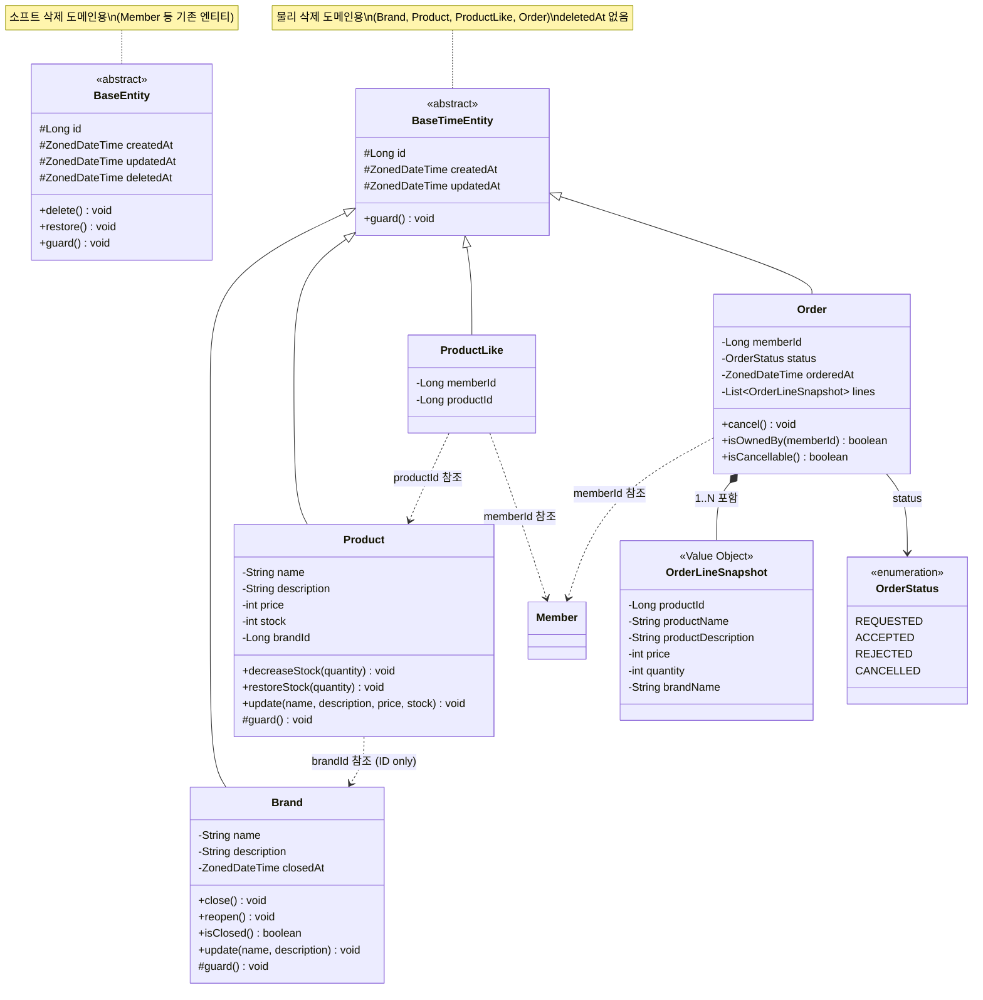
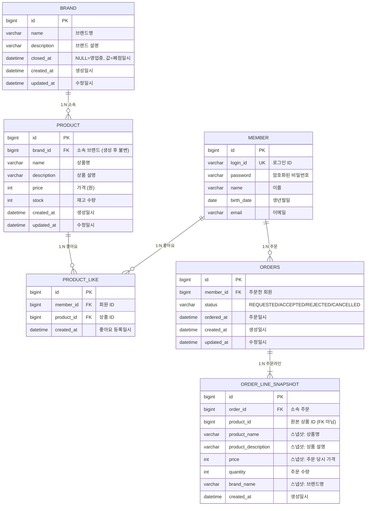

# 클래스 다이어그램 & ERD

> **ARCHIVE** — 이 문서는 히스토리 참고용입니다. 현재 설계 기준 문서(SoT)는 `docs/design/01~04-*.md`입니다.

> 작성일: 2026-02-10
> 도메인 정의서(v2) + 요구사항 분석 기반

---

## 1. 클래스 다이어그램

### 왜 필요한가
각 도메인의 책임 배분, Aggregate 경계, 엔티티/VO 구분, BC 간 참조 방식을 한눈에 확인한다.
도메인 로직이 Service에 집중되지 않고 엔티티 자체에 비즈니스 규칙이 있는지 검증한다.

### 다이어그램



### 읽는 포인트

**1. 도메인 로직이 엔티티에 있다**
- `Brand.close()`, `Brand.reopen()` — 폐점/재입점은 브랜드 스스로가 결정하는 행위
- `Product.decreaseStock()`, `Product.restoreStock()` — 재고 변경은 상품의 책임. 재고 비음수 불변식(`stock >= 0`)은 여기서 검증
- `Order.cancel()` — 상태 전이 규칙(`ACCEPTED → CANCELLED`만 허용)은 주문이 판단
- `Order.isOwnedBy()` — 본인 주문 여부 확인도 주문 엔티티의 책임

**2. BC 간 참조는 ID만 사용한다**
- `Product.brandId`는 `Long` 타입. `Brand` 객체 참조가 아님
- `ProductLike.memberId`, `Order.memberId`도 동일
- 이렇게 하면 BC 간 직접 의존이 없어, 나중에 서비스 분리 시 변경이 최소화됨

**3. OrderLineSnapshot은 Value Object이다**
- 식별자(`id`)가 없다 (DB에서는 기술적으로 PK를 부여하지만, 도메인 관점에서 독립 식별 불필요)
- 한번 생성되면 변경 불가 (불변)
- Order와 동일한 생명주기를 가짐 (Order 없이 존재 불가)

**4. ProductLike는 독립 엔티티이다**
- 값 객체가 아닌 이유: `memberId + productId`라는 고유 식별이 필요하고, 등록/삭제(토글)라는 상태 변경이 있음
- 다만 도메인 로직이 거의 없는 단순 엔티티. 이는 좋아요의 본질이 "관계의 기록"이기 때문

---

## 2. 계층별 패키지 구조 (예상)

기존 코드베이스 패턴(ExampleV1Controller, ExampleFacade, ExampleService, ExampleRepository)을 따른다.

```
com.loopers
├── interfaces/api/
│   ├── brand/
│   │   ├── BrandV1ApiSpec.java
│   │   ├── BrandV1Controller.java
│   │   └── BrandV1Dto.java
│   ├── product/
│   │   ├── ProductV1ApiSpec.java
│   │   ├── ProductV1Controller.java
│   │   └── ProductV1Dto.java
│   ├── like/
│   │   ├── LikeV1ApiSpec.java
│   │   ├── LikeV1Controller.java
│   │   └── LikeV1Dto.java
│   ├── order/
│   │   ├── OrderV1ApiSpec.java
│   │   ├── OrderV1Controller.java
│   │   └── OrderV1Dto.java
│   └── admin/
│       ├── AdminBrandV1Controller.java
│       ├── AdminProductV1Controller.java
│       └── AdminOrderV1Controller.java
│
├── application/
│   ├── brand/
│   │   ├── BrandFacade.java
│   │   └── BrandInfo.java
│   ├── product/
│   │   ├── ProductFacade.java
│   │   └── ProductInfo.java
│   ├── like/
│   │   └── LikeFacade.java
│   ├── order/
│   │   ├── OrderFacade.java
│   │   └── OrderInfo.java
│   └── admin/
│       ├── AdminBrandFacade.java
│       ├── AdminProductFacade.java
│       └── AdminOrderFacade.java
│
├── domain/
│   ├── brand/
│   │   ├── Brand.java
│   │   ├── BrandService.java
│   │   └── BrandRepository.java
│   ├── product/
│   │   ├── Product.java
│   │   ├── ProductService.java
│   │   └── ProductRepository.java
│   ├── like/
│   │   ├── ProductLike.java
│   │   ├── LikeService.java
│   │   └── LikeRepository.java
│   └── order/
│       ├── Order.java
│       ├── OrderLineSnapshot.java
│       ├── OrderStatus.java
│       ├── OrderService.java
│       └── OrderRepository.java
│
└── infrastructure/
    ├── brand/
    │   ├── BrandJpaRepository.java
    │   └── BrandRepositoryImpl.java
    ├── product/
    │   ├── ProductJpaRepository.java
    │   └── ProductRepositoryImpl.java
    ├── like/
    │   ├── LikeJpaRepository.java
    │   └── LikeRepositoryImpl.java
    └── order/
        ├── OrderJpaRepository.java
        └── OrderRepositoryImpl.java
```

---

## 3. ERD

### 왜 필요한가
영속성 구조, FK 방향, 인덱스 전략, 정규화 수준을 확인한다.
특히 스냅샷의 product_id가 FK가 아닌 이유, 테이블명 예약어 회피 등을 명시한다.

### 다이어그램



### 읽는 포인트

**1. ORDER_LINE_SNAPSHOT.product_id는 FK가 아니다**
- 상품이 물리 삭제되어도 스냅샷은 보존되어야 한다
- FK를 걸면 상품 삭제 시 CASCADE DELETE로 스냅샷이 사라지거나, RESTRICT로 삭제가 막힌다
- 따라서 비즈니스 참조(조회용)로만 사용하고, DB 레벨 참조 무결성은 적용하지 않는다

**2. PRODUCT_LIKE에 복합 유니크 제약이 필요하다**
```sql
UNIQUE INDEX uk_like_member_product (member_id, product_id)
```
- 한 회원이 같은 상품에 좋아요를 중복 생성하면 안 된다
- 토글 시 이 제약으로 데이터 정합성을 DB 레벨에서 보장한다

**3. ORDERS 테이블명**
- `ORDER`는 SQL 예약어(`ORDER BY`)이므로 `ORDERS`로 명명한다

**4. BRAND.closed_at의 이중 역할**
- NULL: 영업 중
- NOT NULL: 폐점 상태 + 폐점 시각 기록
- 상품 조회 시 `WHERE brand.closed_at IS NULL`이 핵심 필터 조건

**5. BaseTimeEntity로 물리 삭제 도메인을 분리한다**
- 기존 `BaseEntity`(deletedAt 포함)는 소프트 삭제가 필요한 엔티티(Member 등)에서 사용한다
- 신규 `BaseTimeEntity`(deletedAt 없음)는 물리 삭제 도메인(Brand, Product, ProductLike, Order)에서 사용한다
- 주문(ORDERS)은 삭제하지 않고 상태(CANCELLED)로 관리한다
- 이 분리로 도메인의 삭제 정책이 코드에 명확히 드러난다

---

## 4. 인덱스 전략

| 테이블 | 인덱스 | 용도 |
|--------|--------|------|
| `product` | `idx_product_brand_id (brand_id)` | 브랜드별 상품 필터링 |
| `product_like` | `uk_like_member_product (member_id, product_id)` UNIQUE | 중복 좋아요 방지 + 토글 조회 |
| `product_like` | `idx_like_member_id (member_id)` | 내 좋아요 목록 조회 |
| `product_like` | `idx_like_product_id (product_id)` | 상품 삭제 시 연쇄 삭제 |
| `orders` | `idx_orders_member_id (member_id)` | 내 주문 목록 조회 |
| `orders` | `idx_orders_ordered_at (ordered_at)` | 날짜 기간 필터링 |
| `orders` | `idx_orders_member_ordered (member_id, ordered_at)` | 회원별 기간 필터 복합 |
| `order_line_snapshot` | `idx_snapshot_order_id (order_id)` | 주문 상세 조회 시 스냅샷 로딩 |

---

## 5. DDL (예상)

```sql
CREATE TABLE brand (
    id          BIGINT AUTO_INCREMENT PRIMARY KEY,
    name        VARCHAR(100)  NOT NULL,
    description VARCHAR(500)  NOT NULL,
    closed_at   DATETIME(6)   NULL,
    created_at  DATETIME(6)   NOT NULL,
    updated_at  DATETIME(6)   NOT NULL
);

CREATE TABLE product (
    id          BIGINT AUTO_INCREMENT PRIMARY KEY,
    brand_id    BIGINT        NOT NULL,
    name        VARCHAR(200)  NOT NULL,
    description VARCHAR(1000) NOT NULL,
    price       INT           NOT NULL,
    stock       INT           NOT NULL DEFAULT 0,
    created_at  DATETIME(6)   NOT NULL,
    updated_at  DATETIME(6)   NOT NULL,

    INDEX idx_product_brand_id (brand_id),
    CONSTRAINT fk_product_brand FOREIGN KEY (brand_id) REFERENCES brand(id)
);

CREATE TABLE product_like (
    id          BIGINT AUTO_INCREMENT PRIMARY KEY,
    member_id   BIGINT      NOT NULL,
    product_id  BIGINT      NOT NULL,
    created_at  DATETIME(6) NOT NULL,

    UNIQUE INDEX uk_like_member_product (member_id, product_id),
    INDEX idx_like_member_id (member_id),
    INDEX idx_like_product_id (product_id),
    CONSTRAINT fk_like_member FOREIGN KEY (member_id) REFERENCES member(id),
    CONSTRAINT fk_like_product FOREIGN KEY (product_id) REFERENCES product(id)
);

CREATE TABLE orders (
    id          BIGINT AUTO_INCREMENT PRIMARY KEY,
    member_id   BIGINT       NOT NULL,
    status      VARCHAR(20)  NOT NULL,
    ordered_at  DATETIME(6)  NOT NULL,
    created_at  DATETIME(6)  NOT NULL,
    updated_at  DATETIME(6)  NOT NULL,

    INDEX idx_orders_member_id (member_id),
    INDEX idx_orders_member_ordered (member_id, ordered_at),
    CONSTRAINT fk_orders_member FOREIGN KEY (member_id) REFERENCES member(id)
);

CREATE TABLE order_line_snapshot (
    id                  BIGINT AUTO_INCREMENT PRIMARY KEY,
    order_id            BIGINT        NOT NULL,
    product_id          BIGINT        NOT NULL,
    product_name        VARCHAR(200)  NOT NULL,
    product_description VARCHAR(1000) NOT NULL,
    price               INT           NOT NULL,
    quantity            INT           NOT NULL,
    brand_name          VARCHAR(100)  NOT NULL,
    created_at          DATETIME(6)   NOT NULL,

    INDEX idx_snapshot_order_id (order_id),
    CONSTRAINT fk_snapshot_order FOREIGN KEY (order_id) REFERENCES orders(id)
);
```

---

## 6. 설계 결정 기록

| 결정 | 이유 | 대안 |
|------|------|------|
| 스냅샷 product_id에 FK 미적용 | 상품 삭제 후에도 스냅샷 보존 필요 | FK + ON DELETE SET NULL (NULL 허용 시) |
| ORDERS 테이블명 | ORDER는 SQL 예약어 | order_info, purchase 등 |
| **BaseTimeEntity 신규 도입** | 물리 삭제 도메인(Brand, Product, ProductLike, Order)은 deletedAt이 불필요. 기존 BaseEntity(deletedAt 포함)는 소프트 삭제 도메인(Member 등)에서 계속 사용 | BaseEntity를 그대로 상속하고 deletedAt 미사용 (불필요한 컬럼 낭비) |
| 비관적 락 (FOR UPDATE) | 재고 정합성 확보. 감성 이커머스 규모에 적합 | 낙관적 락, 원자적 UPDATE |
| 개별 UPDATE 루프 | 실패 상품 식별 가능. 비관적 락과 자연스러운 조합 | 벌크 UPDATE |
| **productId 오름차순 정렬 후 락 획득** | 데드락 방지. 모든 TX가 동일 순서로 락을 잡아 교착 상태 원천 차단 | 정렬 없이 요청 순서대로 (데드락 위험) |
| **폐점 브랜드 검증 규칙 위치: Facade** | 현재 모놀리스에서 Facade가 BC 간 조율자 역할. 상품은 brandId(Long)만 보유하여 브랜드 상태를 스스로 알 수 없음 | 도메인 서비스(`OrderDomainService.validateOrderable(product, brand)`)로 이동 — 도메인 모델링 순수성을 높이지만 복잡도 증가 |
| **주문 취소 시 삭제된 상품의 재고 복원 건너뛰기** | 상품이 물리 삭제되면 복원할 대상이 없음. 주문 상태 변경(CANCELLED)은 정상 수행 | 취소 자체를 거부 (사용자 경험 저하) |
| **모놀리스에서 BC 간 단일 TX** | BC 경계는 논리적 자치권(언어, 책임). TX 경계는 데이터 정합성(물리적). 같은 DB를 쓰는 모놀리스에서 두 BC가 하나의 TX에 참여하는 것은 정합성과 단순성을 동시에 확보 | 도메인 이벤트 + 보상 트랜잭션 (서비스 분리 시 전환) |
