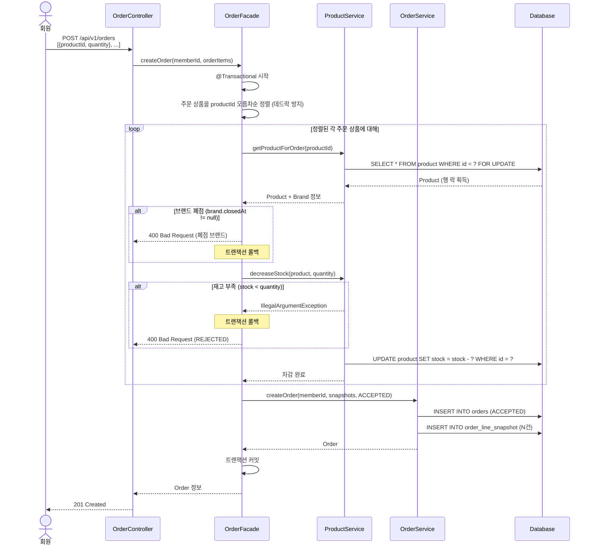
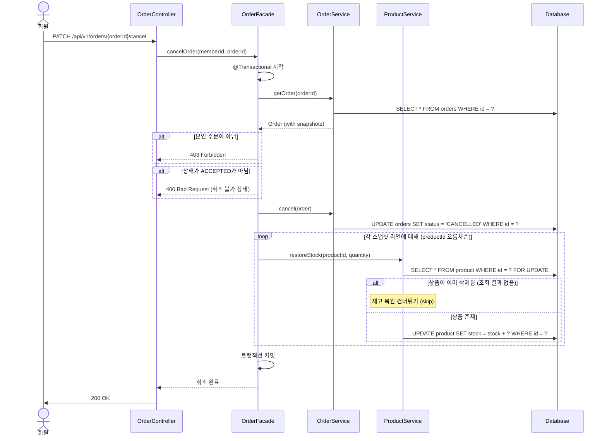
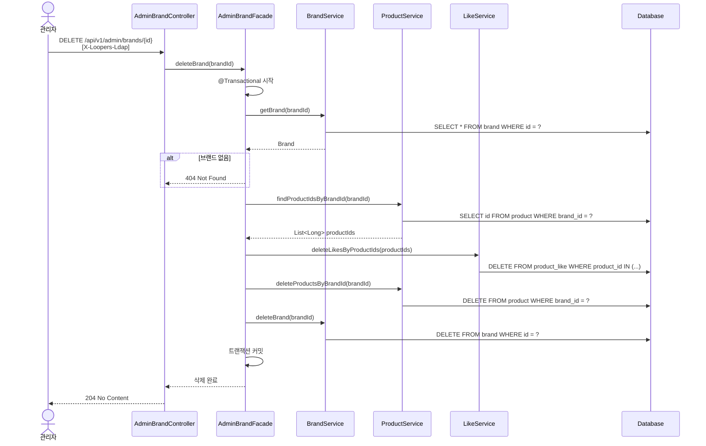
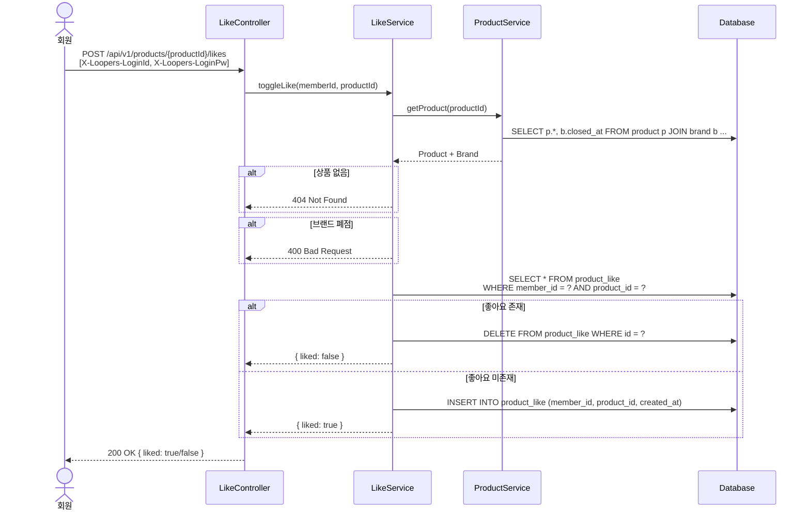
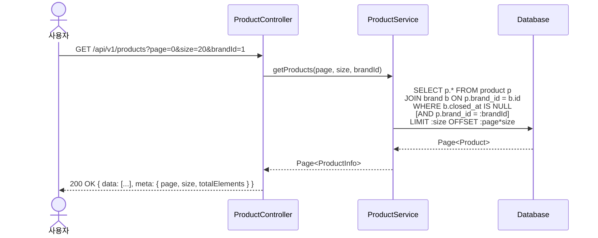

# 시퀀스 다이어그램

> **ARCHIVE** — 이 문서는 히스토리 참고용입니다. 현재 설계 기준 문서(SoT)는 `docs/design/01~04-*.md`입니다.

> 작성일: 2026-02-10
> 도메인 정의서(v2) + 요구사항 분석 기반
> 각 다이어그램은 "왜 필요한가 → 다이어그램 → 읽는 포인트" 순서로 기술한다.

---

## 1. 주문 생성 흐름

### 왜 필요한가
주문은 상품 BC(재고 확인/차감)와 주문 BC(주문 생성/스냅샷)가 만나는 지점이다.
트랜잭션 경계, 비관적 락의 적용 지점, 실패 시 롤백 범위를 검증한다.

### 다이어그램

### 읽는 포인트
- **Facade가 트랜잭션을 소유한다.** ProductService와 OrderService는 각자의 책임만 수행하고, 조율은 Facade에서 한다. 모놀리스에서 두 BC(상품, 주문)가 하나의 트랜잭션에 참여하는 것은 정합성과 단순성을 동시에 확보하는 올바른 선택이다. BC 경계는 논리적 자치권이며, TX 경계와 반드시 일치할 필요는 없다.
- **비관적 락(FOR UPDATE)**은 ProductService가 DB에서 상품을 조회하는 시점에 획득된다. 다른 트랜잭션은 이 행이 해제될 때까지 대기한다.
- **productId 오름차순 정렬 후 락 획득**: 데드락을 방지한다. TX1이 A→B, TX2가 B→A 순서로 락을 잡으면 교착 상태가 발생하므로, 모든 트랜잭션이 동일한 순서(ID 오름차순)로 락을 획득해야 한다.
- **실패 시 전체 롤백**: 3개 상품 중 3번째에서 재고 부족이면, 1~2번째의 재고 차감도 롤백된다. 에러 응답에는 **어떤 상품이 부족한지** 구체적 정보(productId, productName, requestedQuantity, availableStock)를 포함한다.
- **REQUESTED 상태는 DB에 저장되지 않는다.** 요청 수신~재고 확인 사이의 논리적 상태이며, 저장 시점에는 ACCEPTED 또는 REJECTED가 확정된다.

---

## 2. 주문 취소 흐름

### 왜 필요한가
취소 시 재고 복원이 수반된다. 주문 BC에서 상품 BC로의 역방향 호출이 발생하며,
상태 전이의 유효성 검증과 재고 복원의 정확성을 확인한다.

### 다이어그램

### 읽는 포인트
- **상태 검증이 먼저, 재고 복원이 나중이다.** 상태가 유효하지 않으면 DB 수정 없이 즉시 반환한다.
- **스냅샷에 기록된 수량으로 복원한다.** 원본 상품의 현재 상태가 아닌, 주문 당시 차감한 수량을 기준으로 한다.
- **상품이 이미 삭제된 경우 재고 복원을 건너뛴다.** 상품이 물리 삭제되었다면 복원할 대상이 없으므로, 해당 라인은 skip하고 주문 상태만 CANCELLED로 변경한다.
- **재고 복원 시에도 productId 오름차순 정렬**을 적용하여 데드락을 방지한다.

---

## 3. 브랜드 삭제 흐름 (연쇄)

### 왜 필요한가
3개 테이블에 걸친 연쇄 물리 삭제의 순서와 트랜잭션 범위를 명확히 한다.
FK 제약 위반 없이 삭제하려면 의존 역순으로 처리해야 한다.

### 다이어그램

### 읽는 포인트
- **삭제 순서: 좋아요 → 상품 → 브랜드.** FK 의존의 역순이다. 순서를 바꾸면 참조 무결성 위반이 발생한다.
- **productIds를 먼저 조회한 후** 좋아요 삭제에 사용한다. 상품 삭제 이후에는 brand_id로 상품을 찾을 수 없다.
- **단일 트랜잭션**: 중간에 실패하면 전체가 롤백되어 부분 삭제 상태가 발생하지 않는다.

---

## 4. 좋아요 토글 흐름

### 왜 필요한가
토글 방식의 내부 분기 로직과 응답 구조를 확인한다.
폐점 브랜드 상품에 대한 좋아요 차단 조건도 포함된다.

### 다이어그램

### 읽는 포인트
- **상품 존재 + 브랜드 폐점 여부를 먼저 확인한다.** 좋아요 처리 전에 비즈니스 전제 조건을 검증한다.
- **토글 로직**: 존재하면 삭제(물리), 없으면 생성. 별도의 등록/취소 API가 없다.
- **응답에 현재 상태를 포함**하여 클라이언트가 UI를 동기화할 수 있다.

---

## 5. 상품 조회 흐름 (사용자)

### 왜 필요한가
사용자 상품 조회에서 폐점 브랜드 필터링이 어떻게 적용되는지 확인한다.
두 BC(상품 + 브랜드)의 데이터를 조합하는 조회 전략을 검증한다.

### 다이어그램

### 읽는 포인트
- **JOIN을 통해 브랜드 폐점 여부를 필터링한다.** 상품 테이블에 별도 플래그가 없으므로, 반드시 brand 테이블과 조인해야 한다.
- **brandId 파라미터는 선택적이다.** 없으면 전체 상품(폐점 제외), 있으면 해당 브랜드 상품만 반환한다.
- **관리자 조회와의 차이**: 관리자는 `WHERE b.closed_at IS NULL` 조건 없이 전체를 조회한다.
