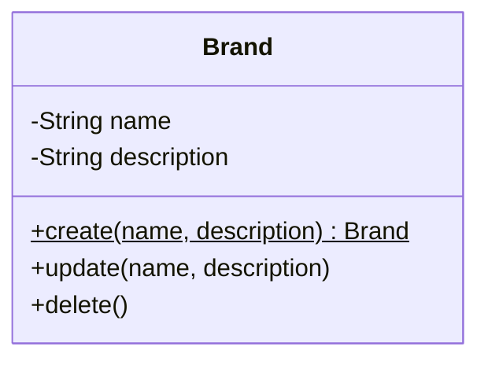

# Brand 클래스다이어그램

## 개요
입점 브랜드의 등록, 수정, 삭제를 담당하는 객체 구조를 정의한다.

## 클래스다이어그램

## 설계 결정

- 브랜드 삭제 시 하위 상품 연쇄 삭제는 Facade에서 오케스트레이션한다 (Brand Entity는 Product를 모른다)
- 브랜드명 유일성 검증은 DB 조회가 필요하므로 Service에서 처리한다
