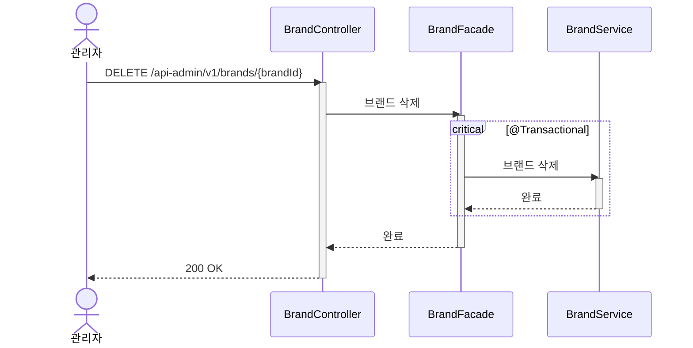

# 브랜드 삭제 시퀀스다이어그램

## 개요
관리자가 브랜드를 삭제하면 브랜드만 삭제 상태로 변경된다. 하위 상품 정리는 배치(스케줄링)로 비동기 처리한다.

## 시퀀스

## 핵심 포인트

- 브랜드 삭제 시 브랜드만 삭제 상태로 변경한다
- 하위 상품 정리는 배치(스케줄링)로 비동기 처리한다
- BrandService.삭제가 조회+검증+삭제를 캡슐화한다 (Facade에 Entity 노출 안 함)
