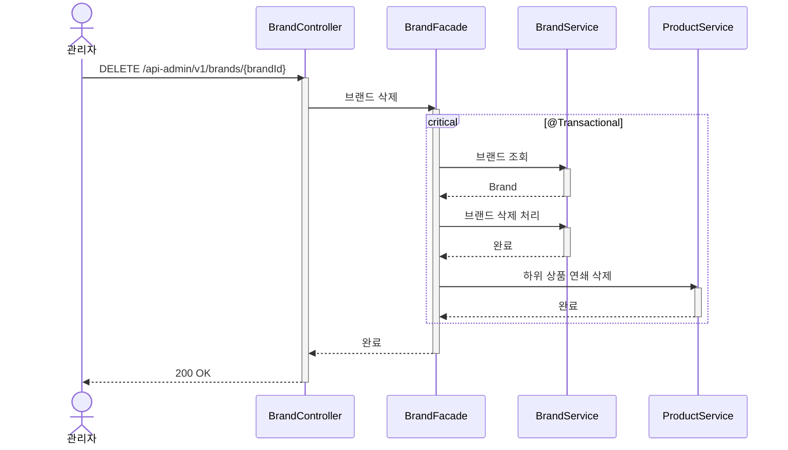

# 브랜드 삭제 시퀀스다이어그램

## 개요
관리자가 브랜드를 삭제하면 해당 브랜드에 속한 모든 상품도 연쇄 삭제되는 흐름을 정의한다.

## 시퀀스

## 핵심 포인트

- 브랜드 삭제와 하위 상품 삭제는 같은 트랜잭션에서 원자적으로 처리한다
- Facade가 BrandService와 ProductService를 오케스트레이션한다
- Brand Entity는 Product를 모르며, 연쇄 삭제는 Facade의 책임이다
