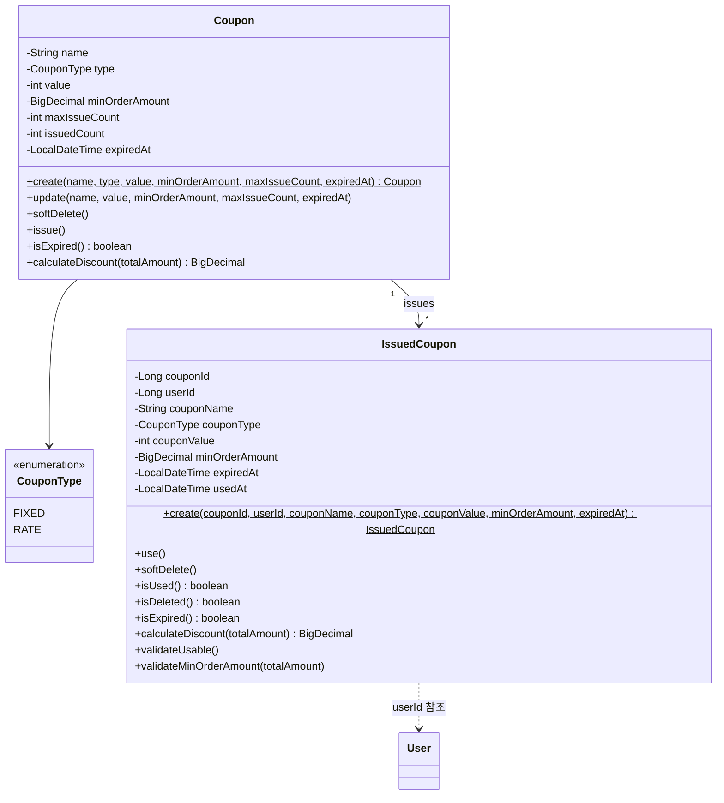

# Coupon 클래스다이어그램

## 개요
쿠폰 템플릿 관리, 사용자 발급, 주문 시 할인 적용을 담당하는 객체 구조를 정의한다.

## 클래스다이어그램

## 설계 결정

- Coupon은 Soft Delete 대상이므로 BaseEntity 상속 (createdAt, updatedAt, deletedAt)
- IssuedCoupon도 연쇄 삭제 + 사용 처리(usedAt)가 있으므로 BaseEntity 상속
- CouponType은 enum으로 FIXED/RATE를 구분하며, 할인 계산 로직은 Coupon 엔티티가 소유
- `issue()`: issuedCount 증가 + 만료/수량 검증 (불변식 강제)
- `calculateDiscount(totalAmount)`: FIXED는 min(value, totalAmount), RATE는 totalAmount x value / 100
- `isExpired()`, `isUsed()`: 사실 제공 — Facade가 맥락에 맞게 판단
- type은 등록 후 불변 — update()에서 type 변경 불가
- IssuedCoupon은 발급 시점의 Coupon 데이터를 스냅샷하여, 사용 가능 여부 검증과 할인 계산을 자기 완결적으로 수행한다
- `validateUsable()`: 삭제/사용/만료 검증 (불변식 강제)
- `calculateDiscount()`: Coupon과 동일한 FIXED/RATE 할인 계산 로직
- `validateMinOrderAmount()`: 최소 주문 금액 미달 시 예외 (불변식 강제)
