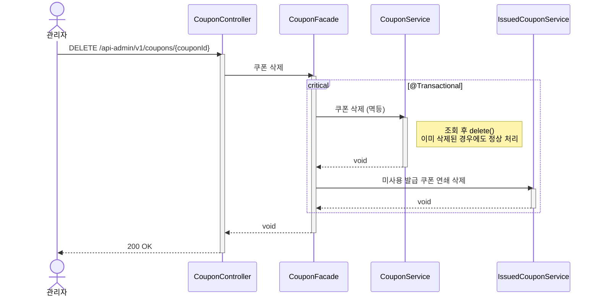

# 쿠폰 삭제 시퀀스다이어그램

## 개요
관리자가 쿠폰 템플릿을 삭제하면 미사용 발급 쿠폰을 연쇄 삭제하는 흐름을 정의한다.

## 시퀀스

## 핵심 포인트
- 쿠폰 삭제와 발급 쿠폰 연쇄 삭제는 하나의 트랜잭션에서 원자적으로 처리한다
- 연쇄 삭제 대상은 미사용(AVAILABLE) 발급 쿠폰만 — 이미 사용된(USED) 쿠폰은 보존
- 삭제는 멱등하게 처리한다 — 이미 삭제된 쿠폰을 다시 삭제해도 정상 응답
