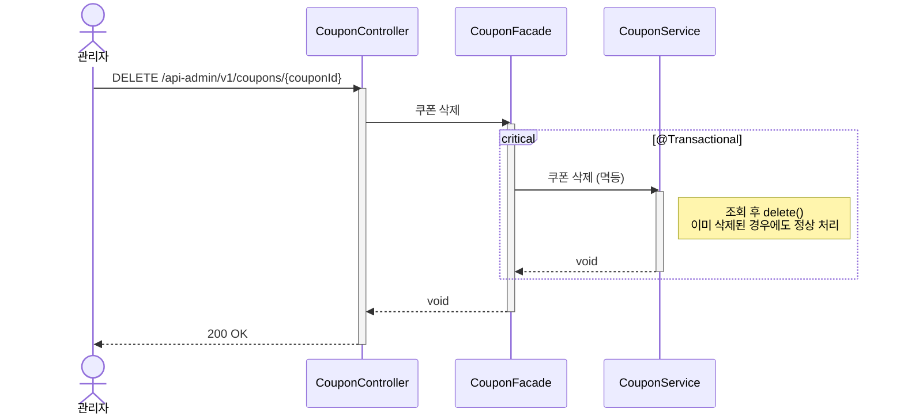

# 쿠폰 삭제 시퀀스다이어그램

## 개요
관리자가 쿠폰 템플릿을 삭제하는 흐름을 정의한다. 이미 발급된 쿠폰은 영향받지 않는다.

## 시퀀스

```mermaid
sequenceDiagram
    actor 관리자
    participant CC as CouponController
    participant CF as CouponFacade
    participant CS as CouponService

    관리자->>CC: DELETE /api-admin/v1/coupons/{couponId}
    activate CC
    CC->>CF: 쿠폰 삭제
    activate CF

    critical @Transactional
        CF->>CS: 쿠폰 삭제 (멱등)
        activate CS
        Note right of CS: 조회 후 delete()<br/>이미 삭제된 경우에도 정상 처리
        CS-->>CF: void
        deactivate CS
    end

    CF-->>CC: void
    deactivate CF
    CC-->>관리자: 200 OK
    deactivate CC
```

## 핵심 포인트
- 쿠폰 템플릿만 soft delete하며, 이미 발급된 쿠폰은 영향받지 않는다
- 삭제는 멱등하게 처리한다 — 이미 삭제된 쿠폰을 다시 삭제해도 정상 응답
