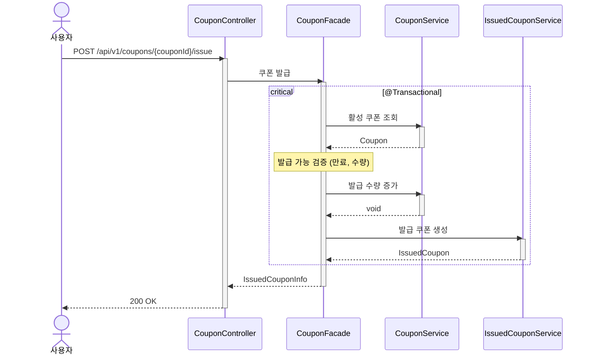

# 쿠폰 발급 시퀀스다이어그램

## 개요
사용자가 쿠폰을 발급받을 때 만료/수량/중복 검증과 동시성 제어를 처리하는 흐름을 정의한다.

## 시퀀스

## 핵심 포인트
- 발급 가능 검증(만료, 수량)으로 Fail-Fast 후, 원자적 업데이트로 수량 초과를 방지한다
- 중복 발급은 IssuedCouponService에서 검증한다
- 발급 수량 증가와 발급 쿠폰 생성은 하나의 트랜잭션에서 원자적으로 처리한다
