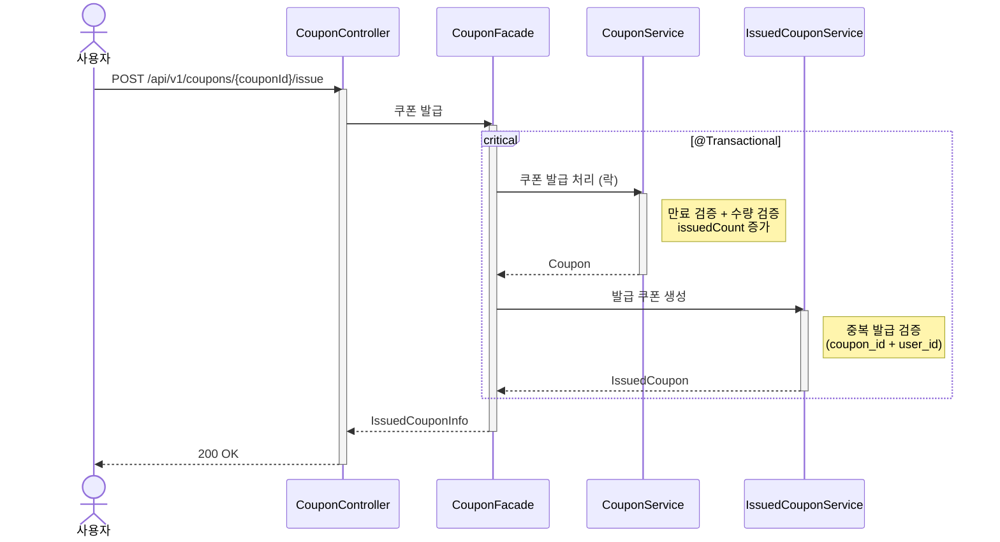

# 쿠폰 발급 시퀀스다이어그램

## 개요
사용자가 쿠폰을 발급받을 때 만료/수량/중복 검증과 동시성 제어를 처리하는 흐름을 정의한다.

## 시퀀스

## 핵심 포인트
- CouponService가 쿠폰을 비관적 락으로 조회하여 issuedCount의 동시성을 보장한다
- 만료 검증, 수량 검증은 Coupon 엔티티의 `issue()` 메서드에서 처리 (불변식 강제)
- 중복 발급 검증은 IssuedCouponService에서 처리 (DB unique constraint 활용)
- 발급 수량 차감과 발급 쿠폰 생성은 하나의 트랜잭션에서 원자적으로 처리한다
