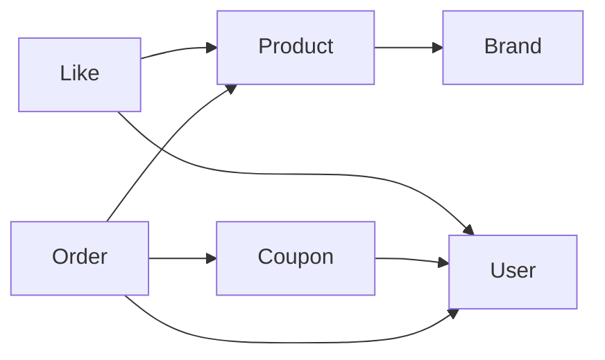

# 도메인맵

## 개요
커머스 서비스의 도메인 간 의존 방향을 정의한다.

## 도메인 의존 관계

## 도메인 설명

| 도메인 | 설명 |
|--------|------|
| User | 서비스에 가입한 사용자 계정 |
| Brand | 상품을 그룹화하는 입점 브랜드 |
| Product | 고객이 탐색하고 주문하는 판매 단위 |
| Like | 사용자가 상품에 표시하는 관심 표현 |
| Coupon | 할인 혜택을 제공하는 쿠폰 템플릿과 발급 인스턴스 |
| Order | 사용자의 상품 구매 요청 |
