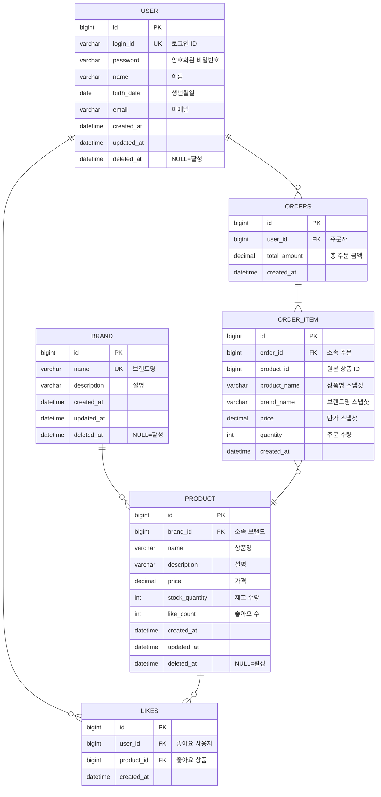

# ERD

## 개요
커머스 서비스의 전체 데이터 구조를 정의한다.

## ERD

## 테이블 설명

| 테이블 | 도메인 | 설명 | 삭제 정책 |
|--------|--------|------|----------|
| USER | User | 서비스 가입 사용자 계정 | Soft Delete |
| BRAND | Brand | 입점 브랜드 정보 | Soft Delete |
| PRODUCT | Product | 판매 상품 정보 | Soft Delete |
| LIKES | Like | 사용자-상품 간 좋아요 | Hard Delete |
| ORDERS | Order | 사용자의 주문 | 삭제 불가 |
| ORDER_ITEM | Order | 주문 시점 상품 스냅샷 | 삭제 불가 |

## 제약 조건

| 테이블 | 제약 | 컬럼 | 설명 |
|--------|------|------|------|
| USER | UNIQUE | login_id | 로그인 ID 유일성 |
| BRAND | UNIQUE | name | 브랜드명 유일성 (삭제 포함) |
| LIKES | UNIQUE | user_id, product_id | 1인 1좋아요 보장 |
