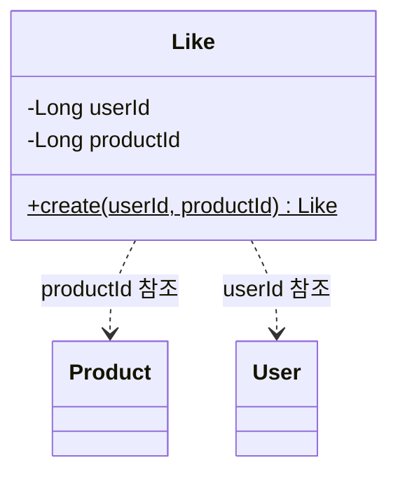

# Like 클래스다이어그램

## 개요
사용자의 상품 좋아요 등록/취소를 담당하는 객체 구조를 정의한다.

## 클래스다이어그램

## 설계 결정

- Like는 생성만 있는 엔티티이므로 BaseEntity를 상속하지 않고 createdAt만 포함한다
- 취소 시 물리적 삭제(Hard Delete)하므로 deletedAt이 없다
- 좋아요 수(likeCount)는 Product 엔티티에 비정규화하여 동기 업데이트한다
